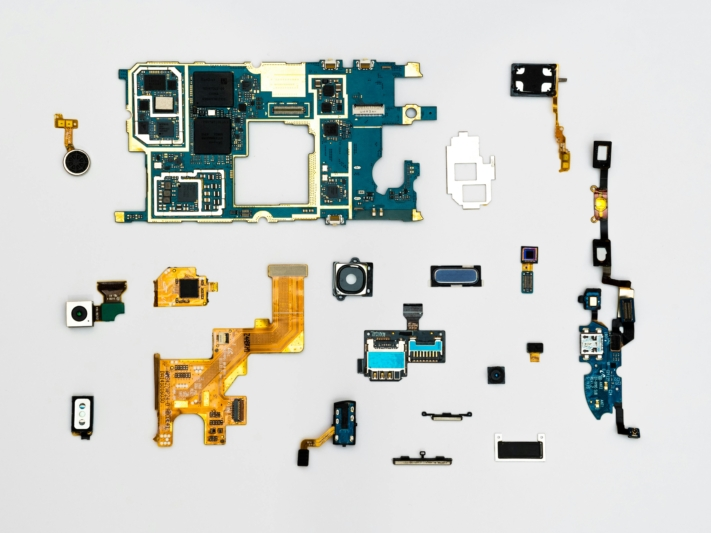

Многие школьники и студенты попадают в водоворот прокрастинации и учебы в последнюю минуту. Возможно, Вы тоже откладываете учебу до тех пор, пока в последнюю ночь перед экзаменом Вам не придется часами зубрить, чтобы получить необходимые знания. Но не волнуйтесь, есть лучший способ: составьте эффективный **план обучения**!

Будь то **выпускные школьные экзамены** или **экзамены в университете** – хорошо продуманный план подготовки может стать решающим фактором между успехом и неудачей. В этой статье мы расскажем Вам в 7 простых шагах, как составить учебный план, чтобы начать следующий этап экзаменов с меньшим стрессом.

## 1\. Определите и визуализируйте цель обучения

Если Вы хотите составить план обучения, то прежде всего Вам следует четко определить цель обучения. Определите, какой именно **материал** Вам нужно освоить и к какому **сроку**. Убедитесь, что Ваши цели **реалистичны**, а содержание **актуально**, чтобы Вы не испытывали стресса на этапе обучения.

Чтобы отслеживать свой прогресс в процессе обучения, Ваши цели должны быть **измеримыми**. Полезный метод – представить себе желаемые результаты в конкретных терминах, будь то оценка или определенный уровень знаний. Это даст Вам четкое представление о том, к чему Вы стремитесь, и создаст дополнительную мотивацию для достижения этой цели.

## 2\. Собрать и структурировать учебный материал

Прежде чем составлять план обучения, необходимо собрать и структурировать весь учебный материал. Начните с **полного обзора** всех актуальных тем и отсеивания **несущественной информации**. Запишите источники важного материала, например, **учебники**, **слайды лекций**, **специализированные статьи** или собственные **заметки** с уроков.

Затем важно систематически структурировать все собранные материалы, чтобы сохранить общую картину. Для этого можно использовать табличную организацию по **тематическим блокам** или **интеллект-карты**, чтобы не забыть о релевантном контенте.

## 3\. Разделить на более мелкие учебные блоки и расставить приоритеты

Теперь, когда Вы определили все важные для экзамена темы, пришло время разбить их на **небольшие учебные пакеты**. Это позволит Вам эффективнее усваивать и обрабатывать учебный материал. Разбив его на управляемые блоки, Вы не дадите себе почувствовать, что перегружены обилием материала, и не потеряете концентрацию.

Также рекомендуется оценить **уровень сложности** отдельных учебных разделов и расставить приоритеты в соответствии с ними. Таким образом, Вы сможете эффективно сконцентрировать свое время и энергию на тех темах, которые представляют наибольшую сложность или имеют особое значение для экзамена. Четкое **ранжирование** учебного материала поможет Вам расставить приоритеты и обеспечить оптимальное использование ограниченных ресурсов.

## 4\. Найти подходящий метод обучения

Составляя план обучения, стоит также рассмотреть различные методы обучения и выбрать тот, который **подходит** Вам больше всего. Методы обучения – это стратегии, направленные на достижение максимального успеха в обучении путем закрепления знаний. Учитывая разнообразие доступных методов, важно выбрать те, которые лучше всего соответствуют Вашим **индивидуальным потребностям**, и, возможно, комбинировать различные методы.

Чтобы выбрать подходящий метод обучения, прежде всего учитывайте свои предпочтения и стили обучения. Возможно, Вы предпочитаете наглядные пособия, такие как **учебные видеоролики** и **графики**, а может быть, Вам лучше дается **активное слушание** и **обсуждение**. Экспериментируйте с различными методами, чтобы понять, какие из них наиболее эффективны для Вас.

К числу проверенных методов обучения можно отнести следующие:

### Метод локусов

С помощью [метода локусов](https://de.wikipedia.org/wiki/Loci-Methode) Вы связываете информацию с хорошо известными Вам местами. Представьте, что Вы изучаете список словарных слов. Каждое слово ассоциируется у Вас с определенным местом в Вашем доме. Когда Вы захотите повторить словарный запас позже, Вы мысленно пройдетесь по своему дому и вспомните слова, которые Вы связали с определенными местами.

### Принцип Парето

[Принцип Парето](https://de.wikipedia.org/wiki/Paretoprinzip) гласит, что Вы можете достичь примерно 80 процентов успеха в обучении, сосредоточившись на наиболее важных 20 процентах материала. Например, Вы можете обнаружить, что изучение наиболее важных концепций или формул по предмету принесет Вам наибольшую пользу, а остальной материал будет менее важен. Сосредоточившись на главном, Вы сможете более эффективно использовать учебное время и добиться лучших результатов. Этот принцип может пригодиться Вам уже при составлении плана обучения.

### Система Лейтнера

По [системе Лейтнера](https://de.wikipedia.org/wiki/Lernkartei) Вы раскладываете индексные карточки по разным стопкам или лоткам в зависимости от того, насколько хорошо Вы усвоили информацию на них. Допустим, у Вас есть коробка с 5 отделениями, в которой Вы каждый день перебираете свои карточки. Если Вы правильно ответили на карточку, она перемещается на одно отделение вперед, пока не попадет в отделение с успешно усвоенной информацией. Если Вы ответили неправильно, она возвращается в первое отделение. Таким образом, Вы больше концентрируетесь на более сложных карточках, а более легкие приходится повторять реже.

### Техника Pomodoro

[Техника Pomodoro](https://de.wikipedia.org/wiki/Pomodoro-Technik) заключается в разделении работы на интервалы продолжительностью около 25 минут, известные как "помодоро", с последующими короткими перерывами. Например, Вы напряженно работаете над задачей в течение 25 минут, а затем делаете 5-минутный перерыв. После четырех "помодоро" сделайте более длительный перерыв – от 15 до 30 минут. Этот метод помогает сохранить концентрацию и снизить утомляемость.

### Мнемотехники

[Мнемотехники](https://de.wikipedia.org/wiki/Mnemotechnik) – это методы, которые помогают Вам лучше запоминать информацию, связывая ее с легко запоминающимися образами, историями или структурами. Например, Вы можете придумать историю, чтобы запомнить список дат, или использовать аббревиатуру, чтобы запомнить последовательность информации.

## 5\. Оценить затраты времени и составить расписание

Теперь, когда Вы структурировали учебный материал, пришло время составить подробное расписание учебных занятий. Этот план поможет Вам эффективно достигать целей обучения и поддерживать здоровый баланс между **учебой**, **повседневной жизнью** и **свободным временем**.

При составлении расписания необходимо учитывать несколько важных аспектов. Во-первых, важно предусмотреть **резервное время** и **крайние сроки**. Резервное время позволит Вам лучше справляться с непредвиденными обстоятельствами или дополнительной нагрузкой, не выбивая из колеи Ваш учебный план. Четкие сроки помогут Вам не сбиться с пути и не потеряться.

Используйте календарь, чтобы планировать не только время учебы, но и повседневные дела и досуг. Это поможет Вам составить сбалансированный график, в котором будет достаточно места для отдыха и расслабления. Не забывайте о **регулярных перерывах в учебе**. Они помогают повысить эффективность и предотвратить появление симптомов усталости.

Будьте реалистами и ставьте перед собой достижимые цели. При необходимости скорректируйте свой план обучения, чтобы обеспечить достижение поставленных целей.

## 6\. Мотивация

Приближается этап обучения, а Вы не можете преодолеть свое нежелание? Даже если это трудно, постарайтесь с энтузиазмом отнестись к предмету и придерживаться плана обучения, чтобы избежать нехватки времени и угрызений совести.

Важным аспектом мотивации является **личная значимость** учебного материала. Ваш мозг с большей вероятностью сохранит информацию в долгосрочной памяти, если Вы воспринимаете ее как значимую и интересную. Поэтому удовольствие от учебы может творить чудеса! Даже если Вы не всегда с энтузиазмом относитесь к такому предмету, как расчет процентов, Вы должны хотя бы понимать, что он Вам пригодится в жизни. Так обучение станет не только более эффективным, но и более увлекательным.

Также полезно **связывать** информацию с уже имеющимися знаниями. Поэтому постарайтесь установить связь между учебным материалом и Вашими предыдущими знаниями. И конечно, практика – путь к мастерству: **применяя** абстрактный учебный материал на конкретных примерах, Вы сможете закрепить свои знания.

Если Вы не забываете о своих целях в учебе, Вы можете быть уверены, что находитесь на правильном пути и приближаетесь к успеху. Вознаграждайте себя за усилия, будь то **небольшое свободное время**, особое **угощение** или другое лакомство. Расслабляющие занятия, такие как **спорт**, **культурные мероприятия** или поддержание **социальных контактов**, – это важный противовес учебным будням, помогающий сохранить психическое здоровье.

## 7\. Рефлексия

Рефлексия – важнейший этап в процессе обучения, поскольку она позволяет Вам оценить свой прогресс, переосмыслить свой план обучения и внести необходимые **коррективы**. Фиксируйте свой прогресс в [дневнике обучения](), с помощью которого Вы можете регулярно проверять уровень своих знаний и оценивать методы обучения. Подумайте, сможете ли Вы еще достичь целей, которые поставили перед собой, или необходимо скорректировать курс. Возможно, Ваши методы обучения или цели изменились в процессе обучения – важно признать это и скорректировать свой план обучения соответствующим образом.

Обращайте внимание на отклонения от первоначального плана обучения и анализируйте их причины. Возможно, Вам трудно придерживаться графика или Вы легко отвлекаетесь. Определите возможные камни преткновения и подумайте, как Вы можете их преодолеть, будь то **повышение дисциплины**, **совершенствование методов управления временем** или **уменьшение количества отвлекающих факторов** с помощью [цифрового детокса]().

## Создайте план обучения с помощью SeaTable

Готовы ли Вы к следующему экзаменационному периоду? Если нет, то сейчас самое время попробовать **бесплатный учебный план** SeaTable. Создав свой собственный учебный план, Вы сможете **упорядочить** все **учебные материалы**. От базовых понятий до сложных тем – все можно структурировать в одном месте. Кроме того, Вы можете сохранить **контактные данные своих учителей и преподавателей**, чтобы при необходимости связаться с ними напрямую.



Этот план обучения поможет Вам получить **представление обо всем учебном материале** и спланировать **реалистичные сроки** для изучения. Это позволит Вам эффективно использовать свое время и гарантировать, что у Вас будет достаточно времени для выполнения каждой задачи. Еще одно преимущество плана обучения – возможность расставить **приоритеты** в соответствии с актуальностью всего материала. Вы можете легко **отслеживать прогресс в обучении** и работать конкретно над своими пробелами, просто отмечая основные темы и подтемы, которые Вы уже изучили. **Гибкость** плана обучения позволяет Вам в любой момент скорректировать время обучения и цели обучения.

Расслабьтесь и избавьтесь от лишнего стресса! [Зарегистрируйтесь]() бесплатно, создайте свой индивидуальный план обучения с помощью [шаблона]() и почувствуйте, насколько легким может быть обучение.
