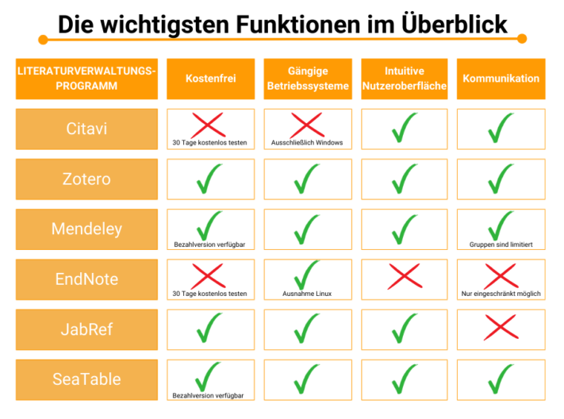

Ya sea para un trabajo de fin de grado, una tesis doctoral o un informe de investigación, un **programa de gestión bibliográfica** facilita el trabajo en proyectos académicos. La elaboración de **bibliografías** consume tanto tiempo como la búsqueda, revisión y análisis de **fuentes**.

Con una gestión bibliográfica estructurada, evitarás errores en las listas de referencias y mantendrás una **visión clara de todos los estudios relevantes** sobre tu tema. Además, un programa de gestión bibliográfica te ayuda a crear las referencias de las obras recopiladas en un **estilo de citación** uniforme.

A continuación, te presentamos una comparativa de diferentes soluciones de software y consejos para una gestión bibliográfica exitosa.

¡Pon orden en tu literatura científica! © caftor / Adobe Stock

## ¿Por qué es útil un programa de gestión bibliográfica?

Recopilar evidencias para hipótesis, exponer el estado de la investigación o fundamentar tu propio enfoque: en los proyectos académicos, la **búsqueda y análisis de fuentes** es imprescindible, ya sea en libros, revistas o medios online. El trabajo científico riguroso implica un gran esfuerzo, que puedes reducir con una gestión bibliográfica eficiente.

Con un programa de gestión bibliográfica puedes…

- [Mantener la visión global en proyectos extensos]()
- Registrar la literatura científica de forma sistemática
- Garantizar una citación uniforme
- Realizar cambios flexibles en tus listas bibliográficas
- Reducir errores en listas bibliográficas largas
- Organizar tus fuentes por categorías y proyectos
- Guardar datos automáticamente en la nube o en un servidor

En definitiva, la estructura de base de datos de los programas de gestión bibliográfica permite una administración de fuentes mucho más eficiente que hacerlo manualmente (por ejemplo, en un editor de texto o en papel).

## Comparativa de programas de gestión bibliográfica

¿Has decidido usar un software de gestión bibliográfica para trabajar de forma más eficiente? ¡Perfecto! Pero ahora surge la pregunta: ¿qué programa es el más adecuado para ti? Esto depende sobre todo del tamaño de tu proyecto y de las herramientas que desees utilizar. A continuación, te presentamos los seis programas más conocidos.

Primero, hazte una idea general de las funciones.

### Citavi – el clásico

Citavi es el programa de gestión bibliográfica preferido por muchas universidades. Sus ventajas para este ámbito son principalmente su uso en **alemán**, la **colaboración en grupo sin restricciones** y un **buen soporte** para consultas.

El trabajo en grupo es muy sencillo con Citavi.

Sin embargo, a diferencia de muchos de sus competidores, **no es gratuito y solo está disponible para Windows**. Tras 30 días de prueba gratuita, hay que pagar. El precio depende de tu situación: para estudiantes, la versión web cuesta desde 75 euros al año. Las empresas pagan unos 425 euros por dos años en la versión para Windows.

### Zotero – el programa para principiantes

Zotero es especialmente adecuado para principiantes, ya que es intuitivo y sirve para investigaciones en cualquier disciplina. El programa es **gratuito**, funciona en todos los sistemas operativos habituales y, gracias a su app, también puede usarse en móvil o tablet. Sin embargo, hay algunas ventajas e inconvenientes que debes tener en cuenta:

**Ventajas**

- Mediante un complemento, puedes importar datos bibliográficos de Internet directamente al programa.
- Las capturas de pantalla y los PDFs se importan automáticamente desde el navegador.
- Puedes elegir tu estilo de citación preferido.

**Desventajas**

- Los PDFs almacenados en el programa no pueden editarse fácilmente, aunque hay una función de notas para trabajar en paralelo.
- La búsqueda en bases de datos dentro del programa es limitada.
- Debes revisar las referencias automáticas, ya que pueden ser incorrectas o incompletas.

### Mendeley – el software en la nube

Mendeley te ofrece una **suscripción gratuita** con dos gigabytes de almacenamiento en la nube. Si necesitas más, puedes adquirir una versión con más espacio, soporte adicional, más funciones y mejor cifrado de datos (precio a consultar). El programa funciona en todos los sistemas operativos.



Además de la versión de escritorio o el Web Importer, puedes usar Mendeley con un **plugin para Word**. Todos tus datos, documentos y carpetas se sincronizan en la nube.

Pese a estas ventajas, el programa tiene algunas limitaciones: no guarda los historiales de búsqueda y no todos los documentos almacenados pueden vincularse entre sí. Además, debes tener buen nivel de inglés, ya que solo está disponible en este idioma.

### EndNote – el todoterreno

Con EndNote obtienes un **paquete completo con muchas funciones útiles**, pero debes estar dispuesto a pagar un **precio elevado**. El programa comercial de gestión bibliográfica de Thomson-Reuters también ofrece una versión gratuita de **30 días de prueba**, aunque con funciones muy limitadas.

La versión completa incluye muchas herramientas útiles.

El programa está especializado en investigadores que trabajan en grandes proyectos. Esto se nota sobre todo en que requiere **mucho tiempo de aprendizaje** para dominar todas sus funciones.

Para usarlas sin límites, debes comprar la versión completa, que parte de 252 euros para usuarios individuales. Como estudiante, tras verificar tu condición, obtienes un 50% de descuento.

### JabRef – el multilingüe

JabRef es un **gestor bibliográfico gratuito y de código abierto**. Los desarrolladores ponen el código fuente a disposición de todos, permitiendo que muchos colaboren en su mejora. Esto se refleja especialmente en que el programa está **disponible en muchos idiomas**.

Quien tenga conocimientos puede ayudar a mejorar JabRef.

Sin embargo, JabRef también tiene limitaciones: su gestión en dispositivos móviles no es óptima, no permite comunicación entre usuarios y no tiene búsqueda de texto completo, lo que dificulta la creación de bibliografías.

### SeaTable – la solución inteligente en tablas

SeaTable te ofrece una alternativa **basada en tablas** a los programas de gestión bibliográfica tradicionales. Su interfaz es **intuitiva** y cuenta con muchas funciones útiles para estructurar tu literatura de forma rápida y sencilla.

La [plantilla]() te da una visión general de cómo usar el programa y adaptarlo a tus necesidades. SeaTable es una base de datos donde puedes introducir tus datos en tablas, vincularlos a tareas y añadir documentos. La **colaboración en equipo** es **en tiempo real**.

SeaTable está disponible como **versión gratuita en la nube** o como programa para tu propio servidor. Si quieres más funciones y colaborar con más usuarios, puedes actualizar: la versión Plus cuesta 7 euros por usuario y mes, y la Enterprise, 14 euros por usuario y mes.

## Cómo aprovechar al máximo tu programa de gestión bibliográfica

Con estos ocho consejos sacarás el máximo partido al programa que elijas para gestionar tu bibliografía. Aquí verás en qué debes fijarte y qué funciones pueden facilitarte el trabajo.

### 1\. Precaución al importar fuentes

No confíes en que las referencias en los programas o en otros trabajos académicos sean correctas. Puede haber errores, datos incompletos o en el estilo de citación incorrecto. Al importar datos de otros programas o mediante DOI, puede que falte información importante. Esto es especialmente molesto si detectas los errores solo al insertar la bibliografía en tu documento.

Comprueba siempre que las referencias sean correctas y complétalas si es necesario. Si prefieres dejar esta tarea para el final, es útil anotarlo en una [lista de tareas]() para no olvidarlo.

Algunos programas pueden capturar fuentes mediante DOI. © ake1150 / Adobe Stock

### 2\. Introduce cuidadosamente los datos bibliográficos

Un programa de gestión bibliográfica solo es tan bueno como su usuario, es decir, tú. Por eso, asegúrate de introducir los datos correctamente. Así, el programa podrá generar las referencias y bibliografías sin errores, ya que sabrá exactamente dónde va cada dato.

No toda la información de tus fuentes es relevante para la bibliografía final. Para no saturar las referencias generadas automáticamente, debes saber cómo citar correctamente:



Debes indicar los autores con nombre y apellido y, si corresponde, títulos académicos. En obras colectivas, también el nombre de los editores.




Además del año, en fuentes online debes indicar el día y el mes de publicación. Si una fuente no tiene fecha, también debes especificarlo.




El título corresponde al del artículo, libro o capítulo (en obras colectivas). Presta atención a las mayúsculas y minúsculas.




Normalmente basta con indicar la revista o la obra donde se publicó el artículo. En libros, indica la editorial.




Anota estos datos con la mayor precisión posible. Si las páginas no están impresas, cuéntalas tú mismo.


### 3\. Buscar nuevas fuentes con el programa

Algunos programas facilitan la búsqueda de nueva literatura. Por ejemplo, en Citavi puedes configurar **alertas de búsqueda** para saber cuándo hay nuevos artículos sobre tus temas. Mendeley ofrece un servicio de recomendaciones para ver artículos similares.

Las bibliotecas también son útiles para la búsqueda de fuentes. © Jacob Lund / Adobe Stock

### 4\. Crear una estructura en el programa

Para trabajar de forma estructurada, necesitas un **esquema claro** de tu literatura. Puedes clasificar tus fuentes por categorías o asignarlas a proyectos como tesis, [análisis de contenido]() o investigaciones.

Zotero te permite marcar fuentes y filtrarlas. En SeaTable puedes organizar y agrupar las fuentes como desees: por autor, tema, tipo de fuente o estado de revisión. Así, incluso en proyectos grandes, encontrarás lo que buscas rápidamente.

### 5\. Elegir el estilo de citación

No todas las fuentes se citan igual. Desde el principio de tu proyecto, decide qué [**estilo de citación**](https://www.scribbr.de/richtig-zitieren/uebersicht-zitierstile/) vas a usar. Una vez elegido, aplícalo de forma uniforme y configúralo en tu programa. Así, podrás formatear todas tus fuentes en ese estilo y copiarlas a tu trabajo.



### 6\. Usar la función de notas

Algunos programas incluyen herramientas para **notas**. Úsalas para anotar ideas importantes durante la lectura y añade el número de página para encontrarlas fácilmente después.

También puedes usar el clásico bloc de notas.

### 7\. Revisar los resultados

No confíes totalmente en el programa. Antes de entregar tu trabajo, revisa la bibliografía. **Comprueba** si has seguido las normas de estilo y si las referencias están bien hechas.

### 8\. No borres contenido

A menudo revisas más fuentes de las que acabas usando. Cuando terminas un proyecto, es fácil olvidarlas. ¡Pero no tiene por qué ser así! No borres tus fuentes ni las notas, aunque el trabajo ya haya terminado. Puede que las necesites en futuros proyectos. Mejor, crea una base de conocimientos en tu programa de gestión bibliográfica.

## Conclusión: prueba un programa de gestión bibliográfica

El programa más adecuado para ti depende de las funciones que necesites y de cuánto estés dispuesto a invertir. Es recomendable probar los programas gratuitamente.

SeaTable te ofrece una [plantilla]() con literatura de ejemplo y el proceso completo, desde la incorporación de fuentes hasta la generación de la bibliografía. Puedes adaptarla a tus necesidades, añadir tus propias fuentes y estructurarlas y visualizarlas con muchas herramientas útiles.

Si quieres usar SeaTable como programa de gestión bibliográfica, [regístrate]() gratis.
