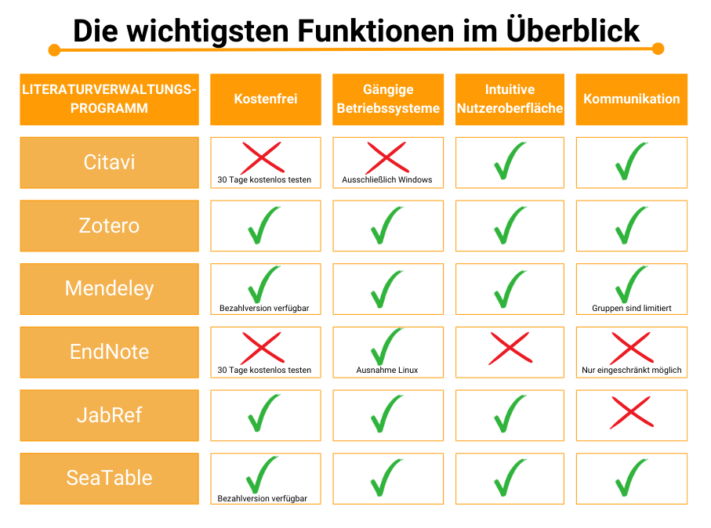

Qu'il s'agisse d'un travail de fin d'études, d'une thèse ou d'un rapport de recherche, un **programme de gestion de la littérature** vous facilite le travail sur les projets scientifiques. La création d'une **bibliographie** prend autant de temps que la recherche, la consultation et l'évaluation des **sources**.

Une gestion structurée de la littérature vous permet d'éviter les erreurs dans les listes de références et de garder **une vue d'ensemble de toutes les études pertinentes** sur votre sujet. De plus, un programme de gestion de la littérature vous aide à rédiger les références des ouvrages collectés dans un **style de citation** uniforme.

Vous trouverez ci-dessous une comparaison de différentes solutions logicielles ainsi que des conseils pour une gestion efficace de la littérature.

Mettez de l'ordre dans votre littérature scientifique ! © caftor / Adobe Stock

## Pourquoi un programme de gestion de la littérature est-il utile ?

Rassembler des preuves pour des hypothèses, présenter l'état de la recherche ou étayer sa propre démarche : Dans les projets scientifiques, la **recherche et l'évaluation de sources** sont inévitables - que ce soit dans les livres, les revues ou les médias en ligne. Un travail scientifique propre est alors lié à un grand effort que vous pouvez minimiser grâce à une gestion habile de la littérature.

Avec un programme de gestion de la littérature, vous pouvez ...

- garder [une vue d'ensemble des projets de grande envergure]()
- Recenser systématiquement la littérature de recherche.
- veiller à l'uniformité des citations.
- apporter des modifications flexibles à vos listes de lecture
- réduire les risques d'erreur dans les longues listes bibliographiques.
- classer vos sources par catégories et par projets
- Sauvegarder automatiquement les données dans le cloud ou sur un serveur.

Tout bien considéré, la structure de la base de données des programmes de gestion de la littérature vous permet de gérer les sources de manière plus judicieuse qu'il ne serait possible de le faire manuellement (par exemple dans un éditeur de texte ou sur papier).

## Comparaison des programmes de gestion de la littérature

Vous avez pris la décision d'utiliser un logiciel de littérature pour travailler plus efficacement ? C'est merveilleux ! Mais la question qui se pose maintenant est de savoir quel programme est le mieux adapté à vos besoins. Cela dépend avant tout de la taille de votre projet et des outils que vous souhaitez utiliser. Nous vous présentons ci-dessous les six programmes les plus connus.

Commencez par vous faire une idée des caractéristiques.

### Citavi - le classique

Citavi est le programme de gestion de la littérature préféré de nombreuses universités. Pour l'utilisation dans ce domaine, ce sont surtout l'application en **allemand**, le **travail en groupe possible sans restriction**, ainsi qu'un **bon support** en cas de questions qui constituent des avantages.

Travailler en groupe est un jeu d'enfant avec Citavi.

Cependant, contrairement à beaucoup de ses concurrents, le programme n'est **pas gratuit et ne peut être utilisé que sous Windows**. Après 30 jours de gratuité, il faut mettre la main à la poche. Le prix à payer dépend de votre activité et commence pour les étudiants à 75 euros par an dans la version web. Les entreprises paient environ 425 euros pour deux ans pour la version Windows.

### Zotero - le programme pour débutants

Zotero est particulièrement adapté aux néophytes, car il est intuitif et conçu pour les recherches dans toutes les disciplines. Le programme est **gratuit**, fonctionne sur tous les systèmes d'exploitation courants et peut également être utilisé sur un téléphone portable ou une tablette grâce à une application. Il existe toutefois quelques avantages et inconvénients en termes de contenu, auxquels il convient de prêter attention :

**Avantages**

- Un module complémentaire permet de transférer directement dans le programme des données bibliographiques provenant d'Internet.
- Les captures d'écran et les PDF sont automatiquement repris du navigateur.
- Vous pouvez définir votre style de citation préféré.

**Inconvénients**

- Vous ne pouvez pas modifier facilement les PDF déposés dans le programme, mais il existe une fonction de prise de notes dans laquelle vous pouvez travailler simultanément.
- La recherche dans la base de données du programme n'est possible que de manière limitée.
- Les références bibliographiques automatiques doivent être vérifiées, car elles peuvent être erronées ou incomplètes.

### Mendeley - le logiciel en nuage

Mendeley vous propose un **abonnement gratuit** avec deux gigaoctets d'espace de stockage dans le cloud. Si cela ne vous suffit pas, vous pouvez acheter sur demande, moyennant un prix, une version avec plus d'espace de stockage, un support supplémentaire, d'autres fonctionnalités et un meilleur cryptage des données. Le programme fonctionne sur tous les systèmes d'exploitation.



Outre l'utilisation via le programme de bureau ou le Web Importer, vous pouvez également utiliser Mendeley via un **plug-in Word**. Toutes vos données, documents et dossiers sont synchronisés via le cloud.

Malgré ces avantages, le programme présente des faiblesses au niveau du contenu. L'historique des recherches n'est pas enregistré et il n'est pas possible de relier entre elles toutes les œuvres enregistrées. En outre, il est préférable de bien comprendre l'anglais, car le programme n'est disponible que dans cette langue.

### EndNote - l'outil à tout faire

Avec EndNote, vous disposez d'un **paquet complet avec de nombreuses fonctions utiles**, mais vous devez être prêt à payer un **prix élevé** pour cela. Le programme commercial de gestion de la littérature du prestataire de services d'information Thomson-Reuters propose également une version gratuite que vous pouvez **tester pendant 30 jours**. Les fonctions sont toutefois très limitées.

Dans la version complète, vous obtenez de nombreux outils utiles.

Le programme est spécialisé pour les scientifiques qui travaillent sur de grands projets de recherche. Cela se manifeste surtout par le fait que le programme nécessite un **temps d'apprentissage important** pour apprendre à utiliser les nombreuses fonctionnalités.

Pour pouvoir les utiliser de manière illimitée, il faut acheter une version complète. Celle-ci commence à 252 euros pour un utilisateur unique. En tant qu'étudiant, vous bénéficiez d'une réduction de 50 % après vérification de votre légitimité.

### JabRef - le gourou des langues

JabRef est un **système de gestion de la littérature gratuit et open source**. Les développeurs de la plate-forme mettent le code source à la disposition de tous, ce qui permet à de nombreux développeurs de participer à l'optimisation du logiciel. Cela se traduit notamment par le fait que le programme est disponible **dans de nombreuses langues**.

Ceux qui s'y connaissent peuvent aider à améliorer JabRef.

En outre, JabRef présente toutefois des points faibles. La gestion de la littérature ne fonctionne pas de manière optimale sur les terminaux mobiles, vous ne pouvez pas communiquer avec d'autres utilisateurs et il n'y a pas de recherche plein texte, ce qui complique la création de la bibliographie.

### SeaTable - la solution de tableau intelligent

SeaTable vous offre une alternative, **sous forme de tableau**, aux programmes de gestion de la littérature déjà présentés. L'interface utilisateur est **intuitive** et vous offre de nombreuses fonctionnalités utiles pour structurer rapidement et facilement votre littérature.

Ce [modèle]() vous donne un aperçu de la manière dont vous pouvez utiliser le programme et l'adapter à vos besoins. SeaTable est une base de données, où vous pouvez saisir vos données dans des tableaux, les associer à des tâches et les enrichir de documents. La **collaboration en équipe** est possible en **temps réel**.

SeaTable est disponible **gratuitement en version cloud** ou en tant que programme pour votre propre serveur. Si vous souhaitez obtenir des fonctionnalités supplémentaires et collaborer avec davantage d'utilisateurs, il est possible d'effectuer des mises à niveau. La version Plus coûte 7 euros par utilisateur et par mois et la version Enterprise 14 euros par utilisateur et par mois.

## Comment utiliser au mieux votre logiciel de gestion bibliographique

Les huit conseils suivants vous permettront de tirer le meilleur parti du programme que vous souhaitez utiliser pour la gestion de votre littérature. Vous y apprendrez à quoi il faut faire attention et quelles fonctions du programme vous faciliteront le travail.

### 1\. prudence lors de l'importation de sources

Ne vous fiez pas à l'exactitude des sources indiquées dans les programmes de littérature ou autres travaux scientifiques. Des erreurs se produisent, les données peuvent être incomplètes ou présentées dans un style de citation incorrect. Lors de l'importation de données à partir d'autres programmes ou par DOI, il peut également arriver que des informations importantes ne soient pas reprises. C'est particulièrement ennuyeux si vous ne remarquez les erreurs qu'au moment d'insérer la bibliographie dans votre document.

Contrôlez donc directement si les références bibliographiques sont correctes et complétez-les si nécessaire. Si vous souhaitez garder cette tâche pour la fin, il est utile de l'inscrire sur une [liste de choses à faire]() afin de ne pas l'oublier.

Certains programmes de gestion de la littérature peuvent saisir les sources par DOI. © ake1150 / Adobe Stock

### 2\. saisir soigneusement les données bibliographiques

La qualité d'un programme de gestion de la littérature dépend de celle de son utilisateur, c'est-à-dire vous. Veillez donc à saisir correctement les données bibliographiques. Ainsi, votre programme pourra créer les références formatées et les bibliographies sans faire d'erreurs, car il saura exactement où placer telle ou telle information.

Toutes les informations sur vos sources ne sont pas pertinentes pour le report ultérieur dans la bibliographie. Pour ne pas vous laisser submerger par les indications générées automatiquement par de nombreux programmes, vous devez savoir comment citer correctement vos sources :



Les auteurs doivent être mentionnés avec leurs noms et prénoms et, le cas échéant, leurs titres académiques. Outre les auteurs, le nom des éditeurs doit également être mentionné pour les ouvrages collectifs.




Outre l'année, vous devez également indiquer le jour et le mois de publication des sources Internet. S'il s'agit d'une source sans indication d'année, vous devez également le signaler.




Le titre se réfère au titre de l'article, du livre ou du chapitre s'il s'agit d'un recueil. Il convient de respecter les majuscules et les minuscules.




La plupart du temps, il suffit d'indiquer la revue ou l'ouvrage dans lequel l'article a été publié. S'il s'agit d'un livre, il convient de mentionner l'éditeur.




Notez ces informations le plus précisément possible. Comptez les numéros de page s'ils ne sont pas imprimés.


### 3\. rechercher de nouvelles sources avec le programme de gestion de la littérature

Certains programmes de gestion de la littérature vous facilitent la recherche de nouveaux ouvrages. Avec Citavi, vous avez par exemple la possibilité de **recevoir des alertes de recherche**. Vous êtes ainsi informé lorsque de nouveaux articles sur l'un de vos sujets sont disponibles en ligne. Mendeley propose un service de recommandation qui vous permet d'afficher des articles similaires.

Pour la recherche de sources, les bibliothèques sont également une bonne solution. © Jacob Lund / Adobe Stock

### 4\. créer un plan dans le programme de gestion de la littérature

Pour pouvoir travailler de manière structurée, il est nécessaire de **structurer** votre littérature de **manière claire**. Vous pouvez répartir vos sources en catégories ou les attribuer à différents projets tels que des travaux de fin d'études, [des analyses de contenu]() ou des projets de recherche.

Zotero vous offre la possibilité d'attribuer des marqueurs aux sources, en fonction desquels vous pouvez effectuer une sélection. Dans SeaTable, vous pouvez trier et regrouper les sources selon vos souhaits, par exemple par auteur, par thème, par type de source ou par état d'avancement. Vous trouverez ainsi rapidement ce que vous cherchez, même dans les projets de grande envergure.

### 5\. définir le style de citation

Toutes les sources ne sont pas citées selon le même modèle. Dès le début de votre projet, vous devez décider quel type de citation vous souhaitez utiliser. [**style de citation**](https://www.scribbr.de/richtig-zitieren/uebersicht-zitierstile/) que vous utiliserez. Une fois que vous vous êtes décidé pour un style, vous devez l'appliquer de manière uniforme et le paramétrer dans votre programme de gestion de la littérature. Ce programme vous permet ensuite de formater toutes vos sources dans ce style et de les copier dans votre travail.



### 6\. utiliser la fonction de prise de notes dans le programme de gestion de la littérature

Certains programmes disposent d'outils de **prise de notes**. Utilisez-les pour noter les déclarations de contenu importantes pendant la lecture et attribuez-leur des numéros de page afin de pouvoir retrouver les passages plus facilement par la suite.

Vous pouvez également recourir au bloc-notes classique.

### 7\. vérifier les résultats

Ne vous fiez pas entièrement au programme. Avant de rendre votre travail, relisez la bibliographie. **Vérifiez** que vous avez respecté les consignes de style et que vous avez placé les références correctement.

### 8\. ne pas supprimer de contenu

Souvent, on consulte plus de sources que l'on n'en utilise finalement pour son travail. Lorsqu'un projet est terminé, c'est souvent la fin : Loin des yeux, loin du cœur. Mais ce n'est pas une fatalité ! N'effacez pas vos sources et vos notes prises avec difficulté, même si le travail semble terminé pour vous. Après tout, vous pourriez avoir besoin de ces informations pour de futurs projets et les réutiliser. Créez plutôt une base de connaissances dans votre programme de gestion de la littérature.

## Conclusion : essayer un programme de gestion de la littérature

Le choix du programme de gestion de la littérature dépend des fonctions que vous souhaitez utiliser et du montant que vous êtes prêt à investir dans le programme. Il est également recommandé de tester les programmes gratuitement.

SeaTable vous propose à cet effet un [modèle]() dans lequel vous pouvez trouver des exemples de littérature et suivre le processus, de l'insertion des sources à l'édition de la bibliographie. Vous pouvez adapter le modèle à vos besoins, y ajouter vos propres sources, le structurer et le visualiser à l'aide de nombreux outils utiles.

Si vous souhaitez utiliser SeaTable comme outil de gestion de la documentation, il vous suffit de [vous inscrire]() gratuitement.
