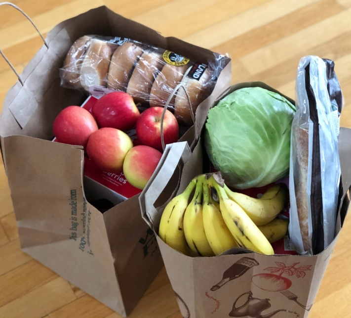
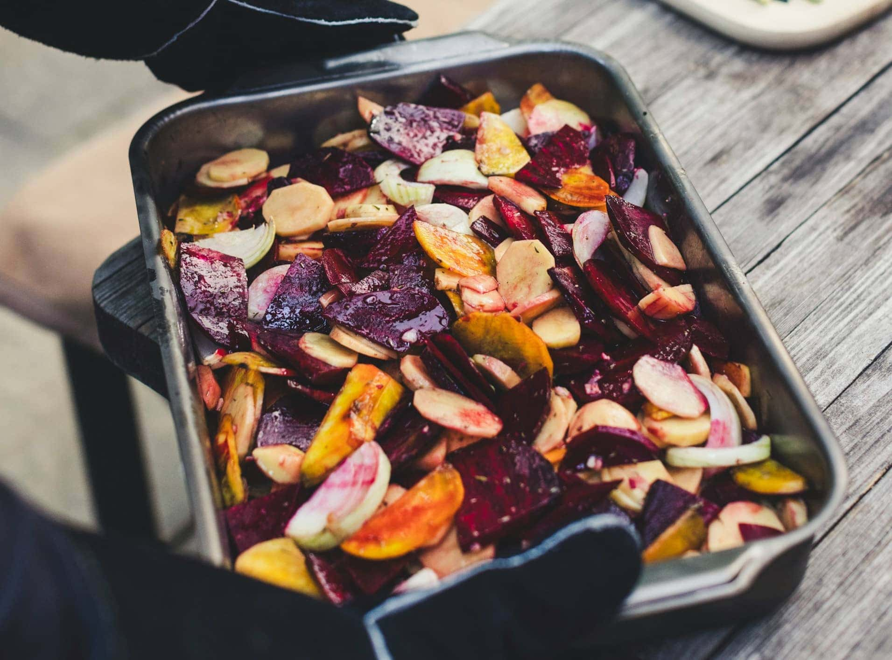

Manger le moins cher et le plus sain possible en peu de temps - c'est exactement ce que promet une tendance venue des États-Unis. En effet, dans notre quotidien stressant, une **alimentation équilibrée** est souvent négligée. Au lieu de cela, nous avons souvent recours à la restauration rapide ou à des snacks malsains, par exemple pendant les pauses déjeuner, afin d'apaiser nos fringales. Dans cet article, vous découvrirez ce qu'est le Meal **Prep**, ce à quoi vous devez faire attention en faisant du Meal Prepping et comment vous pouvez établir un [plan hebdomadaire Meal Prep](#Vorlage_fuer_Ihren_Meal_Prep_Wochenplan) intelligent.

## Qu'est-ce que Meal Prep exactement ?

Meal Prep est l'abréviation de **Meal Pre**paration, ce qui signifie en français préparation des repas. L'idée est de précuire vos plats préférés en grandes quantités afin qu'ils soient prêts à être consommés les jours suivants et qu'ils puissent être réchauffés ou terminés en quelques minutes.

Différents plats sont préparés à partir de quelques ingrédients.



Comme beaucoup de tendances alimentaires, l'engouement pour le meal prepping vient des États-Unis. Là-bas, le Meal Prep a surtout été utilisé par les amateurs de fitness, mais il a rapidement trouvé des applications dans tous les domaines de la vie.




Il vaut la peine d'essayer Meal Prep, en particulier pour les personnes qui ne trouvent pas le temps de cuisiner un repas maison dans leur vie quotidienne. Cela aide également à respecter les résolutions alimentaires et à renforcer l'autodiscipline. Bien sûr, il faut un peu de courage et suffisamment de motivation pour se lancer dans cette nouvelle façon de cuisiner, mais au final, cela peut rendre l'alimentation plus efficace, plus saine et moins chère.




Il y a deux façons de faire de la Meal Prep. Soit vous cuisinez **deux fois plus**, de sorte que le repas suffise pour le lendemain, soit vous allez un peu plus loin, vous prenez le temps de **précuire les différents ingrédients** et vous pouvez ensuite les combiner à votre guise les jours suivants.


## Avantages et inconvénients de Meal Prep

Meal Prep présente quelques avantages imbattables, aussi bien par rapport à la préparation quotidienne de plats frais que par rapport aux plats préparés vendus au supermarché ou dans les restaurants à emporter.

### Les avantages :

- **Gain de temps :** vous ne devez pas passer des heures dans la cuisine chaque soir, mais vous pouvez préparer vos repas pour plusieurs jours et les combiner de différentes manières.
- **Économise de l'argent :** les plats préparés sont généralement plus chers que de cuisiner soi-même et, proportionnellement, les grandes quantités d'aliments coûtent moins cher que les petits paquets.
- **Du sur-mesure pour vous :** Contrairement aux plats préparés, vous pouvez adapter les plats que vous avez cuisinés vous-même à vos propres besoins et préférences et les affiner à votre guise.
- **Favorise une alimentation saine :** les plats cuisinés à la maison contiennent souvent moins de sucre, de graisse et de sel - vous savez ce que vous consommez et pouvez adapter les recettes à vos objectifs alimentaires.
- **Contre le gaspillage alimentaire :** vous pouvez éviter les emballages entamés et les ingrédients abîmés en achetant des aliments frais dans les quantités appropriées et en les utilisant directement dans leur intégralité.

En ciblant vos achats, vous économisez de l'argent et du temps, car vous n'achetez que les aliments dont vous avez vraiment besoin.

Cela semble trop beau pour être vrai ? Bien sûr, comme beaucoup de tendances alimentaires, Meal Prep ne peut pas résoudre tous les problèmes. Outre les avantages évidents, il y a aussi des points négatifs à prendre en compte avant d'aborder le sujet de Meal Prep.

### Les inconvénients :

- **Conservation limitée :** certains aliments et plats (par exemple les salades) ne sont pas adaptés à un stockage prolongé, car ils se détériorent rapidement, perdent leur consistance ou leur goût.
- **Rend inflexible :** un repas improvisé au restaurant peut bouleverser votre plan de repas. Dans le pire des cas, vous devrez jeter des aliments avariés ou des portions précuites.
- **La monotonie :** même les plats préférés ne font pas toujours envie quand on les mange pour la troisième journée consécutive. Ci-dessous, vous découvrirez toutefois comment varier vos repas précuits.
- **Le stockage a un coût :** Si vous cuisinez à l'avance pour plusieurs jours, vous avez besoin de suffisamment de place dans votre réfrigérateur ou votre congélateur et, en outre, de moyens de conservation adéquats.

Faites preuve de créativité et veillez à ce que les plats soient aussi variés que possible.

## Étape par étape pour une préparation parfaite des repas

Pour que la mission Meal Prep soit un succès, vous avez d'abord besoin d'un [plan alimentaire](#Vorlage_fuer_Ihren_Meal_Prep_Wochenplan). Les **cinq étapes** suivantes vous aideront à le faire.

Avec une bonne planification, Meal Prep réussit même aux cuisiniers inexpérimentés.

### 1\. préparer

Demandez-vous d'abord pour combien de jours vous souhaitez cuisiner à l'avance. Pour les débutants en Meal Prep, il est préférable de cuisiner pour deux ou trois jours afin de s'habituer à l'effort et de développer progressivement une routine. Recherchez des **recettes Meal Prep** adaptées. Elles doivent contenir des aliments que vous aimez. En outre, la composition de votre plat est importante. Pour une alimentation équilibrée, vos repas devraient contenir les éléments suivants :

- **Protéines :** les bonnes sources sont la viande, le poisson et les produits laitiers, mais aussi le tofu et les légumineuses.
- **Légumes :** de préférence frais et de saison, mais ils contiennent aussi beaucoup de vitamines et de nutriments lorsqu'ils sont surgelés.
- **Glucides :** les pommes de terre, le riz et les pâtes sont les aliments les plus adaptés à cet effet.
- **Graisses :** les graisses végétales comme l'huile d'olive contiennent davantage d'acides gras insaturés et sont donc plus saines que les graisses animales.

### 2\. faire des achats

Les recettes sont choisies, il vous manque encore les **ingrédients**. Listez ce dont vous avez besoin et en quelles **quantités** afin de garder une vue d'ensemble pendant vos achats. De plus, une [liste de courses]() vous aide à n'acheter que les aliments dont vous avez vraiment besoin pour vos repas. Veillez à n'acheter des produits frais et périssables que si vous pouvez les utiliser immédiatement.

Une liste vous aide à garder une vue d'ensemble de vos achats.

### 3\. préparer

Vient maintenant la partie la plus laborieuse du Meal Prep. Pour préparer tous vos aliments, prenez **suffisamment** de temps, de préférence deux à trois heures, le jour de votre choix. Rôtissez, cuisez, étuvez ou faites cuire les ingrédients séparément, car ils ont **des points de cuisson différents** et se transforment sinon en une bouillie boueuse. En plus des repas principaux, vous pouvez également préparer **de petits en-cas** pour les petits creux. Il peut s'agir par exemple de barres de céréales faites maison.



### 4\. stocker

Pour que les ingrédients préparés restent frais suffisamment longtemps et conservent leur saveur, il est conseillé de les **conserver séparément**. [Des boîtes](https://www.chefkoch.de/vergleich/meal-prep-boxen/) spéciales avec des parois de séparation conviennent par exemple à la préparation des repas. Les aliments doivent être conservés dans des récipients en verre ou en plastique robuste qui se ferment hermétiquement. Conservez de préférence les plats préparés au réfrigérateur ou congelez-les.



### 5\. combiner

La dernière étape de Meal Prep est la plus facile. Sortez les composants préparés du réfrigérateur et composez un plat à votre convenance. **Différentes combinaisons** permettent de varier les goûts. Emballez votre création en toute sécurité pour le transport ou réchauffez et savourez directement votre repas sain et délicieux fait maison !



## Exemple de plan hebdomadaire Meal Prep

Voici un exemple de **plan alimentaire** pour illustrer encore une fois le fonctionnement de Meal Prep : Vous avez choisi quatre plats pour une semaine, qui contiennent tous des légumes, des pommes de terre et/ou du riz. **Les légumes au four** constituent la base de tous les plats et pourraient être composés, par exemple, de poivrons, de courgettes, de carottes, de pois chiches, d'oignons et de champignons.

Les légumes au four sont parfaits comme base pour différents plats.

Le **dimanche soir**, prenez donc environ deux heures pour laver, couper et cuire les légumes dans un grand plat à four pendant que vous faites cuire séparément les pommes de terre et le riz. Laissez refroidir les composants et placez le tout dans des boîtes ou des bocaux propres. Vous pouvez ensuite combiner les plats suivants à partir des ingrédients préparés :

- **Lundi :** Légumes au four avec pommes de terre (+ sauce tomate et herbes de Provence)
- **Mardi :** chop suey avec du riz (+ épices asiatiques comme le gingembre et la sauce soja)
- **Mercredi :** Ratatouille avec pommes de terre (+ bouillon de force et muscade)
- **Jeudi :** curry de légumes avec riz (+ lait de coco et poudre de curry)
- **Vendredi :** Légumes gratinés (tous les restes + fromage)

Grâce aux différentes épices, vous donnez aux légumes un goût différent chaque jour. Selon votre propre goût, vous pouvez bien sûr compléter les plats avec de la viande et d'autres ingrédients.

## Modèle pour votre plan hebdomadaire Meal Prep

Pour que vos recettes préférées soient toujours à portée de main, vous pouvez créer une liste de tous les plats Meal Prep et noter sur quels sites web vous avez trouvé tel ou tel plat. Le [modèle gratuit de SeaTable]() est idéal pour classer vos recettes Meal Prep de manière claire.

Il vous suffit d'inscrire le jour où vous souhaitez cuisiner un plat la prochaine fois et de créer en permanence de nouveaux **plans hebdomadaires Meal Prep** dans le calendrier. Téléchargez des photos et laissez-vous inspirer semaine après semaine par votre galerie de plats possibles. Deux autres tableaux vous permettent d'enregistrer tous les ingrédients dans une **liste de courses** et de comparer les **valeurs nutritives** de vos plats préférés.

Si vous souhaitez utiliser SeaTable pour votre plan hebdomadaire Meal Prep, il vous suffit de [vous inscrire]() gratuitement. Vous trouverez le modèle correspondant [ici](). Supprimez les exemples de recettes et adaptez le plan alimentaire à vos besoins.
