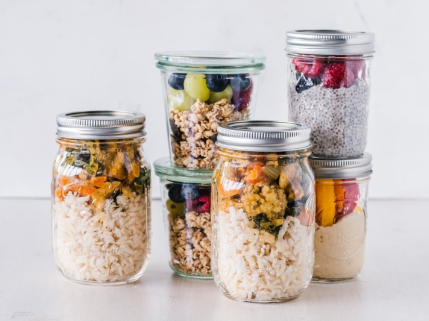

Com pouco tempo, comer de forma barata e saudável – uma tendência dos EUA promete exatamente isso. Pois, no dia a dia corrido, uma **alimentação equilibrada** muitas vezes fica de lado. Em vez disso, por exemplo, nas pausas para o almoço, frequentemente recorremos a fast food ou lanches pouco saudáveis para saciar a fome. Neste artigo, você vai aprender o que é o **Meal Prep**, o que deve ser observado ao preparar as refeições e como criar um inteligente [plano semanal de Meal Prep](#Vorlage_fuer_Ihren_Meal_Prep_Wochenplan).

## O que exatamente é Meal Prep?

Meal Prep é a abreviação de **Meal Preparation**, que em português significa preparo de refeições. A ideia é cozinhar suas comidas favoritas em grandes quantidades para que estejam prontas para consumo nos dias seguintes e possam ser aquecidas ou finalizadas em poucos minutos.

Com poucos ingredientes, são criados pratos variados.



Como muitas tendências alimentares, o hype do Meal Prep vem dos EUA. Lá, o Meal Prep foi inicialmente usado por amantes de fitness, mas rapidamente se espalhou para todas as áreas da vida.




Especialmente para pessoas que não têm tempo para cozinhar refeições caseiras no dia a dia, vale a pena experimentar o Meal Prep. Ele também ajuda a manter resoluções alimentares e a fortalecer a autodisciplina. Claro que é preciso um pouco de coragem e motivação para se adaptar a essa nova forma de cozinhar, mas no final das contas pode tornar a alimentação mais eficiente, saudável e econômica.




Existem duas formas de fazer Meal Prep. Ou você cozinha a **quantidade dobrada**, para que a comida dure até o dia seguinte, ou vai além, dedicando tempo para **pré-cozinhar os ingredientes separadamente** e pode combiná-los como quiser nos dias seguintes.


## Vantagens e desvantagens do Meal Prep

O Meal Prep tem algumas vantagens imbatíveis – tanto em comparação ao cozimento diário de pratos frescos quanto a pratos prontos do supermercado ou de delivery.

### Vantagens:

- **Economiza tempo:** Você não precisa passar horas na cozinha toda noite, pode preparar refeições para vários dias e combiná-las de formas diferentes.
- **Economiza dinheiro:** Pratos prontos geralmente são mais caros que cozinhar em casa e, proporcionalmente, comprar grandes quantidades de alimentos sai mais barato que embalagens pequenas.
- **Personalizado para você:** Pratos caseiros podem ser ajustados conforme suas necessidades e preferências e aprimorados ao seu gosto.
- **Estimula alimentação saudável:** Pratos caseiros costumam conter menos açúcar, gordura e sal – você sabe o que está consumindo e pode adaptar as receitas aos seus objetivos nutricionais.
- **Combate o desperdício de alimentos:** Você evita embalagens abertas e ingredientes estragados comprando a quantidade certa e aproveitando tudo.

Compras direcionadas economizam dinheiro e tempo, pois você compra só o que realmente precisa.

Parece bom demais para ser verdade? Como muitas tendências alimentares, o Meal Prep também não resolve todos os problemas. Além das vantagens óbvias, há pontos negativos que você deve considerar antes de se dedicar ao tema.

### Desvantagens:

- **Validade limitada:** Alguns alimentos e pratos (ex.: saladas) não são adequados para armazenamento prolongado, pois estragam rápido ou perdem textura e sabor.
- **Torna inflexível:** Uma refeição espontânea no restaurante pode bagunçar seu plano alimentar. No pior caso, você terá que descartar alimentos estragados ou porções pré-cozidas.
- **Monotonia:** Mesmo pratos favoritos cansam se consumidos pelo terceiro dia consecutivo. Mais abaixo você verá como variar suas refeições pré-cozidas.
- **Armazenamento custa espaço:** Quem cozinha para vários dias precisa de espaço suficiente na geladeira ou freezer e dos recipientes adequados.

Seja criativo e garanta pratos o mais variados possível.

## Passo a passo para o Meal Prep perfeito

Para que a missão Meal Prep seja um sucesso, você precisa primeiro de um [plano alimentar](#Vorlage_fuer_Ihren_Meal_Prep_Wochenplan). Os seguintes **cinco passos** ajudam no processo.

Com o planejamento certo, o Meal Prep também funciona para cozinheiros iniciantes.

### 1\. Preparar

Primeiro, pergunte-se para quantos dias deseja cozinhar antecipadamente. Para iniciantes, é recomendável começar preparando para dois ou três dias, para se acostumar com o esforço e desenvolver uma rotina. Procure por **receitas de Meal Prep** adequadas. Elas devem conter alimentos que você gosta de comer. Além disso, a composição do prato é importante. Para uma alimentação equilibrada, suas refeições devem conter:

- **Proteínas:** Boas fontes são carnes, peixes e laticínios, mas também tofu e leguminosas.
- **Legumes:** De preferência frescos e sazonais, mas congelados também têm muitas vitaminas e nutrientes.
- **Carboidratos:** Batatas, arroz e massas são os mais indicados.
- **Gorduras:** Gorduras vegetais como azeite contêm mais ácidos graxos insaturados e são mais saudáveis que gorduras animais.

### 2\. Comprar

Com as receitas escolhidas, agora faltam os **ingredientes**. Faça uma lista do que precisa e em quais **quantidades**, para manter o controle durante as compras. Além disso, uma [lista de compras]() ajuda a comprar só os alimentos realmente necessários para suas refeições. Compre produtos frescos e perecíveis apenas quando for usá-los imediatamente.

Uma lista ajuda a ter controle das compras.

### 3\. Preparar

Agora vem a parte mais trabalhosa do Meal Prep. Para preparar todos os alimentos, reserve **tempo suficiente**, idealmente duas a três horas em um dia de sua escolha. Frite, cozinhe, cozinhe no vapor ou asse os ingredientes separadamente, pois eles têm **tempos de cozimento diferentes** e, caso contrário, viram uma mistura mole. Além das refeições principais, você pode preparar **lanches pequenos** para o meio do dia, como barras de cereal caseiras.



### 4\. Armazenar

Para que os ingredientes preparados permaneçam frescos e saborosos por tempo suficiente, devem ser **armazenados separadamente**. Para Meal Prep, são indicadas, por exemplo, [caixas](<[https://www.chefkoch.de/vergleich/meal-prep-boxen/](https://www.chefkoch.de/vergleich/meal-prep-boxen/)>) com divisórias. Guarde os alimentos em recipientes herméticos de vidro ou plástico resistente. Armazene as refeições preferencialmente na geladeira ou congele.



### 5\. Combinar

O último passo do Meal Prep é o mais fácil. Tire os componentes preparados da geladeira e monte o prato conforme desejar. **Combinações variadas** garantem diversidade de sabores. Embale sua criação com segurança para transporte ou aqueça e aproveite sua comida caseira, saudável e deliciosa!



## Exemplo de plano semanal de Meal Prep

Um exemplo de **plano alimentar** ilustra o funcionamento do Meal Prep: você escolheu quatro pratos para a semana, todos contendo legumes, batatas e/ou arroz. O **legume assado no forno** é a base para todos os pratos e pode incluir pimentão, abobrinha, cenoura, grão-de-bico, cebola e cogumelos.

Legumes assados são uma ótima base para pratos variados.

No **domingo à noite**, reserve cerca de duas horas para lavar, cortar e assar os legumes em uma assadeira grande, enquanto cozinha as batatas e o arroz separadamente. Deixe os componentes esfriarem e coloque tudo em potes ou recipientes limpos. Com os ingredientes preparados, você pode montar os seguintes pratos:

- **Segunda:** legumes assados com batatas (+ molho de tomate e ervas da Provence)
- **Terça:** Chop Suey com arroz (+ temperos asiáticos como gengibre e molho de soja)
- **Quarta:** Ratatouille com batatas (+ caldo de carne e noz-moscada)
- **Quinta:** curry de legumes com arroz (+ leite de coco e curry em pó)
- **Sexta:** legumes gratinados (todos os restos + queijo)

Com os diferentes temperos, você dá um sabor diferente aos legumes a cada dia. Claro que pode complementar os pratos com carne e outros ingredientes conforme seu gosto.

## Modelo para seu plano semanal de Meal Prep

Para ter suas receitas favoritas sempre à mão, você pode criar uma lista com todos os pratos de Meal Prep e registrar em quais sites encontrou cada receita. O [modelo gratuito do SeaTable]() é ideal para organizar suas receitas de Meal Prep de forma clara.

Basta inserir o dia em que pretende cozinhar cada prato e criar novos **planos semanais de Meal Prep** no calendário. Faça upload de fotos e deixe sua galeria inspirar você semana após semana com possíveis pratos. Em outras duas tabelas, você pode registrar todos os ingredientes em uma **lista de compras** e comparar os **valores nutricionais** dos seus pratos favoritos.

Se quiser usar o SeaTable para seu plano semanal de Meal Prep, [registre-se]() gratuitamente. O modelo correspondente está disponível [aqui]({{< relref "templates/healthcare/recipes-meal-plan" >
