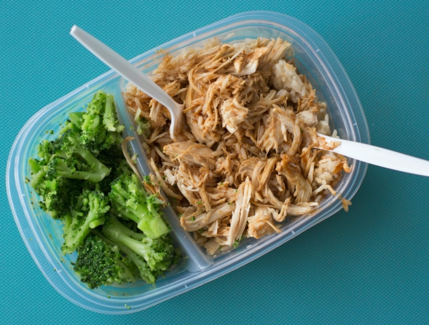

Питаться как можно дешевле и здоровее при минимальных затратах времени - именно это обещает тенденция из США. В напряженной повседневной жизни мы часто пренебрегаем **сбалансированным питанием**. Вместо этого мы часто тянемся к фастфуду или нездоровым закускам, например, в обеденный перерыв, чтобы удовлетворить свою тягу. В этой статье вы узнаете, что такое **подготовка продуктов питания**, на что следует обращать внимание при подготовке блюд и как составить грамотный [план подготовки продуктов на неделю](#Vorlage_fuer_Ihren_Meal_Prep_Wochenplan).

## Что такое подготовка к приему пищи?

Meal Prep - это аббревиатура, обозначающая **приготовление еды**. Идея заключается в том, что вы заранее готовите свои любимые блюда в больших количествах, чтобы они были готовы к употреблению в последующие дни и могли быть повторно разогреты или доведены до готовности всего за несколько минут.

Различные блюда готовятся всего из нескольких ингредиентов.



Как и многие другие тенденции в области питания, ажиотаж вокруг приготовления пищи зародился в США. Там приготовление пищи использовалось в основном любителями фитнеса, но быстро вошло во все сферы жизни.




Особенно стоит попробовать "Готовим еду" тем, кто не находит времени для самостоятельного приготовления пищи. Это также помогает придерживаться диетических резолюций и укрепляет самодисциплину. Конечно, для того чтобы попробовать новый способ приготовления пищи, требуется немного усилий и достаточно мотивации, но в конечном итоге он может сделать ваше питание более эффективным, здоровым и дешевым.




Существует два способа приготовления пищи. Можно либо приготовить **двойную порцию**, чтобы хватило на следующий день, либо сделать еще один шаг вперед и потратить время на **предварительное приготовление отдельных ингредиентов**, а затем комбинировать их по своему усмотрению в последующие дни.


## Преимущества и недостатки приготовления пищи

Приготовление пищи имеет ряд неоспоримых преимуществ - как перед ежедневным приготовлением свежих блюд, так и перед готовыми блюдами из супермаркета или ресторана на вынос.

### Преимущества:

- **Экономия времени:** не нужно каждый вечер проводить часы на кухне, а можно готовить блюда на несколько дней и комбинировать их в разных вариантах.
- **Экономия денег:** готовые блюда обычно стоят дороже, чем приготовленные самостоятельно, а большие объемы продуктов обходятся дешевле маленьких упаковок.
- **Индивидуальный подход:** В отличие от готовых блюд, блюда домашнего приготовления можно адаптировать к собственным потребностям и предпочтениям, а также доработать их по своему усмотрению.
- **Способствует здоровому питанию:** приготовленные дома блюда часто содержат меньше сахара, жира и соли - вы знаете, что едите, и можете адаптировать рецепты к своим пищевым целям.
- **Против пищевых отходов:** Вы можете избежать вскрытия упаковок и порчи ингредиентов, если будете покупать необходимое количество свежих продуктов и сразу же использовать их.

Целевые покупки экономят время и деньги, поскольку вы покупаете только те продукты, которые вам действительно нужны.

Звучит слишком хорошо, чтобы быть правдой? Как и многие другие тенденции в области питания, Meal Prep не может решить всех ваших проблем. Помимо очевидных преимуществ, есть и негативные моменты, которые следует учитывать, прежде чем браться за тему приготовления пищи.

### Недостатки:

- **Ограниченный срок хранения:** некоторые продукты и блюда (например, салаты) не подходят для длительного хранения, так как быстро портятся, теряют консистенцию или вкус.
- **Негибкость**: спонтанный ужин в ресторане может нарушить ваш план питания. В худшем случае придется выбрасывать испорченные продукты или заранее приготовленные порции.
- **Однообразие:** не всегда хочется есть любимые блюда, даже если ешь их третий день подряд. Но ниже вы узнаете, как внести разнообразие в заранее приготовленную еду.
- **Расходы на хранение:** Если вы готовите пищу на несколько дней вперед, вам потребуется достаточно места в холодильнике или морозильной камере и соответствующее оборудование для хранения.

Проявляйте творческий подход и старайтесь, чтобы ваши блюда были как можно более разнообразными.

## Шаг за шагом к идеальному приготовлению пищи

Для успешного выполнения миссии по приготовлению пищи сначала необходимо составить [план питания](#Vorlage_fuer_Ihren_Meal_Prep_Wochenplan). Следующие **пять шагов** помогут вам в этом процессе.

При правильном планировании даже неопытные повара могут добиться успеха в приготовлении пищи.

### 1\. подготовить

Прежде всего, спросите себя, на сколько дней вы хотите готовить заранее. Для начинающих готовить еду лучше всего готовить на два-три дня, чтобы привыкнуть к усилиям и постепенно выработать привычный режим. Поищите подходящие **рецепты** для приготовления еды. Они должны содержать продукты, которые вы любите есть. Важен также состав блюд. Для сбалансированного питания в состав пищи должны входить следующие продукты:

- **Белки:** хорошими источниками являются мясо, рыба и молочные продукты, а также тофу и бобовые.
- **Овощи:** в идеале - свежие и сезонные, но и в замороженном виде они содержат много витаминов и питательных веществ.
- **Углеводы:** для этого особенно подходят картофель, рис и макаронные изделия.
- **Жиры:** Растительные жиры, такие как оливковое масло, содержат больше ненасыщенных жирных кислот и поэтому более полезны, чем животные жиры.

### 2\. покупки

Рецепты выбраны, теперь вам нужны **ингредиенты**. Составьте список того, что вам нужно и в каких **количествах**, чтобы иметь возможность следить за всем во время покупок. [Список покупок]() также поможет вам купить только те продукты, которые действительно необходимы для приготовления блюд. Убедитесь, что вы покупаете свежие и скоропортящиеся продукты, только если вы можете использовать их немедленно.

Список помогает следить за своими покупками.

### 3\. подготовка

Теперь наступает самая трудоемкая часть подготовки блюд. Выделите **достаточно времени** на подготовку всех продуктов, желательно два-три часа в выбранный вами день. Обжаривайте, отваривайте, готовьте на пару или запекайте ингредиенты по отдельности, поскольку они имеют **разную температуру приготовления** и иначе превратятся в однообразную кашицу. В дополнение к основным приемам пищи можно готовить **небольшие перекусы** между ними. Это могут быть, например, домашние батончики мюсли.



### 4\. хранение

Чтобы подготовленные ингредиенты долго оставались свежими и сохраняли свои вкусовые качества, их следует **хранить отдельно**. Например, для приготовления блюд можно использовать специальные [коробки](https://www.chefkoch.de/vergleich/meal-prep-boxen/) с разделителями. Продукты следует хранить в герметичных контейнерах из стекла или прочного пластика. Лучше всего хранить готовые блюда в холодильнике или замораживать их.



### 5\. комбинировать

Последний этап подготовки блюд - самый простой. Достаньте из холодильника подготовленные ингредиенты и составьте из них блюдо по своему усмотрению. **Различные комбинации** обеспечат разнообразие вкусов. Надежно упакуйте свое творение для транспортировки или разогрейте его и сразу же наслаждайтесь полезной и вкусной домашней едой!



## Пример плана подготовки блюд на неделю

Ниже приведен пример **плана питания**, иллюстрирующий принцип работы системы Meal Prep: Вы выбрали четыре блюда на неделю, все они содержат овощи, картофель и/или рис. **Овощи, приготовленные в духовке**, составляют основу всех блюд и могут состоять, например, из перца, кабачков, моркови, нута, лука и грибов.

Духовые овощи являются прекрасной основой для приготовления различных блюд.

Поэтому в **воскресенье вечером** примерно за два часа вымойте, нарежьте и запеките овощи в большой посуде для запекания, а картофель и рис приготовьте отдельно. Оставьте ингредиенты остывать и переложите все в чистые коробки или банки. Затем из подготовленных ингредиентов можно приготовить следующие блюда:

- **Понедельник:** овощи в духовке с картофелем (+ томатный соус и травы Прованса)
- **Вторник:** Чоп-суй с рисом (+ азиатские специи, такие как имбирь и соевый соус)
- **Среда:** Рататуй с картофелем (+ бульон и мускатный орех)
- **Четверг:** Овощное карри с рисом (+ кокосовое молоко и порошок карри)
- **Пятница:** овощи на гратане (все остатки + сыр)

Различные специи каждый день придают овощам разный вкус. Разумеется, в блюда можно добавлять мясо и другие ингредиенты по своему вкусу.

## Шаблон для еженедельного плана приготовления пищи

Чтобы любимые рецепты всегда были под рукой, можно составить список всех блюд, которые вы готовите, и записывать, на каких сайтах вы нашли то или иное блюдо. [Бесплатный шаблон от SeaTable]() идеально подходит для наглядной организации рецептов приготовления блюд.

Просто введите день, в который вы хотите приготовить то или иное блюдо, и создавайте новые **еженедельные планы Meal Prep** в календаре. Загружайте фотографии и вдохновляйтесь галереей возможных блюд неделю за неделей. В двух дополнительных таблицах можно записать все ингредиенты в **список покупок** и сравнить **пищевую ценность** ваших любимых блюд.

Если вы хотите использовать SeaTable для составления своего еженедельного плана питания, просто [зарегистрируйтесь]() бесплатно. Соответствующий шаблон можно найти [здесь](). Удалите примеры рецептов и настройте план питания в соответствии со своими потребностями.
