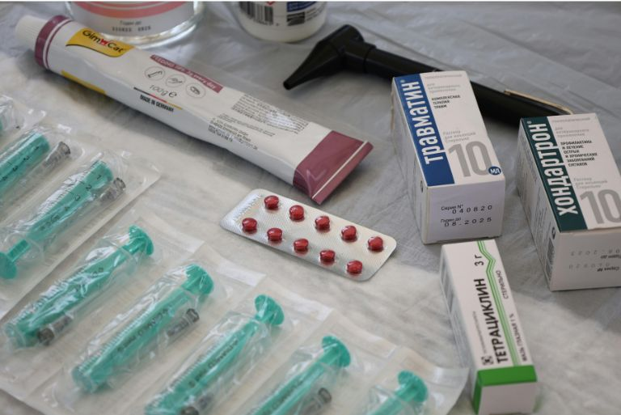

Did you know that over 50 percent of all patients aged 65 and over take five or more different medications every day? This is shown by the Medication Compass 2022 of the Scientific Institute of the AOK. But the more medication you take every day, the more difficult it becomes to remember everything: Which tablet do you need to take and when? In what dosage? And should you take the medicine before or after a meal?

It is important to have an overview in order to avoid confusion or incorrect intake. This is exactly where the **medication plan** comes into play. It helps to clearly document all relevant information relating to medication and not only makes everyday life easier for those affected, but also the work of doctors and nursing staff. In this blog article, you can find out what a good medication plan should contain and what specific benefits it offers.

## What is a medication plan?

A medication plan is a structured written overview of all the medication you take regularly. It records the name of your medication, the dosage, when to take it and any special instructions for use. As a patient, you know exactly when you need to take which medication. This gives you peace of mind and helps you not to forget to take your medication or accidentally mix it up.

The medication schedule is also an important aid for nursing staff. Based on this overview, they can prepare the tablets specifically and correctly in tablet doses. Doctors, on the other hand, receive a clear **overview of your entire medication**. This makes it easier to identify and avoid possible interactions or duplicate prescriptions.

A medication plan can even be crucial for emergency personnel in an emergency. If you find yourself in an emergency situation and need to act quickly, the plan provides important information about your ongoing treatment and facilitates targeted and safe care.

## Why is a medication plan important?

A structured medication plan is essential for the **health and safety** of patients. This is because it helps to identify critical combinations of medication and prevent dangerous interactions. It also facilitates **communication between doctors, pharmacists and nursing staff** - especially in sensitive situations such as changes of doctor, hospital stays or emergencies.

A clear plan also supports **improved therapy**, as it promotes regular and correct intake and thus stabilizes or strengthens your health in the long term. Last but not least, a medication plan also relieves the burden on your relatives and carers, who can monitor your intake more easily and provide targeted support.

## Common mistakes when taking medication

When taking medication on a daily basis, it is easy to make mistakes that can have serious consequences for your health. It often happens that an active ingredient is accidentally taken **twice**. This can be self-inflicted, for example if you make a mistake with the number of tablets or the frequency of intake; or it may be because you have been prescribed the same active ingredient under different trade names without realizing it.

The **forgetting of medication** is also a common problem. Sometimes an intake is skipped altogether, in other cases only the intended time of day is confused. Both can lead to the effect of your therapy being impaired or unwanted side effects occurring.

A further risk that can be prevented by a medication plan is that of possible **interactions** between different medications. These are particularly difficult to recognize if not all the preparations taken are fully recorded. This often concerns **self-medication** products that are taken without consulting a doctor. This also includes over-the-counter products such as St. John's wort, painkillers such as ibuprofen or certain dietary supplements. These seemingly harmless preparations can also influence the effect of your other medication or even trigger dangerous reactions.

It is therefore important that you keep an eye on all your medication. A carefully managed medication schedule will help you to avoid such errors and improve the safety of your treatment.

{{< warning headline="Free medication analysis by a pharmacist" text="A medication analysis at the pharmacy can help to identify possible risks when taking medication at an early stage. Many pharmacies now offer this analysis free of charge - especially for people who take several medications on a permanent basis. Specially trained pharmacists check your entire medication for compatibility, possible interactions and duplicate prescriptions. Such a consultation can not only provide you with clarity, but also make your therapy much safer. It's worth simply asking at your pharmacy." />}}

## What should not be missing from a medication plan?

In order for your medication plan to be fully effective, you should keep it complete and accurate. The following information must not be missing in order to ensure safe, correct and comprehensible use of the medication:

- Trade name of the medication
- Active ingredient
- Strength
- Dosage
- Time of administration
- Reason for use
- Instructions for use
- Start and planned end of intake
- Dosage form
- Prescribing doctor

## Who should have access to the medication plan?

For a medication plan to really help once it has been drawn up, it should not just be in your hands. If you are supported by relatives, a carer or nursing staff, for example, they can immediately see at a glance which tablets need to be taken and when. This not only takes the pressure off you, but also ensures that nothing is forgotten in everyday life.

Your family doctor and any specialists who may also be treating you will also benefit from this. With the plan, they have all the important information at a glance and can better coordinate your therapy. For example, it can prevent two different doctors from accidentally prescribing you medication that is not compatible.

An up-to-date tablet plan can also be very valuable in the pharmacy. A pharmacist can often recognize possible interactions at first glance or give you helpful tips on how certain medications work best - for example, whether a tablet should be taken before or after a meal.

The medication plan is particularly important in an emergency. Imagine you suddenly have to go to hospital and are so upset that you can't list everything you take regularly. The ambulance service and emergency doctors can immediately assess which medication you need and which pre-existing conditions need to be taken into account by looking at the plan.

## Why a digital medication plan makes sense

A digital medication plan has many advantages and makes everyday life noticeably easier. One of the biggest advantages is that it is always up to date. Changes to medication can be entered immediately so that you and everyone involved always have the latest status at a glance, regardless of whether a new dosage has been prescribed or a medication has been discontinued.

The central availability is also very helpful. It is no longer necessary to carry notes around with you or hope that the latest version is somewhere handy. Instead, doctors or nursing staff can access the latest data at any time - with your consent, of course.

In emergency situations, a digital plan can even save lives. Rescue services and emergency doctors immediately receive an overview of your regular medication and can therefore make faster and safer decisions.

The digital medication plan is also impressive when it comes to data protection. It can be managed in such a way that only authorized persons have access and complies with the legal requirements for protecting your sensitive health data. The digital version is also environmentally friendly. New paper lists no longer need to be printed and yet everything remains up to date at all times.

## Medication plan with SeaTable

The free medication schedule template from SeaTable makes it easy to take your medication correctly. Instead of a confusing box of medication or a printed list that can quickly get lost, you can record all relevant information centrally and digitally. This means you can easily create and update your medication list on an ongoing basis.



The GDPR-compliant template combines various views and functions to make your everyday life easier. In addition to a classic medication list, you can link doctors and specialists directly to the prescribed preparations, display practice locations on a map and store your patient data clearly. With the integrated page design plugin, you can access a print-ready version at any time or share your plan digitally with medical staff. This means you always have an overview, even in hectic or critical moments, always have your medication to hand and can be sure that everything is fully documented.

## FAQs



Your medication list should contain the following information:

- Trade name of the medication
- Active ingredient
- Strength
- Dosage
- Time of administration
- Reason for use
- Instructions for use (e.g. before or after eating)
- Start and planned end of intake
- Dosage form (e.g. tablet, drops, injection)
- Name of the prescribing doctor





With a simple software tool such as SeaTable, you can record your medication digitally. To create your medication plan yourself, enter all the relevant data in the free template, link medications to the doctors treating you and keep the plan up to date. The digital version can be adapted at any time on your computer, tablet or smartphone and printed out if required.





Yes, in SeaTable you can immediately enter changes such as new medications, changed dosages or discontinued preparations. This means that the plan is always up to date and everyone involved has access to the latest version - with your consent.





An intake schedule reduces the risk of forgetting, double doses or incorrect intake. It makes organization easier for you, provides clear intake times and offers security in everyday life. At the same time, doctors and pharmacists can use the plan to identify possible interactions more quickly and optimally coordinate your therapy.

