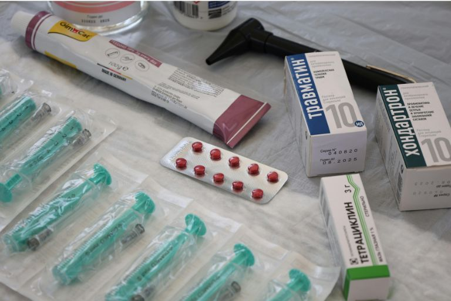
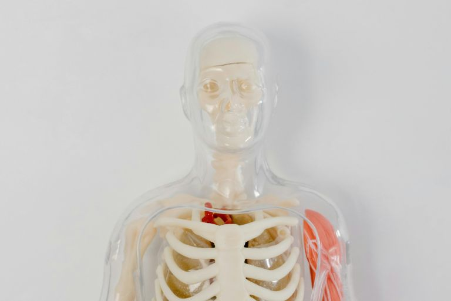
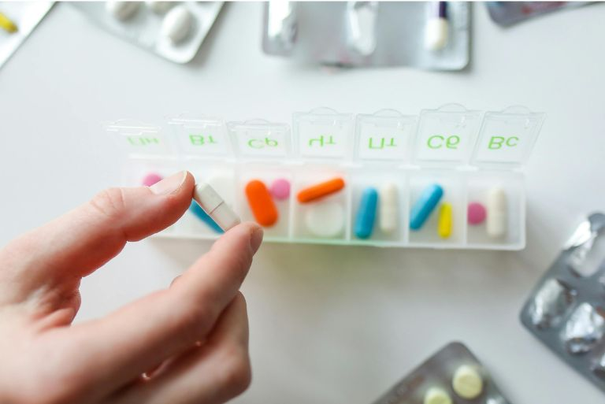

Saviez-vous que plus de 50 pour cent des patients âgés de 65 ans et plus prennent quotidiennement cinq médicaments différents ou plus ? C'est ce que montre le Compas des médicaments 2022 de l'Institut scientifique de l'AOK. Mais plus vous prenez de médicaments chaque jour, plus il est difficile de penser à tout : quel comprimé prendre et à quel moment ? Dans quel dosage ? Et faut-il prendre le médicament avant ou après le repas ?

Pour éviter les confusions ou les erreurs de prise, il est important d'avoir une vue d'ensemble. C'est là qu'intervient le **Plan des médicaments**. Il aide à documenter de manière claire toutes les informations importantes concernant la médication et facilite non seulement le quotidien des personnes concernées, mais aussi le travail des médecins et du personnel soignant. Vous découvrirez dans cet article de blog ce que doit contenir un bon plan de médication et quels sont ses avantages concrets.

## Qu'est-ce qu'un plan de traitement médicamenteux ?

Un plan de traitement est un aperçu écrit structuré de tous les médicaments que vous prenez régulièrement. Il mentionne le nom de votre médicament, le dosage, l'heure de prise et des indications particulières sur son utilisation. En tant que patient, vous savez ainsi exactement quand vous devez prendre quel médicament. Cela vous donne de la sécurité et vous aide à ne pas oublier de prendre vos médicaments ou à ne pas les confondre par inadvertance.

Le plan de médication est également un soutien important pour le personnel soignant. Sur la base de cet aperçu, ils peuvent préparer les comprimés de manière ciblée et correcte dans des piluliers. Quant aux médecins, le plan leur donne une **vue d'ensemble claire de toute votre médication**. Cela permet d'identifier et d'éviter plus rapidement d'éventuelles interactions ou des prescriptions en double.

Même pour le personnel de secours, un plan de médication peut être décisif en cas d'urgence. Si vous vous trouvez dans une situation d'urgence et que vous devez agir rapidement, le plan fournit des informations importantes sur votre traitement en cours et facilite un traitement ciblé et sûr.

## Pourquoi un plan de traitement est-il important ?

Un plan de médication structuré est indispensable pour la **santé et la sécurité** des patients. Il permet en effet d'identifier les combinaisons critiques de médicaments et d'éviter les interactions dangereuses. De plus, il facilite la **communication entre les médecins, les pharmaciens et le personnel soignant** - en particulier dans des situations sensibles comme les changements de médecin, les hospitalisations ou les urgences.

Un plan clair soutient en outre la **thérapie améliorée**, car il favorise la prise régulière et correcte et stabilise ou renforce ainsi votre santé à long terme. Enfin, un plan de médication signifie également un soulagement pour vos proches et le personnel soignant, qui peuvent plus facilement contrôler la prise et apporter un soutien ciblé.

## Erreurs fréquentes lors de la prise de médicaments

Lors de la prise quotidienne de médicaments, il est facile de faire des erreurs qui ont parfois des conséquences importantes sur la santé. Il arrive souvent qu'une substance active soit prise **doublement** par inadvertance. Cela peut être de votre propre faute, par exemple si vous vous trompez sur le nombre de comprimés ou la fréquence de prise ; ou bien c'est parce qu'on vous a prescrit le même principe actif sous des noms commerciaux différents, sans que vous vous en rendiez compte.

L'**oubli de médicaments** est également un problème courant. Parfois, une prise est complètement omise, dans d'autres cas, on se trompe simplement de moment de la journée prévu. Dans les deux cas, l'efficacité de votre traitement peut être compromise ou des effets secondaires indésirables peuvent apparaître.

Un autre risque qui peut être évité grâce à un plan de médication est lié à d'éventuelles **interactions** entre différents médicaments. Celles-ci sont particulièrement difficiles à détecter si toutes les préparations prises ne sont pas entièrement répertoriées. Il s'agit souvent de produits d'automédication** qui sont pris en plus sans consultation du médecin. En font également partie des produits en vente libre comme le millepertuis, des analgésiques comme l'ibuprofène ou certains compléments alimentaires. Même ces préparations apparemment inoffensives peuvent influencer l'effet de vos autres médicaments ou même déclencher des réactions dangereuses.

Il est donc important de garder un œil sur l'ensemble de votre médication. Un plan de médication soigneusement géré vous aidera à éviter de telles erreurs et à améliorer la sécurité de votre traitement.

{{< warning headline="Analyse gratuite de la médication par un pharmacien" text="Une analyse de la médication en pharmacie peut aider à identifier à temps les risques éventuels liés à la prise de médicaments. De nombreuses pharmacies proposent désormais cette analyse gratuitement - en particulier pour les personnes qui prennent durablement plusieurs médicaments. A cette occasion, des pharmaciens spécialement formés examinent l'ensemble de votre médication afin de vérifier la compatibilité, les interactions possibles et les doubles prescriptions. Un tel entretien peut non seulement vous apporter des éclaircissements, mais aussi rendre votre traitement nettement plus sûr. Cela vaut la peine de vous renseigner auprès de votre pharmacien." />}}

## Qu'est-ce qui ne devrait pas manquer dans un plan de médicaments ?

Pour que votre plan de traitement soit pleinement efficace, vous devez le tenir à jour de manière complète et minutieuse. Les indications suivantes ne doivent pas y manquer afin de garantir une utilisation sûre, correcte et compréhensible des médicaments :

- Nom commercial du médicament
- Principe actif
- Dosage
- Dosage
- Date de prise
- Raison de l'utilisation
- Instructions de prise
- Début et fin prévue de la prise
- Forme d'administration
- Médecin prescripteur

## Qui devrait avoir accès au plan de médication ?

Pour qu'un plan de médication puisse réellement vous aider une fois qu'il a été établi, il ne doit pas être uniquement entre vos mains. Si vous êtes par exemple assisté par des proches, un soignant ou du personnel soignant, ils peuvent immédiatement voir quels comprimés doivent être pris et à quel moment en jetant un coup d'œil sur le plan. Non seulement cela vous libère de la pression, mais cela vous permet également de ne rien oublier au quotidien.

Votre médecin de famille et les spécialistes qui vous traitent peut-être en plus en profitent également. Grâce au plan, ils ont toutes les informations importantes sous les yeux et peuvent mieux adapter votre traitement. Cela permet par exemple d'éviter que deux médecins différents vous prescrivent par erreur des médicaments qui ne sont pas compatibles.

Un plan actualisé des comprimés peut également être très utile à la pharmacie. Un pharmacien reconnaît souvent au premier coup d'œil les interactions possibles ou vous donne des indications utiles sur la manière dont certains médicaments agissent le mieux - par exemple, si un comprimé doit être pris avant ou après le repas.

Le plan de médication est particulièrement important en cas d'urgence. Imaginez que vous soyez soudainement hospitalisé et que, sous le coup de l'émotion, vous ne puissiez pas énumérer tous les médicaments que vous prenez régulièrement. En jetant un coup d'œil au plan, les services de secours et les médecins d'urgence peuvent immédiatement évaluer les médicaments dont vous avez besoin et les maladies antérieures dont il faut tenir compte.

## Pourquoi un plan de médication numérique est-il utile ?

Un plan médicamenteux numérique présente de nombreux avantages et facilite sensiblement le quotidien. L'un des plus grands avantages réside dans son actualité permanente. Les modifications apportées à la médication peuvent être inscrites immédiatement, de sorte que vous et toutes les personnes concernées avez toujours un aperçu de la situation la plus récente, qu'un nouveau dosage ait été prescrit ou qu'un médicament ait été arrêté.

La disponibilité centrale est également très utile. Il n'est plus nécessaire de transporter des fiches ou d'espérer que la dernière version se trouve quelque part à portée de main. Au lieu de cela, les médecins ou le personnel soignant peuvent accéder à tout moment aux données actuelles, bien entendu uniquement avec votre accord.

Dans les situations d'urgence, un plan numérique peut même sauver des vies. Les services de secours et les médecins d'urgence obtiennent immédiatement un aperçu de vos médicaments réguliers et peuvent ainsi prendre des décisions plus rapides et plus sûres.

Le plan de médication numérique convainc également en matière de protection des données. Il peut être géré de manière à ce que seules les personnes autorisées y aient accès et répond aux exigences légales en matière de protection de vos données de santé sensibles. De plus, la version numérique est respectueuse de l'environnement. Il n'est plus nécessaire d'imprimer de nouvelles listes papier, mais tout reste à jour à tout moment.

## Plan de médicaments avec SeaTable

Avec le modèle de plan de médication gratuit de SeaTable, il est très facile de prendre correctement vos médicaments. Au lieu d'une boîte de médicaments encombrée ou d'une liste imprimée qui peut vite se perdre, vous saisissez toutes les informations pertinentes de manière centralisée et numérique. Vous pouvez ainsi établir sans grand effort votre liste de médicaments et la mettre à jour en continu.



Le modèle conforme au RGPD combine différentes vues et fonctions pour faciliter votre quotidien. En plus d'une liste classique de médicaments, vous pouvez relier directement les médecins et les spécialistes aux préparations prescrites, représenter les lieux de pratique sur une carte et enregistrer clairement les données de vos patients. Grâce au plug-in de conception de page intégré, vous accédez à tout moment à une version prête à imprimer ou partagez votre plan numériquement avec le personnel médical. Ainsi, vous gardez toujours une vue d'ensemble, même dans les moments de stress ou critiques, vous avez toujours votre médication à portée de main et vous pouvez être sûr que tout est documenté sans faille.

## FAQs



Votre liste de médicaments doit contenir les informations suivantes :

- Nom commercial du médicament
- Substance active
- Dosage
- Dosage
- Date de prise
- Raison de l'utilisation
- Instructions de prise (par ex. avant ou après le repas)
- Début et fin prévue de la prise
- Forme d'administration (p. ex. comprimé, gouttes, injection)
- Nom du médecin prescripteur





Un outil logiciel simple comme SeaTable vous permet de saisir vos médicaments sous forme numérique. Pour créer vous-même votre plan de médication, il vous suffit de saisir toutes les données pertinentes dans le modèle gratuit, d'associer les médicaments aux médecins traitants et de tenir le plan à jour en permanence. La version numérique peut être adaptée à tout moment sur l'ordinateur, la tablette ou le smartphone et imprimée si vous le souhaitez.





Oui, SeaTable vous permet de saisir immédiatement les modifications telles que les nouveaux médicaments, les changements de dosage ou les préparations arrêtées. Ainsi, le plan reste toujours à jour et toutes les personnes concernées ont accès - avec votre accord - à la dernière version.





Un plan de prise réduit le risque d'oublis, de doubles prises ou d'erreurs de prise. Il vous facilite l'organisation, indique des heures de prise claires et offre une sécurité au quotidien. En même temps, les médecins et les pharmaciens peuvent, sur la base du plan, identifier plus rapidement les éventuelles interactions et ajuster votre traitement de manière optimale.


