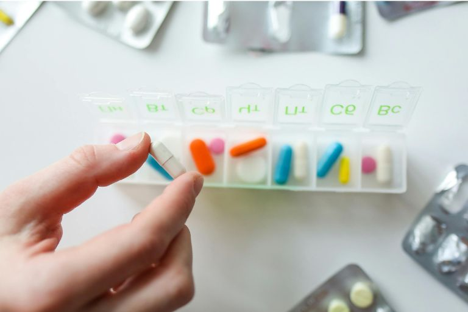

Sabia que mais de 50 por cento de todos os doentes com 65 anos ou mais tomam cinco ou mais medicamentos diferentes todos os dias? É o que revela a Bússola Farmacêutica 2022 do Instituto Científico da AOK. Mas quanto mais medicamentos tomar todos os dias, mais difícil se torna lembrar-se de tudo: que comprimido tem de tomar e quando? Em que dosagem? E deve tomar o medicamento antes ou depois de uma refeição?

É importante ter uma visão geral para evitar confusões ou tomas incorrectas. É exatamente aqui que entra em jogo o **plano de medicação**. Este ajuda a documentar claramente todas as informações relevantes relacionadas com a medicação e facilita não só a vida quotidiana das pessoas afectadas, mas também o trabalho dos médicos e dos prestadores de cuidados. Pode descobrir o que deve conter um bom plano de medicação e quais as vantagens específicas que oferece neste artigo do blogue.

## O que é um plano de medicação?

Um plano de medicação é um resumo escrito e estruturado de todos os medicamentos que toma regularmente. Regista o nome do medicamento, a dosagem, quando deve ser tomado e quaisquer instruções especiais de utilização. Como doente, sabe exatamente quando tem de tomar cada medicamento. Isto dá-lhe paz de espírito e ajuda-o a não se esquecer de tomar os seus medicamentos ou a não os misturar acidentalmente.

O calendário de medicação é também uma ajuda importante para os prestadores de cuidados. Com base nesta visão geral, eles podem preparar os comprimidos de forma específica e correta em doses de comprimidos. Os médicos, por outro lado, recebem uma **visão clara de toda a sua medicação** a partir do plano. Desta forma, é mais fácil reconhecer e evitar possíveis interações ou receitas duplicadas.

Um plano de medicação pode mesmo ser crucial para o pessoal de emergência numa situação de urgência. Se estiver numa situação de emergência e precisar de agir rapidamente, o plano fornece informações importantes sobre o seu tratamento em curso e facilita a prestação de cuidados direcionados e seguros.

## Porque é que um plano de medicação é importante?

Um plano de medicação estruturado é essencial para a **saúde e segurança** dos doentes. Isto porque ajuda a reconhecer combinações críticas de medicamentos e a prevenir interações perigosas. Também facilita a **comunicação entre médicos, farmacêuticos e prestadores de cuidados** - especialmente em situações delicadas como mudanças de médico, internamentos hospitalares ou emergências.

Um plano claro também contribui para **melhorar a terapia**, uma vez que promove a toma regular e correta e, assim, estabiliza ou reforça a sua saúde a longo prazo. Por último, mas não menos importante, um plano de medicação também alivia a carga dos seus familiares e prestadores de cuidados, que podem monitorizar mais facilmente a sua toma e prestar apoio direcionado.

## Erros comuns na toma de medicamentos

Ao tomar medicamentos diariamente, é fácil cometer erros que podem ter consequências graves para a sua saúde. Acontece frequentemente que um ingrediente ativo é acidentalmente tomado **duas vezes**. Isto pode ser auto-infligido, por exemplo, se cometer um erro com o número de comprimidos ou a frequência da toma; ou pode ser porque lhe foi receitado o mesmo princípio ativo sob diferentes nomes comerciais sem se aperceber.

O **esquecimento da medicação** é também um problema frequente. Por vezes, salta-se completamente uma toma, noutros casos, confunde-se apenas a hora do dia prevista. Ambas as situações podem levar a uma diminuição do efeito da terapêutica ou a efeitos secundários indesejáveis.

Um outro risco que pode ser evitado através de um plano de medicação é o de possíveis **interações** entre diferentes medicamentos. Estas são particularmente difíceis de reconhecer se não forem registadas todas as preparações tomadas. Trata-se frequentemente de produtos de **automedicação** que são tomados sem consultar um médico. Incluem-se também produtos de venda livre, como a erva de São João, analgésicos como o ibuprofeno ou certos suplementos alimentares. Estas preparações, aparentemente inofensivas, podem influenciar o efeito dos seus outros medicamentos ou mesmo provocar reacções perigosas.

Por isso, é importante controlar todos os seus medicamentos. Um plano de medicação cuidadosamente gerido ajudá-lo-á a evitar tais erros e a melhorar a segurança do seu tratamento.

{{< warning headline="Análise gratuita da medicação por um farmacêutico" text="Uma análise da medicação na farmácia pode ajudar a reconhecer, numa fase inicial, eventuais riscos na toma de medicamentos. Atualmente, muitas farmácias oferecem esta análise gratuitamente - especialmente para as pessoas que tomam vários medicamentos a longo prazo. Farmacêuticos especialmente treinados verificam toda a sua medicação quanto à compatibilidade, possíveis interações e receitas duplicadas. Uma consulta deste tipo pode não só esclarecê-lo, mas também tornar a sua terapêutica muito mais segura. Vale a pena perguntar simplesmente na sua farmácia." />}}

## O que não deve faltar num plano de medicação?

Para que o seu plano de medicação seja totalmente eficaz, deve mantê-lo completo e exato. As seguintes informações não podem faltar para garantir uma utilização segura, correta e compreensível do medicamento:

- Nome comercial do medicamento
- Princípio ativo
- Dosagem
- Dosagem
- Tempo de administração
- Razão de ser
- Instruções de utilização
- Início e fim previsto da toma
- Formulário de dosagem
- Médico prescritor

## Quem deve ter acesso ao plano de medicação?

Para que um plano de medicação seja realmente útil, depois de elaborado, não deve estar apenas nas suas mãos. Se for apoiado por familiares, um prestador de cuidados ou pessoal de enfermagem, por exemplo, estes podem ver imediatamente quais os comprimidos que têm de ser tomados e quando. Isto não só alivia a pressão sobre si, como também garante que nada é esquecido no dia a dia.

O seu médico de família e os especialistas que o tratam também beneficiam com isto. Com o plano, eles têm todas as informações importantes num relance e podem coordenar melhor a sua terapia. Por exemplo, pode evitar que dois médicos diferentes lhe receitem acidentalmente medicamentos que não são compatíveis.

Um plano de comprimidos atualizado também pode ser muito útil na farmácia. Um farmacêutico pode muitas vezes reconhecer possíveis interações à primeira vista ou dar-lhe dicas úteis sobre como certos medicamentos funcionam melhor - por exemplo, se um comprimido deve ser tomado antes ou depois de uma refeição.

O plano de medicação é particularmente importante numa situação de emergência. Imagine que, de repente, tem de ir para o hospital e está tão perturbado que não consegue enumerar tudo o que toma regularmente. Os serviços de ambulância e os médicos de urgência podem avaliar imediatamente quais os medicamentos de que necessita e quais as doenças pré-existentes que têm de ser tidas em conta, consultando o plano.

## Porque é que um plano de medicação digital faz sentido

Um plano de medicação digital tem muitas vantagens e torna a vida quotidiana visivelmente mais fácil. Uma das maiores vantagens é o facto de estar sempre atualizado. As alterações à medicação podem ser introduzidas imediatamente, para que o utente e todos os envolvidos tenham sempre à mão o estado mais recente, independentemente de ter sido prescrita uma nova dosagem ou de um medicamento ter sido descontinuado.

A disponibilidade centralizada também é muito útil. Já não é necessário andar sempre com as notas ou esperar que a versão mais recente esteja algures à mão. Em vez disso, os médicos ou prestadores de cuidados podem aceder aos dados mais recentes em qualquer altura, naturalmente apenas com o seu consentimento.

Em situações de emergência, um plano digital pode mesmo salvar vidas. Os serviços de salvamento e os médicos de emergência recebem imediatamente uma visão geral da sua medicação regular e podem, assim, tomar decisões mais rápidas e seguras.

O plano de medicação digital também é impressionante no que diz respeito à proteção de dados. Pode ser gerido de forma a que apenas as pessoas autorizadas tenham acesso e cumpre os requisitos legais para a proteção dos seus dados de saúde sensíveis. A versão digital também é amiga do ambiente. Já não é necessário imprimir novas listas em papel e, no entanto, tudo se mantém sempre atualizado.

## Plano de medicação com SeaTable

O modelo de plano de medicação gratuito da SeaTable torna muito fácil tomar a sua medicação corretamente. Em vez de uma caixa de medicamentos confusa ou de uma lista impressa que se pode perder rapidamente, pode registar todas as informações relevantes de forma centralizada e digital. Isto significa que pode criar facilmente a sua lista de medicação e actualizá-la de forma contínua.



O modelo compatível com o RGPD combina várias vistas e funções para facilitar o seu dia a dia. Para além de uma lista de medicamentos clássica, pode ligar médicos e especialistas diretamente às preparações prescritas, apresentar a localização do consultório num mapa e armazenar os dados dos seus doentes de forma clara. Com o plugin de design de páginas integrado, pode aceder a uma versão pronta a imprimir em qualquer altura ou partilhar o seu plano digitalmente com o pessoal médico. Isto significa que tem sempre uma visão geral, mesmo em momentos agitados ou críticos, tem sempre a sua medicação à mão e pode ter a certeza de que tudo está totalmente documentado.

## FAQs



A lista de medicamentos deve conter as seguintes informações:

- Nome comercial do medicamento
- Ingrediente ativo
- Dosagem
- Dosagem
- Tempo de administração
- Razão de utilização
- Instruções de utilização (por exemplo, antes ou depois de comer)
- Início e fim planeado da toma
- Forma de dosagem (por exemplo, comprimido, gotas, injeção)
- Nome do médico que prescreve o medicamento





Com uma ferramenta de software simples como o SeaTable, pode registar a sua medicação digitalmente. Para criar o seu próprio plano de medicação, introduza todos os dados relevantes no modelo gratuito, associe os medicamentos aos médicos que o tratam e mantenha o plano atualizado. A versão digital pode ser personalizada em qualquer altura no seu computador, tablet ou smartphone e impressa, se necessário.





Sim, no SeaTable pode introduzir imediatamente alterações, tais como novos medicamentos, dosagens alteradas ou preparações descontinuadas. Isto significa que o plano está sempre atualizado e que todos os envolvidos têm acesso à versão mais recente - com o seu consentimento.





Um horário de ingestão reduz o risco de esquecimentos, doses duplas ou ingestão incorrecta. Facilita a sua organização, proporciona horários de ingestão claros e oferece segurança na vida quotidiana. Ao mesmo tempo, os médicos e farmacêuticos podem reconhecer mais rapidamente possíveis interações com base no plano e coordenar de forma óptima a sua terapêutica.


