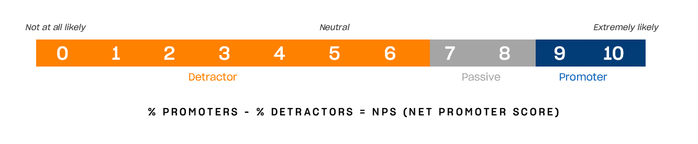

## What is the Net Promoter Score?

The Net Promoter Score was developed in 2003 by US business strategist Fred Reichheld and management consultants Bain & Company. It is intended to provide a **statement of the probability** with which customers would recommend the company or product to others. Reichheld's aim was to create a simple and easy-to-interpret format for statistically quantifying **customer experiences**.

### Calculate the Net Promoter Score

The answers to the question "How likely are you to recommend the company/product to others?" are given on an NPS scale from 0 to 10, where 0 means "very unlikely" and 10 "extremely likely". Based on the answers, customers are divided into three groups: Promoters (scores 9-10), i.e. enthusiastic and loyal customers; Indifferents (scores 7-8), who are basically satisfied but not enthusiastic; and Detractors (scores 0-6), who are dissatisfied or may even harm the company.

The **actual Net Promoter Score is calculated** as the percentage of promoters minus the percentage of detractors and can be between +100 and -100. So if you survey 100 customers and there are 50 promoters and 25 detractors, your NPS is 25.

## What does the Net Promoter Score mean?

The NPS is used in [customer management]() as an **indicator of customer loyalty**. Many companies use it as a parameter, as it is easy to determine and provides comparable results. A high NPS is generally associated with customer satisfaction and growth, while a low value indicates problems.

Proponents see a high score as a positive reflection of many factors, such as product quality, service experience, brand image and also the emotional connection of customers to the brand. In these companies, the score is not just seen as a simple measurement. Rather, the NPS has become a strategic tool for better understanding customer needs and securing a company's own competitiveness in the long term.

### What are the advantages of the Net Promoter Score?

However, there are also critical voices that doubt that customer satisfaction can be determined using the NPS and see it as an outdated tool. Let's take another look at the advantages:

* easy to understand and implement
    
* provides insights into customer loyalty
    
* scales with the size of the company
    
* provides comparable results
    
### What are the disadvantages of the Net Promoter Score?

However, critics see the often cited simple recording of comparable results as a problem. Because, if you give customer satisfaction a value with the NPS, you still **don't get a statement about the reasons for a positive or negative brand perception**. A multi-layered customer experience is abstracted to a single number that does not provide any clues for further measures, such as detailed information on product functionality, service quality or value for money. In addition, the NPS scale does not reflect mean value trends.

Furthermore, in practice, most customers often end up in the group of indifferent customers, who do not play a role in the calculation of the NPS. They remain unnoticed in a pure Net Promoter Scorecard assessment of customers. Another point of criticism is that only the intention to recommend is assessed and not the actual recommendations. To summarize, the most frequent points of criticism are

* lack of informative value about the reasons for or against an intention to recommend
    
* pure recording of the intention to recommend instead of the actual recommendation rate
    
* neglect of the group of indifferents

## What exactly is measured with the NPS?

These points of criticism are entirely justified - but they also miss the point of the actual problem: Namely, that the NPS is often given a meaning that it doesn't have - and shouldn't have. Let's go back to Reichheld's concern: measuring the probability of customers recommending a product or company to others. **Measuring the probability** - no more, but also no less. The NPS is therefore not intended as a key figure for making direct statements about customer satisfaction - or, and this is where the criticism applies, only the actual recommendation rate.

Nevertheless, the fundamental willingness to advertise a product or company presupposes satisfaction. In this respect, the NPS does not accurately reflect customer satisfaction, **but it does make trends visible**. It can also be useful as an early indicator of problematic developments, but should always be used in the context of a more comprehensive customer experience strategy.

## How do you interpret the results?

As already mentioned, the score can lie between -100 and +100. A positive score means that there are more promoters than detractors and is therefore generally considered good, while a negative score is problematic. If you take a closer look at statements by Fred Reichheld and Bain & Comapny, the score can be evaluated even more **granularly**:

* Score < 0 = problematic
    
* Score > 0 = good
    
* Score > 20 = favorable
    
* Score > 50 = excellent
    
* Score > 80 = world class
    

### Are there any benchmarks that can be used for orientation?

There are now also **industry benchmarks** in circulation, but these are only of limited use, as different companies from different regions, with different target groups and company sizes are often lumped together - if it is transparent at all how the benchmark was arrived at. If you are using an NPS in your company for the first time, it is more advisable to **first collect your own data**, identify trends and finally measure your current value against your own historical value.

## Conduct and evaluate NPS surveys

What does this look like in practice? How do you conduct a survey to obtain useful results?

Typically, customer surveys are conducted via email, web, mobile app or directly at the POS. We recommend that you provide your customers with an [online link](), e.g. to a [universal app from SeaTable](). Of course, you can simply ask the question about the likely intention to recommend. Usually, however, you also ask why the respective value was selected. The good thing about this is that the question is not just aimed at a feeling ("What did you think of our product?"), but at a behavioral intention ("Would you recommend our product to others?"). For many, this question is much easier to answer. The NPS is also so popular because the answer is usually more precise and honest than a purely emotional question.  

### Qualitative data and score calculation

If required, you can ask additional questions or insert open text fields to obtain **qualitative data**. This allows you to draw conclusions about the underlying reasons for or against a recommendation during the subsequent analysis. However, this additional information is irrelevant for the actual NPS calculation.

Following the data collection, you can calculate your score. If you have taken the opportunity to collect further qualitative or quantitative data, you can now form customer clusters, analyze trends and evaluate responses thematically. [Modern No Code platforms such as SeaTable]() offer **customizable dashboards**, real-time insights and the ability to **link results with other customer data**.

## What are the best practices for NPS surveys?

### Ask regularly and at the right time

In order to obtain meaningful NPS feedback, it is important to conduct surveys at the right time and through the right channels. This can be done immediately after a purchase, after using a service or **as part of regular customer experience programs**. The brevity of the survey increases the response rate. In addition, **clear communication** of the survey improves accessibility: customers should be able to understand why their feedback is important and how the results will be used to improve the experience. Incentives and a personalized approach also increase the willingness to participate.

### Collecting NPS as part of a holistic survey

You should collect the NPS score as part of a comprehensive customer survey and review it regularly in order to recognize changes promptly. This is because the NPS on its own says nothing about customer satisfaction. However, the intervals at which you carry out these surveys are completely individual and also depend to a certain extent on your industry. In eCommerce, consumer surveys are often sent out immediately after checkout in order to obtain prompt feedback. However, regular quarterly or semi-annual surveys without reference to a current transaction can also provide valuable insights.

It is generally recommended to:

* collect qualitative and quantitative data at the same time
    
* segment results according to customer groups
    
* consider data from previous surveys to identify trends
    
* collect data regularly

### Work with the results

Always respond promptly to negative feedback. Try to win over detractors with **targeted measures and a personal approach**. If you win back the goodwill or at least the indifference of the customer, you will avoid negative word of mouth - and save money, because in the end it is always cheaper to keep a customer than to win a new one.

It is also important to keep an eye on **the group of indifferents**, as they are promoters or detractors in perspective. The direction in which they develop really depends on you. Here too, you need to spend less time and money to turn a neutral customer into an enthusiastic one than to win over a new customer. **Involve customer service, product management and marketing** to harness the results holistically

## Which methods can the NPS be combined with in order to obtain a holistic picture?

Which specific methods are suitable for supplementing the NPS? Basically, any method that helps you to better understand your customers and their motivation, from classic satisfaction surveys and qualitative interviews to customer loyalty metrics (retention rate) and in-depth analyses using customer journey mapping. **Integrate your NPS data into CRM and business intelligence systems** in order to derive and evaluate specific measures.

If you consider the Net Promoter Score as a part of your customer experience analysis that gives an indication of how likely you are to be recommended by your customers, it is **a powerful tool** that helps to better identify the strengths and weaknesses of your company.

## SeaTable - Your tool for NPS surveys

No matter how you end up calculating your Net Promoter Score and using it for your analytics, make sure you use a tool that not only allows you to conduct surveys, but also to store and manage all your feedback. With the **No-Code Database SeaTable** you have a flexible, user-friendly tool at your disposal that you can customize as you wish. Create **web forms for data collection**, use our **Universal App Builder as a survey portal**, collaborate seamlessly in real time and analyze the results with the **integrated statistics module and customizable dashboards**.



SeaTable already offers all the functions you need for modern survey management in the **free version**. As a modern cloud solution, SeaTable is hosted exclusively on servers in Germany and thus offers **maximum GDPR compliance**. To retain full data sovereignty, you can also use SeaTable on your own server.

## FAQ - Net Promoter Score


No, there are no reliable NPS benchmarks for individual countries or sectors. Values circulating online are only of limited use. We recommend that you measure yourself against your historical NPS score.



In principle, any score greater than zero is considered good, the higher the better. Negative values indicate fundamental problems in your brand and product perception.



The Net Promoter Score says nothing directly about customer satisfaction. It merely evaluates the likelihood with which customers would recommend your company or product to others. Further surveys are required to determine the actual recommendation rate or specific reasons.

