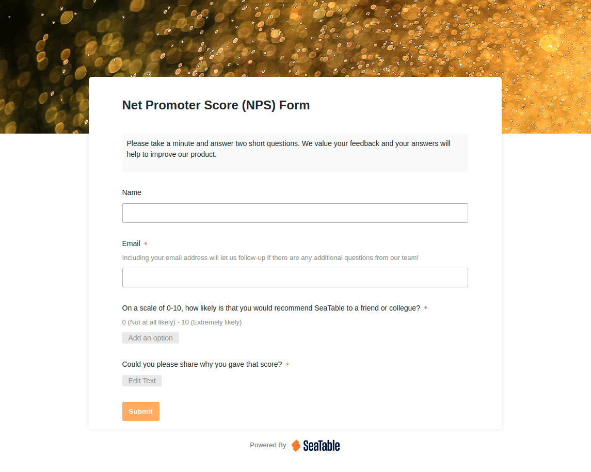

## Qu'est-ce que le Net Promoter Score ?

Le Net Promoter Score a été développé en 2003 par le stratège américain Fred Reichheld et les consultants en management Bain & Company. Il est destiné à fournir un **état de la probabilité** avec laquelle les clients recommanderaient l'entreprise ou le produit à d'autres. L'objectif de Reichheld était de créer un format simple et facile à interpréter pour quantifier statistiquement **l'expérience du client**.

### Calculer le Net Promoter Score

Les réponses à la question "Quelle est la probabilité que vous recommandiez cette entreprise/ce produit à d'autres ?" sont données sur une échelle NPS de 0 à 10, où 0 signifie "très peu probable" et 10 "extrêmement probable". Sur la base des réponses, les clients sont divisés en trois groupes : les promoteurs (scores 9-10), c'est-à-dire les clients enthousiastes et fidèles ; les indifférents (scores 7-8), qui sont en général satisfaits mais pas enthousiastes ; et les détracteurs (scores 0-6), qui sont mécontents ou peuvent même nuire à l'entreprise.

Le **actual Net Promoter Score est calculé** comme le pourcentage de promoteurs moins le pourcentage de détracteurs et peut être compris entre +100 et -100. Ainsi, si vous enquêtez auprès de 100 clients et qu'il y a 50 promoteurs et 25 détracteurs, votre NPS est de 25.

## Que signifie le Net Promoter Score ?

Le NPS est utilisé dans [la gestion de la clientèle]() comme un **indicateur de la fidélité des clients**. De nombreuses entreprises l'utilisent comme un paramètre, car il est facile à déterminer et fournit des résultats comparables. Un NPS élevé est généralement associé à la satisfaction et à la croissance des clients, tandis qu'une valeur faible indique des problèmes.

Les promoteurs considèrent qu'un score élevé est le reflet positif de nombreux facteurs, tels que la qualité des produits, l'expérience de service, l'image de marque et également le lien émotionnel des clients avec la marque. Dans ces entreprises, le score n'est pas seulement considéré comme une simple mesure. Au contraire, le NPS est devenu un outil stratégique pour mieux comprendre les besoins des clients et assurer la propre compétitivité de l'entreprise à long terme.

### Quels sont les avantages du Net Promoter Score ?

Cependant, il y a aussi des voix critiques qui doutent que la satisfaction du client puisse être déterminée à l'aide du NPS et qui le considèrent comme un outil dépassé. Regardons de plus près ses avantages :

* facile à comprendre et à mettre en œuvre
    
* fournit des informations sur la fidélité des clients
    
* évolue avec la taille de l'entreprise
    
* fournit des résultats comparables
    
### Quels sont les inconvénients du Net Promoter Score ?

Cependant, les critiques considèrent que le simple enregistrement de résultats comparables, souvent cité, est un problème. En effet, si vous attribuez une valeur à la satisfaction client avec le NPS, vous n'obtenez toujours **aucune déclaration sur les raisons d'une perception positive ou négative de la marque**. Une expérience client multi-couches est résumée à un seul chiffre qui ne fournit aucune indication pour d'autres mesures, telles que des informations détaillées sur la fonctionnalité du produit, la qualité du service ou la valeur de l'argent. De plus, l'échelle NPS ne reflète pas les tendances de la valeur.

De plus, dans la pratique, la plupart des clients finissent souvent dans le groupe des clients indifférents, qui ne jouent aucun rôle dans le calcul du NPS. Ils passent inaperçus dans une évaluation purement Net Promoter Scorecard des clients. Un autre point de critique est que seule l'intention de recommander est évaluée, et non les recommandations réelles. En résumé, les points de critique les plus fréquents sont les suivants

* le manque de valeur informative sur les raisons pour ou contre une intention de recommander
    
* l'enregistrement pur et simple de l'intention de recommander plutôt que du taux de recommandation réel
    
* négation du groupe d'indifférents

## Qu'est-ce qui est exactement mesuré avec le NPS ?

Ces points de critique sont tout à fait justifiés - mais ils manquent également le point du problème réel : à savoir que le NPS est souvent donné une signification qu'il n'a pas - et ne devrait pas avoir. Revenons à la préoccupation de Reichheld : mesurer la probabilité que les clients recommandent un produit ou une entreprise à d'autres. **Mesurer la probabilité** - pas plus, mais pas moins non plus. Le NPS n'est donc pas destiné à être un chiffre clé pour faire des déclarations directes sur la satisfaction des clients - ou, et c'est là que la critique s'applique, uniquement le taux de recommandation réel.

Néanmoins, la volonté fondamentale de faire de la publicité pour un produit ou une entreprise présuppose la satisfaction. Dans ce sens, le NPS ne reflète pas exactement la satisfaction des clients, **mais il permet de voir les tendances**. Il peut également être utile en tant qu'indicateur précoce d'évolutions problématiques, mais il doit toujours être utilisé dans le cadre d'une stratégie d'expérience client plus globale.

## Comment interprétez-vous les résultats ?

Comme mentionné précédemment, le score peut être compris entre -100 et +100. Un score positif signifie qu'il y a plus de promoteurs que de détracteurs et est donc généralement considéré comme bon, tandis qu'un score négatif est problématique. Si vous regardez de plus près les déclarations de Fred Reichheld et de Bain & Comapny, le score peut être évalué encore plus **granulairement** :

* Score < 0 = problématique
    
* Score > 0 = bon
    
* Score > 20 = favorable
    
* Score > 50 = excellent
    
* Score > 80 = classe mondiale
    

### Y a-t-il des points de référence qui peuvent être utilisés pour l'orientation ?

Il existe également des **référentiels industriels** en circulation, mais leur utilité est limitée, car différentes entreprises de différentes régions, avec différents groupes cibles et tailles d'entreprises sont souvent regroupées - s'il est transparent du tout comment le référentiel a été atteint. Si vous utilisez un NPS dans votre entreprise pour la première fois, il est plus conseillé de **collecter d'abord vos propres données**, d'identifier les tendances et enfin de mesurer votre valeur actuelle par rapport à votre propre valeur historique.

## Conduisez et évaluez les enquêtes NPS

À quoi cela ressemble-t-il dans la pratique ? Comment mener une enquête pour obtenir des résultats utiles ?

En général, les enquêtes clients sont menées par e-mail, sur le web, sur les applications mobiles ou directement sur le point de vente. Nous vous recommandons de fournir à vos clients un [lien en ligne](), par exemple vers une [application universelle de SeaTable](). Of course, you can simply ask the question about the likely intention to recommend. En général, cependant, vous demandez également pourquoi la valeur en question a été sélectionnée. La bonne chose à ce sujet est que la question ne vise pas seulement un sentiment ("Qu'avez-vous pensé de notre produit ?"), mais une intention comportementale ("Recommanderiez-vous notre produit à d'autres ?"). Pour beaucoup, cette question est beaucoup plus facile à répondre. Le NPS est également très populaire parce que la réponse est généralement plus précise et plus honnête qu'une question purement émotionnelle.  

### Données qualitatives et calcul du score

Si vous le souhaitez, vous pouvez poser des questions supplémentaires ou insérer des champs en texte ouvert pour obtenir des données **qualitatives**. Cela vous permet de tirer des conclusions sur les raisons sous-jacentes pour ou contre une recommandation lors de l'analyse ultérieure. Toutefois, ces informations supplémentaires ne sont pas pertinentes pour le calcul réel du NPS.

Après la collecte des données, vous pouvez calculer votre score. Si vous avez saisi l'occasion de collecter d'autres données qualitatives ou quantitatives, vous pouvez maintenant former des groupes de clients, analyser les tendances et évaluer les réponses par thème. [Les plateformes modernes sans code telles que SeaTable () offrent des tableaux de bord personnalisables, des informations en temps réel et la possibilité de **lier les résultats à d'autres données clients.

## Quelles sont les meilleures pratiques pour les enquêtes NPS ?

### Demandez régulièrement et au bon moment

Afin d'obtenir un feedback NPS significatif, il est important de réaliser des enquêtes au bon moment et par le biais des bons canaux. Cela peut être fait immédiatement après un achat, après l'utilisation d'un service ou **dans le cadre de programmes réguliers d'expérience client**. La brièveté de l'enquête augmente le taux de réponse. En outre, une **communication claire** de l'enquête améliore l'accessibilité : les clients doivent être en mesure de comprendre pourquoi leur feedback est important et comment les résultats seront utilisés pour améliorer l'expérience. Des incitations et une approche personnalisée augmentent également la volonté de participer.

Collect net promoter score at the right time](customer-experience.jpg)

### Collecter le NPS dans le cadre d'une enquête globale

Vous devriez collecter le score NPS dans le cadre d'une enquête client globale et le réviser régulièrement afin de détecter rapidement les changements. En effet, le NPS en lui-même ne donne aucune indication sur la satisfaction du client. Cependant, les intervalles auxquels vous réalisez ces enquêtes sont totalement individuels et dépendent également dans une certaine mesure de votre secteur d'activité. Dans le commerce électronique, les enquêtes auprès des consommateurs sont souvent envoyées immédiatement après l'achat afin d'obtenir un feedback rapide. Cependant, des enquêtes régulières, trimestrielles ou semi-annuelles, sans référence à une transaction en cours, peuvent également fournir des informations précieuses.

Il est généralement recommandé de :

* collecter des données qualitatives et quantitatives en même temps
    
* segmenter les résultats en fonction des groupes de clients
    
* Considérer les données des enquêtes précédentes pour identifier les tendances.
    
* collecter régulièrement les données

### Travailler avec les résultats

Toujours répondre rapidement aux commentaires négatifs. Essayez de gagner sur les détracteurs avec des **mesures ciblées et une approche personnalisée**. Si vous gagnez la confiance ou au moins l'indifférence du client, vous éviterez le bouche à oreille négatif - et vous économiserez de l'argent, car au final, il est toujours plus avantageux de garder un client que d'en gagner un nouveau.

Il est également important de garder un œil sur **le groupe d'indifférents**, car ils sont des promoteurs ou des détracteurs en perspective. La direction dans laquelle ils se développent dépend vraiment de vous. Ici aussi, vous devez consacrer moins de temps et d'argent à transformer un client neutre en un client enthousiaste qu'à gagner un nouveau client. **Intégrer le service client, la gestion des produits et le marketing** pour exploiter les résultats de manière holistique

## Quelles sont les méthodes avec lesquelles le NPS peut être combiné afin d'obtenir une vision globale ?

Quelles méthodes spécifiques sont appropriées pour compléter le NPS ? En principe, toute méthode qui vous aide à mieux comprendre vos clients et leurs motivations, depuis les enquêtes de satisfaction classiques et les entretiens qualitatifs jusqu'aux mesures de la fidélité des clients (taux de rétention) et aux analyses approfondies utilisant la cartographie du parcours client. **Intégrez vos données NPS dans les systèmes de CRM et de business intelligence** afin de dériver et d'évaluer des mesures spécifiques.

Si vous considérez le Net Promoter Score comme une partie de votre analyse de l'expérience client qui donne une indication de la probabilité que vous soyez recommandé par vos clients, c'est **un outil puissant** qui aide à mieux identifier les points forts et les points faibles de votre entreprise.

## SeaTable - Votre outil pour les enquêtes NPS

Quelle que soit la manière dont vous calculez votre Net Promoter Score et l'utilisez pour vos analyses, assurez-vous d'utiliser un outil qui vous permet non seulement de mener des enquêtes, mais aussi de stocker et de gérer tous vos commentaires. Avec la base de données **No-Code SeaTable**, vous disposez d'un outil flexible et convivial que vous pouvez personnaliser à votre guise. Créez des **formulaires Web pour la collecte de données**, utilisez notre **Universal App Builder comme portail d'enquête**, collaborez en temps réel et analysez les résultats grâce au **module statistique intégré et aux tableaux de bord personnalisables**.



SeaTable offre déjà toutes les fonctionnalités dont vous avez besoin pour une gestion moderne des enquêtes dans la version **gratuite**. En tant que solution cloud moderne, SeaTable est exclusivement hébergé sur des serveurs en Allemagne et offre ainsi une **conformité maximale au GDPR**. Pour conserver la pleine souveraineté des données, vous pouvez également utiliser SeaTable sur votre propre serveur.

## FAQ - Net Promoter Score


Non, il n'y a pas de benchmarks NPS fiables pour les pays ou les secteurs individuels. Les valeurs circulant en ligne sont d'un usage limité. Nous vous recommandons de vous mesurer par rapport à votre score NPS historique.



En principe, tout score supérieur à zéro est considéré comme bon, plus il est élevé, mieux c'est. Des valeurs négatives indiquent des problèmes fondamentaux dans la perception de votre marque et de votre produit.



Le Net Promoter Score ne dit rien directement sur la satisfaction du client. Il évalue simplement la probabilité avec laquelle les clients recommanderaient votre entreprise ou votre produit à d'autres. D'autres enquêtes sont nécessaires pour déterminer le taux de recommandation réel ou des raisons spécifiques.

