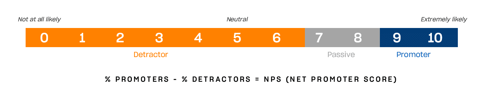
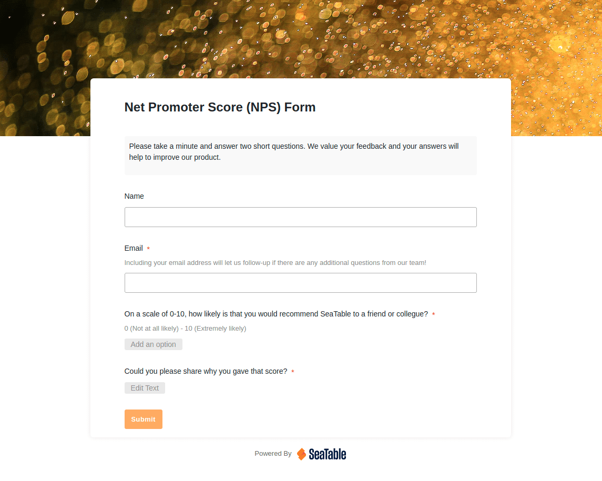

## Что такое Net Promoter Score?

Показатель Net Promoter Score был разработан в 2003 году американским бизнес-стратегом Фредом Райхельдом и консультантами по менеджменту Bain & Company. Его цель - дать **оценку вероятности**, с которой клиенты будут рекомендовать компанию или продукт другим. Целью Райхельда было создать простой и легко интерпретируемый формат для статистической количественной оценки **опыта покупателей**.

### Рассчитать Net Promoter Score

Ответы на вопрос "Насколько вероятно, что Вы порекомендуете компанию/продукт другим?" даются по шкале NPS от 0 до 10, где 0 означает "очень маловероятно", а 10 - "чрезвычайно вероятно". На основании ответов клиенты делятся на три группы: "Промоутеры" (9-10 баллов), т.е. восторженные и лояльные клиенты; "Индифферентные" (7-8 баллов), которые в основном удовлетворены, но без энтузиазма; и "Детракторы" (0-6 баллов), которые недовольны или даже могут навредить компании.

Фактический показатель Net Promoter Score рассчитывается** как процент промоутеров минус процент недоброжелателей и может находиться в диапазоне от +100 до -100. Таким образом, если Вы опросили 100 клиентов и среди них оказалось 50 промоутеров и 25 недоброжелателей, Ваш NPS будет равен 25.

## Что означает показатель Net Promoter Score?

NPS используется в [управлении клиентами]() как **показатель лояльности клиентов**. Многие компании используют его в качестве параметра, поскольку его легко определить и он дает сопоставимые результаты. Высокий показатель NPS обычно ассоциируется с удовлетворенностью клиентов и ростом, в то время как низкое значение указывает на проблемы.

Сторонники считают высокий показатель положительным отражением многих факторов, таких как качество продукции, опыт обслуживания, имидж бренда, а также эмоциональная связь клиентов с брендом. В таких компаниях оценка не рассматривается как простое измерение. Скорее, NPS стал стратегическим инструментом для лучшего понимания потребностей клиентов и обеспечения конкурентоспособности компании в долгосрочной перспективе.

### Каковы преимущества Net Promoter Score?

Однако есть и критики, которые сомневаются в том, что удовлетворенность клиентов можно определить с помощью NPS, и считают его устаревшим инструментом. Давайте еще раз рассмотрим его преимущества:

* легко понять и внедрить
    
* дает представление о лояльности клиентов
    
* масштабируется в зависимости от размера компании
    
* обеспечивает сопоставимые результаты
    
### Каковы недостатки Net Promoter Score?

Однако критики видят в часто упоминаемом простом фиксировании сопоставимых результатов проблему. Потому что, если Вы придаете удовлетворенности клиентов значение с помощью NPS, Вы все равно **не получаете заключения о причинах положительного или отрицательного восприятия бренда**. Многоуровневый покупательский опыт абстрагируется до одного числа, которое не дает никаких зацепок для дальнейших измерений, таких как подробная информация о функциональности продукта, качестве обслуживания или соотношении цены и качества. Кроме того, шкала NPS не отражает тенденции среднего значения.

Более того, на практике большинство покупателей часто оказываются в группе равнодушных покупателей, которые не играют никакой роли при расчете NPS. Они остаются незамеченными при чистой оценке клиентов по Net Promoter Scorecard. Еще один пункт критики заключается в том, что оценивается только намерение порекомендовать, а не фактические рекомендации. Подводя итог, можно сказать, что наиболее частыми пунктами критики являются

* отсутствие информативности о причинах за или против намерения рекомендовать
    
* чистый учет намерения рекомендовать вместо фактического количества рекомендаций
    
* игнорирование группы равнодушных

## Что именно измеряется с помощью NPS?

Эти пункты критики полностью оправданы - но они также упускают суть реальной проблемы: а именно, что NPS часто придают значение, которого у него нет - и не должно быть. Давайте вернемся к проблеме Райхельда: измерение вероятности того, что клиенты будут рекомендовать продукт или компанию другим. **Измерение вероятности** - не больше, но и не меньше. Поэтому NPS не предназначен в качестве ключевого показателя для прямых заявлений об удовлетворенности клиентов - или, и здесь критика применима, только для измерения фактической доли рекомендаций.

Тем не менее, фундаментальная готовность рекламировать продукт или компанию предполагает удовлетворенность. В этом отношении NPS не отражает точно удовлетворенность клиентов, **но он позволяет увидеть тенденции**. Он также может быть полезен в качестве раннего индикатора проблемного развития событий, но всегда должен использоваться в контексте более комплексной стратегии по улучшению потребительского опыта.

## Как Вы интерпретируете результаты?

Как уже говорилось, оценка может находиться в диапазоне от -100 до +100. Положительная оценка означает, что сторонников больше, чем противников, и поэтому в целом считается хорошей, в то время как отрицательная оценка вызывает проблемы. Если Вы внимательно посмотрите на высказывания Фреда Райхельда и Bain & Comapny, оценку можно оценить еще более **однозначно**:

* Оценка < 0 = проблематично
    
* Балл > 0 = хорошо
    
* Оценка > 20 = благоприятно
    
* Оценка > 50 = отлично
    
* Оценка > 80 = мировой класс
    

### Существуют ли контрольные показатели, которые можно использовать для ориентации?

В настоящее время существуют **отраслевые эталоны**, но они имеют лишь ограниченное применение, поскольку различные компании из разных регионов, с разными целевыми группами и размерами компаний часто объединяются вместе - если вообще понятно, как был получен эталон. Если Вы впервые используете NPS в своей компании, целесообразнее **сначала собрать собственные данные**, определить тенденции и, наконец, измерить текущее значение по сравнению с историческим.

## Проведение и оценка опросов NPS

Как это выглядит на практике? Как провести опрос, чтобы получить полезные результаты?

Как правило, опросы покупателей проводятся по электронной почте, через Интернет, мобильное приложение или непосредственно на кассе. Мы рекомендуем Вам предоставлять своим клиентам [онлайн-ссылку](), например, на [универсальное приложение от SeaTable](). Конечно, Вы можете просто задать вопрос о вероятном намерении порекомендовать. Однако обычно Вы также спрашиваете, почему было выбрано соответствующее значение. Хорошо в этом то, что вопрос направлен не просто на ощущение ("Что Вы думаете о нашем продукте?"), а на поведенческое намерение ("Порекомендовали бы Вы наш продукт другим?"). Для многих на этот вопрос гораздо проще ответить. NPS также так популярен потому, что ответ на него обычно более точен и честен, чем на чисто эмоциональный вопрос.  

### Качественные данные и подсчет баллов

При необходимости Вы можете задать дополнительные вопросы или вставить открытые текстовые поля, чтобы получить **количественные данные**. Это позволит Вам сделать выводы о причинах, лежащих в основе рекомендаций, в ходе последующего анализа. Однако эта дополнительная информация не имеет значения для фактического расчета NPS.

После сбора данных Вы можете рассчитать свой балл. Если Вы воспользовались возможностью собрать дополнительные качественные или количественные данные, то теперь Вы можете сформировать кластеры клиентов, проанализировать тенденции и оценить ответы тематически. [Современные платформы No Code, такие как SeaTable]() предлагают **настраиваемые приборные панели**, анализ в режиме реального времени и возможность **связать результаты с другими данными о клиентах**.

## Каковы лучшие практики проведения опросов NPS?

### Проводите опросы регулярно и в нужное время.

Чтобы получить значимые отзывы о NPS, важно проводить опросы в нужное время и по нужным каналам. Это можно делать сразу после покупки, после использования услуги или **как часть регулярных программ по улучшению потребительского опыта**. Краткость опроса увеличивает количество ответов. Кроме того, **четкое информирование** об опросе повышает его доступность: клиенты должны понимать, почему их отзывы важны и как результаты будут использованы для улучшения опыта. Поощрения и индивидуальный подход также повышают готовность к участию.

### Сбор NPS как часть комплексного исследования

Вам следует собирать показатели NPS как часть комплексного опроса клиентов и регулярно пересматривать их, чтобы своевременно заметить изменения. Это связано с тем, что NPS сам по себе ничего не говорит об удовлетворенности клиентов. Однако интервалы, через которые Вы проводите такие опросы, абсолютно индивидуальны и в определенной степени зависят от Вашей отрасли. В электронной коммерции опросы потребителей часто рассылаются сразу после оформления заказа, чтобы получить оперативную обратную связь. Однако регулярные ежеквартальные или полугодовые опросы без привязки к текущей транзакции также могут дать ценные сведения.

Обычно рекомендуется:

* собирать качественные и количественные данные одновременно
    
* сегментировать результаты по группам покупателей
    
* учитывайте данные предыдущих опросов для выявления тенденций
    
* регулярно собирайте данные

### Работайте с результатами

Всегда оперативно реагируйте на негативные отзывы. Постарайтесь переубедить недоброжелателей с помощью **целевых мер и индивидуального подхода**. Если Вы вернете себе расположение или хотя бы безразличие клиента, Вы избежите негативного сарафанного радио - и сэкономите деньги, потому что в конечном итоге всегда дешевле удержать клиента, чем привлечь нового.

Также важно следить за **группой равнодушных**, поскольку в перспективе они могут быть как промоутерами, так и недоброжелателями. То, в каком направлении они будут развиваться, зависит только от Вас. И здесь Вам нужно потратить меньше времени и денег, чтобы превратить нейтрального клиента в энтузиаста, чем для привлечения нового клиента. **Привлеките к работе службу поддержки клиентов, менеджмент продукта и маркетинг**, чтобы использовать результаты комплексно.

## С какими методами можно комбинировать NPS, чтобы получить целостную картину?

Какие конкретные методы подходят для дополнения NPS? В принципе, любой метод, который поможет Вам лучше понять Ваших клиентов и их мотивацию, от классических опросов об удовлетворенности и качественных интервью до показателей лояльности клиентов (коэффициент удержания) и глубокого анализа с помощью составления карты путешествия клиента. **Интегрируйте данные NPS в CRM и системы бизнес-анализа**, чтобы вывести и оценить конкретные показатели.

Если Вы рассматриваете Net Promoter Score как часть анализа Вашего клиентского опыта, которая дает представление о том, насколько вероятно, что Вас будут рекомендовать Ваши клиенты, то это **мощный инструмент**, который помогает лучше определить сильные и слабые стороны Вашей компании.

## SeaTable - Ваш инструмент для проведения опросов NPS

Независимо от того, как Вы в конечном итоге рассчитаете свой Net Promoter Score и будете использовать его для аналитики, убедитесь, что Вы используете инструмент, который позволяет не только проводить опросы, но и хранить и управлять всеми отзывами. С **Некодовой базой данных SeaTable** в Вашем распоряжении гибкий, удобный инструмент, который Вы можете настроить по своему усмотрению. Создавайте **веб-формы для сбора данных**, используйте наш **Универсальный конструктор приложений в качестве портала для проведения опросов**, осуществляйте беспрепятственную совместную работу в режиме реального времени и анализируйте результаты с помощью **встроенного модуля статистики и настраиваемых информационных панелей**.



SeaTable уже в **бесплатной версии** предлагает все функции, необходимые для современного управления опросами. Будучи современным облачным решением, SeaTable размещается исключительно на серверах в Германии и, таким образом, обеспечивает **максимальное соответствие GDPR**. Чтобы сохранить полную независимость данных, Вы также можете использовать SeaTable на своем собственном сервере.

## FAQ - Net Promoter Score


Нет, не существует надежных эталонов NPS для отдельных стран или секторов. Значения, циркулирующие в Интернете, имеют лишь ограниченное применение. Мы рекомендуем Вам оценивать себя по своему историческому показателю NPS.



В принципе, любой показатель, превышающий ноль, считается хорошим, чем выше, тем лучше. Отрицательные значения указывают на фундаментальные проблемы в восприятии Вашего бренда и продукта.



Net Promoter Score ничего не говорит непосредственно об удовлетворенности покупателей. Он просто оценивает вероятность того, что клиенты будут рекомендовать Вашу компанию или продукт другим. Для определения фактической частоты рекомендаций или конкретных причин требуются дополнительные исследования.

