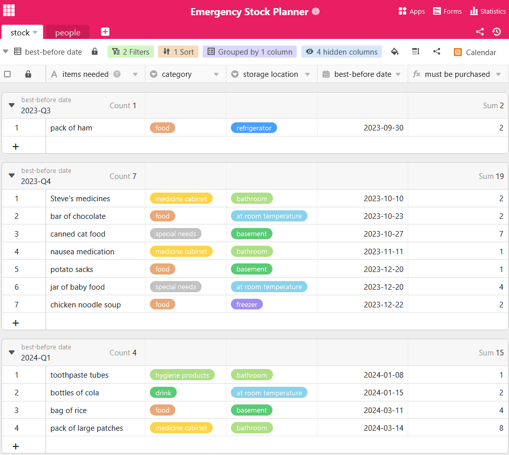

Was würden Sie tun, wenn plötzlich flächendeckend die Strom- und Wasserversorgung ausfällt? In Deutschland ist das zwar sehr unwahrscheinlich, in anderen Teilen der Welt kommen Schäden an der Infrastruktur jedoch häufiger vor. Auf solche und andere **Notsituationen** sind viele nicht ausreichend vorbereitet.

Deshalb ist es ratsam, für den Fall der Fälle optimal vorzusorgen, um die Grundversorgung von sich und seinen Liebsten sicherzustellen. Dabei hilft ein **Notvorrat**, welcher Dinge des täglichen Lebens wie Wasser, Nahrungsmittel, Hygieneartikel und Medikamente enthält. Hier erfahren Sie alles, was Sie zum Anlegen von Notvorräten wissen müssen.

## Darum ist ein Notfallvorrat sinnvoll

Was es bedeuten kann, auf einen Notvorrat zurückgreifen zu müssen, ist uns spätestens seit der Corona-Pandemie bekannt. Aus Angst, dass man für längere Zeit die Wohnung nicht verlassen kann oder die dringend benötigte Ware nicht mehr erhältlich sein könnte, wurden in Deutschland große Mengen an Nudeln und Klopapier gehamstert. Das zeigt: Wenn es zu einem Krisenfall kommt, sind die Supermärkte schnell leergekauft. Von der konkreten Notsituation abgesehen hat das Bevorraten von Lebensmitteln den Vorteil, dass man unabhängig von Ladenöffnungszeiten und Lieferketten ist.



## Darauf sollten Sie bei der Auswahl von Lebensmitteln achten

Bereits beim täglichen Essen ist es meist schwierig, es jedem recht zu machen. Das Gleiche gilt für die Wahl der Nahrung für den Notfall. Besonders wenn Sie für mehrere Personen einen Notvorrat anlegen, sollten Sie die Essgewohnheiten jedes Einzelnen beachten. Ebenso müssen Sie **Allergien** und **Unverträglichkeiten** sowie spezielle Nahrung für Kleinkinder oder Haustiere einplanen. Versuchen Sie nicht, unbekannte Lebensmittel zu kaufen, welche im Ernstfall vielleicht keinem schmecken. Verlassen Sie sich auf gern gegessene Kost, welche Sie in abwechslungsreiche Gerichte verwandeln können.

Gemeinsames Einkaufen hilft, nur Lebensmittel mitzunehmen, welche auch gegessen werden.

### Nährstoff- und kalorienreiche Lebensmittel

Legen Sie Wert darauf, dass die Ernährung nicht zu einseitig wird und achten Sie auf eine ausreichende **Nährstoffzufuhr**. Diese besteht aus Kohlenhydraten, Fetten, Proteinen, Vitaminen und Mineralstoffen, welche den Körper mit Energie versorgen. Außerdem sollte der Kalorienbedarf gedeckt sein. Da dieser bei jedem Menschen unterschiedlich hoch ausfällt, sei es aufgrund des Alters oder der sportlichen Aktivität, sollten Sie diesen vorher ermitteln. Dafür bieten sich [Online-Kalorienrechner](https://www.esn.com/pages/kalorienrechner) an.

Die wichtigsten Lebensmittel auf einen Blick

Wie Sie sehen, gehören in einen ausgewogenen Notvorrat viele kalorien- und nährstoffreiche Lebensmittel. Dafür eignen sich vor allem luftdicht verpackte Nahrungsmittel, die wenig Wasser enthalten und nicht gekühlt werden müssen. Zudem gibt es eine große Auswahl an Obst, Gemüse, Fisch und Fleisch in Konserven. Milchprodukte sind zwar nicht so lange haltbar, aber besonders für Vegetarier eine Protein-, Vitamin-D- und Calcium-Quelle. Natürlich muss es nicht nur gesundes Essen geben. Auch eher ungesunde Lebensmittel wie Schokolade, Kekse oder Chips enthalten Kalorien und dienen in Krisenzeiten als Nervennahrung.

### Wasser ist das wichtigste Lebensmittel

Neben dem Essen müssen Sie genügend Flüssigkeit zu sich nehmen. Ohne Nahrung kann ein Mensch bis zu drei Monate überleben, ohne Wasser weniger als eine Woche. Daher sollten Sie immer ausreichend Getränke im Haus haben. Im Schnitt empfiehlt das BKK **zwei Liter Flüssigkeit** pro Person am Tag. Neben Mineralwasser eignen sich zur Lagerung auch Fruchtsäfte und Softgetränke, da ihr hoher Zuckeranteil und die Kohlensäure konservierend wirken.

Übrigens benötigen Sie nicht nur Trinkwasser, sondern auch **Nutzwasser** zum Kochen und Sauberhalten. Im Ernstfall empfiehlt es sich, Wasser in großen Behältern, wie zum Beispiel Eimern oder der Badewanne, zu sammeln, solange die Wasserzufuhr noch gewährleistet ist. Wenn Sie einen Garten oder Zugang zu einer Dachrinne haben, können Sie sogar Regenwasser auffangen.

## Notvorräte für längere Haltbarkeit richtig lagern

Damit Sie Ihren Vorrat nicht immer wieder von Grund auf neu zusammenstellen müssen, sollten Sie beim Kauf primär auf **lang haltbare Lebensmittel** setzen. Es gibt jedoch auch die Möglichkeit, mit ein paar einfachen Kniffen Ihre selbst gekochten Lieblingsgerichte länger haltbar zu machen. Sie können diese entweder **einfrieren** (im Fall eines Blackouts müssen Sie diese dann zuerst verzehren) oder Sie kochen Ihr Essen ein. Aber Achtung: Beim **Einkochen** gibt es jede Menge zu beachten. Mithilfe einer [Anleitung](https://www.oma-kocht.de/wie-einkochen-anleitung-einsteiger-einwecken/) gelingt es Ihnen gleich beim ersten Versuch. Indem Sie Lebensmittel in einer luftdichten Verpackung an einem kühlen, trockenen und dunklen Ort lagern, erhöhen Sie die Haltbarkeit.

Eine weitere Möglichkeit, Essen haltbar zu machen, ist es einzulegen.

### Das Prinzip “lebender Vorrat”

Um zu verhindern, dass die gelagerten Lebensmittel ihr Mindesthaltbarkeitsdatum überschreiten und im Notfall nicht mehr genießbar sind, können Sie außerdem mit einem “lebenden Vorrat” arbeiten. Dabei binden Sie die gelagerten Lebensmittel in Ihren täglichen Gebrauch ein und kaufen Nachschub. So verdirbt Ihnen nichts. Achten Sie darauf, die neu gekauften Nahrungsmittel immer hinten im Regal zu platzieren, damit Sie die älteren zuerst aufbrauchen. Mit einem [Online-Planer für Ihre Vorratshaltung](https://seatable.io/notvorrat-anlegen/#Online-Planer_fuer_Ihren_Notvorrat) behalten Sie immer den Überblick, welche Lebensmittel als Nächstes verwertet werden sollten.

{{< warning headline="So lange sind Lebensmittel haltbar" text="Das **Mindesthaltbarkeitsdatum** auf der Verpackung zeigt, bis wann sich ein Produkt mindestens lagern und verzehren lässt. Jedoch bedeutet dies nicht, dass die Nahrungsmittel darüber hinaus nicht mehr genießbar sind. Bei richtiger Lagerung und im verschlossenen Zustand sind sie meist ohne Bedenken über die Deadline hinaus essbar. Die Lebensmittel sollten trotzdem vor dem Verzehr auf Spuren des Verderbens geprüft werden. Das können zum Beispiel ein unangenehmer Geruch, Schimmel oder aufgeblähte Verpackungen sein." />}}

### Bei Rabattaktionen sinnvoll sparen

Bauen Sie Ihren Vorrat Stück für Stück weiter aus. Es ist nicht notwendig, alles auf einmal zu kaufen. Gewöhnen Sie sich an, beim Einkaufen eine Packung mehr von haltbaren Nahrungsmitteln mitzunehmen, als Sie es sonst tun würden. Bei **Rabattaktionen** können Sie natürlich auch zuschlagen und größere Mengen kaufen. So sparen Sie Geld und sind gleichzeitig optimal auf alles vorbereitet. Achten Sie dennoch darauf, dass Sie nur das kaufen, was in Ihrer Familie auch gegessen wird.

Nutzen Sie Rabattaktionen für Nahrungsmittel, Hygieneartikel und andere nützliche Waren.

## Was Sie noch in Ihrem Notvorrat brauchen

Nun haben Sie einen groben Überblick erhalten, worauf Sie beim Vorbereiten Ihres Vorrats achten sollten. Neben Essen und Getränken brauchen Sie aber noch weitere Ausstattungsgegenstände, um gegen jede Unannehmlichkeit gewappnet zu sein. Hier finden Sie eine kleine Auswahl. Generell ist es sinnvoll, eine **Campingausrüstung** zur Hand zu haben, da diese optimal auf Notsituationen angepasst ist, in denen Sie Ihr Zuhause verlassen müssen. Natürlich müssen Sie sich nicht vorbereiten wie ein [Prepper](https://www.deutschlandfunk.de/prepper-in-deutschland-immer-bereit-fuer-die-naechste-100.html), eine Grundausstattung reicht völlig aus.

### Für einen Stromausfall

- Es mag nicht oft vorkommen, doch wenn der Strom länger ausfällt, verderben Ihnen frische Lebensmittel schnell. Um diese noch verkochen zu können, sollten Sie immer eine **alternative Kochgelegenheit** parat haben. Dafür bietet sich ein Gaskocher oder ein nicht elektrischer Grill an.
- Darüber hinaus ist ein Vorrat an **Kerzen und Taschenlampen** essenziell, damit Sie nachts nicht im Dunkeln sitzen müssen.
- Um immer erreichbar zu sein, sollten Sie **aufgeladene Akkus** für Ihre mobilen Endgeräte vor Ort haben. Mit solarbetriebenen Powerbanks und Ladestationen können Sie auch ohne Strom aus der Steckdose Ihre elektronischen Geräte mit Energie versorgen.

### Für die Hausapotheke

Etwas, was man immer daheim haben sollte, ist eine Hausapotheke. Besonders in Zeiten der Unsicherheit hilft diese, nicht wegen jeder noch so kleinen Verletzung oder Erkrankung in Panik zu verfallen. Enthalten sein sollten:

- Verschreibungspflichtige Medikamente
- Mittel gegen Erkältung, Schmerzen und Fieber
- Mittel gegen Durchfall, Übelkeit und Erbrechen
- Wundsalben, Sonnenschutz, Mücken- und Zeckenspray
- Fieberthermometer, Pinzette, Schere
- Desinfektionsmittel und Verbandsmaterial

### Für die Sauberkeit

Um sich und Ihre Wohnung sauber halten zu können, empfiehlt es sich, auch mit Hygieneartikeln vorzusorgen. Dazu gehören:

- Reinigungs- und Waschmittel, Fleckenentferner
- Seife, Zahnpasta, Shampoo
- Feuchttücher und Toilettenpapier

Natürlich darf auch Wasser zum Waschen nicht fehlen. Um dieses länger haltbar zu machen, können Sie **Entkeimungsmittel** benutzen.

## Online-Planer für Ihren Notvorrat

Damit Sie auf die nächste Notsituation ideal vorbereitet sind, hat das Team von SeaTable Ihnen eine Vorlage für Ihren Notvorrat erstellt. Diese können Sie nach Belieben an Ihre Bedürfnisse anpassen.

Wenn Sie SeaTable zur Vorratshaltung nutzen möchten, [registrieren]() Sie sich einfach kostenlos. Die entsprechende Vorlage finden Sie [hier](https://seatable.io/vorlage/xd246xzxtnuset-pxi0xsa/).
