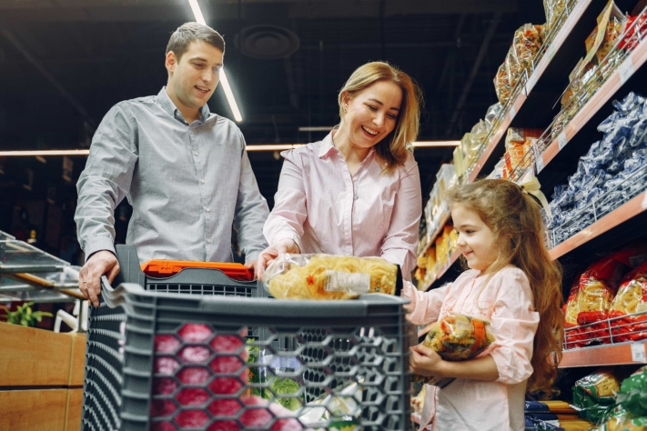
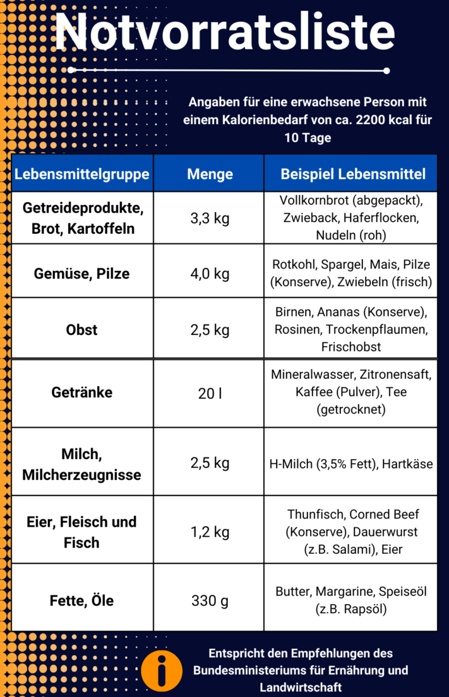
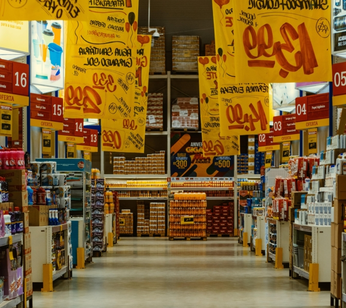

What would you do if the power and water supply suddenly failed across the board? In Germany, this is very unlikely, but in other parts of the world, damage to infrastructure is more common. Many people are not sufficiently prepared for such and other **emergency situations**.

Therefore, it is advisable to make optimal provisions for the worst-case scenario in order to ensure basic supplies for oneself and one's loved ones. An **emergency stockpile** containing everyday necessities such as water, food, hygiene products and medicines can help. Here you can find out everything you need to know about stockpiling emergency supplies.

## This is why an emergency stockpile makes sense

What it can mean to have to fall back on emergency supplies is something we have known at least since the Corona pandemic. Fearing that people would not be able to leave their homes for a long time or that urgently needed goods would no longer be available, large quantities of pasta and toilet paper were hoarded in Germany. This shows: When it comes to a crisis situation, supermarkets are quickly emptied. Apart from the specific emergency situation, stockpiling food has the advantage of being independent of store opening hours and supply chains.



## Here's what you should look for when choosing foods

Even with daily food, it is usually difficult to please everyone. The same applies to the choice of food for emergencies. Especially if you are stocking up on emergency food for several people, you should consider the eating habits of each individual. Likewise, you need to plan for **allergies** and **intolerances**, as well as special food for small children or pets. Don't try to buy unfamiliar foods, which may not taste good to anyone in an emergency. Rely on food you like to eat, which you can turn into varied dishes.

Shopping together helps to bring only food that will be eaten.

### Food rich in nutrients and calories

Make sure that the diet does not become too one-sided and pay attention to a sufficient **nutrient intake**. This consists of carbohydrates, fats, proteins, vitamins and minerals, which provide the body with energy. In addition, the calorie requirement should be covered. Since this is different for each person, whether due to age or sporting activity, you should determine this beforehand. [Online calorie calculators](https://www.esn.com/pages/kalorienrechner) are available for this purpose.

The most important foods at a glance

As you can see, a balanced emergency supply includes many foods that are rich in calories and nutrients. Foods that are packed in airtight containers, contain little water and do not need to be refrigerated are particularly suitable for this purpose. In addition, a wide variety of canned fruits, vegetables, fish and meats are available. Dairy products don't have as long a shelf life, but are a source of protein, vitamin D and calcium, especially for vegetarians. Of course, it doesn't have to be all healthy food. Even rather unhealthy foods such as chocolate, cookies or chips contain calories and serve as nerve food in times of crisis.

### Water is the most important food

In addition to food, you must consume enough liquid. Without food a person can survive up to three months, without water less than a week. Therefore, you should always have enough drinks in the house. On average, the BKK recommends **two liters of fluid** per person per day. In addition to mineral water, fruit juices and soft drinks are also suitable for storage, as their high sugar content and carbon dioxide have a preservative effect.

By the way, you need not only drinking water, but also **utility water** for cooking and keeping clean. In case of emergency, it is recommended to collect water in large containers, such as buckets or the bathtub, as long as the water supply is still guaranteed. If you have a garden or access to a gutter, you can even collect rainwater.

## Properly store emergency supplies for longer shelf life

So that you do not have to compile your stock again and again from scratch, you should primarily focus on **long-lasting foods** when buying. However, there is also the possibility of using a few simple tricks to make your favorite home-cooked dishes last longer. You can either **freeze** them (in case of a blackout, you will have to eat them first) or you can boil down your food. But beware: there is a lot to consider when **canning**. With the help of [instructions](https://www.oma-kocht.de/wie-einkochen-anleitung-einsteiger-einwecken/), you'll succeed on your first try. By storing food in airtight packaging in a cool, dry and dark place, you increase the shelf life.

Another way to preserve food is to pickle it.

### The "living stock" principle

To prevent stored food from exceeding its best-before date and becoming inedible in an emergency, you can also work with a "living stockpile." In doing so, you incorporate the stored food into your daily use and buy supplies. That way, nothing spoils for you. Be sure to always place the newly purchased foods at the back of the shelf so you use up the older ones first. With an [online planner for your stockpiling](https://seatable.io/en/notvorrat-anlegen/#Online-Planer_fuer_Ihren_Notvorrat), you always keep track of which foods should be used up next.



### Save wisely on discount promotions

Continue to build your stock piece by piece. It is not necessary to buy everything at once. When shopping, get in the habit of taking one more package of shelf-stable food than you would otherwise. Of course, during **discount promotions**, you can also strike and buy larger quantities. This way, you'll save money while being optimally prepared for anything. Nevertheless, make sure that you only buy what is eaten in your family.

Take advantage of discount promotions on food, hygiene items and other useful goods.

## What else you need in your emergency supply

Now you've got a rough idea of what to look for when preparing your supplies. Besides food and drinks, however, you need other equipment to be prepared against any inconvenience. Here you will find a small selection. In general, it makes sense to have **camping equipment** on hand, as it is optimally adapted to emergency situations in which you have to leave your home. Of course, you do not have to prepare like a [prepper](https://www.deutschlandfunk.de/prepper-in-deutschland-immer-bereit-fuer-die-naechste-100.html), basic equipment is quite enough.

### For a power failure

- It may not happen often, but if the power goes out for a long time, fresh food will spoil quickly. To still be able to cook them, you should always have an **alternative cooking facility** ready. A gas stove or a non-electric grill is ideal for this.
- In addition, a supply of **candles and flashlights** is essential so you don't have to sit in the dark at night.
- To always be accessible, you should have **charged batteries** for your mobile devices on hand. With solar-powered powerbanks and charging stations, you can power your electronic devices even without electricity from the wall socket.

### For the medicine cabinet

Something you should always have at home is a medicine cabinet. Especially in times of uncertainty, it helps not to panic because of every little injury or illness. It should contain:

- Prescription drugs
- Remedy for cold, pain and fever
- Remedy for diarrhea, nausea and vomiting
- Wound ointments, sunscreen, mosquito and tick spray
- Clinical thermometer, tweezers, scissors
- Disinfectant and dressing material

### For the cleanliness

In order to be able to keep yourself and your home clean, it is recommended that you also take precautions with hygiene items. These include:

- Detergents and cleaning agents, stain removers
- Soap, toothpaste, shampoo
- Wet wipes and toilet paper

Of course, water for washing should not be missing. To make this last longer, you can use **disinfectant**.

## Online planner for your emergency stock

So that you are ideally prepared for the next emergency situation, the SeaTable team has created a template for your emergency supply. You can adapt this to your needs as you wish.

If you want to use SeaTable for stockpiling, just [register]() for free. You can find the corresponding template [here]().
