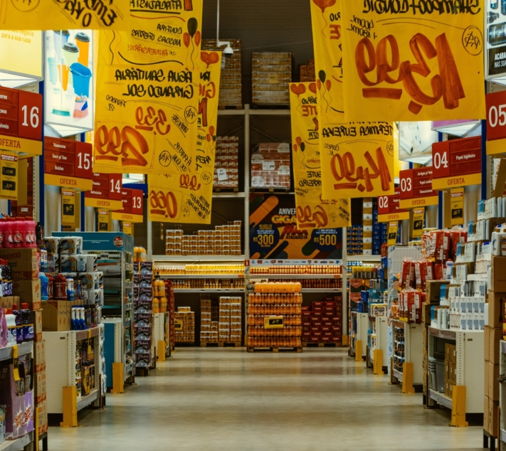

Que feriez-vous si l'approvisionnement en électricité et en eau était soudainement interrompu sur l'ensemble du territoire ? Bien que cela soit très improbable en Allemagne, les dommages aux infrastructures sont plus fréquents dans d'autres parties du monde. Nombreux sont ceux qui ne sont pas suffisamment préparés à de telles **situations d'urgence** ou à d'autres.

C'est pourquoi il est conseillé de se prémunir de manière optimale en cas d'urgence, afin d'assurer les besoins de base de soi-même et de ses proches. Pour ce faire, il est utile de constituer des **réserves d'urgence** contenant des objets de la vie quotidienne tels que de l'eau, des aliments, des produits d'hygiène et des médicaments. Vous trouverez ici tout ce que vous devez savoir sur la constitution de réserves d'urgence.

## D'où l'intérêt d'une réserve d'urgence

Nous savons, au moins depuis la pandémie de Corona, ce que cela peut signifier de devoir recourir à une réserve d'urgence. En Allemagne, de grandes quantités de pâtes et de papier toilette ont été thésaurisées par crainte de ne pas pouvoir quitter son domicile pendant une longue période ou de ne plus pouvoir se procurer les produits dont on avait un besoin urgent. Cela montre que : En cas de crise, les supermarchés sont rapidement vidés de leurs stocks. Au-delà de la situation d'urgence concrète, le stockage de denrées alimentaires présente l'avantage d'être indépendant des heures d'ouverture des magasins et des chaînes d'approvisionnement.

{{< warning headline="Ce que recommande l'État allemand" text="L'Office fédéral pour la protection de la population et l'aide en cas de catastrophe (BKK) recommande de constituer des réserves d'urgence pour **10 jours**. Pour pouvoir calculer ce [stock](https://www.ernaehrungsvorsorge.de/private-vorsorge/notvorrat/vorratskalkulator) pour votre ménage, il existe un [calculateur de stock](https://www.ernaehrungsvorsorge.de/private-vorsorge/notvorrat/vorratskalkulator) détaillé. Celui-ci calcule quels aliments vous devriez acheter et en quelles quantités afin de pouvoir garantir un approvisionnement suffisant." />}}

## Voici ce à quoi vous devez faire attention lorsque vous choisissez des aliments

Déjà pour les repas quotidiens, il est généralement difficile de contenter tout le monde. Il en va de même pour le choix de la nourriture en cas d'urgence. Surtout si vous constituez des réserves d'urgence pour plusieurs personnes, vous devez tenir compte des habitudes alimentaires de chacune d'entre elles. De même, vous devez prévoir **les allergies** et **les intolérances** ainsi que la nourriture spéciale pour les jeunes enfants ou les animaux domestiques. N'essayez pas d'acheter des aliments inconnus qui ne plairont peut-être à personne en cas d'urgence. Faites confiance aux aliments que vous aimez et que vous pouvez transformer en plats variés.

Faire les courses ensemble permet de n'emporter que des aliments qui seront consommés.

### Aliments riches en nutriments et en calories

Veillez à ce que l'alimentation ne soit pas trop déséquilibrée et assurez-vous que l'**apport en nutriments** est suffisant. Celui-ci se compose de glucides, de lipides, de protéines, de vitamines et de minéraux qui fournissent de l'énergie au corps. En outre, les besoins en calories doivent être couverts. Comme ceux-ci varient d'une personne à l'autre, que ce soit en raison de l'âge ou de l'activité sportive, il convient de les déterminer au préalable. Pour cela, il existe des [calculateurs de calories en ligne](https://www.esn.com/pages/kalorienrechner).

Les principaux aliments en un coup d'œil

Comme vous pouvez le constater, une réserve d'urgence équilibrée doit contenir de nombreux aliments riches en calories et en nutriments. Les aliments emballés hermétiquement, qui contiennent peu d'eau et ne doivent pas être réfrigérés, sont particulièrement adaptés à cet effet. Il existe en outre un grand choix de fruits, légumes, poissons et viandes en conserve. Les produits laitiers ne se conservent certes pas aussi longtemps, mais ils constituent une source de protéines, de vitamine D et de calcium, en particulier pour les végétariens. Bien sûr, il ne doit pas y avoir que des aliments sains. Même les aliments plutôt malsains comme le chocolat, les biscuits ou les chips contiennent des calories et servent de nourriture pour les nerfs en temps de crise.

### L'eau est l'aliment le plus important

En plus de la nourriture, vous devez vous hydrater suffisamment. Sans nourriture, une personne peut survivre jusqu'à trois mois, sans eau moins d'une semaine. Vous devriez donc toujours avoir suffisamment de boissons à la maison. En moyenne, le BKK recommande **deux litres de liquide** par personne et par jour. Outre l'eau minérale, les jus de fruits et les boissons gazeuses conviennent également pour le stockage, car leur teneur élevée en sucre et le gaz carbonique ont un effet conservateur.

D'ailleurs, vous n'avez pas seulement besoin d'eau potable, mais aussi **d'eau utile** pour la cuisine et le maintien de la propreté. En cas d'urgence, il est recommandé de recueillir l'eau dans de grands récipients, comme des seaux ou la baignoire, tant que l'approvisionnement en eau est encore assuré. Si vous avez un jardin ou accès à une gouttière, vous pouvez même récupérer l'eau de pluie.

## Stocker correctement les réserves de secours pour une plus longue durée de conservation

Pour ne pas avoir à reconstituer vos réserves à chaque fois à partir de zéro, il est conseillé d'acheter en priorité des **aliments qui se conservent longtemps**. Il est toutefois possible de conserver plus longtemps vos plats préférés préparés par vos soins grâce à quelques astuces simples. Vous pouvez soit les **congeler** (en cas de black-out, vous devrez alors les consommer en premier), soit faire cuire vos aliments. Mais attention : il y a beaucoup de choses à respecter lors de la **mise en conserve**. Un [guide](https://www.oma-kocht.de/wie-einkochen-anleitung-einsteiger-einwecken/) vous permettra de réussir dès le premier essai. En conservant les aliments dans un emballage hermétique, dans un endroit frais, sec et sombre, vous augmentez leur durée de conservation.

Une autre façon de conserver les aliments est de les faire mariner.

### Le principe de la "réserve vivante

Pour éviter que les aliments stockés ne dépassent leur date de péremption et ne soient plus consommables en cas d'urgence, vous pouvez également travailler avec un "stock vivant". Dans ce cas, vous intégrez les aliments stockés dans votre utilisation quotidienne et vous en achetez de nouveaux. Ainsi, rien ne se gâte. Veillez à toujours placer les nouveaux aliments achetés au fond de l'étagère afin de consommer les plus anciens en premier. Avec un [planificateur en ligne pour vos réserves](https://seatable.io/fr/notvorrat-anlegen/#Online-Planer_fuer_Ihren_Notvorrat), vous gardez toujours une vue d'ensemble des aliments qui devraient être utilisés ensuite.

{{< warning headline="La durée de conservation des aliments" text="La **date de durabilité minimale** sur l'emballage indique jusqu'à quand un produit peut être conservé et consommé. Toutefois, cela ne signifie pas que les aliments ne sont plus consommables au-delà de cette date. S'ils sont correctement stockés et fermés, ils peuvent généralement être consommés sans problème au-delà de la date limite. Il convient néanmoins de vérifier que les aliments ne présentent pas de traces d'altération avant de les consommer. Il peut s'agir par exemple d'une odeur désagréable, de moisissures ou d'emballages gonflés." />}}

### Économiser judicieusement lors des actions de réduction

Constituez votre stock petit à petit. Il n'est pas nécessaire de tout acheter en une seule fois. Lorsque vous faites vos courses, prenez l'habitude d'emporter un paquet d'aliments de longue conservation de plus que vous ne le feriez normalement. En cas **d'actions de réduction**, vous pouvez bien sûr aussi frapper et acheter de plus grandes quantités. Vous économiserez ainsi de l'argent tout en étant parfaitement préparé à toute éventualité. Veillez toutefois à n'acheter que ce qui est consommé dans votre famille.

Profitez des réductions sur les produits alimentaires, les produits d'hygiène et autres produits utiles.

## Ce dont vous avez encore besoin dans votre réserve d'urgence

Vous avez maintenant une idée générale de ce à quoi vous devez faire attention lorsque vous préparez vos provisions. Outre la nourriture et les boissons, vous avez également besoin d'autres équipements pour parer à tout désagrément. Vous trouverez ici une petite sélection. En général, il est judicieux d'avoir un **équipement de camping** à portée de main, car il est parfaitement adapté aux situations d'urgence dans lesquelles vous devez quitter votre domicile. Bien entendu, vous n'avez pas besoin de vous préparer comme un [prepper](https://www.deutschlandfunk.de/prepper-in-deutschland-immer-bereit-fuer-die-naechste-100.html), un équipement de base suffit amplement.

### Pour une panne de courant

- Cela n'arrive peut-être pas souvent, mais lorsque l'électricité est coupée pendant une longue période, les aliments frais se gâtent rapidement. Pour pouvoir encore les cuire, vous devriez toujours avoir une **autre possibilité de cuisson** sous la main. Une cuisinière à gaz ou un barbecue non électrique sont des solutions idéales pour cela.
- En outre, il est essentiel de disposer d'un stock de **bougies et de lampes de poche** pour ne pas rester dans le noir la nuit.
- Pour être toujours joignable, vous devez avoir sur vous des **batteries chargées** pour vos terminaux mobiles. Les powerbanks et les stations de recharge à énergie solaire vous permettent d'alimenter vos appareils électroniques en énergie, même si vous ne disposez pas d'une prise de courant.

### Pour la pharmacie familiale

Une pharmacie est une chose que l'on devrait toujours avoir chez soi. Elle permet de ne pas paniquer à la moindre blessure ou maladie, surtout en période d'incertitude. Elle devrait contenir

- Médicaments sur ordonnance
- Remède contre le rhume, les douleurs et la fièvre
- Remède contre la diarrhée, les nausées et les vomissements
- Pommades cicatrisantes, protection solaire, spray anti-moustiques et anti-tiques
- Thermomètre médical, pincettes, ciseaux
- Désinfectants et pansements

### Pour la propreté

Pour pouvoir rester propre et garder votre appartement propre, il est recommandé de prévoir également des articles d'hygiène. En font partie

- Produits de nettoyage et de lavage, détachants
- Savon, dentifrice, shampoing
- Lingettes humides et papier toilette

Bien sûr, il ne faut pas oublier l'eau pour le lavage. Pour que celle-ci se conserve plus longtemps, vous pouvez utiliser **des produits de stérilisation**.

## Planificateur en ligne pour vos réserves d'urgence

Pour que vous soyez idéalement préparé à la prochaine situation d'urgence, l'équipe de SeaTable a créé pour vous un modèle de réserve d'urgence. Vous pouvez l'adapter à vos besoins.

Si vous souhaitez utiliser SeaTable pour faire des réserves, il vous suffit de [vous inscrire]() gratuitement. Vous trouverez le modèle correspondant [ici]().
