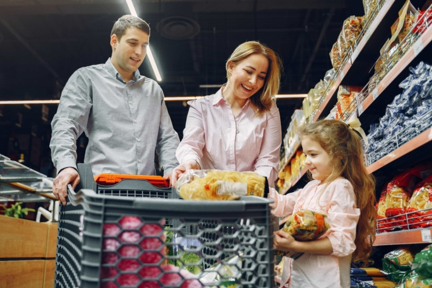

O que faria se a eletricidade e a água falhassem subitamente em todo o país? Na Alemanha isso é muito improvável, mas noutras partes do mundo os danos nas infra-estruturas são mais comuns. Muitas pessoas não estão suficientemente preparadas para estas e outras **situações de emergência**.

Por conseguinte, é aconselhável tomar as melhores disposições para o pior cenário possível, a fim de assegurar as necessidades básicas do próprio e dos seus familiares. Uma **reserva de emergência** que contenha as necessidades quotidianas, como água, alimentos, produtos de higiene e medicamentos, pode ajudar. Aqui pode encontrar tudo o que precisa de saber sobre a constituição de reservas de emergência.

## É por isso que faz sentido ter uma reserva de emergência

O que pode significar ter de recorrer à constituição de reservas de emergência é algo que conhecemos, pelo menos, desde a pandemia do coronavírus. Com receio de não poder sair do apartamento durante um período de tempo mais longo ou de que os bens urgentemente necessários deixassem de estar disponíveis, foram acumuladas grandes quantidades de massa e de papel higiénico na Alemanha. Isto demonstra-o: Quando se trata de uma situação de crise, os supermercados são rapidamente esvaziados. Para além da situação de emergência específica, a acumulação de alimentos tem a vantagem de ser independente dos horários de abertura das lojas e das cadeias de abastecimento.

{{< warning headline="É isto que o Estado alemão recomenda" text="O Serviço Federal de Proteção Civil e Assistência em caso de Catástrofe (BKK) recomenda que se faça uma reserva de bens de emergência para **10 dias**. Para calcular este valor para o seu agregado familiar, existe uma [calculadora de stocks](https://www.ernaehrungsvorsorge.de/private-vorsorge/notvorrat/vorratskalkulator) pormenorizada. Esta calcula quais os alimentos que deve comprar e em que quantidades para garantir um abastecimento suficiente." />}}

## Eis o que deve procurar ao escolher os alimentos

Mesmo com a alimentação diária, é normalmente difícil agradar a todos. O mesmo se aplica à escolha da alimentação de emergência. Especialmente se estiver a armazenar alimentos de emergência para várias pessoas, deve ter em conta os hábitos alimentares de cada um. Da mesma forma, é necessário planear as **alergias** e **intolerâncias**, bem como os alimentos especiais para crianças pequenas ou animais de estimação. Não tente comprar alimentos desconhecidos que podem não ser do agrado de ninguém numa emergência. Confie nos alimentos que gosta de comer e que pode transformar em pratos variados.

Fazer compras em conjunto ajuda a levar apenas alimentos que serão consumidos.

### Alimentos ricos em nutrientes e calorias

Certifique-se de que a dieta não se torna demasiado unilateral e de que ingere uma quantidade suficiente **de nutrientes**. Estes consistem em hidratos de carbono, gorduras, proteínas, vitaminas e minerais, que fornecem energia ao corpo. Para além disso, as necessidades calóricas devem ser cobertas. Uma vez que esta varia de pessoa para pessoa, quer seja devido à idade ou à atividade desportiva, deve determiná-la previamente. Para o efeito, estão disponíveis [calculadoras de calorias em linha](https://www.esn.com/pages/kalorienrechner).

Os alimentos mais importantes em resumo

Como se pode ver, um stock de emergência equilibrado inclui muitos alimentos ricos em calorias e nutrientes. Os alimentos que são embalados hermeticamente, que contêm pouca água e que não precisam de ser refrigerados são particularmente adequados para este fim. Existe também uma grande variedade de frutas, legumes, peixe e carne enlatados. Os produtos lácteos não se conservam tanto tempo, mas são uma fonte de proteínas, vitamina D e cálcio, especialmente para os vegetarianos. É claro que nem tudo tem de ser saudável. Mesmo os alimentos pouco saudáveis, como o chocolate, as bolachas ou as batatas fritas de pacote, contêm calorias e servem de alimento de reserva em tempos de crise.

### A água é o alimento mais importante

Para além dos alimentos, é necessário beber líquidos suficientes. Sem comida, uma pessoa pode sobreviver até três meses, sem água menos de uma semana. Por conseguinte, deve ter sempre bebidas suficientes em casa. Em média, a BKK recomenda **dois litros de líquidos** por pessoa e por dia. Para além da água mineral, os sumos de fruta e os refrigerantes também são adequados para armazenamento, uma vez que o seu elevado teor de açúcar e o ácido carbónico têm um efeito conservante.

A propósito, não precisa apenas de água potável, mas também de **água de serviço** para cozinhar e manter-se limpo. Em caso de emergência, é aconselhável recolher água em grandes recipientes, como baldes ou a banheira, desde que o abastecimento de água ainda esteja garantido. Se tiver um jardim ou acesso a uma caleira, pode mesmo recolher a água da chuva.

## Armazenar corretamente os artigos de emergência para prolongar o seu prazo de validade

Para que não tenha de compilar o seu stock de raiz uma e outra vez, deve concentrar-se principalmente nos **alimentos de longa duração** quando os compra. No entanto, existe também a possibilidade de fazer com que os seus pratos caseiros favoritos durem mais tempo com alguns truques simples. Pode **congelá-los** (no caso de um apagão, terá de os comer primeiro) ou pode ferver os alimentos. Mas atenção: há muito a ter em conta quando se trata de **conservar**. Com a ajuda de um [guia](https://www.oma-kocht.de/wie-einkochen-anleitung-einsteiger-einwecken/), pode fazê-lo corretamente à primeira. Ao armazenar os alimentos em embalagens herméticas, num local fresco, seco e escuro, aumenta o seu prazo de validade.

Outra forma de conservar os alimentos é fazer pickles.

### O princípio do "stock vivo

Para evitar que os alimentos armazenados ultrapassem o prazo de validade e se tornem não comestíveis em caso de emergência, pode também trabalhar com um "stock vivo". Neste caso, integra os alimentos armazenados na sua utilização diária e compra provisões. Desta forma, nada se estraga. Certifique-se de que coloca sempre os alimentos recém-comprados na parte de trás da prateleira, de modo a consumir primeiro os mais antigos. Com um [planeador online para a sua reserva](#Online-Planer_fuer_Ihren_Notvorrat), mantém sempre um registo dos alimentos que devem ser consumidos a seguir.

{{< warning headline="Este é o tempo que os alimentos podem ser conservados" text="A **data de validade indicada na** embalagem indica o período mínimo até ao qual um produto pode ser armazenado e consumido. No entanto, isto não significa que o alimento deixe de ser comestível para além desta data. Se forem armazenados corretamente e selados, são geralmente comestíveis para além do prazo sem hesitação. No entanto, os alimentos devem ser verificados quanto a vestígios de deterioração antes do consumo. Estes podem ser, por exemplo, um cheiro desagradável, bolor ou embalagens inchadas." />}}

### Poupar sabiamente nas promoções de desconto

Continue a construir o seu stock peça por peça. Não é necessário comprar tudo de uma vez. Quando for às compras, habitue-se a levar mais um pacote de alimentos não perecíveis do que levaria de outra forma. É claro que, durante as **campanhas de desconto**, também pode atacar e comprar quantidades maiores. Desta forma, poupa dinheiro e está perfeitamente preparado para tudo ao mesmo tempo. No entanto, certifique-se de que compra apenas o que a sua família come.

Aproveite as ofertas de desconto em alimentos, produtos de higiene e outros bens úteis.

## O que mais precisa na sua reserva de emergência

Agora tem uma visão geral do que deve procurar ao preparar as suas provisões. No entanto, para além de alimentos e bebidas, é necessário outro equipamento para estar preparado para qualquer inconveniente. Aqui encontrará uma pequena seleção. Em geral, faz sentido ter à mão **equipamento de campismo**, uma vez que este está perfeitamente adaptado a situações de emergência em que é necessário sair de casa. É claro que não precisa de se preparar como um [prepper](https://www.deutschlandfunk.de/prepper-in-deutschland-immer-bereit-fuer-die-naechste-100.html), o equipamento básico é suficiente.

### Para uma falha de energia

- Pode não ser frequente, mas se faltar a eletricidade durante um longo período de tempo, os alimentos frescos estragam-se rapidamente. Para poder cozinhá-los, deve ter sempre à mão um **meio de cozedura alternativo**. Um fogão a gás ou um grelhador não elétrico são ideais para este efeito.
- Além disso, é essencial dispor de velas **e lanternas** para não ter de se sentar às escuras durante a noite.
- Para estar sempre contactável, deve ter à mão **baterias carregadas** para os seus dispositivos móveis. Com os bancos de energia e as estações de carregamento alimentados por energia solar, pode alimentar os seus aparelhos electrónicos mesmo sem eletricidade na tomada.

### Para o armário dos medicamentos

Uma coisa que se deve ter sempre em casa é um armário de medicamentos. Especialmente em tempos de insegurança, ajuda a não entrar em pânico por causa do mais pequeno ferimento ou doença. Deve conter:

- Medicamentos sujeitos a receita médica
- Remédio para constipações, dores e febre
- Remédios para a diarreia, as náuseas e os vómitos
- Pomadas para feridas, protetor solar, spray para mosquitos e carraças
- Termómetro clínico, pinças, tesouras
- Desinfectantes e pensos

### Para a limpeza

Para poder manter-se a si e à sua casa limpos, é aconselhável tomar também precauções com artigos de higiene. Estes incluem:

- Produtos de limpeza e detergentes, tira-nódoas
- Sabão, pasta de dentes, champô
- Toalhetes húmidos e papel higiénico

É claro que não deve faltar água para a lavagem. Para que dure mais tempo, pode utilizar **agentes esterilizantes**.

## Planeador online para a sua reserva de emergência

Para que esteja idealmente preparado para a próxima situação de emergência, a equipa SeaTable criou um modelo para o seu abastecimento de emergência. Pode adaptá-lo às suas necessidades como desejar.

Se pretender utilizar o SeaTable para a constituição de reservas, basta [registar-se]() gratuitamente. Pode encontrar o modelo correspondente [aqui]().
