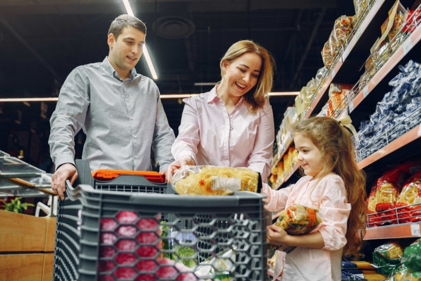
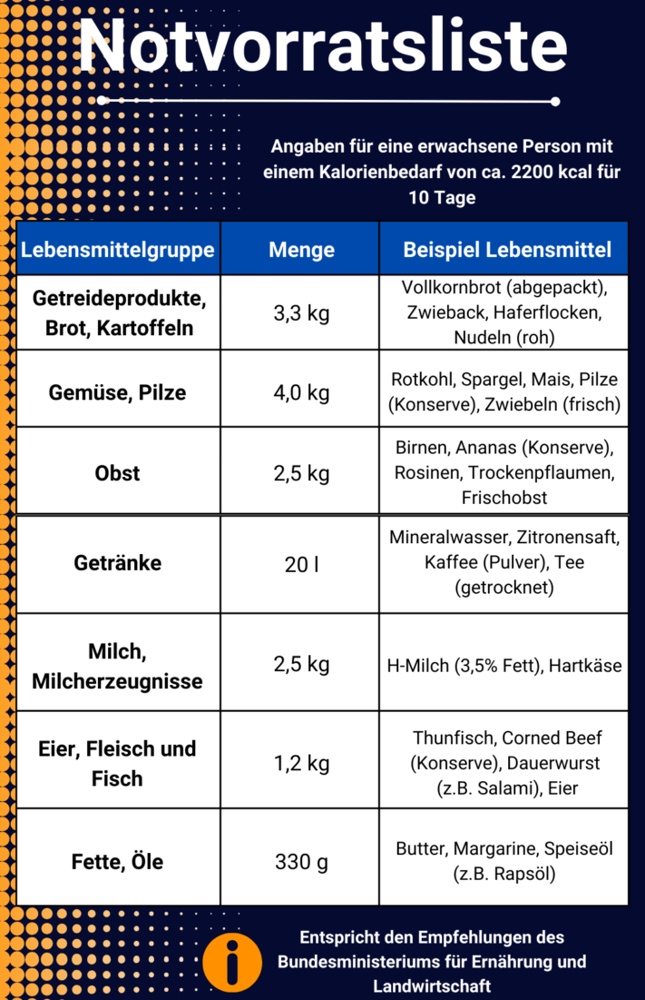
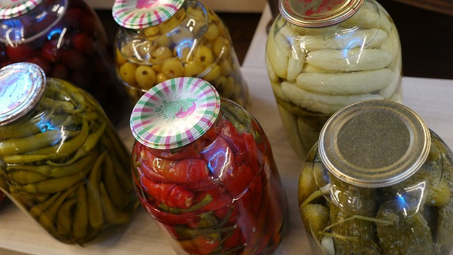
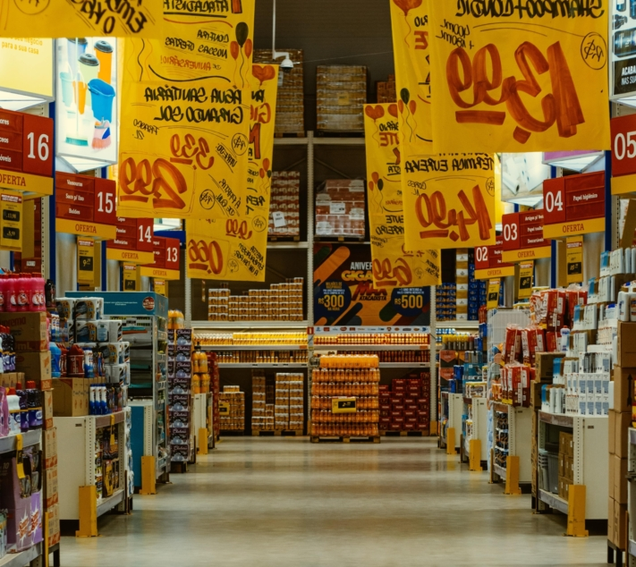
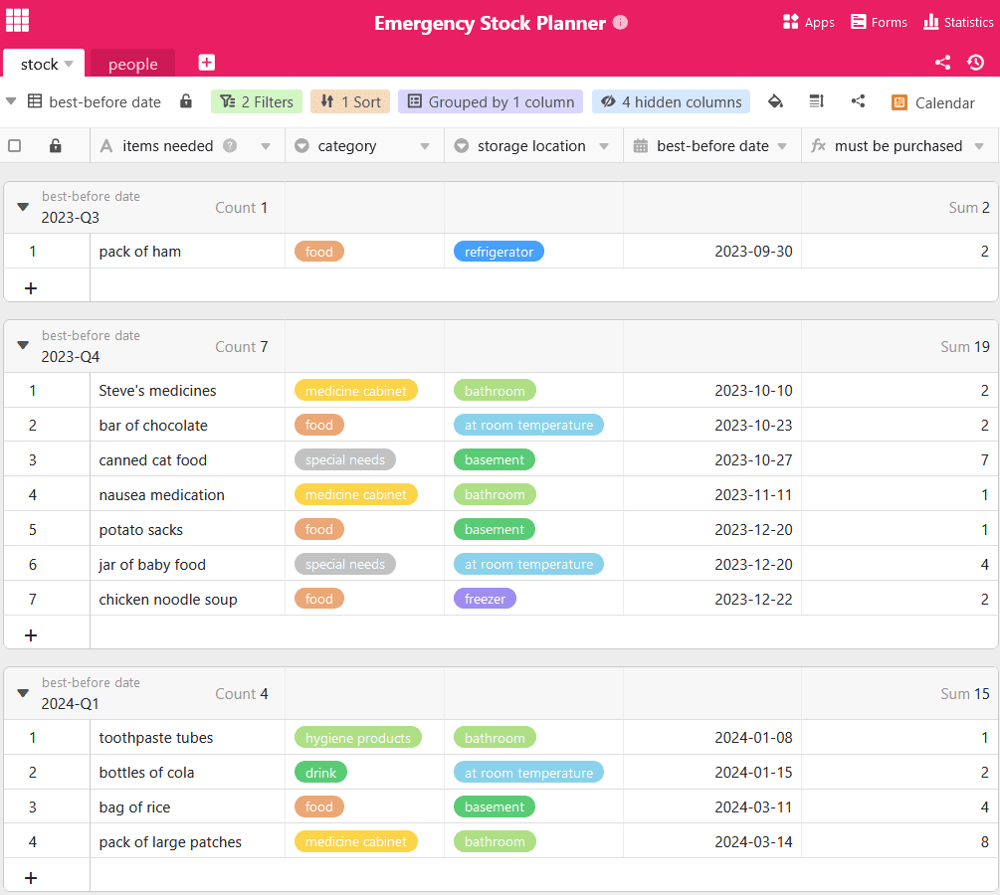

Что бы вы делали, если бы во всей стране внезапно отключилось электричество и водоснабжение? В Германии это маловероятно, но в других частях света повреждения инфраструктуры встречаются гораздо чаще. Многие люди недостаточно подготовлены к таким и другим **чрезвычайным ситуациям**.

Поэтому для обеспечения основных потребностей себя и своих близких целесообразно создать оптимальные запасы на случай наихудшего развития событий. В этом может помочь **аварийный запас**, содержащий предметы первой необходимости, такие как вода, продукты питания, средства гигиены и медикаменты. Здесь вы найдете все, что нужно знать о создании запасов на случай чрезвычайных ситуаций.

## Вот почему имеет смысл создавать аварийные запасы

О том, что может означать необходимость создания запасов на случай чрезвычайных ситуаций, мы знаем, по крайней мере, со времен пандемии "Корона". В Германии, опасаясь, что нельзя будет надолго покинуть квартиру или что срочно необходимые товары могут оказаться недоступными, запасались большим количеством лапши и туалетной бумаги. Это показывает: Когда наступает кризисная ситуация, супермаркеты быстро опустошаются. Помимо конкретной чрезвычайной ситуации, преимущество накопления запасов продовольствия заключается в том, что оно не зависит от времени работы магазинов и цепочек поставок.

{{< warning headline="Вот что рекомендует немецкое государство" text="Федеральное управление по делам гражданской обороны и чрезвычайным ситуациям (БКК) рекомендует запастись средствами на случай чрезвычайных ситуаций на **10 дней**. Для расчета этого показателя для вашей семьи существует подробный [калькулятор запасов](https://www.ernaehrungsvorsorge.de/private-vorsorge/notvorrat/vorratskalkulator). Он позволяет рассчитать, какие продукты питания и в каких количествах необходимо приобрести для обеспечения достаточного запаса." />}}

## Вот на что следует обратить внимание при выборе продуктов питания

Даже при ежедневном питании, как правило, трудно угодить всем. То же самое относится и к выбору аварийного питания. Особенно если вы запасаетесь продуктами на несколько человек, следует учитывать пищевые привычки каждого. Кроме того, необходимо предусмотреть **аллергию** и **непереносимость**, а также специальное питание для маленьких детей или домашних животных. Не пытайтесь покупать незнакомые продукты, которые могут не прийтись по вкусу в чрезвычайной ситуации. Положитесь на продукты, которые вы любите есть и которые можно превратить в разнообразные блюда.

Совместные покупки помогают брать только те продукты, которые будут съедены.

### Продукты, богатые питательными веществами и калориями

Следите за тем, чтобы диета не была слишком однобокой, и следите за достаточным **поступлением питательных веществ**. К ним относятся углеводы, жиры, белки, витамины и минеральные вещества, которые обеспечивают организм энергией. Кроме того, должна быть покрыта потребность в калориях. Поскольку у разных людей она разная, будь то возраст или занятия спортом, ее следует определить заранее. Для этого существуют [онлайн-калькуляторы калорий](https://www.esn.com/pages/kalorienrechner).

Важнейшие продукты питания с первого взгляда

Как видите, сбалансированный запас на случай чрезвычайных ситуаций включает в себя множество продуктов, богатых калориями и питательными веществами. Особенно подходят для этого продукты, которые герметично упакованы, содержат мало воды и не нуждаются в холодильнике. Существует также широкий ассортимент консервированных фруктов, овощей, рыбы и мяса. Молочные продукты хранятся не так долго, но являются источником белка, витамина D и кальция, особенно для вегетарианцев. Конечно, не обязательно есть только здоровую пищу. Даже довольно вредные продукты, такие как шоколад, печенье или чипсы, содержат калории и могут послужить нервной подпиткой в кризисное время.

### Вода - важнейший продукт питания

Помимо пищи, необходимо пить достаточное количество жидкости. Без пищи человек может прожить до трех месяцев, без воды - менее недели. Поэтому в доме всегда должно быть достаточное количество напитков. В среднем БКК рекомендует **два литра жидкости** на человека в день. Кроме минеральной воды, для хранения подходят фруктовые соки и безалкогольные напитки, так как высокое содержание сахара и углекислоты в них оказывает консервирующее действие.

Кстати, вам нужна не только питьевая, но и **техническая вода** для приготовления пищи и поддержания чистоты. В экстренной ситуации целесообразно набирать воду в большие емкости, например, в ведра или ванну, пока еще гарантировано водоснабжение. Если у вас есть сад или доступ к водостоку, вы можете собирать даже дождевую воду.

## Правильное хранение аварийных запасов для увеличения срока годности

Чтобы не пришлось снова и снова собирать запасы с нуля, при покупке следует ориентироваться в первую очередь на **продукты с длительным сроком хранения**. Однако есть возможность сделать так, чтобы любимые домашние блюда хранились дольше с помощью нескольких простых приемов. Их можно либо **заморозить** (в случае отключения электричества их придется съесть в первую очередь), либо отварить. Но будьте осторожны: при **консервировании** нужно учитывать очень многое. С помощью [руководства](https://www.oma-kocht.de/wie-einkochen-anleitung-einsteiger-einwecken/) вы сможете сделать все правильно с первого раза. Если хранить продукты в герметичной упаковке в прохладном, сухом и темном месте, то это увеличит срок их хранения.

Другой способ сохранения продуктов - маринование.

### Принцип "живого запаса"

Для того чтобы в чрезвычайной ситуации хранящиеся продукты не превысили срок годности и не стали несъедобными, можно также работать с "живым запасом". В этом случае хранящиеся продукты включаются в повседневный обиход и закупаются про запас. Таким образом, ничего не портится. Вновь купленные продукты всегда кладите в самый конец полки, чтобы сначала израсходовать старые. С помощью [онлайн-планировщика запасов](#Online-Planer_fuer_Ihren_Notvorrat) вы всегда будете знать, какие продукты следует использовать в следующий раз.

{{< warning headline="Вот как долго можно хранить продукты" text="**Дата до на** упаковке указывает минимальный срок, до которого продукт можно хранить и употреблять. Однако это не означает, что после этой даты продукт уже не пригоден к употреблению. При правильном хранении и герметичной упаковке они, как правило, без колебаний пригодны к употреблению и после указанного срока. Тем не менее, перед употреблением продукты следует проверить на наличие следов порчи. Это может быть, например, неприятный запах, плесень или вздувшаяся упаковка." />}}

### Экономьте с умом на скидочных акциях

Продолжайте наращивать свой запас по частям. Не обязательно покупать все сразу. Когда вы ходите по магазинам, возьмите за привычку брать на одну упаковку непортящихся продуктов больше, чем в противном случае. Конечно, во время **скидочных акций** можно ударить и купить большую партию. Таким образом, вы экономите деньги и одновременно оптимально подготовлены ко всему. Тем не менее убедитесь, что вы покупаете только то, что ест ваша семья.

Воспользуйтесь скидочными предложениями на продукты питания, средства гигиены и другие полезные товары.

## Что еще необходимо иметь в аварийном запасе

Теперь у вас есть примерное представление о том, на что следует обратить внимание при подготовке запасов. Однако помимо еды и напитков вам необходимо и другое оборудование, чтобы быть готовым к любым неудобствам. Здесь вы найдете небольшую подборку. В целом имеет смысл иметь под рукой **походное снаряжение**, поскольку оно оптимально приспособлено к чрезвычайным ситуациям, когда приходится покидать свой дом. Конечно, не обязательно готовиться как [преппер](https://www.deutschlandfunk.de/prepper-in-deutschland-immer-bereit-fuer-die-naechste-100.html), вполне достаточно базового снаряжения.

### При отключении питания

- Возможно, это случается нечасто, но если электричество отключается на длительное время, свежие продукты быстро портятся. Чтобы успеть приготовить их, необходимо всегда иметь наготове **альтернативное средство приготовления пищи**. Для этого идеально подходит газовая плита или неэлектрический гриль.
- Кроме того, необходимо иметь запас **свечей и факелов**, чтобы не сидеть ночью в темноте.
- Чтобы всегда быть на связи, необходимо иметь под рукой **заряженные аккумуляторы** для мобильных устройств. Зарядные станции на солнечных батареях позволяют питать электронные устройства даже при отсутствии электричества в розетке.

### Для аптечки

Дома всегда должна быть аптечка. Особенно в период отсутствия безопасности она помогает не паниковать из-за даже самой незначительной травмы или болезни. В ней должны быть:

- Рецептурные препараты
- Средство от простуды, боли и лихорадки
- Средства от диареи, тошноты и рвоты
- Мази для ран, солнцезащитные средства, спрей от комаров и клещей
- Клинический термометр, пинцет, ножницы
- Дезинфицирующие средства и перевязочные материалы

### Для обеспечения чистоты

Чтобы содержать себя и свое жилище в чистоте, рекомендуется также соблюдать меры предосторожности, используя предметы гигиены. К ним относятся:

- Чистящие и моющие средства, пятновыводители
- Мыло, зубная паста, шампунь
- Влажные салфетки и туалетная бумага

Конечно, вода для мытья не должна отсутствовать. Чтобы она служила дольше, можно использовать **стерилизующие средства**.

## Онлайн-планировщик для создания запасов на случай чрезвычайных ситуаций

Для того чтобы вы были идеально подготовлены к следующей чрезвычайной ситуации, команда SeaTable создала шаблон для вашего аварийного запаса. Вы можете адаптировать его к своим потребностям по своему усмотрению.

Если вы хотите использовать SeaTable для создания запасов, просто [зарегистрируйтесь]() бесплатно. Соответствующий шаблон можно найти [здесь]().
