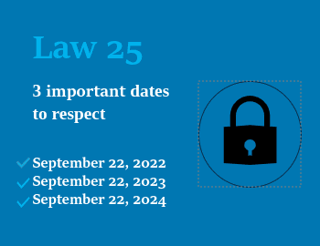
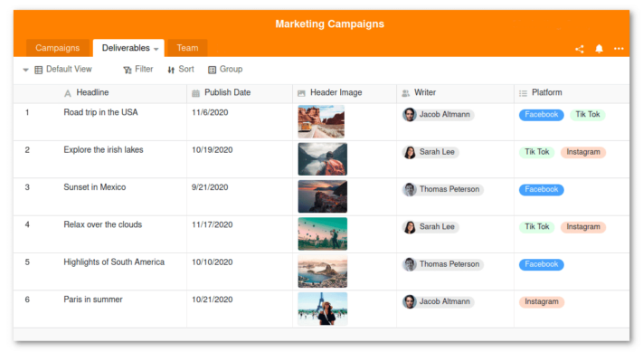

Die Daten von Millionen Kanadiern lagern auf US-Servern von Microsoft, Google, Amazon oder Airtable – zugleich erlaubt der sogenannte **Patriot Act** US-Behörden grundsätzlich all diese Daten abzuschöpfen. [Aus diesem Grund raten Datenschutzexperten schon seit Langem davon ab, personenbezogene Daten in US-Clouds zu speichern.](https://www.heise.de/select/ct/2017/9/1492964161648735) Auch die kanadische Provinz Quebec will dies ab September 2023 durch strengere Datenschutzgesetze unterbinden.

Wie die neuen Datenschutzregeln im Detail aussehen, welche Folgen sich daraus für Sie ergeben und welche datenschutzkonformen Lösungen es gibt, erfahren Sie in diesem Artikel.

## Der Patriot Act im Konflikt mit Datenschutzgesetzen weltweit

Der sogenannte **Patriot Act** ist ein seit den Terroranschlägen vom 11. September 2001 in den Vereinigten Staaten geltendes [Bundesgesetz](https://www.justice.gov/archive/ll/highlights.htm). Es besagt, dass US-Bundesbehörden wie die NSA oder CIA auf alle in den USA liegenden Daten ohne persönliche Zustimmung oder richterliche Anordnung zugreifen dürfen. Dasselbe gilt für ausländische Tochterfirmen und Standorte amerikanischer Unternehmen, die nach dem Patriot Act dazu verpflichtet sind, Zugriff auf ihre Server zu gewähren, selbst wenn lokale Gesetze dies verbieten.

Der vom ehemaligen US-Präsidenten George W. Bush unterzeichnete Patriot Act erlaubt US-Behörden wie dem FBI oder der NSA, ohne richterliche Anordnung auf die Server von US-Unternehmen zuzugreifen.

Doch wie groß ist dieses Problem? Aufgrund der Dominanz US-amerikanischer Tech-Riesen wie Microsoft, Google oder Amazon landen viele Daten von Privatpersonen und Unternehmen rund um den Globus zwangsläufig in den USA. Zum Beispiel nutzt der US-amerikanische Cloud-Kollaborationsdienst Airtable, dem Kunden auf der ganzen Welt vertrauen, zur Speicherung seiner Kundendaten den ebenfalls aus den Vereinigten Staaten stammenden Branchenführer Amazon Web Services (AWS). Infolgedessen werden die Daten aller Kunden von AWS, einschließlich der Kundendaten von Airtable, in US-amerikanischen Rechenzentren gehostet. Diese liegen im Geltungsbereich des Patriot Act, der US-Behörden einen Zugriff ohne jegliche Zustimmung und letztlich eine anlasslose Massenüberwachung der Daten ermöglicht.

Aufgrund der Tatsache, dass die datenschutzrechtlichen Regelungen des Patriot Act in krassem Widerspruch zu den Datenschutzregeln anderer Staaten stehen, beginnt in vielen Ländern ein Umdenken hin zu mehr Datensouveränität.

## US-Clouds aus europäischer Sicht schon länger bedenklich

Dass die Nutzung von US-amerikanischen Cloud-Anbietern mit datenschutzrechtlichen Risiken verbunden ist, ist im Hinblick auf die [Datenschutz-Grundverordnung (DSGVO)](https://dsgvo-gesetz.de/) in der EU schon länger bekannt. Grund dafür ist neben dem Patriot Act das amerikanische Datenschutz-Niveau, welches im Vergleich zum europäischen deutlich niedriger ist. Spätestens jedoch seit dem Wegfall des Privacy Shields ist die Nutzung von Cloud-Anbietern aus den USA für Unternehmen in der EU nicht mehr nur umstritten, sondern gar mit einem [rechtlichen Risiko](https://www.it-recht-kanzlei.de/hosting-usa-dienstleister-standardvertragsklauseln-ungenuegend.html#:~:text=Nach dem Wegfall des Schutzschildes,DSGVO anerkannte Transfergarantie zu schaffen.) verbunden. Der Privacy Shield war eine Vereinbarung, mit der sich die US-Regierung bis 2020 dazu verpflichtet hatte, sich bei der Verarbeitung von personenbezogenen Daten aus der EU an die Vorschriften der DSGVO zu halten. Da die Weitergabe personenbezogener Daten aus der EU verboten ist, verstoßen Unternehmen, die solche Daten noch auf Servern von US-Anbietern speichern oder verarbeiten lassen, nach Meinung einiger Experten gegen europäische Gesetze.

## Das Gesetz 25 der kanadischen Provinz Quebec

Am 22. September 2021 hat die Regierung der kanadischen Provinz Quebec in Anlehnung an die DSGVO in Europa das „Gesetz zur Modernisierung der gesetzlichen Bestimmungen zum Schutz personenbezogener Daten“ – kurz [Gesetz 25](https://www.quebec.ca/gouvernement/ministeres-et-organismes/institutions-democratique-acces-information-laicite/acces-documents-protection-renseignements-personnels/pl64-modernisation-de-la-protection-des-renseignements-personnels#:~:text=Les modifications qui résultent de,citoyens sur leurs renseignements personnels) – verabschiedet. Die in Gesetz 25 enthaltenen Datenschutzregeln treten seither schrittweise in Kraft. Mit dem Gesetzesentwurf sollen die als veraltet geltenden Datenschutzgesetze in Kanada sowohl für den privaten als auch für den öffentlichen Sektor modernisiert und an die technologischen Fortschritte angepasst werden.

Quebecs Gesetz 25 tritt seit September 2022 in jährlichen Schritten in Kraft.

## Inhalte und Auswirkungen des Gesetzes mit Blick auf den Patriot Act

Das Gesetz 25 soll Menschen mehr Transparenz darüber geben, wann und zu welchem Zweck Unternehmen personenbezogene Daten sammeln. Um dieses Ziel zu erreichen, gelten ab September 2023 neue Regeln für den Umgang von Unternehmen und Institutionen mit personenbezogenen Daten. Unter anderem müssen diese in Zukunft bis auf wenige Ausnahmefälle stets eine ausdrückliche Zustimmung einholen, bevor sie die Daten einer Person verwenden dürfen. Dabei muss die Einwilligung für jeden konkreten Zweck gesondert erfolgen und dieser muss den betreffenden Personen auch offen kommuniziert werden. Diese neuen Datenschutzregeln stehen im Konflikt mit dem Patriot Act, der US-Behörden grundsätzlich ohne Einwilligung den Zugriff auf personenbezogene Daten erlaubt, die auf den Servern US-amerikanischer Unternehmen innerhalb und außerhalb der Vereinigten Staaten liegen.

Alle Inhalte von Gesetz 25 zum Nachlesen finden Sie [hier](https://www.publicationsduquebec.gouv.qc.ca/fileadmin/Fichiers_client/lois_et_reglements/LoisAnnuelles/fr/2021/2021C25F.PDF)

## Sind Sie oder Ihr Unternehmen von Gesetz 25 betroffen?

Auch wenn Ihr Unternehmen keine Standorte in Quebec besitzt, könnten Sie dennoch von Gesetz 25 betroffen sein. Denn die mit dem Gesetz verbundenen Regeln gelten nicht nur für Unternehmen in Quebec, sondern – unabhängig vom Standort – für jegliche Unternehmen, die mit Daten von in Quebec ansässigen Personen arbeiten. Darüber hinaus gilt das Gesetz 25 in Kanada als bahnbrechender Rechtsrahmen, der den Anstoß zu weiteren vergleichbaren Gesetzesreformen gegeben hat. Beispielsweise wird Kanada seine bundesstaatlichen Datenschutzgesetze ebenfalls zeitnah mit dem Gesetzesentwurf [C-27](https://www.parl.ca/legisinfo/en/bill/44-1/c-27) überarbeiten, der derzeit noch im Parlament diskutiert wird und das aktuell in ganz Kanada (mit Ausnahme der Provinzen Quebec, British Columbia und Alberta) geltende Bundesgesetz [PIPEDA](https://www.priv.gc.ca/en/privacy-topics/privacy-laws-in-canada/the-personal-information-protection-and-electronic-documents-act-pipeda/pipeda_brief/) ersetzen soll.

Obwohl Gesetz 25 von der Regierung Quebecs verabschiedet wurde, sehen sich auch Unternehmen und Institutionen weit über die Region hinaus mit den Folgen des Gesetzes konfrontiert.

### Kanadischen Unternehmen drohen empfindliche Strafen

Bei Missachtung der neuen Datenschutzregeln drohen kanadischen Unternehmen ab September 2023 empfindliche Strafen. Das Gesetz 25 verfügt im Vergleich zu seinen Vorgängern über ein robustes Durchsetzungssystem, das sowohl ein zweistufiges Geldstrafen-Modell als auch ein Klagerecht vor den Zivilgerichten schafft. Um die [neuen Datenschutzanforderungen von Gesetz 25](https://www.cyberimpact.com/en/law-25-protection-of-personnal-information/) zu erfüllen sowie Strafen und Bußgelder zu vermeiden, müssen Sie Ihre Verfahren zur Verwaltung von Kundendaten anpassen und die Datenschutzrichtlinien in Ihrem Unternehmen überarbeiten.

Besonders einschneidend sind die Folgen für kanadische Unternehmen, die Daten in US-Clouds wie Airtable, Google Workspace oder Microsoft 365 speichern und verarbeiten. Gemäß der ab September geltenden Gesetze ist es nicht mehr erlaubt, personenbezogene Daten von kanadischen Bürgern in US-amerikanischen Rechenzentren zu hosten. Daher sind alle kanadischen Unternehmen und Organisationen, die dies tun, dazu gezwungen, bis zum Inkrafttreten der neuen Regeln im September 2023 auf Alternativen umzusteigen.

## Patriot Act vs. Datenschutz – Wie Sie unabhängig von US-Anbietern werden

Zunächst scheint es gar nicht so leicht zu sein, personenbezogene Daten unabhängig von US-amerikanischen Anbietern, also außerhalb vom Geltungsbereich des Patriot Act zu hosten. Tatsächlich gibt es aber einige Alternativen zu den dominierenden US-Clouds. Wenn Sie derzeit noch Airtable, Google Sheets oder Microsoft Excel für die Speicherung personenbezogener Daten nutzen, könnte beispielsweise SeaTable die richtige Lösung für Sie sein. Diese günstige und leistungsstarke Datenbank- und Kollaborationslösung ist eine zu 100 Prozent datenschutzkonforme Alternative. Als europäisches Unternehmen, das Wert auf höchste Datensicherheit legt, hat SeaTable schon früh dem amerikanischen Branchenführer AWS den Rücken gekehrt. Stattdessen wird die Cloud-Version von SeaTable in deutschen Rechenzentren des Schweizer Anbieters Exoscale gehostet, wodurch die Daten strengen europäischen Datenschutzanforderungen unterliegen.

SeaTable besticht im Vergleich zu Airtable unter anderem durch Mehrsprachigkeit, höhere Speicherlimits und einen günstigeren Preis.

Darüber hinaus bietet SeaTable eine selbstgehostete Variante an, mit der Sie die Software als [On-Premises-Lösung](https://seatable.io/on-premises/) auf Ihren eigenen Servern installieren und betreiben können. So haben Sie die absolute Datenhoheit und maximale Kontrolle über die Speicherorte Ihrer Daten. Egal, für welche Option Sie sich entscheiden – SeaTable steht im Einklang mit den kanadischen Datenschutzgesetzen.

Sie möchten strukturiert Daten erfassen, effizient Aufgaben erledigen und leistungsfähige Prozesse entwickeln – ohne sich Gedanken über die Sicherheit Ihrer Daten machen zu müssen? Dann überzeugen Sie sich selbst und [registrieren Sie sich hier]() für ein **SeaTable Free-Abonnement**, mit dem Ihnen bereits zahlreiche nützliche [Funktionen](https://seatable.io/preise) zur Verfügung stehen. Das Abonnement ist für Sie **komplett kostenlos** und eine perfekte Gelegenheit, SeaTable unverbindlich zu testen.

Noch nicht überzeugt? Weitere Informationen über SeaTable finden Sie auf der [Website](https://seatable.io/).



### Tipp für Airtable-Nutzer

Eine detaillierte Gegenüberstellung von Airtable und SeaTable finden Sie [hier](https://seatable.io/airtable-alternative). Als Airtable-Nutzer haben Sie darüber hinaus die Möglichkeit, ohne Programmierkenntnisse mithilfe eines Skripts sämtliche Daten Ihrer Bases bequem in SeaTable zu migrieren. Wie das funktioniert, erklärt [dieser Hilfeartikel](https://seatable.io/docs/import-von-daten/migration-von-airtable-bases-zu-seatable/).


