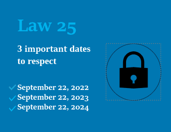
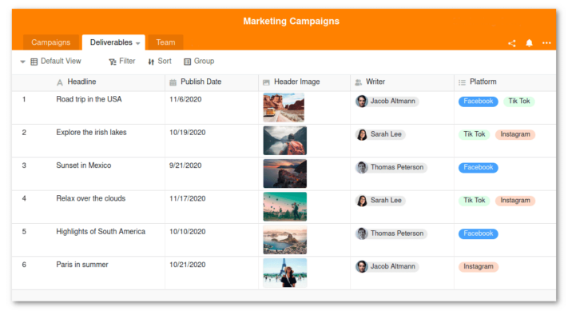

The data of millions of Canadians is stored on US servers of Microsoft, Google, Amazon or Airtable - at the same time, the so-called **Patriot Act** basically allows US authorities to siphon off all this data. [For this reason, data protection experts have long advised against storing personal data in US clouds.](https://www.heise.de/select/ct/2017/9/1492964161648735) The Canadian province of Quebec also wants to prevent this from September 2023 through stricter data protection laws.

This article explains in detail what the new data protection rules look like, what the consequences are for you, and what data protection-compliant solutions are available.

## The Patriot Act in Conflict with Privacy Laws Worldwide

The so-called **Patriot Act** is a [federal law that](https://www.justice.gov/archive/ll/highlights.htm) has been in force in the United States since the terrorist attacks of September 11, 2001. It states that U.S. federal agencies such as the NSA or CIA may access all data located in the U.S. without personal consent or a court order. The same applies to foreign subsidiaries and sites of U.S. companies, which are required by the Patriot Act to grant access to their servers even if local laws prohibit it.

The Patriot Act, signed by former U.S. President George W. Bush, allows U.S. agencies such as the FBI or the NSA to access the servers of U.S. companies without a court order.

But how big is this problem? Due to the dominance of U.S. tech giants such as Microsoft, Google, and Amazon, much of the data of individuals and businesses around the globe inevitably ends up in the United States. For example, US-based cloud collaboration service Airtable, trusted by customers around the world, uses industry leader Amazon Web Services (AWS), also from the United States, to store its customer data. As a result, all AWS customers' data, including Airtable's customer data, is hosted in U.S. data centers. These are within the scope of the Patriot Act, which allows U.S. authorities access without any consent and ultimately mass surveillance of the data without any reason.

Due to the fact that the data protection regulations of the Patriot Act are in stark contrast to the data protection rules of other countries, a rethinking towards more data sovereignty is beginning in many countries.

## US clouds have long been a cause for concern from a European perspective

The fact that the use of US cloud providers is associated with data protection risks has been known for some time with regard to the [General Data Protection Regulation (GDPR)](https://dsgvo-gesetz.de/) in the EU. The reason for this, in addition to the Patriot Act, is the American level of data protection, which is significantly lower than in Europe. However, at the latest since the discontinuation of the Privacy Shield, the use of cloud providers from the USA is no longer only controversial for companies in the EU, but even associated with a [legal risk](https://www.it-recht-kanzlei.de/hosting-usa-dienstleister-standardvertragsklauseln-ungenuegend.html#:~:text=Nach dem Wegfall des Schutzschildes,DSGVO anerkannte Transfergarantie zu schaffen.). The Privacy Shield was an agreement by which the U.S. government had committed until 2020 to comply with the provisions of the GDPR when processing personal data from the EU. Since the transfer of personal data from the EU is prohibited, companies that still store such data or have it processed on servers of U.S. providers are violating European laws, according to some experts.

## The law 25 of the Canadian province of Quebec

On September 22, 2021, the government of the Canadian province of Quebec passed the "Act to Modernize the Legal Provisions for the Protection of Personal Data" - [Act 25](https://www.quebec.ca/gouvernement/ministeres-et-organismes/institutions-democratique-acces-information-laicite/acces-documents-protection-renseignements-personnels/pl64-modernisation-de-la-protection-des-renseignements-personnels#:~:text=Les modifications qui résultent de,citoyens sur leurs renseignements personnels) for short - in line with the GDPR in Europe. The data protection rules contained in Act 25 have since been gradually coming into force. The bill aims to modernize data protection laws in Canada, which are considered outdated, for both the private and public sectors and to adapt them to technological advances.

Quebec's Act 25 has been in effect in annual increments since September 2022.

## Contents and effects of the law with regard to the Patriot Act

Act 25 is intended to give people more transparency about when and for what purpose companies collect personal data. To achieve this goal, new rules for how companies and institutions handle personal data will apply from September 2023. Among other things, in the future they must always obtain explicit consent before using a person's data, with a few exceptions. Consent must be given separately for each specific purpose and this must also be openly communicated to the individuals concerned. These new data protection rules conflict with the Patriot Act, which in principle allows U.S. authorities to access personal data stored on the servers of U.S. companies inside and outside the United States without consent.

You can find all the contents of Act 25 for reference [here](https://www.publicationsduquebec.gouv.qc.ca/fileadmin/Fichiers_client/lois_et_reglements/LoisAnnuelles/fr/2021/2021C25F.PDF)

## Are you or your company affected by Act 25?

Even if your company does not have any locations in Quebec, you could still be affected by Act 25. That's because the rules associated with the Act apply not only to Quebec businesses, but - regardless of location - to any business that works with data of Quebec residents. In addition, Act 25 is considered a groundbreaking legal framework in Canada, which has provided the impetus for other similar legislative reforms. For example, Canada will also revise its federal privacy laws in a timely manner with Bill [C-27](https://www.parl.ca/legisinfo/en/bill/44-1/c-27), which is still being debated in Parliament and is intended to replace the federal [PIPEDA](https://www.priv.gc.ca/en/privacy-topics/privacy-laws-in-canada/the-personal-information-protection-and-electronic-documents-act-pipeda/pipeda_brief/) law currently in place across Canada (with the exception of the provinces of Quebec, British Columbia and Alberta).

Although Bill 25 was passed by the Quebec government, businesses and institutions far beyond the region are also facing its consequences.

### Canadian companies face severe penalties

Canadian companies will face stiff penalties if they fail to comply with the new privacy rules from September 2023. Act 25 has a robust enforcement regime compared to its predecessors, creating both a two-tiered fine model and a right of action in the civil courts. To comply with [Act 25's new data protection requirements](https://www.cyberimpact.com/en/law-25-protection-of-personnal-information/) and avoid penalties and fines, you need to adapt your customer data management procedures and revise your company's data protection policies.

The consequences are particularly drastic for Canadian companies that store and process data in US clouds such as Airtable, Google Workspace or Microsoft 365. Under laws that will take effect in September, it will no longer be permissible to host personal data of Canadian citizens in U.S. data centers. Therefore, all Canadian companies and organizations that do so will be forced to switch to alternatives by the time the new rules come into effect in September 2023.

## Patriot Act vs. data protection - How to become independent from US providers

At first, it seems not so easy to host personal data independently of US providers, i.e. outside the scope of the Patriot Act. But in fact, there are some alternatives to the dominant US clouds. If you are currently still using Airtable, Google Sheets or Microsoft Excel to store personal data, SeaTable, for example, might be the right solution for you. This affordable and powerful database and collaboration solution is a 100 percent privacy-compliant alternative. As a European company that values the highest level of data security, SeaTable turned its back on American industry leader AWS early on. Instead, the cloud version of SeaTable is hosted in German data centers operated by Swiss provider Exoscale, which means that the data is subject to strict European data protection requirements.

Compared to Airtable, SeaTable impresses with multilingualism, higher memory limits and a lower price, among other things.

In addition, SeaTable offers a self-hosted variant that allows you to install and operate the software as an [on-premises solution]() on your own servers. This gives you absolute data sovereignty and maximum control over where your data is stored. No matter which option you choose, SeaTable is compliant with Canadian privacy laws.

You want to capture data in a structured way, complete tasks efficiently and develop powerful processes - without having to worry about the security of your data? Then convince yourself and [register here]() for a **SeaTable Free subscription**, which already provides you with numerous useful [functions](). The subscription is **completely free for** you and a perfect opportunity to test SeaTable without obligation.

Not convinced yet? You can find more information about SeaTable on the [website]().



### Tip for Airtable users

A detailed comparison of Airtable and SeaTable can be found [here](). As an Airtable user, you can also easily migrate all your base data to SeaTable without any programming knowledge by using a script. How this works is explained in [this help article]().


