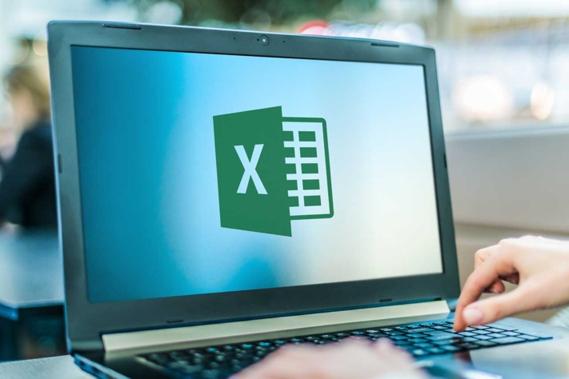
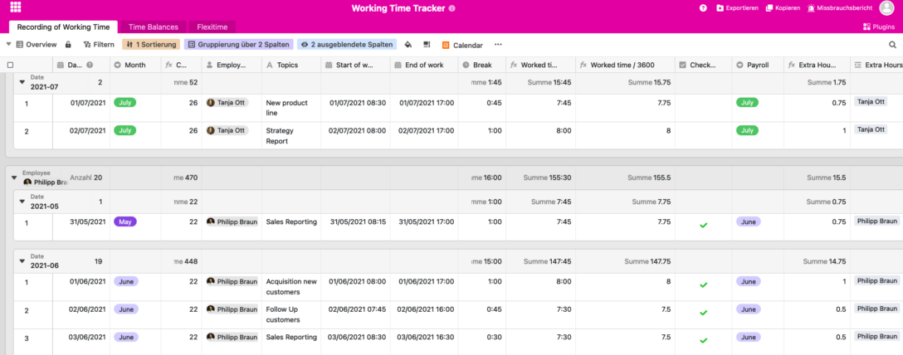

Personnel planning? I use an Excel template. Free of charge is best. Just download it from the Internet and you're done. This is how many HR departments still see it - which is anything but sensible for optimal planning of personnel, shifts and vacations. Because even though personnel planning with Excel is widespread, it is also extremely cumbersome and error-prone. But how does **HR planning** succeed without an **Excel template**, which is also **free of charge**?

The good news is: there are a lot of [online tools](https://seatable.io/en/projekt-management-tool/) that are perfect for workforce planning even without an Excel template. Free of charge, uncomplicated and intuitive to use. In the following text, you'll learn all about the advantages that await you.

## The challenges of personnel planning

The larger a company is, the more difficult personnel planning becomes. In addition to [organizing vacations](https://seatable.io/en/urlaubs-planer/), flextime days and special leave, there is also duty scheduling or shift planning, applicant management and the use of interns, guest students or working students to consider. This not only costs time and money, but sometimes also nerves. Personnel planning without an Excel template, which is ideally available free of charge, seems unimaginable for many at first glance.

[Attendance recording](https://seatable.io/en/arbeitszeiterfassung-in-excel/), vacation planning, personnel requirements planning - the responsibilities in HR are many and varied. The templates for personnel planning must be just as versatile. This is because different aspects have to be taken into account in each planning process. Therefore, it is not advisable to use one template for everything. However, relying on countless Excel lists is not the optimal way either. And yet, most HR managers still work with an Excel template for their personnel planning, which they download free of charge from somewhere.

## How to create a duty roster in Excel

In general, staff planning with Excel templates (free or paid version) is not exclusively bad. The advantage is that free Excel templates from the Internet can be used without much effort. All a user needs is Microsoft Office, Open Office or a Google account to access Google Sheets. Whether it's a duty roster, shift schedule or employee planning - simply enter the relevant search term on Google and the world of free Excel templates opens up.

Personnel planning Excel template free © monticellllo / adobe stock

Depending on the industry you work in, after the download you define the attributes relevant for your business: employees, dates, times, calendar weeks, branches, work models, working hours, etc. The important thing for your staff planning with an Excel template that you use for free is that the plan contains all the essential data, but still remains clear for all employees. Limiting it to the essentials is just as important as a visually appealing design. This is the only way to ensure that everyone in the team understands the meaning of duty scheduling, shift planning, employee planning, and so on.

Once you have defined all the relevant data, you need to enter it correctly in the header and the page row of the Excel list, format the time columns accordingly, assign the appropriate cells to the employees and fill the table with the right formulas. Because each cell, each row and each column needs its own formulas and formatting. And at the latest now it gets uncomfortable.

## Cumbersome, inflexible, impractical - why you should approach workforce planning without a free Excel template

The big problem Excel has is its lack of flexibility. Regardless of whether you are dealing with employee planning, duty rosters or shift distributions, [applicant management](https://seatable.io/en/neue-mitarbeiter-finden-bewerbungsprozess-recruitement/) or other HR processes: The mere use of numbers and letters is not the end of the story. Files, images or checkboxes also play a role here. And as soon as these are involved, Excel reaches its limits. What is great for formulas proves to be very limiting in other areas. And already the advantage of a personnel planning with Excel template is only that it is free of charge.

In addition, there is the teamwork factor. Teamwork is not possible at all with Excel. This is because the files can only be edited by one person at a time, who then sends them back and forth via e-mail, Dropbox or WeTransfer. Not only is a lot of time lost in the process, but often one or the other (important) piece of information is also lost. By the time this is noticed and the point at which the flow of information has snagged is found, the HR department has wasted so much time that it is almost impossible to catch up.

## Bye bye time guzzlers, welcome efficient personnel planning

As you can see, personnel planning with an Excel template has optimization potential - free of charge or not. If you really want to organize your employees in a meaningful way and create duty rosters in an uncomplicated way, you should rely on online tools for personnel planning. Because these usually have three very clear advantages:

- **Time saving**: Fully automated personnel planning without an Excel template, but with an online tool, ensures that all essential data is always up to date and enables a significant minimization of errors compared to manually entered data.
- **Focus on core competencies**: Online tools free up space for the activities that earn you your money. Instead of having to invest a lot of your time in planning, you can pursue your core business.
- **Employee satisfaction**: The clearer a duty or vacation schedule is, the better. Thanks to online tools, you can easily involve your employees in planning processes, take their wishes into account and thus create more transparency. This promotes the satisfaction of all team members.

## The easier way to plan your workforce with online tools

Another key advantage of HR planning without a free Excel template is the extreme flexibility that online tools bring. HR departments can easily share their spreadsheets with their employees, allowing them to independently enter their shifts, duties, and vacations.

Not only is everyone always on the same information level, but the organizational effort is significantly reduced. And it makes no difference whether you run a small, medium or large company, a café or a car dealership. With the right online tool, there is a suitable [shift schedule](https://seatable.io/en/vorlage/nmmouofjq5mw4cobogtgog/) or optimal [working time recording for](https://seatable.io/en/vorlage/dkcp4_k3rnsb4d9sskb6qw/) every requirement.

Personnel Planning Excel Template Free © SeaTable

The same applies to a company's applicant management and the onboarding of new employees. Online tools help you keep track of all open positions, schedule interviews, and always keep an eye on the calendar - including real-time adjustments. Whether it's [recruitment](https://seatable.io/en/vorlage/nmmouofjq5mw4cobogtgog/), [job](https://seatable.io/en/vorlage/nbmf4z3_rssykhs-3egoqa/) [interviews](https://seatable.io/en/vorlage/fg-byiujqtsxggm61en_ug/) or onboarding, with the right online tool you can easily cover all areas of personnel planning. And even without a free Excel template.

Image source Cover image: © Proxima Studio/Adobe Stock
