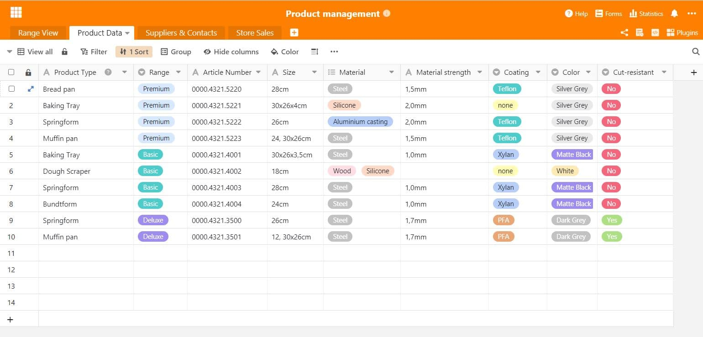
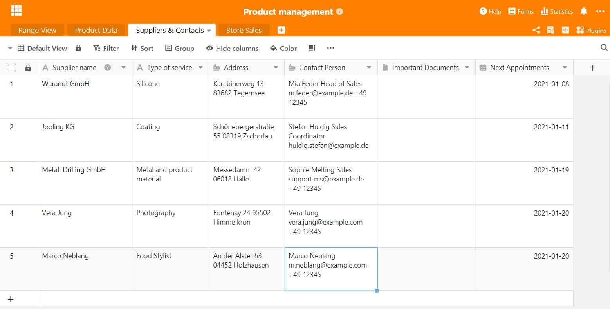
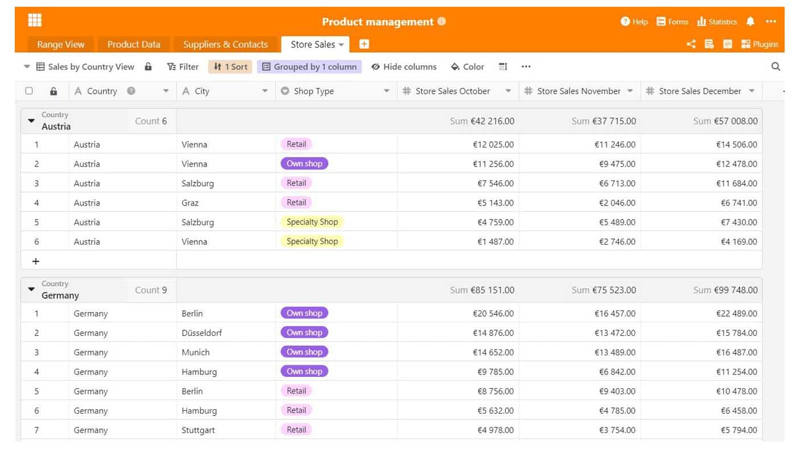
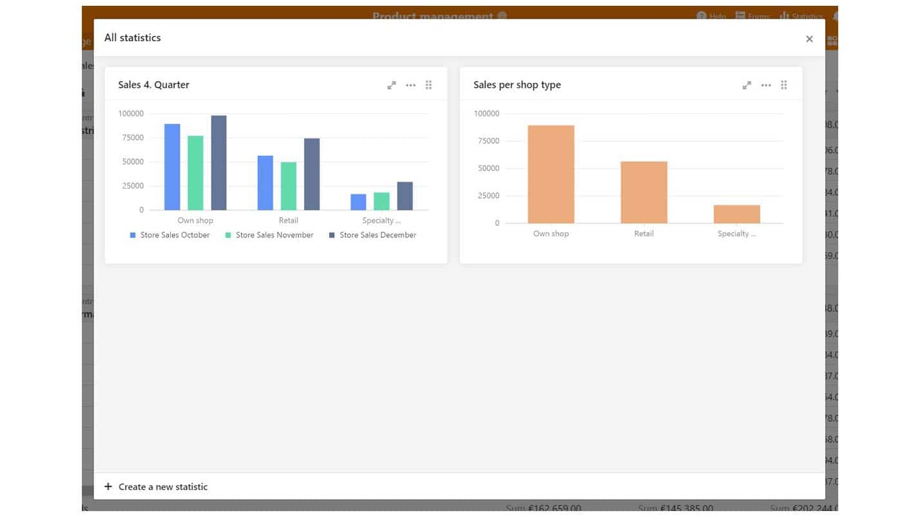

Wenn Unternehmen ein Produkt oder eine Dienstleistung vertreiben, ist ein gutes Produktmanagement sehr wichtig für langfristigen Markterfolg. Denn was nützt ein super Produkt, das einfach nicht läuft? Wir zeigen, was es im Produktmanagement zu beachten gibt und welche nützlichen Funktionen die Arbeit mit SeaTable hier mit sich bringt.

## Was ist Produktmanagement?

In Unternehmen ist das Produktmanagement die zentrale Einheit, die alle Aufgaben rund um das Produkt übernimmt. Das betrifft die Planung, Steuerung und Kontrolle des Produkts während des gesamten Produktentwicklungsprozesses bis hin zum Marktlaunch bzw. bis zum Ausscheiden des Produkts vom Markt. Das Produktmanagement muss seine Kunden sehr gut kennen, die es mit dem Produkt anspricht

Das Produktmanagement liefert wichtige Informationen über die Marktsituation und entwickelt mit ihnen effiziente Produktstrategien. Diese werden den verantwortlichen Stellen als Entscheidungsgrundlage für oder gegen das Produkt vorgelegt. In den Strategien sind auch die Marktanforderungen für das Produkt enthalten, ebenso wie die Marktkommunikation aussehen könnte.

## Warum braucht es ein Produktmanagement?

Ein gutes Produkt alleine reicht nicht aus, um am Markt zu bestehen. Es ist vor allem wichtig, die Marktanforderungen zu prüfen und sich zu fragen: In welcher Marktumgebung befindet sich mein Produkt und was sind die Kundenbedürfnisse, die dort erfüllt werden sollen? Es ist wichtig, den Markt zu kennen, die dort agierenden Wettbewerber und allen voran seine potentiellen Kunden. Ohne dieses Wissen wird es ein Produkt eher schwer haben und wahrscheinlich in der Masse der Konkurrenz untergehen.

Daher ist es wichtig, ein professionelles Produktmanagement im Unternehmen aufzubauen und Verantwortliche festzulegen, die für bestimmte Themen zuständig sind. Nur so behalten Sie den Überblick über sich [ständig ändernde Marktanforderungen](https://www.reckliesmp.de/veraenderungen-im-markt/) und Kundenbedürfnisse.

## Aufgaben eines Produktmanagers

Zu den Aufgaben des Produktmanagements gehören alle Stadien, die ein Produkt durchläuft. Das sind Planung, Konzeption und Umsetzung, in die sich grob folgende Punkte einordnen lassen:

- **Planung**: Idee, Marktanalyse, Konkurrenzanalyse, Kundenanalyse
- **Konzeption**: Strategiebildung zu Markt, Preis, Distribution, Kommunikation; Prototyp, Kostenübersicht
- **Umsetzung**: technische Umsetzung, Strategieumsetzung, Produktlaunch

Zudem gibt es noch einige organisatorische Aufgaben, die ein Produktmanager übernimmt. Er fungiert als **Schnittstelle** zwischen [Marketing](), [Vertrieb](https://seatable.io/vertrieb/) und Produktentwicklung sowie der Produktion. Für die einzelnen Schritte im Produktentwicklungsprozess koordiniert der Produktmanager auch das **[Projektmanagement]()**. Das Produktmanagement ist also auch viel mit Strategiebildung und Analysen beschäftigt, welche neben der Konzeption und Entwicklung des Produkts selbst anfallen.

### Herausforderungen im Produktmanagement

Das Produktmanagement trägt entscheidend zum Erfolg eines Produkts, und damit auch oft zu dem des Unternehmens bei. Das muss auf allen Ebenen anerkannt werden. Wenn wichtige Instanzen wie die Geschäftsleitung nicht hinter dem Produktmanagement und dessen Vorschläge stehen, kann unter Umständen das ganze Unternehmen darunter leiden. Daher ist es wichtig, immer eine ausgeglichene Abstimmung zwischen den verschiedenen Abteilungen anzuzielen und dadurch das größtmögliche Vertrauen herzustellen. Das geht mit professionell aufbereiteten Informationen und Daten, die Arbeitsprozesse zudem enorm erleichtern.

## Die Arbeit im Produktmanagement: Wie strukturiere ich meine Daten richtig?

Nun ist für eine ausreichende Strukturierung im Produktentwicklungsprozess eine gute Organisation der vorhandenen Daten und Informationen wichtig. Manche kennen es vielleicht: Es gibt eine unzählige Menge an Tabellen, Dokumenten und Präsentationen, in der wichtige Informationen gesammelt werden – das kann Chaos und Unübersichtlichkeit erzeugen, wenn nach bestimmten Daten gesucht wird. Sinnvoller ist es, alle wichtigen Daten in einem Dokument abzulegen, das als Master dient. An diesem Informationspunkt sammeln sich alle wichtigen Daten rund um das Produkt, wie etwa das Produktdatenblatt, Daten von Zulieferern und Kunden oder Verkaufszahlen.

Eine gut organisierte Übersicht erleichtert nicht nur den Arbeitsprozess sondern gibt auch die Chance, Daten auszuwerten und ohne großen Aufwand wichtige Kennzahlen aus den Informationen zu ziehen. Mit den richtigen Kniffen können ausdrucksstarke und informative Statistiken erstellt werden, die allen Involvierten einen Blick auf aktuelle Zahlen und Trends geben.

## Produktmanagement mit SeaTable

Sammeln Sie ganz einfach alle Daten an einem Ort: Mit SeaTable. [Unser Template für das Produktmanagement]() ist aus mehreren Tabellenblättern aufgebaut. Zunächst gibt es eine generelle Produktübersicht, gefolgt von einem spezifischen Produktdatenblatt. Ebenso wichtig sind zu den Produktinformationen auch die Kontaktdaten von Zulieferern und externen Mitarbeitern. Nicht zu vergessen: Zahlen wie etwa Umsätze des Produkts können mit SeaTable hervorragend gesammelt und ausgewertet werden. Selbstverständlich ist unser Template flexibel an Ihre Bedürfnisse und die Ihres Produktes anpassbar.

### 1\. Generelle Produktübersicht

Um jedem Mitarbeiter einen umfassenden Blick über das Produkt zu geben, ist ein Standard-Übersichtsblatt sinnvoll. Hier sind die wichtigsten Produktinformationen aufgelistet, wie etwa Produktreihe, Produkttyp, der offizielle Produktname für den Handel, Artikelnummer, Preise und dazugehörige Produktbilder. Insbesondere für Fachfremde ist eine Kurzübersicht besonders wertvoll. Mit den verschiedenen Ansichten in SeaTable können die Daten mit wenigen Klicks zum Beispiel nach Produktreihe oder Produkttyp [gefiltert und gespeichert](https://seatable.io/docs/handbuch/seatable-nutzen/gruppierung-sortierung-filter/) werden und lästiges manuelles Sortieren fällt weg.

Die Produktübersicht gibt dem Produktmanagement Struktur

### 2\. Spezifisches Produktdatenblatt

Manchmal reicht eine Produktübersicht nicht aus und es muss ein wenig spezifischer werden. Ganz spezielle Produktinformationen wie zum Beispiel eine besondere Beschichtung, Material und Materialstärke oder andere Daten, die die Produktübersicht unübersichtlich machen würden. SeaTable ist ideal dafür geeignet, Produktspezifika für Mitarbeiter zu sammeln und damit den Produktentwicklungsprozess zu optimieren. Die genaue Farbbeschreibung beim Lieferanten ist genau so wichtig, wie die Materialbeschaffenheit und hilft beispielsweise neuen Mitarbeitern dabei, sofort ins Tagesgeschäft einsteigen zu können. Verschiedene Ansichten geben auch hier zusätzliche Unterstützung.

Im Produktdatenblatt finden Sie alle wichtigen Informationen rund um das Produkt

### 3\. Alle Kontakte im Blick

Im Produktentwicklungsprozess durchläuft das Produkt eine ganze Reihe an verschiedenen Abteilungen durch. [Marketing](), Vertrieb, Produktionsstätte, Fotografie und auch der Handel sind wichtige alltägliche Kontaktpunkte in der Arbeit eines Produktmanagers. Praktisch ist es dann, wenn alle Kontaktdaten an einem Ort gesammelt und so für jeden zugänglich sind. Für die Urlaubsvertretung ist dies genau so hilfreich wie für die neue Auszubildende! Zudem können auch Informationen hinzugefügt werden, wie etwa Gesprächsprotokolle, wichtige Dokumente oder bevorstehende Telefontermine. Mit SeaTable ist das Erstellen eines Adressbuchs innerhalb einer Tabelle absolut kein Problem.

Notieren Sie alle wichtigen Kontaktdaten Ihrer Lieferanten und Kunden

### 4\. Verkaufszahlen intelligent auswerten

Im Produktmanagement sind die Umsätze ein wichtiges Kontrollinstrument, um den Erfolg von Maßnahmen und Strategien abzuschätzen. Gibt es vielleicht einen Store, der überhaupt nicht gut läuft? Müssen Produkte neu präsentiert oder das Sortiment anders aufgebaut werden? Die Verkaufszahlen sind extrem wichtige Kennzahlen für Unternehmen, aus denen sie wertvolle Informationen ziehen können. Sind die Umsätze gut, so zeugt dies von einem guten Produktmanagement und dass die festgesetzten Ziele erreicht wurden. Falls es Verbesserungsbedarf gibt, können die Umsatzzahlen auch darüber Aufschluss geben. Sind bei den Verkaufszahlen sogar demographische Daten hinterlegt, die beispielsweise durch den Online-Handel gesammelt werden können, kann die Zielgruppenanalyse dadurch bedeutsam optimiert werden – etwa durch die Bildung von [Personas](https://www.reachx.de/6-punkte-anleitung-zur-erstellung-individueller-personas/) oder das Anpassen der Marketingstrategie an bestimmte Zielgruppensegmente.

Sortieren Sie Verkaufszahlen nach Regionen

Statistiken geben wertvolle Informationen über die Verkaufszahlen Ihres Produkts

Der Produktentwicklungsprozess im Produktmanagement ist nicht zu unterschätzen. Dabei müssen sehr viele Posten berücksichtigt werden. Um nicht den Überblick zu verlieren, bieten wir mit unserem SeaTable Produktmanagement Template eine hervorragende Möglichkeit, direkt organisiert und strukturiert in eine neue Art des Produktmanagements zu starten. Erleben Sie einfache Prozesse und effiziente Datensammlung – einfach [hier das Template downloaden]() und loslegen!
