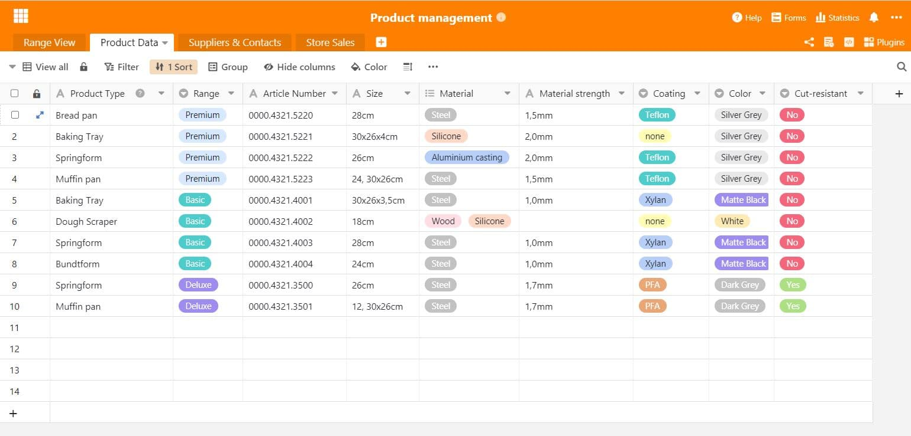
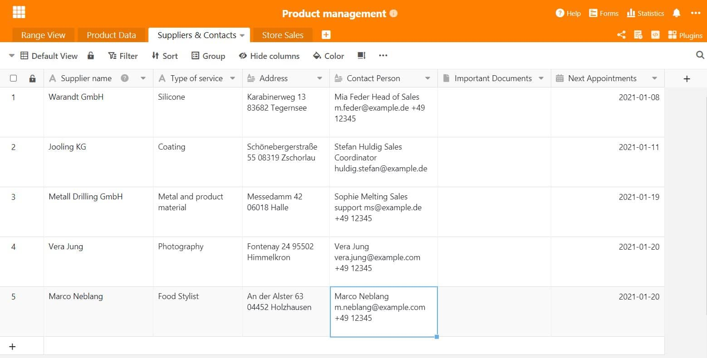

When companies market a product or service, good product management is very important for long-term market success. After all, what good is a great product that simply doesn't work? We show what needs to be considered in product management and which useful functions the work with SeaTable brings with it.

## What is product management?

In companies, product management is the central unit that takes over all tasks related to the product. This concerns the planning, management and control of the product during the entire product development process up to the market launch or until the product is withdrawn from the market. Product management must know its customers very well, whom it addresses with the product.

Product management provides important information about the market situation and uses it to develop efficient product strategies. These are presented to the responsible bodies as a basis for decisions for or against the product. The strategies also include the market requirements for the product, as well as what the market communication might look like.

## Why is product management needed?

A good product alone is not enough to survive in the market. Above all, it is important to examine the market requirements and ask oneself: In which market environment is my product located and what are the customer needs that are to be fulfilled there? It is important to know the market, the competitors operating there and, above all, its potential customers. Without this knowledge, a product will have a hard time and will probably be lost in the mass of competitors.

Therefore, it is important to establish a professional product management in the company and to define responsible persons who are in charge of certain topics. This is the only way to keep an overview of [constantly changing market requirements](https://www.reckliesmp.de/veraenderungen-im-markt/) and customer needs.

## Tasks of a product manager

The tasks of product management include all stages that a product goes through. These are planning, conception and implementation, into which the following points can be roughly classified:

- **Planning**: idea, market analysis, competitor analysis, customer analysis
- **Concept**: strategy development for market, price, distribution, communication; prototype, cost overview
- **Implementation**: technical implementation, strategy implementation, product launch

In addition, there are some organisational tasks that a product manager takes on. He acts as an **interface** between [marketing](), [sales]() and product development as well as production. For the individual steps in the product development process, the product manager also coordinates the **[Project management]()**. Product management is therefore also very busy with strategy formation and analyses, which occur in addition to the conception and development of the product itself.

### Challenges in product management

Product management makes a decisive contribution to the success of a product, and thus often to that of the company. This must be recognised at all levels. If important bodies such as the management do not support product management and its proposals, the whole company may suffer. Therefore, it is important to always aim for a balanced coordination between the different departments and thus establish the greatest possible trust. This can be achieved with professionally prepared information and data, which also facilitate work processes enormously.

## The work in product management: How do I structure my data correctly?

Now, for sufficient structuring in the product development process, a good organisation of the existing data and information is important. Some may know it: There is a countless amount of tables, documents and presentations in which important information is collected - this can create chaos and confusion when searching for specific data. It makes more sense to store all important data in one document that serves as a master. This information point collects all important data about the product, such as the product data sheet, data from suppliers and customers or sales figures.

A well-organised overview not only facilitates the work process but also gives the opportunity to evaluate data and to extract important key figures from the information without much effort. With the right tricks, expressive and informative statistics can be created that give everyone involved a view of current figures and trends.

## Product management with SeaTable

Easily collect all your data in one place: with SeaTable. [Our template for product management]() is made up of several spreadsheets. First there is a general product overview, followed by a specific product data sheet. Equally important to the product information are the contact details of suppliers and external employees. Not to be forgotten: Figures such as sales of the product can be excellently collected and evaluated with SeaTable. Of course, our template is flexibly adaptable to your needs and those of your product.

### 1\. general product overview

To give every employee a comprehensive view of the product, a standard overview sheet is useful. This lists the most important product information, such as product series, product type, the official product name for the trade, item number, prices and associated product images. A brief overview is particularly valuable for people unfamiliar with the subject. With the various views in SeaTable, the data can be [filtered and saved with]() just a few clicks, for example by product series or product type, and tedious manual sorting is no longer necessary.

The product overview gives structure to product management

### 2\. specific product data sheet

Sometimes a product overview is not enough and it needs to be a little more specific. Very specific product information such as a special coating, material and material thickness or other data that would make the product overview confusing. SeaTable is ideal for collecting product specifics for employees and thus optimising the product development process. The exact colour description at the supplier is just as important as the material properties and helps, for example, new employees to get started immediately in the day-to-day business. Different views also provide additional support here.

In the product data sheet you will find all the important information about the product

### 3\. all contacts at a glance

In the product development process, the product passes through a number of different departments. [Marketing](), sales, production plant, photography and also retail are important everyday contact points in the work of a product manager. It is then practical if all contact data is collected in one place and thus accessible to everyone. This is just as helpful for the holiday replacement as it is for the new trainee! In addition, information can also be added, such as minutes of meetings, important documents or upcoming telephone appointments. With SeaTable, creating an address book within a table is absolutely no problem.

Note down all important contact details of your suppliers and customers

### 4\. evaluate sales figures intelligently

In product management, sales are an important control instrument to assess the success of measures and strategies. Is there perhaps a store that is not doing well at all? Do products have to be presented anew or the assortment structured differently? Sales figures are extremely important key figures for companies from which they can draw valuable information. If sales are good, this is evidence of good product management and that the set goals have been achieved. If there is a need for improvement, the sales figures can also provide information about this. If the sales figures even include demographic data, which can be collected through online trading, for example, the target group analysis can be significantly optimised - for example, by creating [personas](https://www.reachx.de/6-punkte-anleitung-zur-erstellung-individueller-personas/) or adapting the marketing strategy to specific target group segments.

Sort sales figures by region

Statistics give valuable information about the sales figures of your product

The product development process in product management should not be underestimated. A lot of items have to be taken into account. In order not to lose the overview, we offer with our SeaTable product management template an excellent possibility to start directly organised and structured into a new kind of product management. Experience simple processes and efficient data collection - simply [download the template here]() and get started!
