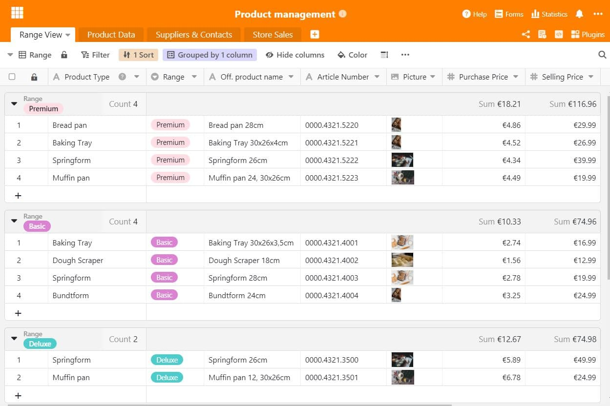
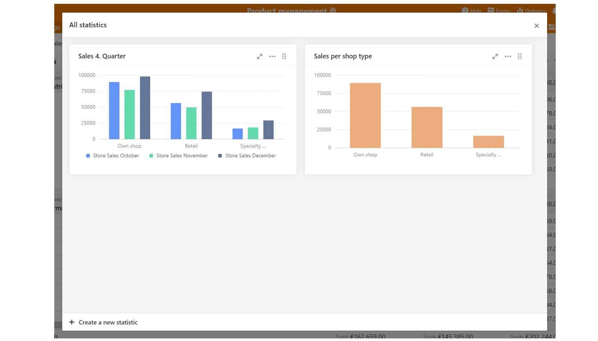

Lorsque les entreprises commercialisent un produit ou un service, une bonne gestion des produits est très importante pour le succès à long terme sur le marché. En effet, à quoi sert un super produit qui ne fonctionne pas ? Nous vous montrons ce à quoi il faut faire attention dans la gestion de produit et quelles fonctions utiles le travail avec SeaTable apporte ici.

## Qu'est-ce que la gestion des produits ?

Dans les entreprises, la gestion de produit est l'unité centrale qui prend en charge toutes les tâches liées au produit. Cela concerne la planification, la gestion et le contrôle du produit tout au long du processus de développement du produit, jusqu'à son lancement sur le marché ou son retrait du marché. Le management de produit doit très bien connaître les clients auxquels il s'adresse avec le produit.

La gestion des produits fournit des informations importantes sur la situation du marché et les utilise pour développer des stratégies de produits efficaces. Celles-ci sont présentées aux services responsables comme base de décision pour ou contre le produit. Les stratégies contiennent également les exigences du marché pour le produit, ainsi que la manière dont la communication sur le marché pourrait se dérouler.

## Pourquoi a-t-on besoin d'une gestion de produits ?

Il ne suffit pas d'avoir un bon produit pour s'imposer sur le marché. Il est avant tout important d'examiner les exigences du marché et de se demander : dans quel environnement de marché se trouve mon produit et quels sont les besoins des clients qui doivent y être satisfaits ? Il est important de connaître le marché, les concurrents qui y opèrent et, avant tout, ses clients potentiels. Sans cette connaissance, un produit aura plutôt du mal à se faire une place et sera probablement noyé dans la masse de la concurrence.

Il est donc important de mettre en place une gestion professionnelle des produits au sein de l'entreprise et de désigner des responsables chargés de certains thèmes. C'est la seule façon de garder une vue d'ensemble sur les [exigences du marché](https://www.reckliesmp.de/veraenderungen-im-markt/) et les besoins des clients, en [constante évolution](https://www.reckliesmp.de/veraenderungen-im-markt/).

## Tâches d'un chef de produit

Toutes les étapes par lesquelles passe un produit font partie des tâches de la gestion de produit. Il s'agit de la planification, de la conception et de la mise en œuvre, dans lesquelles on peut grossièrement classer les points suivants :

- **Planification**: idée, analyse du marché, analyse de la concurrence, analyse des clients
- **Conception**: élaboration d'une stratégie concernant le marché, le prix, la distribution, la communication ; prototype, aperçu des coûts
- **Mise en œuvre**: réalisation technique, mise en œuvre de la stratégie, lancement du produit

En outre, un chef de produit assume certaines tâches organisationnelles. Il fait office d'**interface** entre le [marketing](), les ventes et le développement de produits ainsi que la production. Pour les différentes étapes du processus de développement de produits, le chef de produit coordonne également le **[Gestion de projet]()**. La gestion de produit s'occupe donc aussi beaucoup de la création de stratégies et d'analyses, qui s'ajoutent à la conception et au développement du produit lui-même.

### Les défis de la gestion de produits

La gestion des produits contribue de manière décisive au succès d'un produit, et donc souvent aussi à celui de l'entreprise. Cela doit être reconnu à tous les niveaux. Si des instances importantes comme la direction ne soutiennent pas la gestion des produits et ses propositions, c'est toute l'entreprise qui peut en souffrir. Il est donc important de toujours viser une coordination équilibrée entre les différents services et d'instaurer ainsi la plus grande confiance possible. Cela est possible grâce à des informations et des données préparées de manière professionnelle, qui facilitent en outre énormément les processus de travail.

## Le travail dans la gestion de produits : comment structurer correctement mes données ?

Or, pour une structuration suffisante dans le processus de développement de produits, il est important de bien organiser les données et informations existantes. Certains le savent peut-être déjà : il existe une quantité innombrable de tableaux, de documents et de présentations dans lesquels sont rassemblées des informations importantes - cela peut créer le chaos et la confusion lorsque l'on recherche des données spécifiques. Il est plus judicieux de classer toutes les données importantes dans un document qui sert de maître. Ce point d'information rassemble toutes les données importantes relatives au produit, telles que la fiche technique du produit, les données des fournisseurs et des clients ou les chiffres de vente.

Une vue d'ensemble bien organisée facilite non seulement le processus de travail, mais donne également la possibilité d'évaluer les données et d'en tirer des chiffres clés sans grand effort. Avec les bonnes astuces, il est possible de créer des statistiques expressives et informatives qui donnent à toutes les personnes impliquées un aperçu des chiffres et des tendances actuels.

## Gestion des produits avec SeaTable

Rassemblez facilement toutes vos données en un seul endroit : avec SeaTable. [Notre modèle de gestion des produits]() est composé de plusieurs feuilles de calcul. Il y a d'abord un aperçu général des produits, suivi d'une fiche produit spécifique. Les données de contact des fournisseurs et des collaborateurs externes sont tout aussi importantes pour les informations sur les produits. Il ne faut pas non plus oublier : Les chiffres, tels que le chiffre d'affaires du produit, peuvent être parfaitement collectés et évalués avec SeaTable. Bien entendu, notre modèle est adaptable à vos besoins et à ceux de votre produit.

### 1\. aperçu général des produits

Pour permettre à chaque collaborateur d'avoir une vue d'ensemble du produit, une fiche de présentation standard est utile. Les informations les plus importantes sur le produit y sont listées, comme la gamme de produits, le type de produit, le nom officiel du produit pour le commerce, le numéro d'article, les prix et les images correspondantes du produit. Un bref aperçu est particulièrement précieux pour les personnes non spécialisées. Les différentes vues de SeaTable permettent de [filtrer et d'enregistrer]() les données en quelques clics, par exemple par gamme ou type de produit, et d'éviter les tris manuels fastidieux.

L'aperçu des produits donne une structure à la gestion des produits

### 2\. fiche technique spécifique du produit

Parfois, un aperçu des produits ne suffit pas et il faut être un peu plus spécifique. Des informations très spécifiques sur le produit, comme par exemple un revêtement particulier, le matériau et son épaisseur ou d'autres données qui rendraient l'aperçu du produit confus. SeaTable est idéal pour rassembler les spécificités des produits pour les collaborateurs et optimiser ainsi le processus de développement des produits. La description précise de la couleur chez le fournisseur est tout aussi importante que la nature du matériau et aide par exemple les nouveaux collaborateurs à être immédiatement opérationnels dans leur travail quotidien. Différentes vues apportent ici aussi un soutien supplémentaire.

Dans la fiche technique du produit, vous trouverez toutes les informations importantes sur le produit.

### 3\. tous les contacts en un coup d'œil

Dans le processus de développement d'un produit, celui-ci passe par toute une série de départements différents. Le [marketing](), la distribution, le site de production, la photographie et même le commerce sont des points de contact quotidiens importants dans le travail d'un chef de produit. Il est alors pratique de rassembler toutes les données de contact en un seul endroit et de les rendre ainsi accessibles à tous. C'est tout aussi utile pour le remplaçant en vacances que pour le nouvel apprenti ! Il est également possible d'ajouter des informations telles que des comptes rendus d'entretiens, des documents importants ou des rendez-vous téléphoniques à venir. Avec SeaTable, la création d'un carnet d'adresses au sein d'un tableau ne pose aucun problème.

Notez toutes les coordonnées importantes de vos fournisseurs et clients

### 4\. évaluer intelligemment les chiffres de vente

Dans la gestion des produits, les chiffres d'affaires sont un instrument de contrôle important pour évaluer le succès des mesures et des stratégies. Y a-t-il peut-être un magasin qui ne fonctionne pas du tout ? Les produits doivent-ils être présentés différemment ou l'assortiment doit-il être structuré différemment ? Les chiffres de vente sont des indicateurs extrêmement importants pour les entreprises, qui peuvent en tirer de précieuses informations. Si les ventes sont bonnes, cela signifie que la gestion des produits est bonne et que les objectifs fixés ont été atteints. Si des améliorations sont nécessaires, les chiffres de vente peuvent également fournir des informations à ce sujet. Si les chiffres de vente contiennent même des données démographiques, qui peuvent par exemple être collectées par le commerce en ligne, l'analyse du groupe cible peut être optimisée de manière significative - par exemple en créant des [personas](https://www.reachx.de/6-punkte-anleitung-zur-erstellung-individueller-personas/) ou en adaptant la stratégie marketing à certains segments du groupe cible.

Trier les chiffres de vente par région

Les statistiques fournissent des informations précieuses sur les ventes de votre produit

Le processus de développement de produits dans la gestion de produits ne doit pas être sous-estimé. De très nombreux postes doivent être pris en compte. Pour ne pas perdre la vue d'ensemble, nous proposons avec notre modèle de gestion de produits SeaTable une excellente possibilité de démarrer directement de manière organisée et structurée dans un nouveau type de gestion de produits. Découvrez des processus simples et une collecte de données efficace - [téléchargez]() simplement [le modèle ici]() et lancez-vous !
