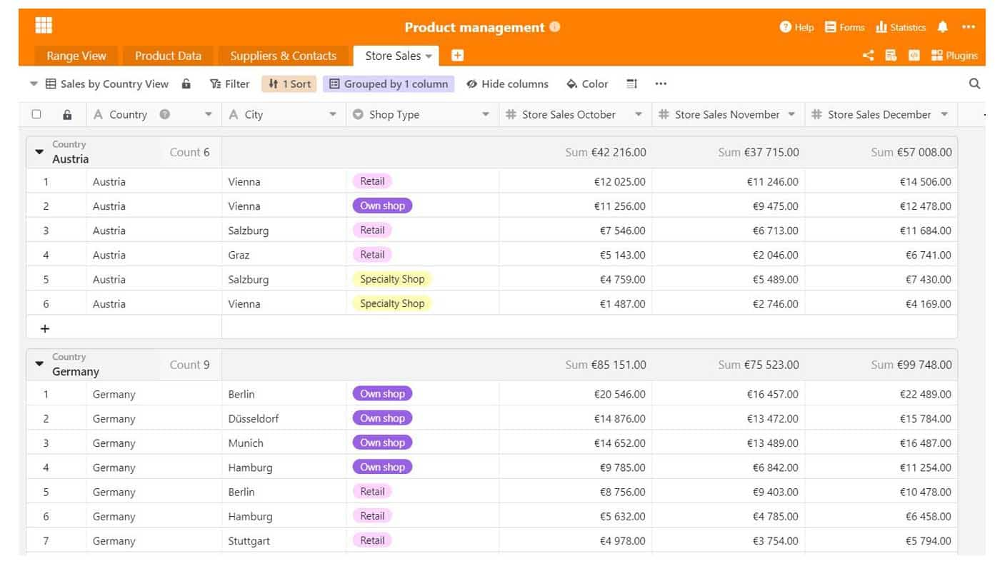

Quando as empresas comercializam um produto ou serviço, uma boa gestão do produto é muito importante para o sucesso do mercado a longo prazo. Afinal de contas, de que serve um grande produto que simplesmente não funciona? Mostramos o que deve ser considerado na gestão do produto e quais as funções úteis que o trabalho com SeaTable traz consigo.

## O que é a gestão do produto?

Nas empresas, a gestão do produto é a unidade central que assume todas as tarefas relacionadas com o produto. Isto diz respeito ao planeamento, gestão e controlo do produto durante todo o processo de desenvolvimento do produto até ao seu lançamento no mercado ou até que o produto seja retirado do mercado. A gestão do produto deve conhecer muito bem os seus clientes, a quem se dirige com o produto.

A gestão de produtos fornece informações importantes sobre a situação do mercado e utiliza-a para desenvolver estratégias de produtos eficientes. Estes são apresentados aos organismos responsáveis como base para decisões a favor ou contra o produto. As estratégias incluem também as exigências do mercado para o produto, bem como o aspecto que a comunicação do mercado pode ter.

## Porque é necessária a gestão do produto?

Um bom produto por si só não é suficiente para sobreviver no mercado. Acima de tudo, é importante examinar as exigências do mercado e perguntar a si próprio: Em que ambiente de mercado está localizado o meu produto e quais são as necessidades do cliente que aí devem ser satisfeitas? É importante conhecer o mercado, os concorrentes que aí operam e, sobretudo, os seus potenciais clientes. Sem este conhecimento, um produto terá dificuldades e provavelmente perder-se-á na massa dos concorrentes.

Por conseguinte, é importante construir uma gestão profissional do produto na empresa e definir as pessoas responsáveis responsáveis por determinados temas. Esta é a única forma de manter uma visão geral das [necessidades do mercado em constante mudança](https://www.reckliesmp.de/veraenderungen-im-markt/) e das necessidades dos clientes.

## Tarefas de um gestor de produto

As tarefas de gestão do produto incluem todas as fases pelas quais um produto passa. Trata-se de planeamento, concepção e implementação, nos quais os seguintes pontos podem ser grosseiramente classificados:

- **Planeamento**: ideia, análise de mercado, análise da concorrência, análise do cliente
- **Conceito**: desenvolvimento de estratégia para o mercado, preço, distribuição, comunicação; protótipo, visão geral dos custos
- **Implementação**: implementação técnica, implementação de estratégias, lançamento de produtos

Além disso, há algumas tarefas de organização que um gestor de produto assume. Actua como uma **interface** entre [marketing](), [vendas]() e desenvolvimento de produtos, bem como produção. Para as etapas individuais do processo de desenvolvimento do produto, o gestor do produto também coordena o **[Gestão de projectos]()**. A gestão do produto está, portanto, também muito ocupada com a formação e análises estratégicas, que ocorrem para além da concepção e desenvolvimento do próprio produto.

### Desafios na gestão de produtos

A gestão do produto contribui decisivamente para o sucesso de um produto e, por conseguinte, muitas vezes para o da empresa. Isto deve ser reconhecido a todos os níveis. Se organismos importantes como a direcção não apoiarem a gestão de produtos e as suas propostas, toda a empresa pode sofrer. Por conseguinte, é importante visar sempre uma coordenação equilibrada entre os diferentes departamentos e assim estabelecer a maior confiança possível. Isto pode ser conseguido com informação e dados preparados profissionalmente, o que também facilita enormemente os processos de trabalho.

## O trabalho na gestão de produtos: Como estruturo correctamente os meus dados?

Agora, para uma estruturação suficiente no processo de desenvolvimento do produto, é importante uma boa organização dos dados e informações existentes. Alguns podem sabê-lo: Há uma quantidade incontável de tabelas, documentos e apresentações em que se recolhe informação importante - isto pode criar caos e confusão quando se procura dados específicos. Faz mais sentido armazenar todos os dados importantes num único documento que sirva de mestre. Este ponto de informação recolhe todos os dados importantes sobre o produto, tais como a ficha de produto, dados de fornecedores e clientes ou números de vendas.

Uma visão geral bem organizada não só facilita o processo de trabalho como também lhe dá a oportunidade de avaliar os dados e extrair números-chave importantes da informação sem muito esforço. Com os truques certos, podem ser criadas estatísticas expressivas e informativas que dão a todos os envolvidos uma visão dos números e tendências actuais.

## Gestão de produtos com SeaTable

Recolha facilmente todos os seus dados num só local: com SeaTable. [O nosso modelo de gestão de produtos]() é composto por várias folhas de cálculo. Primeiro, há uma visão geral do produto, seguida de uma ficha de produto específica. Igualmente importantes para as informações sobre o produto são os dados de contacto dos fornecedores e do pessoal externo. Não deve ser esquecido: Números como as vendas do produto podem ser excelentemente recolhidos e avaliados com SeaTable. Naturalmente, o nosso modelo é adaptável de forma flexível às suas necessidades e às do seu produto.

### 1\. visão geral do produto

Para dar a cada empregado uma visão abrangente do produto, é útil uma folha de síntese padrão. Esta listagem enumera as informações mais importantes sobre o produto, tais como séries de produtos, tipo de produto, nome oficial do produto para o comércio, número de item, preços e imagens de produtos associados. Uma breve visão geral é particularmente valiosa para pessoas não familiarizadas com o assunto. Com as várias vistas no SeaTable, os dados podem ser [filtrados e guardados com]() apenas alguns cliques, por exemplo por série ou tipo de produto, e a tediosa triagem manual já não é necessária.

A visão geral do produto dá estrutura à gestão do produto

### 2\. Ficha de dados do produto específico

Por vezes, uma visão geral do produto não é suficiente e precisa de ser um pouco mais específica. Informação muito específica sobre o produto, tal como um revestimento especial, material e espessura do material ou outros dados que possam tornar a visão geral do produto confusa. SeaTable é ideal para recolher produtos específicos para os empregados e assim optimizar o processo de desenvolvimento do produto. A descrição exacta da cor no fornecedor é tão importante como as propriedades do material e ajuda, por exemplo, os novos empregados a começar imediatamente a trabalhar no dia-a-dia. Diferentes pontos de vista também fornecem apoio adicional aqui.

Na ficha do produto encontrará toda a informação importante sobre o produto

### 3\. todos os contactos num relance

No processo de desenvolvimento do produto, o produto passa por uma série de departamentos diferentes. [Marketing](), vendas, fábrica de produção, fotografia e também retalho são importantes pontos de contacto diários no trabalho de um gestor de produto. É então prático se todos os dados de contacto forem recolhidos num único local e assim acessíveis a todos. Isto é tão útil para o substituto de férias como para o novo estagiário! Além disso, também podem ser acrescentadas informações, tais como actas de reuniões, documentos importantes ou marcações telefónicas futuras. Com SeaTable, criar um livro de endereços dentro de uma mesa não é absolutamente nenhum problema.

Anote todos os dados de contacto importantes dos seus fornecedores e clientes

### 4\. Avaliar inteligentemente os números de vendas

Na gestão de produtos, as vendas são um importante instrumento de controlo para avaliar o sucesso das medidas e estratégias. Haverá talvez uma loja que não se esteja a sair nada bem? Os produtos têm de ser apresentados de novo ou o sortido estruturado de forma diferente? Os números das vendas são números-chave extremamente importantes para as empresas das quais podem extrair informações valiosas. Se as vendas são boas, isto é prova de boa gestão do produto e de que os objectivos estabelecidos foram alcançados. Se houver necessidade de melhorias, os números de vendas também podem fornecer informações sobre isto. Se os números das vendas incluírem mesmo dados demográficos, que podem ser recolhidos através do comércio em linha, por exemplo, a análise do grupo-alvo pode ser significativamente optimizada - por exemplo, criando [personas](https://www.reachx.de/6-punkte-anleitung-zur-erstellung-individueller-personas/) ou adaptando a estratégia de marketing a segmentos específicos do grupo-alvo.

Ordenar os números de vendas por região

As estatísticas dão informações valiosas sobre os números das vendas do seu produto

O processo de desenvolvimento do produto na gestão do produto não deve ser subestimado. Muitos itens têm de ser tidos em conta. A fim de não perder a visão geral, oferecemos com o nosso modelo de gestão de produtos SeaTable uma excelente possibilidade de começar directamente organizado e estruturado num novo tipo de gestão de produtos. Experimente processos simples e recolha de dados eficiente - basta [descarregar o modelo aqui]() e começar!
