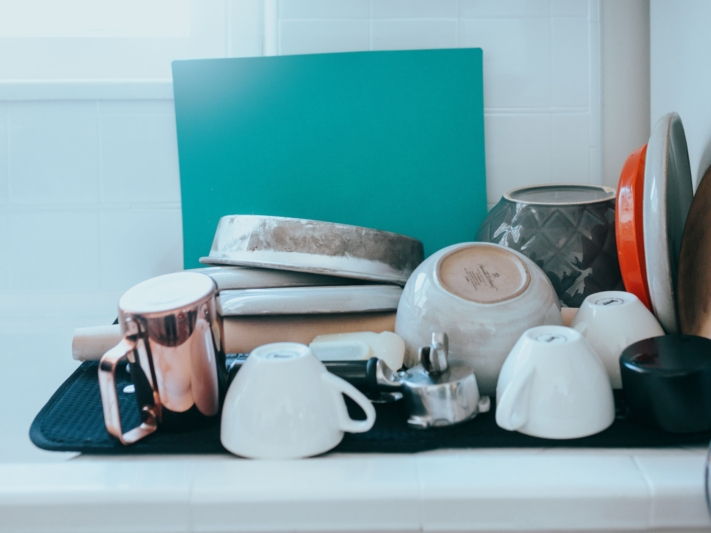
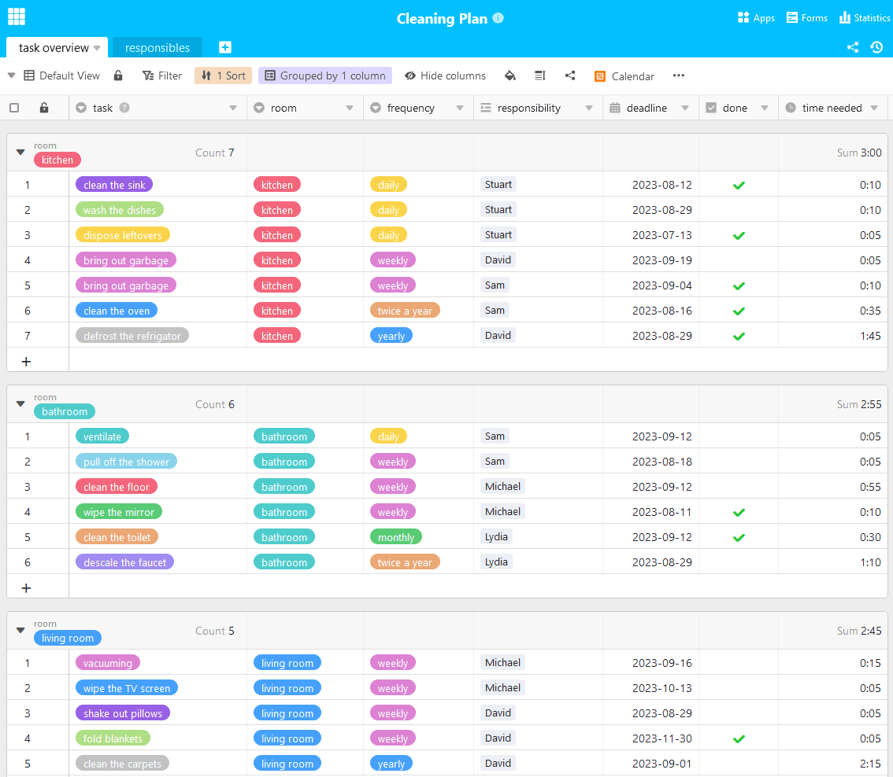

Wer mit mehreren Menschen unter einem Dach lebt, kennt es: Das dreckige Geschirr stapelt sich im Waschbecken, der Duschabfluss ist verstopft und eigentlich müsste man mal wieder staubsaugen. Aber keiner fühlt sich zuständig und die lästige Arbeit bleibt liegen. Um dem Chaos ein Ende zu bereiten, ist ein individueller Putzplan für Ihren Haushalt die Lösung. Hier erfahren Sie alles, was Sie für die Erstellung Ihres Reinigungsplans wissen müssen.

## Warum sich ein Putzplan lohnt

Wohnen viele Personen in einem Haushalt, kommt es unweigerlich zu Meinungsverschiedenheiten. Das bleibt auch beim Thema **Sauberkeit** nicht aus. Nicht jeder ist der Meinung, dass er sein Geschirr sofort spülen muss oder dass regelmäßiges Putzen im Bad notwendig ist.

Dreckiges Geschirr sammelt sich schnell an, wenn Uneinigkeit über die Sauberkeit herrscht.

Daher hilft es, sich zusammenzusetzen und einen gemeinsamen Plan zu erstellen, mit dem am Ende jeder zufrieden ist. Ziehen alle an einem Strang, sind die anfallenden Aufgaben schnell gelöst und man fühlt sich in den eigenen vier Wänden direkt wohler. Der Putzplan teilt die Aufgaben verpflichtend zu, gilt aber natürlich nicht für alle Ewigkeit. Ist jemand nicht zufrieden, sollten Sie den Plan anpassen und weiterentwickeln.

## Was gehört in einen Putzplan?

Nun geht es ans Eingemachte: Sie und Ihre Mitbewohner möchten einen Putzplan erstellen, wissen aber nicht, wo Sie anfangen sollen? Zunächst einmal: Jeder Plan sollte **individuell** auf den Haushalt abgestimmt sein. Stellen Sie sich daher zunächst folgende Fragen:

Ein erster Überblick über anstehende Aufgaben

## Was ist in welchem Raum zu tun?

Um einen groben Überblick über die anfallenden Aufgaben zu erhalten, ist es hilfreich, diese nach Räumen aufzuteilen. Dabei fallen in allen Zimmern grundlegende Aufgaben wie Staubsaugen, den Boden putzen, den Müll rausbringen, Schränke abstauben oder Aufräumen an. Für spezifische Aufgaben in den einzelnen Räumen könnte ein möglicher Putzplan so aussehen:

- **Bad:** Toilette reinigen, Spiegel abwischen, Wasserhahn entkalken, Dusche abziehen, ordentlich lüften
- **Küche:** Arbeitsfläche sauber halten, Essensreste entsorgen, Geschirr spülen, Spülbecken säubern, Backofen reinigen, Kühlschrank und Gefrierschrank abtauen und reinigen
- **Wohnzimmer:** Fernseher abwischen, Kissen ausschütteln, Decken falten
- **Flur:** Kommode aufräumen, Kleiderständer ordentlich halten, Spiegel reinigen
- **Schlafzimmer:** Bett frischmachen, Kleiderschrank aufräumen, Wäsche waschen (hierfür ist meist jeder selbst zuständig)

{{< warning headline="Gut zu wissen: Woher der lästige Staub stammt" text="Immer wiederkehrender Hausstaub kann manch einen in den Wahnsinn treiben oder gar Allergien auslösen. Er besteht aus winzigen Teilchen, die aus unterschiedlichen Quellen stammen. So gelangen beim Lüften kleine Partikel (z. B. Pollen, Sand, Ruß) in die Wohnung, von den Schuhen fällt Schmutz ab, Kleidung und Polster verlieren mikroskopische Fasern, Menschen und Haustiere verlieren Hautschuppen und Haare, Krümel fallen auf den Boden, Insekten wie Milben hinterlassen Ausscheidungen und zerfallen nach ihrem Tod selbst zu Staub. Vermeiden lässt sich die Entstehung von Hausstaub also leider nicht, Sie können diesen aber durch einen Putzplan reduzieren." />}}

## Wie oft muss was erledigt werden?

In welchen zeitlichen Abständen bestimmte Aufgaben zu erledigen sind, hängt davon ab, wie gründlich diese bearbeitet werden. Gibt sich jemand bei einer Aufgabe im Putzplan keine Mühe, muss diese öfter durchgeführt werden, um das gleiche Ergebnis zu erzielen. Trotzdem haben wir für Sie einen Leitfaden, welche Aufgaben bei gründlicher Bearbeitung wie oft anstehen:

Diese Aufgaben kommen in regelmäßigen Abständen auf Sie zu.

## Aufgaben gerecht verteilen

Entscheiden Sie gemeinsam, wer welche Aufgaben übernimmt. Beachten Sie dabei die Tagesabläufe aller Bewohner. Wie viel Zeit können Sie täglich für die Sauberkeit im Haushalt aufbringen? Für die Aufgabenverteilung gibt es verschiedene Ansätze: Fragen Sie nach den **Vorlieben** jedes Einzelnen. Manche kümmern sich gerne um den Abwasch, während andere nichts dagegen haben, den Müll rauszubringen. Im besten Fall sind so bereits alle Aufgaben verteilt.

Sollte das nicht der Fall sein, ist eine weitere Möglichkeit, die Aufgaben zu **rotieren**. Dabei wird die Zuständigkeit wöchentlich gewechselt. Dies ist meist besonders effektiv, da der Arbeitsaufwand nach einem Durchlauf für alle ungefähr gleich ist und jeder für alles schon einmal die Verantwortung übernommen hat. Jedoch dauert es länger, bis eine gewisse Routine in den Alltag kommt.

Teamwork ist das A und O für einen erfolgreichen Putzplan.

Um auch [Putzmuffel](https://www.stuttgarter-zeitung.de/inhalt.putztipps-fuer-faule-mhsd.c745ba0a-445a-4ced-962a-27efccd135af.html) von Ihrem Plan zu überzeugen, ist eine **kreative Lösung** für die Aufgabenverteilung der Schlüssel zum Erfolg. Sie können zum Beispiel jede Woche auslosen, wer welche Tätigkeit übernimmt. Oder Sie entwickeln ein Punktesystem, in dem jede erledigte Aktion Punkte bringt und jeder von Ihnen eine Mindestpunktzahl erreichen muss. Das macht Spaß und fördert eine gute Stimmung.

## Bleiben Sie motiviert

Die Aufgaben sind verteilt, aber keiner macht, was er sollte? Dann liegt es vielleicht am **Motivationsmangel**. Kein Wunder, denn Putzen gehört bei vielen nicht gerade zu ihren Lieblingsbeschäftigungen. Um den Putzplan dennoch am Laufen zu halten, kann es helfen, den richtigen Ansporn zu finden. Verbinden Sie das lästige Saubermachen mit Musik hören oder Serien schauen.

Mit ein bisschen Spaß beim Putzen geht alles direkt viel leichter.

Achten Sie aber darauf, dass Sie sich nicht zu sehr ablenken lassen – das Putzen sollte immer noch Ihre Hauptbeschäftigung sein. Oder nutzen Sie die Anwesenheit Ihrer Mitbewohner und erledigen Sie besonders anstrengende Aufgaben gemeinsam. Eine andere Möglichkeit ist, das Ganze spielerisch zu betrachten. Beispielsweise können Sie Belohnungen oder Strafen einführen, um Ihre Mitbewohner zu Höchstleistungen anzutreiben.

## Online-Putzplan

Bei der Hausarbeit gibt es viel zu planen, besonders wenn Sie mehrere Personen in die Aufgaben einbinden möchten. Um dabei nicht den Überblick zu verlieren, hat das Team von SeaTable Ihnen eine Putzplan-Vorlage erstellt. Diese können Sie nach Belieben an Ihre Bedürfnisse anpassen. Indem Sie Aufgaben klar einem Verantwortlichen zuteilen, sehen Sie beispielsweise auf einen Blick, welche Aufgaben Sie und Ihre Mitbewohner zu erledigen haben und ob diese gerecht verteilt sind.

Wenn Sie SeaTable für die Erstellung Ihres individuellen Putzplans nutzen möchten, [registrieren]() Sie sich einfach kostenlos. Die entsprechende Vorlage finden Sie [hier]().
