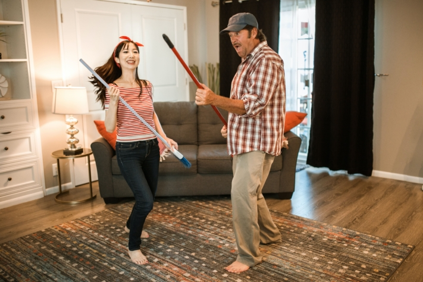

Anyone who lives with several people under one roof knows the situation: dirty dishes are piling up in the sink, the shower drain is clogged, and you really should vacuum again. But no one feels responsible and the annoying work remains undone. To put an end to the chaos, an individual cleaning plan for your household is the solution. Here you can find out everything you need to know to create your cleaning plan.

## Why a cleaning plan is worthwhile

When many people live in a household, disagreements inevitably arise. This is also true when it comes to **cleanliness**. Not everyone thinks that they have to wash their dishes immediately or that regular cleaning in the bathroom is necessary.

Dirty dishes accumulate quickly when there is disagreement about cleanliness.

Therefore, it helps to sit down together and create a joint plan, with which everyone is satisfied in the end. If everyone pulls together, the tasks are quickly solved and you feel directly more comfortable in your own four walls. The cleaning plan allocates the tasks obligatory, but of course does not apply for all eternity. If someone is not satisfied, you should adjust the plan and develop it further.

## What belongs in a cleaning plan?

Now it's down to the nitty-gritty: you and your housemates want to create a cleaning plan, but you don't know where to start? First of all, any plan should be **individual** to the household. Therefore, first ask yourself the following questions:

An initial overview of upcoming tasks

## What to do in which room?

To get a rough overview of the tasks that need to be done, it is helpful to divide them up by room. This involves basic tasks in all rooms, such as vacuuming, cleaning the floor, taking out the trash, dusting the closets, or tidying up. For specific tasks in each room, a possible cleaning schedule might look like this:

- **Bathroom:** clean the toilet, wipe the mirror, descale the faucet, pull the shower, ventilate properly.
- **Kitchen:** keep work surface clean, dispose of leftovers, wash dishes, clean sink, clean oven, defrost and clean refrigerator and freezer
- **Living room:** wipe TV, shake out pillows, fold blankets
- **Hallway:** clean up dresser, keep clothes rack neat, clean mirror
- **Bedroom:** making up the bed, tidying up the closet, doing the laundry (this is usually everyone's responsibility).

{{< warning headline="Good to know: Where the annoying dust comes from" text="Recurring house dust can drive some people crazy or even trigger allergies. It consists of tiny particles that come from different sources. Small particles (e.g. pollen, sand, soot) enter the home when airing, dirt falls off shoes, clothing and upholstery lose microscopic fibers, people and pets shed dander and hair, crumbs fall on the floor, insects such as mites leave behind excretions and decompose into dust themselves after their death. So, unfortunately, the formation of house dust can not be avoided, but you can reduce it with a cleaning schedule." />}}

## How often does what need to be done?

The time intervals at which certain tasks are to be completed depend on how thoroughly they are worked on. If someone does not put any effort into a task in the cleaning schedule, it will have to be done more often to achieve the same result. Nevertheless, we have a guideline for you, which tasks are due how often if they are worked on thoroughly:

These tasks will come your way at regular intervals.

## Distribute tasks fairly

Decide together who will take on which tasks. Take into account the daily routines of all residents. How much time can you devote to household cleanliness each day? There are different approaches for the distribution of tasks: Ask about each individual's **preferences**. Some like to take care of the dishes, while others don't mind taking out the trash. In the best case, all tasks are already distributed this way.

If this is not the case, another option is to **rotate** the tasks. In this case, the responsibility is changed on a weekly basis. This is usually particularly effective, since the workload is roughly the same for everyone after a run-through and everyone has already taken responsibility for everything once. However, it takes longer until a certain routine is established in the daily routine.

Teamwork is the key to a successful cleaning schedule.

In order to convince even [cleaning grouches](https://www.stuttgarter-zeitung.de/inhalt.putztipps-fuer-faule-mhsd.c745ba0a-445a-4ced-962a-27efccd135af.html) of your plan, a **creative solution** for the distribution of tasks is the key to success. For example, you can draw lots each week to see who takes on which activity. Or you can develop a point system in which each completed action earns points and each of you has to achieve a minimum number of points. This is fun and promotes a good atmosphere.

## Stay motivated

The tasks are distributed, but no one does what they should? Then perhaps it's due to a **lack of motivation**. No wonder, because cleaning is not exactly one of many people's favorite activities. To keep the cleaning schedule going anyway, it can help to find the right incentive. Combine the tedious cleaning with listening to music or watching series.

With a little fun cleaning everything goes directly much easier.

But make sure you don't get too distracted - cleaning should still be your main occupation. Or take advantage of your roommates' presence and do particularly strenuous tasks together. Another option is to take a playful approach to the whole thing. For example, you can introduce rewards or punishments to push your roommates to do their best.

## Online cleaning schedule

There is a lot to plan when it comes to housework, especially if you want to involve several people in the tasks. In order not to lose track of everything, the SeaTable team has created a cleaning schedule template for you. You can customize this to your liking. For example, by clearly assigning tasks to a responsible person, you can see at a glance which tasks you and your roommates have to do and whether they are distributed fairly.

If you want to use SeaTable to create your individual cleaning plan, just [register]() for free. You can find the corresponding template [here](https://seatable.io/en/vorlage/a5nogkchqiifwjettvs4ha/).
