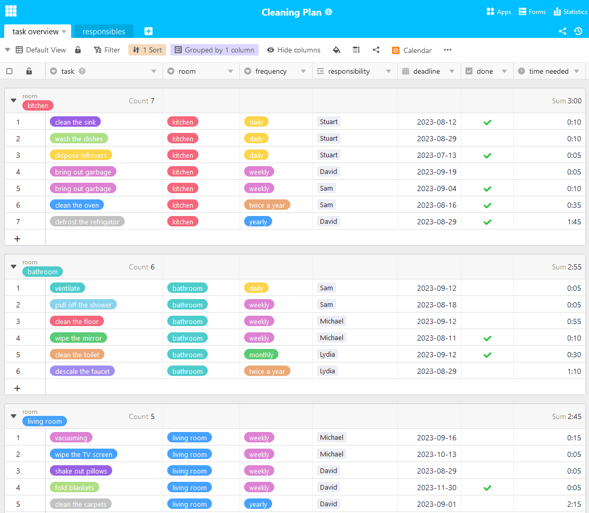

Quiconque vit à plusieurs sous le même toit connaît cette situation : la vaisselle sale s'empile dans l'évier, l'écoulement de la douche est bouché et il faudrait en fait passer l'aspirateur. Mais personne ne se sent responsable et la tâche fastidieuse reste en suspens. Pour mettre fin au chaos, un plan de nettoyage individuel pour votre ménage est la solution. Découvrez ici tout ce que vous devez savoir pour établir votre plan de nettoyage.

## Pourquoi un plan de nettoyage vaut-il la peine ?

Lorsque de nombreuses personnes vivent dans un même foyer, des divergences d'opinion apparaissent inévitablement. Cela n'échappe pas au thème de **la propreté**. Tout le monde n'est pas d'accord pour dire qu'il faut laver immédiatement sa vaisselle ou qu'il est nécessaire de nettoyer régulièrement la salle de bains.

La vaisselle sale s'accumule rapidement lorsqu'il y a un désaccord sur la propreté.

Il est donc utile de se réunir et d'établir un plan commun qui satisfasse tout le monde. Si tout le monde tire à la même corde, les tâches à accomplir sont rapidement résolues et l'on se sent tout de suite mieux entre ses quatre murs. Le plan de nettoyage répartit les tâches de manière obligatoire, mais n'est bien sûr pas valable pour l'éternité. Si quelqu'un n'est pas satisfait, il convient d'adapter le plan et de le développer.

## Que doit contenir un plan de nettoyage ?

Il est temps de passer aux choses sérieuses : vous et vos colocataires souhaitez établir un plan de nettoyage, mais vous ne savez pas par où commencer ? Tout d'abord : chaque plan doit être adapté **individuellement** au ménage. Commencez donc par vous poser les questions suivantes :

Un premier aperçu des tâches à accomplir

## Que faut-il faire dans quelle salle ?

Pour avoir une vue d'ensemble des tâches à effectuer, il est utile de les répartir par pièce. Les tâches de base telles que passer l'aspirateur, nettoyer le sol, sortir les poubelles, dépoussiérer les armoires ou ranger sont à effectuer dans toutes les pièces. Pour les tâches spécifiques dans les différentes pièces, un plan de nettoyage possible pourrait ressembler à ceci :

- **Salle de bain :** nettoyer les toilettes, essuyer le miroir, détartrer le robinet, tirer la douche, aérer correctement
- **Cuisine :** garder le plan de travail propre, jeter les restes de nourriture, faire la vaisselle, nettoyer l'évier, nettoyer le four, dégivrer et nettoyer le réfrigérateur et le congélateur
- **Salon :** essuyer la télévision, secouer les coussins, plier les couvertures
- **Couloir :** ranger la commode, maintenir le portemanteau en ordre, nettoyer le miroir
- **Chambre à coucher :** faire le lit, ranger l'armoire, faire la lessive (chacun est généralement responsable de cela)

{{< warning headline="C'est bon à savoir : D'où vient la poussière gênante" text="La poussière domestique récurrente peut en rendre plus d'un fou ou même déclencher des allergies. Elle se compose de minuscules particules provenant de différentes sources. Ainsi, de petites particules (p. ex. pollen, sable, suie) pénètrent dans l'appartement en aérant, de la saleté tombe des chaussures, les vêtements et les rembourrages perdent des fibres microscopiques, les personnes et les animaux domestiques perdent des squames et des poils, des miettes tombent sur le sol, les insectes comme les acariens laissent des excréments et se décomposent eux-mêmes en poussière après leur mort. Il n'est donc malheureusement pas possible d'éviter la formation de poussière domestique, mais vous pouvez la réduire grâce à un plan de nettoyage." />}}

## À quelle fréquence les choses doivent-elles être faites ?

La fréquence à laquelle certaines tâches doivent être effectuées dépend de la rigueur avec laquelle elles sont effectuées. Si quelqu'un ne fait pas d'effort pour une tâche du plan de nettoyage, celle-ci doit être effectuée plus souvent pour obtenir le même résultat. Néanmoins, nous vous proposons un guide des tâches à effectuer et de leur fréquence si elles sont effectuées avec soin :

Ces tâches vous incombent à intervalles réguliers.

## Répartir les tâches de manière équitable

Décidez ensemble qui se charge de quelles tâches. Tenez compte du déroulement de la journée de tous les habitants. Combien de temps pouvez-vous consacrer chaque jour à la propreté du ménage ? Il existe différentes approches pour la répartition des tâches : Demandez quelles sont **les préférences** de chacun. Certains aiment s'occuper de la vaisselle, tandis que d'autres n'ont rien contre le fait de sortir les poubelles. Dans le meilleur des cas, toutes les tâches sont ainsi déjà réparties.

Si ce n'est pas le cas, une autre possibilité est de **faire tourner** les tâches. Les responsabilités sont alors changées chaque semaine. C'est généralement particulièrement efficace, car la charge de travail est à peu près la même pour tous après un passage et chacun a déjà assumé la responsabilité de tout au moins une fois. Cependant, il faut plus de temps pour qu'une certaine routine s'installe dans le quotidien.

Le travail d'équipe est essentiel à la réussite d'un plan de nettoyage.

Pour convaincre [les plus réticents de](https://www.stuttgarter-zeitung.de/inhalt.putztipps-fuer-faule-mhsd.c745ba0a-445a-4ced-962a-27efccd135af.html) votre plan de [nettoyage](https://www.stuttgarter-zeitung.de/inhalt.putztipps-fuer-faule-mhsd.c745ba0a-445a-4ced-962a-27efccd135af.html), une **solution créative** pour la répartition des tâches est la clé du succès. Vous pouvez par exemple tirer au sort chaque semaine qui se chargera de quelle activité. Ou bien vous pouvez développer un système de points dans lequel chaque action accomplie rapporte des points et chacun d'entre vous doit atteindre un nombre de points minimum. Cela est amusant et favorise une bonne ambiance.

## Restez motivé

Les tâches sont réparties, mais personne ne fait ce qu'il devrait faire ? Alors c'est peut-être dû à un **manque de motivation**. Ce n'est pas étonnant, car pour beaucoup, le nettoyage ne fait pas partie de leurs activités préférées. Pour maintenir malgré tout le plan de nettoyage à flot, il peut être utile de trouver la bonne motivation. Combinez la corvée de nettoyage avec l'écoute de musique ou le visionnage de séries.

Avec un peu de plaisir à nettoyer, tout devient directement beaucoup plus facile.

Veillez toutefois à ne pas vous laisser trop distraire - le nettoyage doit toujours être votre activité principale. Ou alors, profitez de la présence de vos colocataires pour effectuer ensemble les tâches particulièrement fatigantes. Une autre possibilité est d'envisager les choses de manière ludique. Par exemple, vous pouvez introduire des récompenses ou des punitions pour pousser vos colocataires à donner le meilleur d'eux-mêmes.

## Plan de nettoyage en ligne

Il y a beaucoup à planifier lors des tâches ménagères, surtout si vous souhaitez impliquer plusieurs personnes dans les tâches. Pour ne pas perdre la vue d'ensemble, l'équipe de SeaTable a créé un modèle de plan de nettoyage. Vous pouvez l'adapter à vos besoins comme bon vous semble. En attribuant clairement les tâches à un responsable, vous pouvez par exemple voir d'un coup d'œil quelles tâches vous et vos colocataires devez effectuer et si elles sont réparties équitablement.

Si vous souhaitez utiliser SeaTable pour créer votre plan de nettoyage personnalisé, il vous suffit de [vous inscrire]() gratuitement. Vous trouverez le modèle correspondant [ici]().
