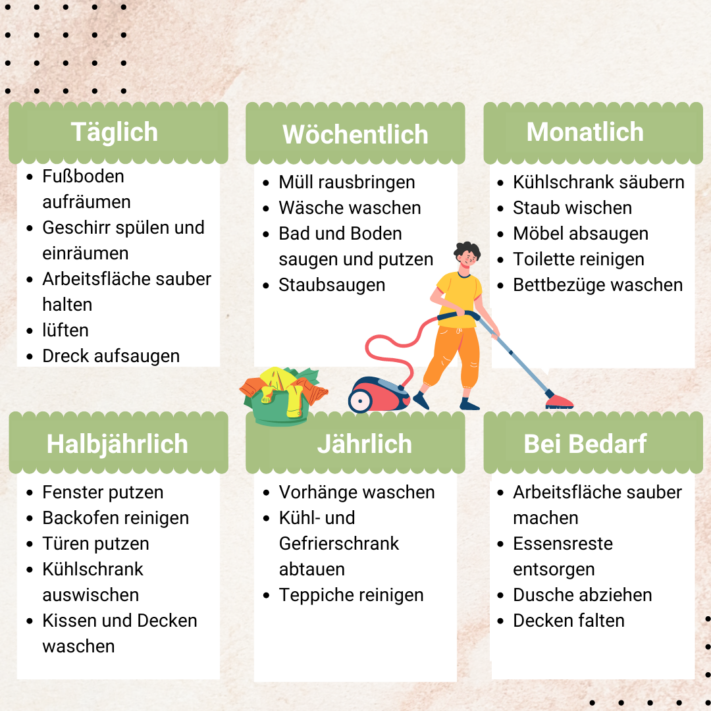
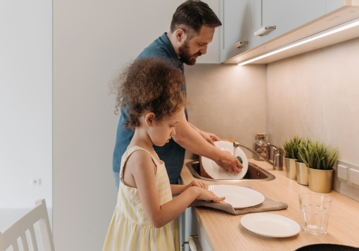
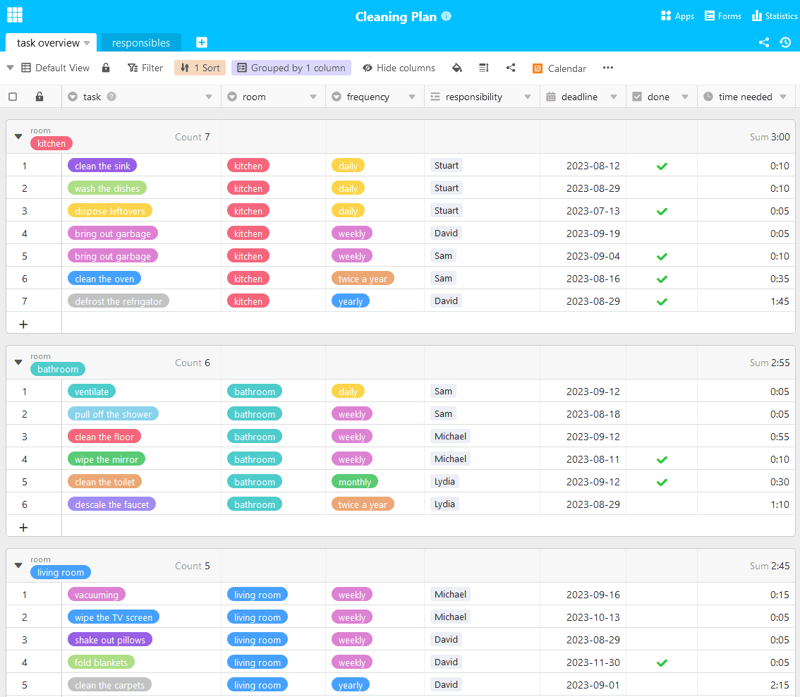

Qualquer pessoa que viva com várias pessoas debaixo do mesmo teto conhece a situação: a loiça suja acumula-se no lava-loiça, o ralo do chuveiro está entupido e é preciso passar o aspirador outra vez. Mas ninguém se sente responsável e o trabalho incómodo continua por fazer. Para pôr fim ao caos, um plano de limpeza individual para a sua casa é a solução. Aqui pode encontrar tudo o que precisa de saber para criar o seu plano de limpeza.

## Porque é que um plano de limpeza vale a pena

Quando muitas pessoas vivem numa casa, é inevitável que surjam desacordos. Isto também é verdade no que diz respeito à **limpeza**. Nem todas as pessoas são da opinião de que têm de lavar a loiça imediatamente ou que é necessária uma limpeza regular da casa de banho.

A louça suja acumula-se rapidamente quando há desacordo sobre a limpeza.

É por isso que é útil sentar-se em conjunto e elaborar um plano comum com o qual todos fiquem satisfeitos no final. Se todos colaborarem, as tarefas serão rapidamente resolvidas e sentir-se-á mais confortável nas suas próprias quatro paredes. O plano de limpeza atribui obrigatoriamente as tarefas, mas é claro que não se aplica a toda a eternidade. Se alguém não ficar satisfeito, deve adaptar o plano e desenvolvê-lo mais.

## O que deve constar de um plano de limpeza?

Agora vamos ao que interessa: você e os seus colegas de casa querem criar um plano de limpeza, mas não sabem por onde começar? Antes de mais: cada plano deve ser adaptado **individualmente** ao agregado familiar. Por isso, comece por colocar a si próprio as seguintes questões:

Uma primeira visão geral das tarefas futuras

## O que deve ser feito em que sala?

Para ter uma visão geral das tarefas que têm de ser feitas, é útil dividi-las por divisão. As tarefas básicas, como aspirar, limpar o chão, deitar fora o lixo, limpar o pó dos armários ou arrumar a casa, são feitas em todas as divisões. Para tarefas específicas nas divisões individuais, um possível plano de limpeza poderia ser o seguinte:

- **Casa de banho:** limpar a sanita, limpar o espelho, descalcificar a torneira, esvaziar o chuveiro, ventilar corretamente.
- **Cozinha:** Manter a superfície de trabalho limpa, deitar fora os restos, lavar a louça, limpar o lava-loiça, limpar o forno, descongelar e limpar o frigorífico e o congelador.
- **Sala de estar:** limpar o televisor, sacudir as almofadas, dobrar os cobertores.
- **Corredor:** arrumar a cómoda, manter o cabide arrumado, limpar o espelho.
- **Quarto:** fazer a cama, arrumar o guarda-roupa, lavar a roupa (normalmente é da responsabilidade de todos)

{{< warning headline="É bom saber: De onde vem o pó irritante" text="O pó doméstico recorrente pode levar algumas pessoas à loucura ou mesmo provocar alergias. É constituído por partículas minúsculas provenientes de diferentes fontes. Pequenas partículas (p. ex., pólen, areia, fuligem) entram em casa ao arejar, a sujidade cai dos sapatos, o vestuário e os estofos perdem fibras microscópicas, as pessoas e os animais de estimação largam pêlos e cabelos, caem migalhas no chão, os insectos, como os ácaros, deixam excreções e decompõem-se em pó após a sua morte. Infelizmente, a formação de pó doméstico não pode ser evitada, mas é possível reduzi-la com um plano de limpeza." />}}

## Com que frequência é que o que tem de ser feito?

Os intervalos em que determinadas tarefas devem ser concluídas dependem do grau de pormenor com que são trabalhadas. Se alguém não se esforçar numa tarefa do plano de limpeza, esta terá de ser realizada mais vezes para obter o mesmo resultado. No entanto, temos uma orientação para si sobre quais as tarefas que devem ser executadas e com que frequência, se forem feitas com cuidado:

Estas tarefas surgem a intervalos regulares.

## Distribuir as tarefas de forma equitativa

Decidir em conjunto quem vai assumir que tarefas. Tenha em conta as rotinas diárias de todos os residentes. Quanto tempo pode dedicar diariamente à limpeza da casa? Existem diferentes abordagens para a distribuição das tarefas: Pergunte quais são as **preferências de** cada pessoa. Alguns gostam de lavar a loiça, enquanto outros não se importam de deitar o lixo fora. Na melhor das hipóteses, todas as tarefas já estão distribuídas.

Se não for esse o caso, outra possibilidade é a **rotação** das tarefas. Neste caso, a responsabilidade é alterada numa base semanal. Normalmente, isto é particularmente eficaz porque a carga de trabalho é praticamente a mesma para todos após um ciclo e todos já assumiram a responsabilidade por tudo. No entanto, demora mais tempo até que uma certa rotina seja estabelecida no quotidiano.

O trabalho de equipa é a chave para um plano de limpeza bem sucedido.

Para convencer [do](https://www.stuttgarter-zeitung.de/inhalt.putztipps-fuer-faule-mhsd.c745ba0a-445a-4ced-962a-27efccd135af.html) seu plano até mesmo [os cabeças de vento da limpeza](https://www.stuttgarter-zeitung.de/inhalt.putztipps-fuer-faule-mhsd.c745ba0a-445a-4ced-962a-27efccd135af.html), uma **solução criativa** para a distribuição das tarefas é a chave do sucesso. Por exemplo, pode tirar à sorte todas as semanas para ver quem assume que atividade. Ou pode desenvolver um sistema de pontos em que cada ação concluída ganha pontos e cada um de vós tem de atingir um número mínimo de pontos. Isto é divertido e promove um bom ambiente.

## Manter-se motivado

As tarefas estão distribuídas, mas ninguém faz o que deve? Então, talvez seja devido a uma **falta de motivação**. Não é de admirar, porque a limpeza não é uma das actividades favoritas de muitas pessoas. No entanto, para manter o horário das limpezas, pode ser útil encontrar o incentivo certo. Combine a limpeza aborrecida com ouvir música ou ver séries.

Com um pouco de diversão na limpeza, tudo se torna muito mais fácil de imediato.

Mas não se distraia demasiado - a limpeza deve continuar a ser a sua principal ocupação. Ou aproveite a presença dos seus colegas de casa e façam juntos as tarefas mais exigentes. Outra opção é adotar uma abordagem lúdica a tudo isto. Por exemplo, pode introduzir recompensas ou castigos para incentivar os seus colegas de casa a darem o seu melhor.

## Calendário de limpeza online

Há muito para planear quando se trata de tarefas domésticas, especialmente se quiser envolver várias pessoas nas tarefas. Para não perder a visão geral, a equipa SeaTable criou um modelo de plano de limpeza para si. Pode adaptá-lo às suas necessidades como desejar. Por exemplo, ao atribuir claramente as tarefas a uma pessoa responsável, pode ver num relance quais as tarefas que você e os seus colegas de casa têm de fazer e se estão distribuídas de forma justa.

Se pretender utilizar o SeaTable para criar o seu plano de limpeza individual, basta [registar-se]() gratuitamente. Pode encontrar o modelo correspondente [aqui]().
