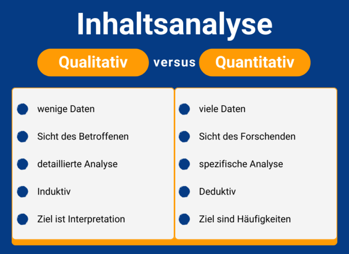
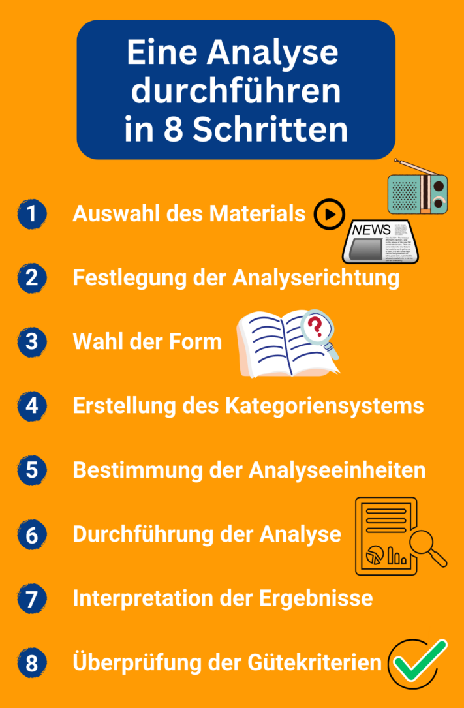
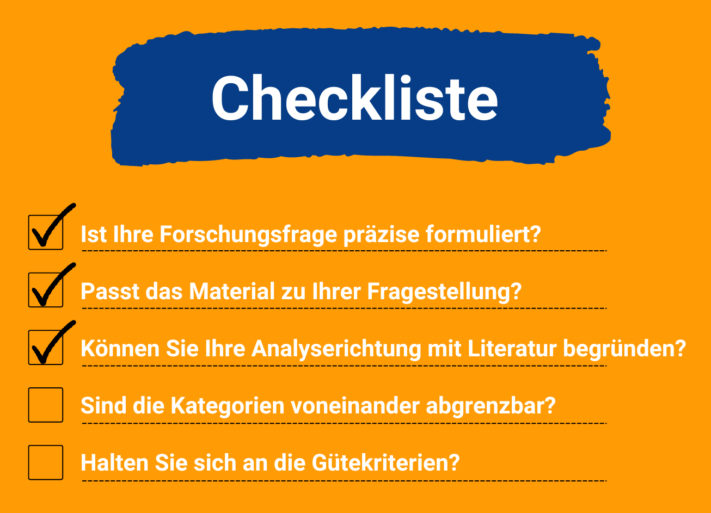

Whether in research or in the working world: **qualitative content analysis** helps you to evaluate data material in a structured way. In this article, you will learn how best to proceed and what you should pay attention to. Subsequently, the implementation of a content analysis is also illustrated using a **press review**.

## What is qualitative content analysis according to Mayring?

Qualitative content analysis is a scientific method of empirical social research. You can use it to categorize, evaluate and interpret various materials such as **interviews**, **newspaper articles**, **radio reports** or **videos**.

How exactly you should design the content analysis depends on the results you want to achieve with your research question.



## Qualitative vs. quantitative content analysis

Basically, there is a **qualitative** and a **quantitative approach** to content analysis. You can decide which of the two methods you should use for your project based on the following criteria:

In qualitative content analysis, you focus on a **small amount** of content that you subject to in-depth analysis. Here it also depends on what you hear, for example, in interviews between the rows . Accordingly, you work **inductively**, i.e. you carry out your own observations and derive a new hypothesis from them. The aim is to understand and **interpret** the results and develop new theoretical approaches on this basis.

Quantitative content analysis is the counterpart to this. It is a standardized procedure in which the researcher always keeps the research conditions constant. Here you draw on a **large amount of content**, which you subject to a specific analysis. The procedure is **deductive**, as you want to examine existing theories and substantiate them with data. The aim of the analysis is to identify, describe and **explain** statistical **frequencies**.

## When is qualitative content analysis a suitable method?

If you want to clarify a scientific question using a small amount of non-standardized data, this method is the right one for you. It involves **collecting opinions or attitudes** that you can interpret at the end of your analysis.

You can also use content analysis to collect important data in your day-to-day work. In the course of this article, you will learn how to do this by creating a [press review](https://de.wikipedia.org/wiki/Pressespiegel).

## Procedure of the qualitative content analysis

At first glance, qualitative content analysis may seem very complex. However, if you look at it in its individual steps, it is easier to understand. In the following, the basic procedure of a qualitative content analysis is explained in eight steps and with the help of examples.

These instructions will help you to do this.

### Before it starts

Before you start your analysis, you need to define what you want to find out with the help of a [research question](https://de.wikipedia.org/wiki/Forschungsfrage). You should formulate this as precisely as possible. Example:

> _What was the tone of reporting on SeaTable in the journalistic media?_

## 1\. selection of the material

To begin with, you need the appropriate **material** with the most important associated information. You select this according to whether it fits your research question.

1. Examples of possible sources are
    - **Visual media:** newspapers, online articles, books
    - **Audio media:** radio reports, podcasts, songs
    - **Audiovisual media:** videos, films, television shows
2. Now take a closer look at **how the material was created** and explain the conditions under which it was created. This varies greatly depending on the type of data you have chosen.
3. Finally, take a look at the **formal characteristics** of your media and determine the form. Visual media are in written text form.

> _The sources for our press review are **online articles** that have been published in journalistic media from its foundation in July 2020 to the present day. The material is available in **written text form**._

## 2\. determination of the direction of analysis

The direction your analysis should take depends on your research question. Possible directions for your qualitative content analysis are

- Source (contents of the medium)
- Author of the source
- Target group of the source
- Object area (the general topic dealt with in the source)

If your project is a scientific paper, you must be able to **explain** your **research question in a well-founded manner**. To do this, you should link it to existing theories and the current state of research.

Look for suitable literature to substantiate your approach.

> _When looking at the articles about the company SeaTable, the **content of the text** is analyzed. The aim is to find out **how** the sources report on the company._

## 3\. choice of form

The form of your qualitative content analysis determines how much material you examine and in what level of detail. You can choose from three approaches:

- **Summarizing content analysis**: The material is shortened to the information most relevant to the research question.
- **Explicative content analysis**: incomprehensible text passages are explained with additional material.
- **Structuring content analysis**: There is a [coding guide](https://www.acad-write.com/ratgeber/tipps/erstellung-codierleitfaden/) in which you determine how the material is to be classified into topic-related categories.



> _Based on some of the articles that report on SeaTable, different categories are defined for the **tonality**. For example, words such as "user-friendly" and "important" are used in an article, from which the category of **positive reporting** can be formed._

## 4\. creation of the category system

You record the categories you want to use to classify your material in a **category system**. You have two possible approaches to choose from to develop this:

- **deductive approach**: You use an existing category system that has already proven its worth.
- **Inductive approach**: As shown above, you can logically derive categories from your own data.

It is important that you formulate each category clearly so that it can be clearly differentiated from other categories and there is no confusion in the classification.

> _The online articles on SeaTable are to be rated according to certain categories. To this end, we are developing a coding guide in which we define and explain the categories. The procedure is **inductive**, as we derive the categories logically from the material. This resulted in the following **categories**: positive tonality, neutral tonality, ambivalent tonality and negative tonality._

## 5\. determination of the units of analysis

Before you can carry out your qualitative content analysis, you need to define the units of analysis. These determine what you will later code, i.e. classify into categories.

Articles can be easily divided into units thanks to their structure.

1. **Evaluation unit**: Determines which materials you code one after the other.

> _We look at articles from 20 different media. Each of these **articles** is an evaluation unit._

3. **Coding unit**: Determines which is the smallest possible component to be coded.

> _The articles start with a short **teaser** as an introductory text. This forms the coding unit._

5. **Context unit**: Determines what the largest possible component is that is coded.

> _The article can be viewed **as a whole**. This means that the context unit is congruent with the evaluation unit._

## 6\. carrying out the analysis

Now it's time for the most important and time-consuming part of the qualitative content analysis. You **code** your material and assign it to the appropriate **categories**. You can do this by hand using a coding sheet or you can use a digital database such as SeaTable.



> _**Result of the analysis:** Most online articles about SeaTable can be categorized as "positive tonality" or "neutral tonality"._

## 7\. interpretation of the results

You can now compile and interpret your results. Refer back to your original question and answer it.

> _Since most of the articles can be assigned to the "positive tonality" or "neutral tonality" category, it can be concluded that SeaTable has a rather positive image and offers a product that usually performs well in tests._

## 8\. review of the quality criteria

Finally, check whether your analysis meets the quality criteria of qualitative content analysis.



Your research must be **comprehensible** to outsiders. Explain how and why you proceeded in each step of your analysis.




Make sure that your analysis shows similar results when repeated across different coders, i.e. that it is **reproducible**.




How reliable is the coding? Is the same content rated equally and are differences expressed appropriately in different values?


## Checklist for your qualitative content analysis

To ensure that your content analysis runs smoothly, here are the most important questions you should ask yourself.

The checklist helps you to keep an eye on the most important points of your analysis.

## Online template for your content analysis

A lot of material and information can come together in a content analysis. That's why you should rely on a digital solution instead of laboriously entering data into coding sheets and evaluating it manually. The SeaTable team has developed a template in the form of a **press review** to make qualitative content analysis easier for you.

Especially if you work with several coders, a **collaboration platform** like SeaTable has unbeatable advantages. You can store all materials centrally in a database and have them coded by giving each coder an individually filtered view. You can also easily evaluate the coded data and visualize it as clear statistics.

If you would like to use SeaTable for your content analysis, simply [register]() free of charge. You can find the template [here](https://seatable.io/en/vorlage/jaw90r-mtsgxsep3vkfd4q/).
