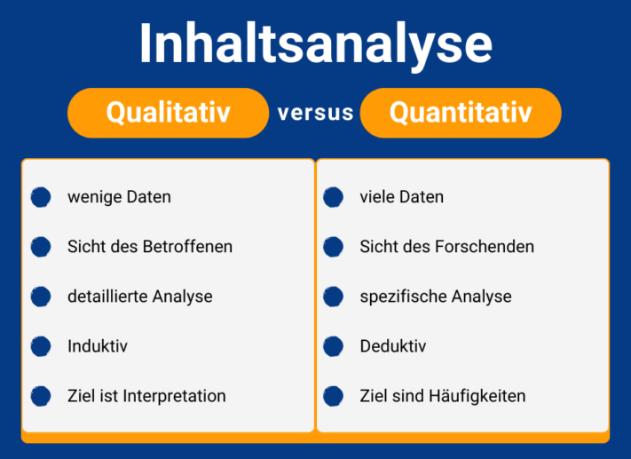
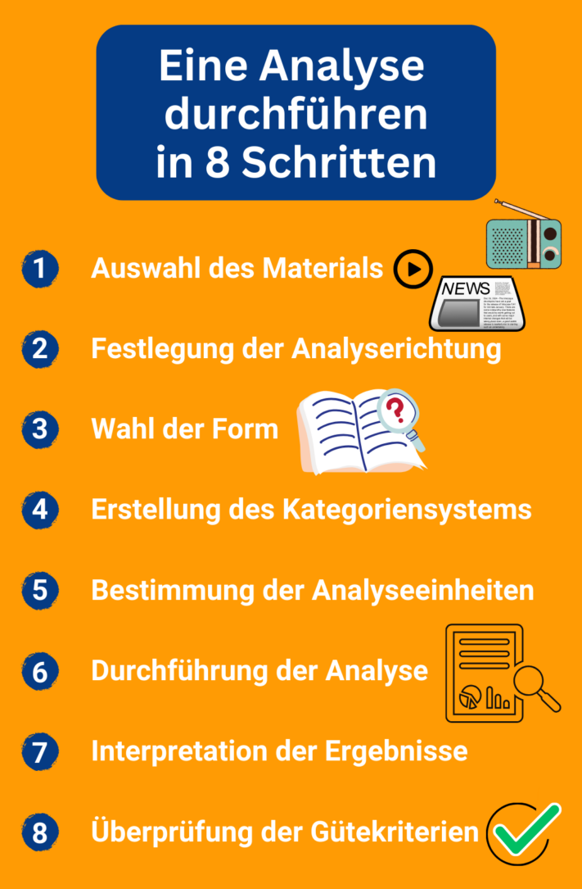

Ya sea en la investigación o en el mundo laboral: el **análisis de contenido cualitativo** le ayuda a analizar el material de datos de forma estructurada. En este artículo aprenderá cuál es la mejor manera de proceder y a qué debe prestar atención. A continuación, también se ilustra la realización de un análisis de contenido mediante una **revista de** prensa.

## ¿Qué es el análisis de contenido cualitativo según Mayring?

El análisis cualitativo de contenidos es un método científico de investigación social empírica. Puede utilizarse para clasificar, evaluar e interpretar diversos materiales, como **entrevistas**, **artículos de prensa**, **reportajes radiofónicos** o **vídeos**.

El diseño exacto del análisis de contenido depende de los resultados que quiera obtener con su pregunta de investigación.



## Análisis de contenido cualitativo frente a cuantitativo

Básicamente, hay un **enfoque** **cualitativo** y otro **cuantitativo** del análisis de contenidos. Puede decidir cuál de los dos métodos debe utilizar para su proyecto en función de los siguientes criterios:

En el análisis de contenido cualitativo, uno se centra en una **pequeña cantidad** de contenido que analiza en profundidad. Aquí también depende de lo que escuche entre líneas en las entrevistas, por ejemplo. En consecuencia, se trabaja **de forma inductiva**, es decir, se llevan a cabo observaciones propias y se deducen nuevas hipótesis a partir de ellas. El objetivo es comprender e **interpretar** los resultados y desarrollar nuevos enfoques teóricos a partir de ellos.

El análisis de contenido cuantitativo es su contrapartida. Se trata de un procedimiento estandarizado en el que el investigador mantiene siempre constantes las condiciones de la investigación. En este caso se utiliza una **gran cantidad de contenido**, que se somete a un análisis específico. El procedimiento es **deductivo**, ya que se trata de analizar las teorías existentes y fundamentarlas con datos. El objetivo del análisis es reconocer, describir y **explicar** **frecuencias** estadísticas.

## ¿Cuándo es adecuado el análisis cualitativo de contenidos?

Si desea aclarar una cuestión científica utilizando una pequeña cantidad de datos no estandarizados, este método es el adecuado para usted. Consiste en **recoger opiniones o actitudes** que podrá interpretar al final de su análisis.

También puede utilizar el análisis de contenidos para recopilar datos importantes en su trabajo diario. A lo largo de este artículo, aprenderá cómo proceder creando una [revista de](https://de.wikipedia.org/wiki/Pressespiegel) prensa.

## Procedimiento del análisis de contenido cualitativo

A primera vista, el análisis cualitativo de contenidos puede parecer muy complejo. Sin embargo, si se observa en sus pasos individuales, resulta más fácil de entender. A continuación se explica el proceso básico de un análisis de contenido cualitativo en ocho pasos y con ayuda de ejemplos.

Estas instrucciones le ayudarán a hacerlo.

### Antes de empezar

Antes de iniciar su análisis, debe utilizar una [pregunta de investigación](https://de.wikipedia.org/wiki/Forschungsfrage) para determinar lo que quiere averiguar. Debe formularla con la mayor precisión posible. Por ejemplo:

> _¿Cuál fue el tono de la información sobre SeaTable en los medios periodísticos?_

## 1\. selección del material

Para empezar, necesita el **material** adecuado con la información relacionada más importante. Lo seleccionas en función de si se ajusta a tu pregunta de investigación.

1. Ejemplos de posibles fuentes
    - **Medios visuales:** periódicos, artículos en línea, libros
    - **Medios de audio:** programas de radio, podcasts, canciones
    - **Medios audiovisuales:** vídeos, películas, programas de televisión
2. A continuación, analice **cómo se** creó el material y explique las condiciones en las que se creó. Esto varía mucho en función del tipo de datos que hayas elegido.
3. Por último, fíjate en las **características formales** de tu medio y determina la forma. Los medios visuales son una forma de texto escrito.

> _Las fuentes de nuestra revista de prensa son **artículos en línea** publicados en medios periodísticos desde su fundación en julio de 2020 hasta la actualidad. El material está disponible en forma de **texto escrito**._

## 2\. determinación de la dirección del análisis

La orientación del análisis dependerá de la pregunta de investigación. Las posibles direcciones del análisis cualitativo de contenido son

- Fuente (contenido del soporte)
- Autor de la fuente
- Grupo destinatario de la fuente
- Área de objeto (el tema general tratado en la fuente)

Si tu proyecto es un artículo científico, debes ser capaz de **explicar** tu **pregunta de investigación de forma fundamentada**. Para ello, debes relacionarla con las teorías existentes y el estado actual de la investigación.

Busque bibliografía adecuada para fundamentar su planteamiento.

> _Al examinar los artículos sobre la empresa SeaTable, se analiza el **contenido del texto**. El objetivo es averiguar **cómo** informan las fuentes sobre la empresa._

## 3\. elección del molde

La forma de su análisis cualitativo de contenido determina cuánto material analizará y con qué nivel de detalle. Puede elegir entre tres enfoques:

- **Análisis resumido del contenido**: el material se reduce a la información más relevante para la pregunta de investigación.
- **Análisis de contenido explicativo**: los pasajes de texto incomprensibles se explican con material adicional.
- **Estructuración del análisis de contenido**: existe una [guía de codificación](https://www.acad-write.com/ratgeber/tipps/erstellung-codierleitfaden/) en la que se determina cómo debe clasificarse el material en categorías relacionadas con el tema.



> _A partir de algunos de los artículos que informan sobre SeaTable, se definen distintas categorías para la **tonalidad**. Por ejemplo, en un artículo se utilizan palabras como "fácil de usar" e "importante", a partir de las cuales se puede formar la categoría de **información positiva**._

## 4\. creación del sistema de categorías

Registre las categorías que desea utilizar para clasificar su material en un **sistema de categorías**. Puede elegir entre dos enfoques para desarrollarlo:

- **enfoque deductivo**: Se utiliza un sistema de categorías existente que ya ha demostrado su eficacia.
- **Enfoque inductivo**: Como se ha mostrado anteriormente, puede derivar lógicamente categorías a partir de sus propios datos.

Es importante que formule cada categoría con claridad para que pueda distinguirse claramente de las demás y no haya confusión al clasificarla.

> _Los artículos en línea de SeaTable deben clasificarse según determinadas categorías. Para ello elaboramos una guía de codificación en la que definimos y explicamos las categorías. El procedimiento es **inductivo**, ya que derivamos las categorías lógicamente del material. El resultado fueron las siguientes **categorías**: tonalidad positiva, tonalidad neutra, tonalidad ambivalente y tonalidad negativa._

## 5\. determinación de las unidades de análisis

Antes de llevar a cabo un análisis cualitativo del contenido, hay que definir las unidades de análisis. Éstas determinan lo que luego codificará, es decir, categorizará.

Los artículos pueden dividirse fácilmente en unidades gracias a su estructura.

1. **Unidad de evaluación**: determina los materiales que se codifican uno tras otro.

> _Analizamos artículos de 20 medios de comunicación diferentes. Cada uno de estos **artículos** es una unidad de análisis._

3. **Unidad de codificación**: determina cuál es el componente más pequeño posible que debe codificarse.

> _Los artículos comienzan con un breve **teaser** a modo de texto introductorio. Éste constituye la unidad de codificación._

5. **Unidad de contexto**: determina cuál es el mayor componente posible que se codifica.

> _El artículo puede verse **como un todo**. Esto significa que la unidad de contexto es congruente con la unidad de evaluación._

## 6\. realización del análisis

Ha llegado el momento de la parte más importante y laboriosa del análisis cualitativo de contenidos. Se **codifica** el material y se asigna a las **categorías** correspondientes. Puede hacerlo a mano con una hoja de codificación o con una base de datos digital como SeaTable.



> _**Resultado del análisis:** La mayoría de los artículos en línea sobre SeaTable pueden clasificarse en "tonalidad positiva" o "tonalidad neutra"._

## 7\. interpretación de los resultados

Ahora puedes resumir e interpretar tus resultados. Vuelve a la pregunta original y respóndela.

> _Dado que la mayoría de los artículos pueden clasificarse en "tonalidad positiva" o "tonalidad neutra", puede concluirse que SeaTable tiene una imagen bastante positiva y ofrece un producto que suele obtener buenos resultados en las pruebas._

## 8\. revisión de los criterios de calidad

Por último, compruebe si su análisis cumple los criterios de calidad del análisis de contenido cualitativo.



Su investigación debe ser **comprensible** para personas ajenas a la empresa. Explique cómo y por qué ha procedido en cada paso de su análisis.




Asegúrese de que su análisis arroja resultados similares cuando se repite entre distintos codificadores, es decir, que es **reproducible**.




¿Es fiable la codificación? ¿Se valora el mismo contenido por igual y las diferencias se expresan adecuadamente en valores diferentes?


## Lista de control para el análisis cualitativo de contenidos

Para que su análisis de contenidos funcione a la perfección, aquí tiene las preguntas más importantes que debe plantearse.

La lista de control le ayuda a no perder de vista los puntos más importantes de su análisis.

## Plantilla en línea para su análisis de contenidos

En el análisis de contenidos puede confluir mucho material e información. Por eso debe confiar en una solución digital en lugar de introducir laboriosamente los datos en hojas de codificación y analizarlos manualmente. El equipo de SeaTable ha desarrollado una plantilla en forma de **revista de** prensa para facilitarle el análisis cualitativo de contenidos.

Especialmente si trabaja con varios codificadores, una **plataforma de colaboración** como SeaTable tiene ventajas insuperables. Puede almacenar todos los materiales de forma centralizada en una base de datos y codificarlos ofreciendo a cada codificador una vista filtrada individualmente. También puede evaluar fácilmente los datos codificados y visualizarlos en forma de estadísticas claras.

Si desea utilizar SeaTable para su análisis de contenidos, sólo tiene que [registrarse]() gratuitamente. Encontrará la plantilla [aquí]().
