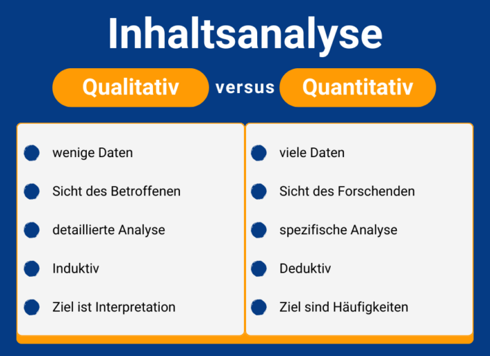

Que ce soit dans la recherche ou dans le monde du travail, une **analyse de contenu qualitative** vous aide à évaluer des données de manière structurée. Cet article vous explique comment procéder au mieux et ce à quoi vous devez faire attention. Ensuite, la réalisation d'une analyse de contenu est également mise en lumière à l'aide d'une **revue de presse**.

## Qu'est-ce que l'analyse qualitative de contenu selon Mayring ?

L'analyse de contenu qualitative est une méthode scientifique de recherche sociale empirique. Vous pouvez l'utiliser pour catégoriser, évaluer et rendre interprétable différents matériaux, comme par exemple des **interviews**, **des articles de journaux**, des **émissions de radio** ou **des vidéos**.

La manière exacte dont vous devez concevoir l'analyse de contenu dépend des résultats que vous souhaitez obtenir avec votre question de recherche.



## Analyse de contenu qualitative vs. quantitative

En principe, il existe une **approche** **qualitative** et une **approche quantitative** de l'analyse de contenu. Vous pouvez décider laquelle des deux méthodes vous devez utiliser pour votre projet en vous basant sur les critères suivants :

Dans l'analyse de contenu qualitative, vous vous concentrez sur un **petit nombre** de contenus que vous soumettez à une analyse approfondie. Ce qui compte ici, c'est ce que vous entendez entre les lignes, par exemple lors d'interviews. Vous travaillez en conséquence **de manière inductive**, c'est-à-dire que vous effectuez vos propres observations et en déduisez une nouvelle hypothèse. L'objectif est de comprendre et d'**interpréter** les résultats et de développer de nouvelles approches théoriques sur cette base.

L'analyse de contenu quantitative constitue le pendant de cette méthode. Il s'agit d'une méthode standardisée dans laquelle le chercheur maintient toujours les conditions d'analyse constantes. Vous recourez ici à un **grand nombre de contenus** que vous soumettez à une analyse spécifique. La démarche est ici **déductive**, car vous souhaitez examiner des théories déjà existantes et les étayer par des données. L'objectif de l'analyse est d'identifier, de décrire et d'**expliquer** des **fréquences** statistiques.

## Quand l'analyse qualitative de contenu est-elle une méthode appropriée ?

Si vous souhaitez clarifier une question scientifique en utilisant peu de données non standardisées, cette méthode est faite pour vous. Il s'agit de **recueillir des opinions ou des attitudes** que vous pourrez interpréter à la fin de votre analyse.

Dans le quotidien professionnel également, vous pouvez collecter des données importantes à l'aide d'une analyse de contenu. Vous apprendrez au cours de cet article comment procéder à l'aide de la création d'une [revue de presse](https://de.wikipedia.org/wiki/Pressespiegel).

## Déroulement de l'analyse de contenu qualitative

L'analyse qualitative de contenu peut paraître très complexe au premier abord. Cependant, si l'on considère les différentes étapes, il est plus facile de les comprendre. Le déroulement de base d'une analyse de contenu qualitative est expliqué ci-dessous en huit étapes et à l'aide d'exemples.

Ce guide vous aidera à le faire.

### Avant de commencer

Avant de commencer votre analyse, vous devez définir ce que vous souhaitez découvrir à l'aide d'une [question de recherche](https://de.wikipedia.org/wiki/Forschungsfrage). Vous devez la formuler le plus précisément possible. Exemple :

> _Quel ton a été utilisé dans les médias journalistiques pour parler de la société SeaTable ?_

## 1\. choix du matériel

Pour commencer, vous avez besoin du **matériel** adéquat avec les principales informations qui s'y rapportent. Vous les choisissez en fonction de leur adéquation avec votre question de recherche.

1. Voici quelques exemples de sources possibles :
    - **Médias visuels :** journaux, articles en ligne, livres
    - **Médias audio :** émissions de radio, podcasts, chansons
    - **Audiovisuel :** vidéos, films, émissions de télévision
2. Maintenant, vous examinez de plus près la **situation de création du matériel** et expliquez dans quelles conditions le matériel a été créé. Cela varie fortement en fonction du type de données que vous avez choisi.
3. Enfin, examinez également les **caractéristiques formelles** de vos médias et déterminez la forme. Les médias visuels se présentent sous la forme d'un texte écrit.

> _Les sources de notre revue de presse sont des **articles en ligne** publiés dans des médias journalistiques depuis sa création en juillet 2020 jusqu'à aujourd'hui. Le matériel est disponible sous forme **de texte écrit**._

## 2\. détermination de la direction de l'analyse

L'orientation de votre analyse dépend de votre question de recherche. Voici quelques directions possibles pour votre analyse de contenu qualitative :

- Source (contenu du média)
- Auteur de la source
- Cible de la source
- Domaine de l'objet (le thème général traité dans la source)

Si votre projet est un travail scientifique, vous devez pouvoir **expliquer** votre **question de recherche de manière fondée**. Pour cela, vous devez la relier aux théories existantes et à l'état actuel de la recherche.

Recherchez la littérature appropriée pour justifier votre démarche de manière fondée.

> _En examinant les articles sur l'entreprise SeaTable, nous analysons le **contenu du texte**. Il s'agit de déterminer **comment** les sources parlent de l'entreprise._

## 3\. choix de la forme

La forme de votre analyse de contenu qualitative détermine la quantité de matériel que vous examinez et le niveau de détail. Vous avez le choix entre trois approches :

- **Analyse de contenu synthétique**: le matériel est réduit aux informations les plus pertinentes pour la question de recherche.
- **Analyse de contenu explicative**: les passages incompréhensibles sont expliqués à l'aide de matériel supplémentaire.
- **Analyse de contenu structurante**: il existe un [guide de codage](https://www.acad-write.com/ratgeber/tipps/erstellung-codierleitfaden/) dans lequel vous définissez comment le matériel doit être classé dans des catégories thématiques.



> _En se basant sur quelques articles qui parlent de SeaTable, différentes catégories de **tonalité** sont définies. Par exemple, un article utilise des mots tels que "convivial" et "important", ce qui permet de créer une catégorie de **rapports positifs**._

## 4\. création du système de catégories

Les catégories que vous souhaitez utiliser pour classer votre matériel doivent être consignées dans un **système de catégories**. Pour élaborer ce système, vous avez le choix entre deux procédures possibles :

- une **approche déductive**: Vous utilisez un système de catégories déjà existant, qui a déjà fait ses preuves.
- une **approche inductive**: Comme nous l'avons montré plus haut, vous pouvez déduire logiquement des catégories à partir de vos propres données.

Il est important de formuler clairement chaque catégorie afin qu'elle puisse être clairement distinguée des autres catégories et qu'il n'y ait pas d'ambiguïté dans la classification.

> _Les articles en ligne sur SeaTable doivent être évalués selon certaines catégories. Pour cela, nous développons un guide de codage dans lequel nous définissons et expliquons les catégories. La démarche est **inductive**, car nous déduisons logiquement les catégories du matériel. Il en résulte les **catégories** suivantes : tonalité positive, tonalité neutre, tonalité ambivalente et tonalité négative._

## 5\. détermination des unités d'analyse

Avant de pouvoir réaliser votre analyse de contenu qualitative, vous devez encore définir les unités d'analyse. Celles-ci déterminent ce que vous allez ensuite coder, c'est-à-dire classer dans des catégories.

Les articles peuvent être facilement divisés en unités grâce à leur structure.

1. **Unité d'évaluation**: détermine les articles que vous codez les uns après les autres.

> _Nous examinons des articles de 20 médias différents. Chacun de ces **articles** constitue une unité d'évaluation._

3. **Unité de codage**: détermine quel est le plus petit composant possible qui sera codé.

> _Les articles commencent par un court **teaser** comme texte d'introduction. Celui-ci constitue l'unité de codage._

5. **Unité de contexte**: détermine quel est l'élément le plus grand possible qui sera codé.

> _L'article peut être considéré **comme un tout**. Ainsi, l'unité de contexte est congruente avec l'unité d'évaluation._

## 6\. réalisation de l'analyse

Il s'agit maintenant de la partie la plus importante et la plus complexe de l'analyse de contenu qualitative. Vous **codez** votre matériel et l'attribuez aux **catégories** correspondantes. Vous pouvez le faire à la main à l'aide d'une fiche de codage ou utiliser une base de données numérique comme SeaTable.



> _**Résultat de l'analyse :** la plupart des articles en ligne sur SeaTable peuvent être classés dans la catégorie "tonalité positive" ou "tonalité neutre"._

## 7\. interprétation des résultats

Vous pouvez maintenant rassembler et interpréter vos résultats. Revenez à votre question initiale et répondez-y.

> _Comme la plupart des articles peuvent être classés dans la catégorie "tonalité positive" ou "tonalité neutre", on peut en conclure que SeaTable a une image plutôt positive et propose un produit qui obtient généralement des résultats positifs lors des tests._

## 8\. vérification des critères de qualité

Enfin, vous vérifiez si votre analyse répond aux critères de qualité de l'analyse de contenu qualitative.



Votre recherche doit être **compréhensible** pour les personnes extérieures. Pour chaque étape de votre analyse, expliquez comment et pourquoi vous avez procédé de la sorte.




Assurez-vous que votre analyse présente des résultats similaires lorsqu'elle est répétée sur différents codeurs, c'est-à-dire qu'elle est **reproductible**.




Quelle est la fiabilité de la codification ? Les mêmes contenus sont-ils évalués de la même manière et les différences s'expriment-elles de manière appropriée par des valeurs différentes ?


## Liste de contrôle pour votre analyse de contenu qualitative

Pour que votre analyse de contenu se déroule sans problème, vous trouverez ici les questions les plus importantes que vous devriez vous poser.

La liste de contrôle vous aide à garder un œil sur les points les plus importants de votre analyse.

## Modèle en ligne pour votre analyse de contenu

Une analyse de contenu peut rassembler de nombreux matériaux et informations. C'est pourquoi il est préférable d'opter pour une solution numérique plutôt que de saisir laborieusement les données sur des feuilles de codage et de les évaluer manuellement. L'équipe de SeaTable a développé un modèle sous forme de **revue de presse** pour vous faciliter l'analyse de contenu qualitative.

Une **plate-forme de collaboration** comme SeaTable présente des avantages imbattables, surtout si vous travaillez avec plusieurs codeurs. Vous pouvez y centraliser tous les matériaux dans une base de données et les faire coder en donnant à chaque codeur une vue filtrée individuellement. De plus, vous pouvez facilement évaluer les données codées et les visualiser sous forme de statistiques claires.

Si vous souhaitez utiliser SeaTable pour votre analyse de contenu, il vous suffit de [vous inscrire](https://seatable.io/fr/enregistrement/) gratuitement. Vous trouverez le modèle [ici]().
