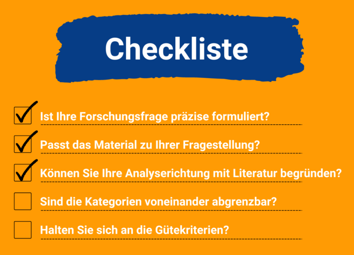

Quer seja na investigação ou no mundo do trabalho: **a análise de conteúdo qualitativo** ajuda-o a analisar o material de dados de uma forma estruturada. Neste artigo, ficará a saber qual a melhor forma de proceder e a que é que deve prestar atenção. Posteriormente, a implementação de uma análise de conteúdo é também ilustrada através de uma **revista de imprensa**.

## O que é a análise de conteúdo qualitativa segundo Mayring?

A análise qualitativa de conteúdos é um método científico de investigação social empírica. Pode ser utilizado para categorizar, avaliar e interpretar vários materiais, como **entrevistas**, **artigos de jornal**, **reportagens de rádio** ou **vídeos**.

A forma exacta como deve conceber a análise de conteúdo depende dos resultados que pretende obter com a sua pergunta de investigação.



## Análise de conteúdo qualitativa vs. quantitativa

Basicamente, existe uma **abordagem** **qualitativa** e uma **abordagem quantitativa** para a análise de conteúdo. Pode decidir qual dos dois métodos deve utilizar para o seu projeto com base nos seguintes critérios:

Na análise de conteúdo qualitativa, o utilizador concentra-se numa **pequena quantidade** de conteúdo que analisa em profundidade. Aqui também depende do que se ouve nas entrelinhas das entrevistas, por exemplo. Por conseguinte, trabalha-se **de forma indutiva**, ou seja, efectua-se as próprias observações e deduz-se uma nova hipótese a partir delas. O objetivo é compreender e **interpretar** os resultados e desenvolver novas abordagens teóricas nesta base.

A análise quantitativa de conteúdo é a sua contrapartida. Trata-se de um procedimento normalizado em que o investigador mantém sempre constantes as condições de investigação. Neste caso, recorre-se a uma **grande quantidade de conteúdos**, que são sujeitos a uma análise específica. O procedimento é **dedutivo**, uma vez que se pretende analisar as teorias existentes e fundamentá-las com dados. O objetivo da análise é reconhecer, descrever e **explicar** as **frequências** estatísticas.

## Quando é que a análise de conteúdo qualitativa é um método adequado?

Se pretende clarificar uma questão científica utilizando uma pequena quantidade de dados não normalizados, este método é o mais indicado para si. Trata-se de **recolher opiniões ou atitudes** que podem ser interpretadas no final da análise.

Também pode utilizar a análise de conteúdo para recolher dados importantes no seu trabalho quotidiano. Ao longo deste artigo, ficará a saber como proceder para criar uma [análise de imprensa](https://de.wikipedia.org/wiki/Pressespiegel).

## Procedimento da análise de conteúdo qualitativa

À primeira vista, a análise de conteúdo qualitativo pode parecer muito complexa. No entanto, se a analisarmos nas suas etapas individuais, é mais fácil de compreender. De seguida, o procedimento básico de uma análise de conteúdo qualitativa é explicado em oito passos e com a ajuda de exemplos.

Estas instruções ajudá-lo-ão a fazê-lo.

### Antes de começar

Antes de iniciar a análise, é necessário definir o que se pretende descobrir com a ajuda de uma [pergunta de investigação](https://de.wikipedia.org/wiki/Forschungsfrage). Esta deve ser formulada da forma mais exacta possível. Exemplo:

> _Qual foi o tom da reportagem sobre o SeaTable nos meios jornalísticos?_

## 1\. seleção do material

Para começar, é necessário o **material** adequado com as informações mais importantes relacionadas. Selecciona-as de acordo com a sua adequação à pergunta de investigação.

1. Exemplos de fontes possíveis são
    - **Meios visuais:** jornais, artigos em linha, livros
    - **Meios áudio:** programas de rádio, podcasts, canções
    - **Meios audiovisuais:** vídeos, filmes, programas de televisão
2. Agora, analise mais detalhadamente a **forma como o material foi criado** e explique as condições em que foi criado. Isto varia muito consoante o tipo de dados que escolheu.
3. Por último, analise as **características formais** dos seus meios de comunicação e determine a forma. Os meios de comunicação visuais são uma forma de texto escrito.

> _As fontes para a nossa análise de imprensa são **artigos em linha** que foram publicados em meios jornalísticos desde a sua fundação em julho de 2020 até aos dias de hoje. O material está disponível em **forma de texto escrito**._

## 2\. determinação da direção da análise

A direção que a sua análise deve tomar depende da sua pergunta de investigação. As direcções possíveis para a sua análise de conteúdo qualitativa são

- Fonte (conteúdo do meio)
- Autor da fonte
- Grupo-alvo da fonte
- Área de objeto (o tema geral tratado na fonte)

Se o seu projeto for um artigo científico, deve ser capaz de **explicar** a sua **questão de investigação de forma bem fundamentada**. Para isso, deve relacioná-la com as teorias existentes e com o estado atual da investigação.

Procure literatura adequada para fundamentar a sua abordagem.

> _Quando se analisam os artigos sobre a empresa SeaTable, analisa-se o **conteúdo do texto**. O objetivo é descobrir **como é que** as fontes falam da empresa._

## 3\. escolha do molde

A forma da sua análise de conteúdo qualitativa determina a quantidade de material a analisar e o nível de pormenor. Pode escolher entre três abordagens:

- **Resumo da análise de conteúdo**: O material é reduzido à informação mais relevante para a questão de investigação.
- **Análise de conteúdo explicativa**: as passagens de texto incompreensíveis são explicadas com material adicional.
- **Estruturar a análise de conteúdo**: Existe um [guia de codificação](https://www.acad-write.com/ratgeber/tipps/erstellung-codierleitfaden/) no qual se determina a forma como o material deve ser classificado em categorias relacionadas com tópicos.



> _Com base nalguns dos artigos que relatam o SeaTable, são definidas diferentes categorias para a **tonalidade**. Por exemplo, palavras como "fácil de utilizar" e "importante" são utilizadas num artigo, a partir do qual se pode formar a categoria de **reportagem positiva**._

## 4\. criação do sistema de categorias

Registar as categorias que pretende utilizar para categorizar o seu material num **sistema de categorias**. Existem duas abordagens possíveis para desenvolver este sistema:

- **abordagem dedutiva**: Utiliza-se um sistema de categorias existente que já provou o seu valor.
- **Abordagem indutiva**: Tal como acima referido, pode derivar logicamente categorias a partir dos seus próprios dados.

É importante que cada categoria seja formulada de forma clara, para que possa ser claramente distinguida de outras categorias e não haja confusão aquando da sua categorização.

> _Os artigos em linha do SeaTable devem ser classificados de acordo com determinadas categorias. Para o efeito, estamos a desenvolver um guia de codificação no qual definimos e explicamos as categorias. O procedimento é **indutivo**, uma vez que derivamos as categorias de forma lógica a partir do material. O resultado foram as seguintes **categorias**: tonalidade positiva, tonalidade neutra, tonalidade ambivalente e tonalidade negativa._

## 5\. determinação das unidades de análise

Antes de efetuar uma análise de conteúdo qualitativa, é necessário definir as unidades de análise. Estas determinam o que será posteriormente codificado, ou seja, categorizado.

Os artigos podem ser facilmente divididos em unidades graças à sua estrutura.

1. **Unidade de avaliação**: Determina que materiais são codificados um após o outro.

> _Analisámos artigos de 20 meios de comunicação social diferentes. Cada um destes **artigos** é uma unidade de análise._

3. **Unidade de codificação**: Determina qual é o componente mais pequeno possível a ser codificado.

> _Os artigos começam com um pequeno **teaser** como texto introdutório. Este constitui a unidade de codificação._

5. **Unidade de contexto**: Determina qual é o maior componente possível que é codificado.

> _O artigo pode ser visto **como um todo**. Isto significa que a unidade de contexto é congruente com a unidade de avaliação._

## 6\. realização da análise

Agora é altura da parte mais importante e demorada da análise qualitativa de conteúdos. **Codifica-se** o material e atribui-se-lhe as **categorias** adequadas. Pode fazer isto à mão, utilizando uma folha de codificação, ou pode utilizar uma base de dados digital, como o SeaTable.



> _**Resultado da análise:** A maioria dos artigos em linha sobre o SeaTable pode ser classificada como "tonalidade positiva" ou "tonalidade neutra"._

## 7\. interpretação dos resultados

Pode agora resumir e interpretar os seus resultados. Regressa à tua pergunta inicial e responde-lhe.

> _Uma vez que a maior parte dos artigos pode ser classificada como "tonalidade positiva" ou "tonalidade neutra", pode concluir-se que a SeaTable tem uma imagem bastante positiva e oferece um produto que, normalmente, tem um bom desempenho nos testes._

## 8\. revisão dos critérios de qualidade

Por último, verifique se a sua análise cumpre os critérios de qualidade da análise de conteúdo qualitativa.



A sua investigação deve ser **compreensível** para quem está de fora. Explique como e porquê procedeu em cada etapa da sua análise.




Certifique-se de que a sua análise apresenta resultados semelhantes quando repetida por diferentes codificadores, ou seja, que é **reprodutível**.




Qual o grau de fiabilidade da codificação? O mesmo conteúdo é classificado da mesma forma e as diferenças são expressas adequadamente em valores diferentes?


## Lista de controlo para a sua análise de conteúdo qualitativa

Para garantir que a sua análise de conteúdos decorre sem problemas, eis as perguntas mais importantes que deve fazer a si próprio.

A lista de controlo ajuda-o a manter-se atento aos pontos mais importantes da sua análise.

## Modelo em linha para a sua análise de conteúdos

Ao analisar o conteúdo, podem juntar-se muitos materiais e informações. É por isso que deve recorrer a uma solução digital em vez de introduzir laboriosamente os dados em folhas de codificação e analisá-los manualmente. A equipa SeaTable desenvolveu um modelo sob a forma de uma **revista de imprensa** para facilitar a análise qualitativa dos conteúdos.

Especialmente se trabalhar com vários programadores, uma **plataforma de colaboração** como o SeaTable tem vantagens imbatíveis. Pode armazenar todos os materiais centralmente numa base de dados e codificá-los, dando a cada codificador uma vista filtrada individualmente. Também pode avaliar facilmente os dados codificados e visualizá-los como estatísticas claras.

Se pretender utilizar o SeaTable para a sua análise de conteúdo, basta [registar-se]() gratuitamente. Pode encontrar o modelo [aqui]().
