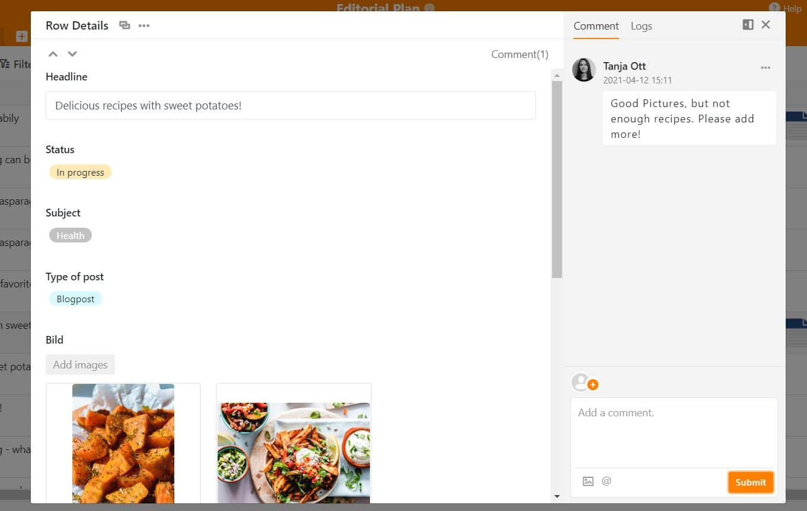
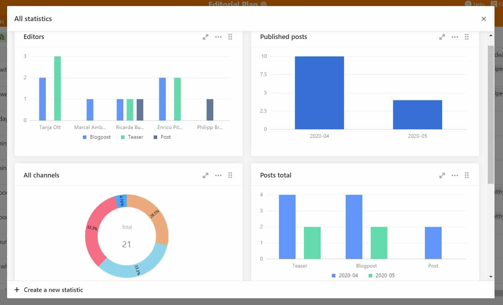

Hoy en día, la presencia en Internet es crucial para el éxito de su empresa. Debe publicar contenidos con regularidad a través de las redes sociales, su sitio web, un blog o formatos como un podcast. Puede tratarse de artículos, vídeos explicativos o infografías, por ejemplo. Un plan de contenidos, también conocido como plan editorial, te ayuda a **planificar y crear todos tus contenidos**.

Siga leyendo para descubrir cómo puede **crear fácilmente su plan de contenidos utilizando una plantilla gratuita** y qué debe tener en cuenta al hacerlo.

## ¿Cuáles son las ventajas de un plan de contenidos?

El uso de un plan integral de contenidos tiene varias ventajas para su marketing:

### El contenido aparece según lo previsto

Con un plan de contenidos siempre puedes controlar los plazos de los borradores y las fechas de publicación importantes. Queda claro **quién tiene que realizar qué tareas y cuándo**. Por lo tanto, los atascos de personal al crear el plan de contenidos o el incumplimiento de los plazos son cosa del pasado.

### Las responsabilidades están claramente distribuidas

Debe asignar un responsable a cada artículo planificado. De este modo, todos los miembros del equipo pueden **filtrar** el **plan editorial según sus tareas pendientes** y ver de un vistazo lo que hay que hacer. **La coordinación entre varias personas o departamentos es más fácil** si está claro quién participa en cada proyecto y quién tiene aún capacidad.

Utilice un plan de contenidos para coordinar la planificación y creación de artículos. Derechos de imagen: © DisobeyArt / Adobe Stock

### No se pierde ningún contenido

Además, una buena planificación de contenidos significa que no se pierde ningún contenido. Cada idea puede registrarse directamente y ocupar un lugar en la cola. El plan de contenidos te ofrece una ubicación central para **recopilar ideas para futuros artículos**, publicaciones en redes sociales, etc.

### Mantener la visión de conjunto con un plan de contenidos

El plan de contenidos también le ayuda a mantener una **visión de conjunto** en el estresante trabajo editorial diario. Es un apoyo para la **planificación y realización con éxito de proyectos** en todos los ámbitos del marketing de contenidos.

### Seguir una estrategia de contenidos

Al fin y al cabo, una buena planificación de contenidos le permite **centrarse en** sus **objetivos**. Estos pueden ser, por ejemplo, **un mayor alcance, más seguidores o más clientes potenciales**. En el plan de contenidos se puede establecer un hilo conductor entre los posts y seguirlo de forma coherente.

## Lista de control para la planificación de contenidos

El siguiente paso es elegir el marco adecuado para su plan de contenidos. La siguiente lista de comprobación te ayudará a crear una buena plantilla de plan editorial que luego solo tendrás que rellenar con ideas y contenidos:

- ¿Cuántos canales quieres gestionar?
- ¿Con qué frecuencia le gustaría publicar?
- ¿Quiere gestionar campañas complejas o simplemente publicar contenido orgánico?
- ¿Sigue una estrategia SEO para el contenido?
- ¿Qué subtareas forman parte de la planificación de contenidos y qué procesos desea asignar al plan de contenidos?
- ¿Cuántas partes deben cooperar a través del plan editorial?
- ¿Necesitas un calendario y recordatorios automáticos?
- ¿Qué datos y estadísticas le gustaría utilizar para analizar el rendimiento?

La planificación de contenidos requiere un concepto bien pensado. Derechos de imagen: © Andrey Popov / Adobe Stock

Las respuestas a las preguntas de la lista de comprobación determinan la estructura y el alcance del modelo de plan de contenidos requerido.

## Crear un plan de contenidos en 5 pasos

En cinco pasos puede tener lista su planificación de contenidos. Empezamos con el "por qué". **¿Por qué quieres hacer marketing de contenidos?**

### 1\. determinar los objetivos

Defina los objetivos que desea alcanzar con el plan editorial. Son posibles, por ejemplo, las siguientes opciones:

- **Conciencia**: Más personas deben conocer su marca o su empresa.
- **Alcance**: Sus mensajes de marketing deben llegar a más personas.
- **Tráfico**: Más gente debería visitar su sitio web.
- **Ventas**: quiere conseguir más clientes potenciales, suscriptores o clientes.
- **Fidelización de clientes**: quiere reforzar la relación con sus clientes y animarles a que le recomienden a otros.
- **Posición única**: quiere destacar [entre la competencia]() con sus contenidos.
- **Estatus de experto**: quiere hacerse un nombre en el sector y convertirse en un experto solicitado en un tema específico.

Una vez definidos los objetivos, el siguiente paso es decidir los medios, tipos de contenido y formatos adecuados.

### 2\. seleccione el soporte, el tipo de contenido y el formato

Los medios importantes para el marketing de contenidos suelen ser **su sitio web, blogs, motores de búsqueda, vídeo y plataformas de medios sociales** como YouTube, Instagram, TikTok y Facebook. ¿Qué tipo de contenido desea publicar? Elige entre **texto, imagen, audio, vídeo** o una mezcla de varios tipos de contenido. Los posibles formatos de contenido dependen del medio que elijas. Los formatos de contenido incluyen artículos de blog, vídeos de YouTube, [episodios de podcast](), publicaciones en redes sociales, presentaciones, seminarios web, libros blancos, infografías, boletines y mucho más.

**Como norma general,** céntrese en dos o tres formatos en los que sea especialmente bueno o en los que le gustaría llegar a serlo. Estos formatos deben adaptarse a los hábitos de uso y las expectativas de su público objetivo.

### 3\. determinar la combinación de contenidos y su frecuencia

A continuación, detalle su plan de contenidos. La combinación de contenidos determina qué contenidos publicará. Se pueden considerar varias categorías temáticas:

- **Viral**: Contenido que corresponde a tendencias actuales o podría desencadenar una nueva.
- **Noticias**: Contenido sobre temas de candente actualidad en su sector o en general en las noticias.
- **Entretenimiento**: Contenidos que atraen la atención y entretienen a su público objetivo.
- **Guía**: Contenido útil que ayuda a su público objetivo.
- **SEO**: Contenidos que su público objetivo desea encontrar a través de un motor de búsqueda.

Para planificar los **contenidos**, especifique también **cuándo y con qué frecuencia deben publicarse**. Por ejemplo, dos veces por semana, todos los martes y jueves a las 8 de la mañana.

### 4\. crear un plan editorial

Ahora es el momento de crear el plan editorial. Con la herramienta adecuada, esto es un juego de niños. Por ejemplo, seleccione una plantilla existente para su plan de contenidos, personalice las tablas según sus propias necesidades e inserte sus datos.

Su plan de contenidos debe **contener al menos columnas para un título provisional o la idea del contenido y la fecha de publicación prevista**. También son útiles las columnas para documentos e imágenes, el estado de edición, el responsable, el formato, el soporte u otra información.

### 5\. defina directrices generales para sus contenidos

Una vez que haya planificado el contenido, debe desarrollar y documentar las directrices de contenido con su equipo en un [taller](https://seatable.io/es/workshop-planen/). De este modo, podrá asegurarse de que el contenido alcanza una calidad homogénea incluso durante un periodo de tiempo más largo con varios participantes.

Incluyen, por ejemplo, **cómo dirigirse a los lectores, la tonalidad de los textos, el uso de emojis y hashtags, la resolución y el tamaño de las imágenes, los enlaces, el formato y mucho más**. Las directrices completan el plan editorial y lo dejan listo para su uso. Si trabajas con autónomos o una agencia, las directrices te ayudan a crear contenidos exactamente como los quieres.

## Crear un plan de contenidos con SeaTable

Con la [plantilla]() gratuita [de plan de contenidos]() de SeaTable, el equipo de marketing, los creadores de contenidos, las agencias y otras partes interesadas pueden trabajar juntos en una sola herramienta. **Puede organizar claramente y mantener fácilmente todos los contenidos de su plan editorial**. Se definen las responsabilidades y se distribuyen las tareas.

### 1\. estructuración significativa con categorías

Puede crear cualquier número de categorías con las columnas de selección única. La ventaja es que después puede **agrupar, filtrar o realizar análisis estadísticos**. Por ejemplo, puedes mostrar todos los artículos de blog no publicados o solo tu [plan de contenidos para redes sociales](https://seatable.io/es/social-media-plan-vorlage/).

### 2\. guardar imágenes y documentos en el plan de contenidos

SeaTable tiene una ventaja decisiva sobre programas tan conocidos como Excel: Con las columnas de archivos e imágenes, puede **almacenar documentos e imágenes para sus entradas directamente en su plan de contenidos**. Ya no tendrá que vincular manualmente las imágenes a unidades de disco, enviarlas por correo electrónico o a través de servicios de intercambio de archivos como Dropbox. ¡Se acabaron los archivos perdidos!

### 3\. plazos siempre a la vista

Para mantener una visión general del calendario, puede **pasar de la vista de tabla a la de calendario con un solo clic**. Los plazos de los borradores y las fechas de publicación se introducen aquí en un resumen mensual, semanal o diario.

### 4\. facilidad de comunicación en el plan editorial

La comunicación para planificar las contribuciones a veces se extiende por varios correos electrónicos, chats internos o documentos. Esto puede resultar confuso rápidamente. Con SeaTable, todos los mensajes se agrupan en un solo lugar: **Comunique sus comentarios directamente en el plan editorial**. Esto funciona de forma muy eficaz a través de la [función de comentarios](https://seatable.io/es/docs/arbeiten-mit-zeilen/zeilen-kommentieren/) en las líneas individuales. Puede **hacer un seguimiento de todos los cambios** en el [registro](https://seatable.io/es/docs/arbeiten-mit-zeilen/anzeige-der-veraenderungen-auf-einer-zeile/), de modo que siempre quede claro quién ha hecho qué cambios en el plan editorial.

Comunicación sencilla y directa en el plan editorial

### 5 Crear claridad con estadísticas

¿Le gustaría experimentar con diferentes datos y analizar sus contenidos según sus deseos? Entonces **cree [estadísticas](https://seatable.io/es/docs/plugins/anleitung-zum-statistik-plugin/) significativas con SeaTable**. Por ejemplo, analice en qué meses ha publicado un número especialmente elevado de posts, qué empleado ha escrito más posts o en qué canal ha tenido más éxito el contenido. De este modo, obtendrá información muy valiosa sobre los aspectos positivos y los aspectos mejorables.

## Consejos para utilizar eficazmente su plan editorial

En definitiva, debe asegurarse de que ...

- ... sus **objetivos son mensurables** para que pueda analizar posteriormente el éxito de sus medidas de marketing de contenidos. Clics, "me gusta", comentarios... ¿qué [cifras clave](https://de.wikipedia.org/wiki/Key-Performance-Indicator) te gustaría recopilar y analizar?
- ... no debe planificar demasiado, pero tampoco demasiado poco tiempo para la creación de contenidos. **La calidad está por encima de la cantidad,** pero debes alcanzar tus objetivos de marketing con un esfuerzo razonable.
- ... todos los participantes tienen acceso al plan editorial y **pueden trabajar en él simultáneamente**.

## Conclusión sobre el plan de contenidos

Cuando se crea un [plan de marketing](https://seatable.io/es/marketingplan-vorlage/), se necesita un plan de contenidos claro para hacer un seguimiento de los contenidos previstos, los plazos, las tareas y su estado. Esto te permitirá planificar y realizar con éxito las aportaciones en equipo.

Si hemos despertado su interés por SeaTable, [regístrese gratis]() en nuestra nube y empiece a trabajar directamente con la plantilla del plan de contenidos.
