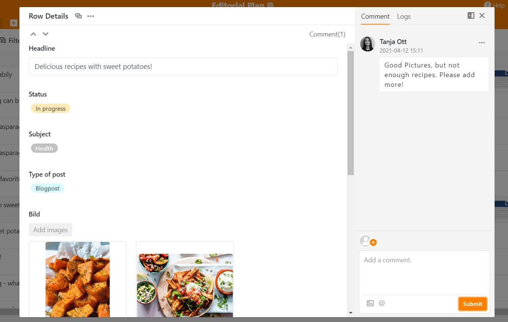

De nos jours, une présence en ligne est essentielle pour le succès de votre entreprise. Il convient de publier régulièrement des contenus via les médias sociaux, votre site web, un blog ou des formats tels qu'un podcast. Il peut s'agir par exemple d'articles, de vidéos explicatives ou d'infographies. Un plan de contenu, également appelé plan éditorial, vous aide à **planifier et à créer tous vos contenus**.

Lisez ci-dessous comment **créer facilement votre plan de contenu à l'aide d'un modèle gratuit** et ce à quoi vous devez faire attention.

## Quels sont les avantages d'un plan de contenu ?

L'utilisation d'un plan de contenu transversal présente certains avantages pour votre marketing :

### Le contenu apparaît comme prévu

Avec un plan de contenu, vous gardez toujours un œil sur les délais pour les projets et les dates de publication importantes. Il est clair **qui** doit **effectuer quelles tâches et quand**. Les goulots d'étranglement au niveau du personnel lors de l'élaboration du plan de contenu ou les délais manqués appartiennent ainsi au passé.

### Les responsabilités sont clairement réparties

Vous devriez attribuer un responsable à chaque contribution planifiée. Ainsi, chaque membre de l'équipe peut **filtrer** le **plan éditorial en fonction de ce qu'il a à** faire et voir d'un seul coup d'œil ce qui doit être fait. La **coordination entre plusieurs personnes ou départements est plus facile** si l'on sait clairement qui est impliqué dans quel projet et qui a encore des capacités.

Un plan de contenu permet de coordonner la planification et la création de contributions. Droits d'image : © DisobeyArt / Adobe Stock

### Aucun contenu n'est perdu

De plus, grâce à une bonne planification du contenu, aucun contenu n'est perdu. Chaque idée peut être directement consignée et se voit attribuer une place dans la file d'attente. Le plan de contenu vous offre un lieu central pour la **collecte d'idées de futurs articles**, de posts sur les médias sociaux, etc.

### Garder une vue d'ensemble grâce à un plan de contenu

Dans le stress quotidien des rédactions, le plan de contenu vous aide en outre à garder **une vue d'ensemble**. Il est un soutien pour **planifier et mettre en œuvre avec succès des projets** dans tous les domaines du marketing de contenu.

### Adopter une stratégie de contenu

Enfin, une bonne planification du contenu permet d'**aborder** vos **objectifs de manière ciblée**. Il peut s'agir par exemple d'une **plus grande portée, de plus de followers ou de plus de leads**. Le plan de contenu permet de créer un fil rouge entre les contributions et de le suivre de manière cohérente.

## Liste de contrôle pour votre planification de contenu

L'étape suivante consiste à choisir le cadre approprié pour votre plan de contenu. La liste de contrôle suivante vous aidera à créer un bon modèle de plan éditorial qu'il vous suffira ensuite de remplir d'idées et de contenus :

- De combien de canaux voulez-vous vous occuper ?
- À quelle fréquence souhaitez-vous publier ?
- Souhaitez-vous gérer des campagnes complexes ou publier exclusivement du contenu organique ?
- Suivez-vous une stratégie de référencement pour le contenu ?
- Quelles sont les tâches partielles qui font partie de la planification du contenu et quels sont les processus que vous souhaitez reproduire avec le plan pour le contenu ?
- Combien de parties doivent collaborer via le plan éditorial ?
- Vous avez besoin d'un calendrier et de rappels automatiques ?
- Quelles données et statistiques souhaitez-vous utiliser pour analyser les performances ?

La planification du contenu nécessite un concept bien pensé. Droits d'image : © Andrey Popov / Adobe Stock

Les réponses aux questions de la liste de contrôle déterminent la structure et l'étendue du modèle de plan de contenu requis.

## Créer un plan de contenu en 5 étapes

Vous pouvez préparer votre planification de contenu en cinq étapes. Commençons par le "pourquoi". **Pourquoi voulez-vous faire du marketing de contenu ?**

### 1\. déterminer les objectifs

Définissez les objectifs que vous souhaitez atteindre avec le plan éditorial. Les options suivantes sont par exemple possibles :

- **Notoriété**: davantage de personnes doivent connaître votre marque ou votre entreprise.
- **La portée des** messages : Vos messages marketing doivent atteindre davantage de personnes.
- **Trafic**: davantage de personnes doivent visiter votre site web.
- **Ventes**: vous souhaitez acquérir davantage de leads, d'abonnés ou de clients.
- **Fidélisation des clients**: vous souhaitez renforcer la relation avec vos clients et les inciter à vous recommander.
- **Position unique**: vous souhaitez vous [démarquer de la concurrence]() par le biais du contenu.
- **Statut d'expert**: vous souhaitez vous faire un nom dans le secteur et devenir un expert recherché sur un sujet particulier.

Une fois les objectifs définis, il s'agit de choisir les médias, les types de contenus et les formats les plus appropriés.

### 2\. choisir le média, le type et le format du contenu

Les médias importants pour le marketing de contenu sont généralement **votre site web, les blogs, les moteurs de recherche, les plateformes de vidéos et de médias sociaux** comme par exemple YouTube, Instagram, TikTok et Facebook. Quel type de contribution souhaitez-vous publier ? Choisissez entre **texte, image, audio, vidéo** ou un mélange de plusieurs types de contenu. En fonction du média que vous choisissez, les formats de contenu possibles en découlent. Les formats de contenu comprennent les articles de blog, les vidéos YouTube, les [épisodes de podcast](), les posts sur les réseaux sociaux, les présentations, les webinaires, les livres blancs, les infographies, les newsletters et bien d'autres.

**En règle générale,** concentrez-vous sur deux ou trois formats dans lesquels vous êtes particulièrement bon ou souhaitez le devenir. Ceux-ci doivent être adaptés aux habitudes d'utilisation et aux attentes de votre groupe cible.

### 3\. définir le mix de contenus et la fréquence

Ensuite, vous entrez dans les détails avec votre plan de contenu. Le mix de contenus détermine les contenus que vous allez publier. Différentes rubriques thématiques entrent en ligne de compte :

- **Viral**: contenu qui correspond aux tendances actuelles ou qui pourrait en déclencher une nouvelle.
- **Actualités**: contenu sur des sujets qui font l'objet de discussions animées dans votre secteur ou qui font généralement l'actualité.
- **Divertissement**: des contenus qui attirent l'attention et divertissent votre groupe cible.
- **Conseils**: un contenu utile qui aide votre groupe cible.
- **SEO**: contenu que votre groupe cible souhaite trouver via un moteur de recherche.

Pour la planification du contenu, déterminez également **quand et à quelle fréquence le contenu doit être publié**. Par exemple, deux fois par semaine, tous les mardis et jeudis à 8 heures.

### 4\. établir un plan éditorial

Il s'agit maintenant d'élaborer concrètement le plan éditorial. Avec le bon outil, c'est un jeu d'enfant. Choisissez par exemple un modèle existant pour votre plan de contenu, adaptez les tableaux à vos propres besoins et insérez vos données.

Votre plan de contenu doit au moins **contenir des colonnes pour un titre de travail ou une idée de contenu ainsi que pour la date de publication prévue**. Il est également utile de prévoir des colonnes pour les documents et les images, le statut de traitement, le responsable, le format, le support ou d'autres informations.

### 5\. définir des directives générales pour votre contenu

Une fois la planification du contenu établie, vous devriez élaborer et documenter des directives de contenu avec votre équipe dans le cadre d'un [atelier](https://seatable.io/fr/workshop-planen/). Vous obtiendrez ainsi des contenus de qualité constante, même sur une longue période, auprès de plusieurs participants.

Il s'agit par exemple de la **manière de s'adresser aux lecteurs, du ton des textes, de l'utilisation d'emojis et de hashtags, de la résolution et de la taille des images, des liens, de la mise en forme et bien plus encore**. Ces directives complètent le plan éditorial et le rendent prêt à l'emploi. Si vous travaillez avec des freelances ou une agence, les guidelines vous aident à créer le contenu exactement comme vous le souhaitez.

## Créer un plan de contenu avec SeaTable

Le [modèle de plan de contenu]() gratuit de SeaTable permet à l'équipe marketing, aux créateurs de contenu, aux agences et aux autres intervenants de travailler ensemble dans un seul outil. **Dans votre plan éditorial, vous pouvez organiser tous les contenus de manière claire et les gérer facilement**. Les responsabilités sont définies et les tâches sont réparties.

### 1\. une structuration judicieuse avec des catégories

Avec les colonnes de sélection simple, vous pouvez créer autant de catégories que vous le souhaitez. L'avantage est que vous pouvez ensuite **regrouper, filtrer ou effectuer des analyses statistiques**. Vous pouvez par exemple afficher tous les articles de blog non publiés ou uniquement votre [contenu Plan Social Media](https://seatable.io/fr/social-media-plan-vorlage/).

### 2\. enregistrer les images et les documents dans le plan de contenu

SeaTable présente un avantage très important par rapport à des programmes connus comme Excel : Grâce aux colonnes de fichiers et d'images, vous pouvez **placer des documents et des images pour vos articles directement dans votre plan de contenu**. Il n'est plus nécessaire de lier manuellement les images sur les disques, de les envoyer par e-mail ou via des services de partage de fichiers comme Dropbox. Ainsi, plus aucun fichier ne sera perdu !

### 3\. ne jamais perdre de vue les échéances

Pour garder une vue d'ensemble dans le temps, vous pouvez **passer du tableau à l'affichage du calendrier en un seul clic**. Ici, les dates limites pour les projets et les dates de publication sont inscrites dans un aperçu mensuel, hebdomadaire ou quotidien.

### 4\. une communication ludique et facile dans le plan éditorial

La communication pour la planification des contributions s'étend parfois sur divers e-mails, chats internes ou documents. Cela peut vite devenir confus. Avec SeaTable, tous les messages sont regroupés au même endroit : **Communiquez vos réactions directement dans le plan éditorial**. Cela fonctionne très efficacement grâce à la [fonction de commentaire](https://seatable.io/fr/docs/arbeiten-mit-zeilen/zeilen-kommentieren/) dans les différentes lignes. Vous pouvez **suivre toutes les modifications** dans le [journal](https://seatable.io/fr/docs/arbeiten-mit-zeilen/anzeige-der-veraenderungen-auf-einer-zeile/) - ainsi, il est toujours clair qui a effectué quelles modifications dans le plan de rédaction.

Communication simple et directe dans le plan éditorial

### 5\. clarifier les choses grâce aux statistiques

Vous souhaitez expérimenter avec différentes données et évaluer votre contenu comme vous le souhaitez ? Alors **créez [des statistiques](https://seatable.io/fr/docs/plugins/anleitung-zum-statistik-plugin/) pertinentes avec SeaTable**. Analysez par exemple les mois au cours desquels vous avez publié un nombre particulièrement élevé de contributions, quel collaborateur a écrit le plus de contributions ou sur quel canal le contenu a eu le plus de succès. Cela offre de nombreux aperçus précieux sur les domaines où les choses fonctionnent bien - et sur ceux où il y a peut-être encore des améliorations à apporter.

## Conseils pour utiliser efficacement votre plan éditorial

Tout bien considéré, vous devez veiller à ce que ...

- ... vos **objectifs** soient **mesurables**, afin que vous puissiez vérifier ultérieurement le succès des mesures de marketing de contenu. Clics, likes, commentaires - quels sont les [indicateurs](https://de.wikipedia.org/wiki/Key-Performance-Indicator) que vous souhaitez collecter et analyser ?
- ... vous ne prévoyez pas trop de temps pour la création de contenu, mais pas trop peu non plus. **La qualité prime certes sur la quantité**, mais vous devez atteindre vos objectifs marketing avec un effort raisonnable.
- ... toutes les personnes concernées ont accès au plan éditorial et **peuvent y travailler en même temps**.

## Conclusion sur le plan de contenu

Lors de l'élaboration d'un [plan marketing](https://seatable.io/fr/marketingplan-vorlage/), un plan de contenu clair est nécessaire pour garder une vue d'ensemble sur les contenus prévus, les délais, les tâches et leur statut. Ainsi, les contributions peuvent être planifiées et réalisées avec succès en équipe.

Si nous avons éveillé votre intérêt pour SeaTable, [inscrivez-vous gratuitement](https://seatable.io/fr/enregistrement/) dans notre nuage et commencez à travailler directement avec le modèle de plan de contenu.
