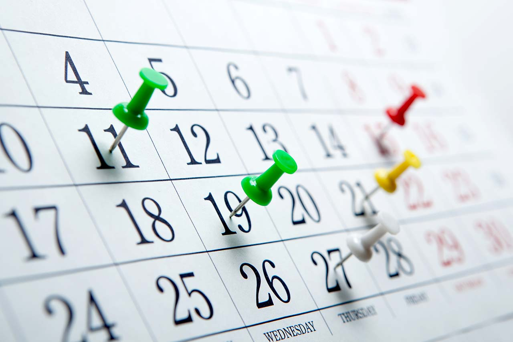
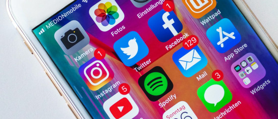

Pour obtenir des résultats mesurables sur les plates-formes de médias sociaux, vous devez publier continuellement de nouveaux contenus. Et ce, souvent plusieurs fois par semaine pour différents canaux, comme LinkedIn, Instagram, Facebook, X ou Youtube. Il s'agit de **publier des contenus intéressants et divertissants dans les délais impartis**. Un **plan éditorial pour les médias sociaux** vous aidera à le mettre en œuvre. Découvrez dans cet article comment développer une stratégie de médias sociaux efficace grâce à un plan de médias sociaux.

## Pourquoi avez-vous besoin d'un plan éditorial pour les médias sociaux ?

### 1\. garder une vue d'ensemble

Un plan pour les médias sociaux vous permet de garder **une vue d'ensemble sur vos canaux de médias sociaux**. Plus précisément, un plan éditorial pour les médias sociaux vous permet de savoir **qui doit publier quoi, quand et où**. Si vous utilisez un outil central pour les publications sur les médias sociaux, vous travaillez plus efficacement avec vos collègues, car chaque membre de l'équipe voit toujours l'état actuel. Vous pouvez ainsi **répartir plus facilement les tâches** tout en respectant vos directives de conception d'entreprise afin de créer des posts sur les médias sociaux comme s'il s'agissait d'un seul et même document.

Un plan éditorial pour les médias sociaux permet de structurer les processus et d'assurer une présence cohérente. Droits d'image : © Urupong / Adobe Stock

### 2\. fixer les idées

Le prochain avantage d'un plan de contenu pour les médias sociaux est que vous pouvez **collecter des idées sans limite**. Si une idée est utilisée pour un post sur les médias sociaux, vous pouvez facilement la déployer sur vos différents canaux et **créer un contenu sur mesure**. Vous avez ainsi à tout moment des contributions dans le pipeline, au cas où la créativité viendrait à manquer lors de la création de nouveaux contenus. En effet, il n'y a rien de pire que de devoir produire des contenus créatifs sous la pression du temps et de ne pas avoir de bonnes idées à ce moment-là.



### 3\. planifier des rendez-vous

Le plan éditorial devrait pouvoir être représenté dans un calendrier. Vous pouvez ainsi planifier longtemps à l'avance **les dates et les intervalles auxquels vous souhaitez publier**. Notez par exemple les jours fériés ou les événements importants pour lesquels vous souhaitez publier un contenu fidèle au thème. Ceux qui produisent régulièrement des contenus pour les canaux de médias sociaux savent à quel point **un plan éditorial bien structuré est important pour le bon déroulement du travail**.

Planifiez les dates de vos posts dans un calendrier. Droits d'image : © mizar_21984 / Adobe Stock

### 4\. classer systématiquement les contenus

De même, un plan pour les médias sociaux permet d'établir des liens entre les contributions. Vous pouvez par exemple **réfléchir à des rubriques et des formats spécifiques** pour lesquels vous publiez régulièrement du contenu. Lors de l'élaboration de la stratégie pour les médias sociaux, vous définissez dans quelle mesure les posts doivent se ressembler ou être indépendants les uns des autres. Réfléchissez aux **messages que vos followers doivent assimiler**, à la meilleure façon de les communiquer et à leur adéquation avec les objectifs fixés dans le plan marketing.

### 5\. analyse et stratégie

Un plan éditorial pour les médias sociaux vous aide en outre à **analyser les posts passés**. Qu'il s'agisse d'impressions, de clics, de likes ou de commentaires : Quel contenu a particulièrement bien fonctionné sur lequel de vos canaux ? Comment pouvez-vous à l'avenir encore mieux adapter vos contenus à vos groupes cibles ? Quelle que soit votre stratégie en matière de médias sociaux : Un plan éditorial pour les médias sociaux que vous avez élaboré vous-même vous aide à planifier, à mettre en œuvre et à évaluer.

## Comment créer votre plan de contenu pour les médias sociaux ?

Avant de commencer à concevoir votre plan éditorial pour les médias sociaux, vous devez développer votre stratégie en matière de médias sociaux et en définir le cadre :

1. À quelle fréquence prévoyez-vous de poster ?
2. Exploitez-vous un ou plusieurs canaux de médias sociaux ?
3. Doit-il être possible de gérer des images et des vidéos ?
4. S'agit-il de contributions organiques ou de campagnes de médias sociaux plus importantes ?
5. Combien de membres de l'équipe doivent-ils collaborer dans le plan éditorial des médias sociaux ?

Quels sont les canaux de médias sociaux que vous utilisez ?

Il s'agit ensuite de choisir l'outil qui soutiendra le mieux votre projet. Vous trouverez ci-dessous plus d'informations sur les [**Outils et modèles pour votre plan de médias sociaux**](#Tools_und_Vorlagen_fuer_Ihren_Social-Media-Plan).

## Ce que doit couvrir un plan éditorial pour les médias sociaux

Lorsque vous créez votre plan éditorial pour les médias sociaux, il s'agit de **reproduire et de simplifier** le **flux de travail de votre équipe de création de contenu**. Les tâches au sein du processus éditorial peuvent être entre autres

1. Recherche et recherche d'idées
2. Séance photo ou tournage vidéo
3. Post-traitement et montage
4. Rédaction de textes
5. Conception de la mise en page
6. Rédaction et validation
7. Publication

Selon la taille de votre équipe de création de contenu, vous pouvez vous charger vous-même des tâches ou les déléguer à des spécialistes (rédacteurs, concepteurs, graphistes, monteurs). Pour que tous les collaborateurs sachent ce qui doit être fait et jusqu'à quand, vous devez **attribuer clairement** les **tâches et fixer des délais.** Un bon plan de contenu pour les médias sociaux devrait au moins contenir les points suivants :

- Thèmes et idées
- Tâches et membres responsables de l'équipe
- Fichiers téléchargés (texte/image/vidéo)
- Vos canaux de médias sociaux et vos formats de contenu
- Statut de traitement
- Délais pour les projets et dates de publication

### Planifier un contenu Instagram - La clé du succès

Pour réussir sur Instagram, une planification minutieuse est indispensable. Planifier le contenu Instagram signifie déterminer à l'avance quel contenu sera publié et à quel moment. Cela implique de choisir les sujets, de créer un concept visuel et de définir un calendrier de publication. Un plan de contenu bien pensé permet de construire une identité de marque cohérente, de fidéliser le groupe cible et d'augmenter la portée. Planifier un contenu Instagram ne se limite pas à publier de belles images. Il s'agit de raconter une histoire et d'interagir avec la communauté.

**Pourquoi la planification est-elle si importante ?**

- **Cohérence :** un plan bien pensé permet d'obtenir un look et une sensation cohérents.
- **la pertinence :** Le contenu peut être mieux adapté au groupe cible.
- **Efficacité :** Gain de temps grâce à des contenus préparés à l'avance.
- **Analyse :** les succès peuvent être mieux mesurés et optimisés.

Avec SeaTable, tu peux facilement planifier ton contenu Instagram. Utilise notre modèle pour rassembler tes idées, répartir les tâches et suivre les progrès. Ainsi, tu gardes toujours une vue d'ensemble et tu peux mettre en œuvre ta stratégie Instagram avec succès.

## Outils et modèles pour votre plan de médias sociaux

Différents outils conviennent à la création de votre plan éditorial pour les médias sociaux. Choisissez entre des tableurs, des outils de gestion des médias sociaux ou une solution de base de données intelligente.

### Plan des médias sociaux avec Excel ou Google Sheets

Si vous utilisez déjà Google Docs ou Microsoft 365, une possibilité simple serait de créer le **plan des médias sociaux dans Excel ou Google Sheets**. Créez une nouvelle feuille pour chaque mois ou chaque année, qui contient un tableau. Ici, vous faites un lien vers d'autres documents comme par exemple des briefings, des images et des vidéos et vous inscrivez des textes directement dans la liste.

Vous trouverez sur Internet**de nombreux modèles de plans pour les médias sociaux pour les deux outils les plus connus**.  
**L'avantage :** vous pouvez travailler avec un programme familier et vous lancer immédiatement.  
**L'inconvénient** d'Excel et d'autres tableurs est que l'**interface** est conçue de manière **peu conviviale** et que les tableaux sont **peu flexibles et difficiles** à éditer.

### Plan éditorial avec outil de gestion des médias sociaux

Une autre option consiste à **utiliser des outils de médias sociaux tels que Hootsuite,CoSchedule ou ContentPepper**. Ceux-ci sont directement issus de la [gestion des médias sociaux]() et sont donc spécialisés dans la planification de contenu. Le grand avantage des outils de gestion des médias sociaux est qu'ils vous permettent à la fois de planifier et de créer des contributions et de les publier directement sur les médias sociaux. Vous vous épargnez ainsi le travail de publication sur les différentes plates-formes.

### Plan des médias sociaux dans SeaTable

Il existe en outre **des solutions de base de données intelligentes** comme SeaTable. Ces tableaux permettent de saisir des informations de toutes sortes et de stocker des images, des documents et des listes de choses à faire. Vous regroupez ainsi l'ensemble du contenu en un seul endroit et représentez vos processus dans un plan éditorial avec lequel tous les **membres de l'équipe** peuvent **travailler ensemble et en temps réel**.

Pour avoir toujours l'essentiel sous les yeux, vous pouvez **structurer et afficher** les données de votre plan de médias sociaux SeaTable **de différentes manières et les analyser à l'aide de statistiques**. [Vous vous inscrivez en ligne]() et commencez immédiatement. Vous recevez ici le [modèle de plan éditorial]() gratuit que vous pouvez adapter exactement à vos besoins.

## Conclusion

Un plan éditorial pour les médias sociaux vous permet d'exploiter pleinement le potentiel de vos canaux. Vous êtes en mesure de planifier à l'avance et de vous adresser à votre public avec un contenu ciblé. Ainsi, la création initiale d'un plan de contenu vous aidera à mettre en œuvre votre stratégie de médias sociaux. **Automatisez vos processus**, enthousiasmez vos followers et travaillez désormais mieux en équipe grâce à la [solution No-Code]() de SeaTable.
