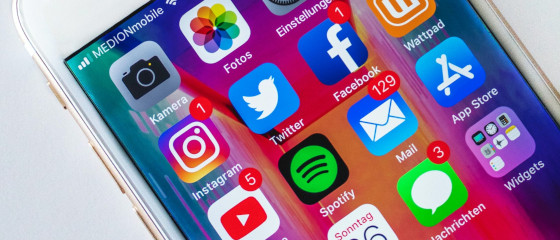

---

Para obter resultados mensuráveis nas plataformas de mídia social, é preciso publicar continuamente novos conteúdos – muitas vezes várias vezes por semana e para diferentes canais, como LinkedIn, Instagram, Facebook, X ou Youtube. O objetivo é **postar conteúdo interessante e envolvente dentro do prazo**. Um **plano editorial de social media** ajuda muito nessa tarefa. Neste artigo, você aprende como desenvolver uma estratégia de sucesso com um plano de social media.

## Por que você precisa de um plano editorial de social media

### 1\. Manter a visão geral

Com um plano de social media, você mantém o **controle sobre seus canais de mídia social**. Em um plano editorial, você registra **quem, o que, quando e onde deve postar**. Ao usar uma ferramenta central para as postagens, você trabalha de forma mais eficiente com sua equipe, pois todos sempre veem o status atual. Assim, é possível **distribuir tarefas com mais facilidade** e ainda seguir as diretrizes de design da marca, garantindo que os posts tenham uma aparência consistente.

Um plano editorial de social media garante processos estruturados e uma presença uniforme. Direitos da imagem: © Urupong / Adobe Stock

### 2\. Registrar ideias

Outra vantagem de um content plan para social media é que você pode **coletar ideias ilimitadamente**. Quando uma ideia de post entra em ação, basta distribuí-la pelos canais e **criar conteúdo sob medida**. Assim, você sempre tem posts na fila, caso falte criatividade para novos conteúdos. Nada pior do que ter que criar algo sob pressão e não ter boas ideias.



### 3\. Planejar datas

O plano editorial deve ser representado em um calendário. Assim, você pode planejar com antecedência **em quais datas e com que frequência vai postar**. Anote feriados ou eventos importantes para publicar conteúdos temáticos. Quem produz conteúdo regularmente sabe **como um plano editorial estruturado é importante para o fluxo de trabalho**.

Planeje as datas dos seus posts em um calendário. Direitos da imagem: © mizar_21984 / Adobe Stock

### 4\. Organizar conteúdos de forma sistemática

Um plano de social media também permite criar conexões entre os posts. Você pode, por exemplo, **criar categorias e formatos próprios** para publicar conteúdos regularmente. Na estratégia, defina se os posts devem ser semelhantes ou independentes. Pense **quais mensagens seus seguidores devem assimilar**, como transmiti-las e se elas se encaixam nos objetivos do seu plano de marketing.

### 5\. Análise e estratégia

Um plano editorial de social media também ajuda a **analisar posts anteriores**. Seja impressões, cliques, curtidas ou comentários: qual conteúdo teve melhor desempenho em cada canal? Como melhorar ainda mais para o público-alvo? Não importa a estratégia: um plano editorial próprio auxilia no planejamento, execução e avaliação.

## Como criar seu content plan para social media

Antes de começar a montar seu plano editorial, desenvolva sua estratégia de social media e defina o escopo:

1. Com que frequência você pretende postar?
2. Você administra um ou vários canais de social media?
3. É preciso gerenciar imagens e vídeos?
4. Trata-se de posts orgânicos ou campanhas mais complexas?
5. Quantos membros da equipe vão colaborar no plano editorial?

Quais canais de social media você utiliza?

Depois, escolha a ferramenta que melhor apoia seu objetivo. Abaixo você encontra mais sobre possíveis [**ferramentas e modelos para seu plano de social media**](#Tools_und_Vorlagen_fuer_Ihren_Social-Media-Plan).

## O que um plano editorial de social media deve abranger

Ao criar seu plano editorial, o objetivo é **mapear e simplificar o fluxo de trabalho da equipe de criação de conteúdo**. As tarefas do processo editorial podem incluir:

1. Pesquisa e geração de ideias
2. Sessão de fotos ou gravação de vídeo
3. Edição e corte
4. Redação de textos
5. Design de layout
6. Revisão e aprovação
7. Publicação

Dependendo do tamanho da equipe, você pode assumir as tarefas ou delegar para especialistas (redatores, designers, editores). Para que todos saibam o que fazer e quando, as **tarefas devem ser claramente atribuídas e agendadas**. Um bom content plan de social media deve conter pelo menos:

- Temas e ideias
- Tarefas e responsáveis
- Arquivos carregados (texto/imagem/vídeo)
- Seus canais e formatos de social media
- Status de edição
- Prazos para rascunhos e datas de publicação

### Planejar conteúdo para Instagram – O segredo do sucesso

Para ter sucesso no Instagram, é indispensável um planejamento cuidadoso. Planejar conteúdo para Instagram significa definir com antecedência quais conteúdos serão postados em cada momento. Isso inclui escolher temas, criar um conceito visual e definir um calendário de publicações. Um plano bem elaborado ajuda a construir uma identidade de marca consistente, engajar o público e aumentar o alcance. Planejar conteúdo para Instagram é mais do que postar belas imagens: trata-se de contar uma história e interagir com a comunidade.

**Por que o planejamento é tão importante?**

- **Consistência:** Um bom planejamento garante aparência e linguagem uniformes.
- **Relevância:** Os conteúdos podem ser melhor adaptados ao público.
- **Eficiência:** Economia de tempo com conteúdos preparados.
- **Análise:** Resultados podem ser melhor medidos e otimizados.

Com o SeaTable, você pode planejar seu conteúdo do Instagram facilmente. Use nosso modelo para reunir ideias, distribuir tarefas e acompanhar o progresso. Assim, você mantém o controle e executa sua estratégia com sucess.

## Ferramentas e modelos para seu plano de social media

Várias ferramentas são adequadas para criar seu plano editorial. Escolha entre planilhas, ferramentas de gerenciamento de social media ou uma solução inteligente de banco de dados.

### Plano de social media com Excel ou Google Sheets

Se você já usa Google Docs ou Microsoft 365, uma opção simples é **criar o plano de social media no Excel ou Google Sheets**. Crie uma nova aba para cada mês ou ano, contendo uma tabela. Nela, você pode linkar outros documentos como briefings, imagens e vídeos, e inserir os textos diretamente.

Na internet, você encontra **diversos modelos de plano de social media para essas ferramentas**.  
**Vantagem:** Você trabalha com um programa conhecido e pode começar imediatamente.  
**Desvantagem:** A interface é pouco amigável e as tabelas são **pouco flexíveis e trabalhosas** de editar.

### Plano editorial com ferramenta de gerenciamento de social media

Outra opção são **ferramentas como Hootsuite, CoSchedule ou ContentPepper**. Vindas do [gerenciamento de social media](), são especializadas em planejamento de conteúdo. A grande vantagem dessas ferramentas é que você pode planejar, criar e postar diretamente nas redes sociais, economizando o trabalho de publicar manualmente em cada plataforma.

### Plano de social media no SeaTable

Além disso, há **soluções inteligentes de banco de dados** como o SeaTable. Nas tabelas, você pode inserir todo tipo de informação, armazenar imagens, documentos e listas de tarefas. Assim, todo o conteúdo fica centralizado e os processos são refletidos em um plano editorial, onde **todos os membros da equipe colaboram em tempo real**.

Para sempre focar no que é mais importante, você pode estruturar, exibir e analisar os dados do seu plano de social media no SeaTable de diferentes formas. [Cadastre-se online]() e comece imediatamente. Aqui você encontra o [modelo gratuito de plano editorial](), que pode ser ajustado às suas necessidades.

## Conclusão

Com um plano editorial de social media, você aproveita ao máximo o potencial dos seus canais. Você pode planejar com antecedência e engajar seu público com conteúdo direcionado. Assim, a criação do plano de conteúdo ajuda a implementar sua estratégia de social media. **Automatize seus processos**, encante seus seguidores e trabalhe melhor em equipe com a [solução no-code]() do SeaTable.
