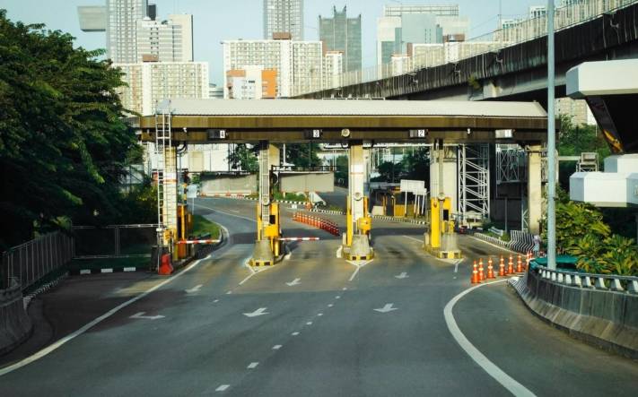

Закон о подоходном налоге описывает три категории **расходов, которые** могут быть **компенсированы** сотрудникам их компаниями. Помимо заказов, сделанных от имени компании, и расходов, понесенных для выполнения заказа, это также относится к **командировкам**. Будь то командировка на несколько дней, встреча с удаленным клиентом или поездка на выставку - для многих сотрудников командировки являются частью повседневной жизни. В следующей статье вы не только узнаете, что такое **отчет о командировочных расходах**, но и получите ценные советы по его составлению.

Компании часто проводят [анализ затрат и результатов]() деловых поездок, чтобы убедиться, что расходы оправданы.

## Что такое отчет о командировочных расходах

Отчет о командировочных расходах - это структурированный отчет, в котором перечислены все расходы, понесенные во время деловой поездки. Он служит для обеспечения надлежащего возмещения расходов сотрудникам, а также прозрачности и отслеживания финансовых затрат на командировки.

В ходе этого процесса сотрудник фиксирует все соответствующие расходы. Затем эти расходы проверяются, как правило, бухгалтерией или отделом контроля компании. Если они соответствуют действующим правилам, сотруднику возмещаются соответствующие расходы.

## Почему вы должны составлять отчет о расходах на поездку

Во многих компаниях существуют четкие правила, требующие составления отчетов о расходах после командировок. Но даже если таких правил нет, есть веские причины, по которым все равно имеет смысл составлять отчет о расходах. От этого выигрывают и сотрудники, и работодатели.

Для **работодателей** Правильный учет командировочных расходов важен не только для соблюдения **налогового законодательства**, но и для **контроля за расходами** и выявления потенциальной экономии. Подробный учет позволяет компаниям лучше понять, сколько денег они тратят на деловые поездки и где есть возможности для оптимизации.

Также для **сотрудников** есть свои преимущества в составлении отчета о командировочных расходах. Хотя вы можете заявить расходы на командировку как расходы, связанные с доходом, в своей **декларации о доходах**, это лишь уменьшит вашу годовую зарплату до вычета налогов. Поэтому возмещение расходов работодателем часто является более экономически обоснованным вариантом.

Заявляя о расходах, сотрудники записывают свои затраты и представляют их для возмещения.

## Какие расходы вы можете возместить после командировки

Во время деловой поездки могут возникнуть некоторые расходы, которые можно разделить на четыре типа: Дополнительные суточные расходы, расходы на проживание, расходы на проезд и случайные командировочные расходы.

### Дополнительные расходы на питание

Дополнительные расходы на питание возмещаются **без уплаты налогов** и определяются в соответствии с [установленными правилами командировочных расходов](https://www.bva.bund.de/SharedDocs/Downloads/DE/Bundesbedienstete/Mobilitaet-Reisen/RV_RK_TG_UK/Rechtsgrundlagen/Dienstreisen/bmf_erlass_201125_steuerliche_Behandlung_RK_AN.pdf?__blob=publicationFile&v=5). Важно отметить, что сумма возмещаемых расходов при поездке за границу может варьироваться в зависимости от страны назначения.

В отношении поездок внутри страны действуют четкие правила: Если сотрудник находится в командировке не менее 8 часов, размер фиксированной оплаты составляет 14 евро. Для поездок продолжительностью не менее 24 часов эта сумма увеличивается до 28 евро.

### Расходы на проживание

Расходы на проживание включают в себя такие расходы, как **проживание в гостинице** или **аренда квартиры** во время командировки. Существуют различные способы учета расходов на проживание. Некоторые компании используют **фиксированную ставку** за ночлег, другие предпочитают выставлять счета на основании **квитанций**.

Важной особенностью выставления счетов за проживание является **личный взнос** за завтрак и другие приемы пищи. Часто для этого устанавливается фиксированная сумма, обычно 5,60 евро за завтрак и 11,20 евро за вечерний прием пищи. Эти суммы ложатся на плечи работника и должны быть соответствующим образом учтены в отчете о командировочных расходах.

Отель часто выбирается в соответствии с бюджетом компании и действующими правилами для деловых поездок.

### Путевые расходы

Путешествуете ли вы по суше, морю или воздуху - командировочные расходы являются неотъемлемой частью отчета о командировочных расходах. Вы можете заявить о них, как только отправитесь в путешествие на другом виде транспорта, кроме служебного автомобиля, например, на **самолете** или **поезде**. Вам возместят расходы на проезд **туда и обратно**, а также **на проезд до места назначения** и, при определенных условиях, **на проезд домой между ними**.

Расходы на проезд обычно рассчитываются либо по **фиксированной ставке за километр**, либо по **километровой ставке**. Надбавка за километраж - это фиксированная сумма за пройденный километр, которая часто используется для **частных или арендованных автомобилей**. В качестве альтернативы можно использовать ставку за километр, учитывающую фактические расходы на километр, например, для **поездок на такси**.

### Дополнительные командировочные расходы

Помимо крупных расходов на командировку, могут быть и более мелкие расходы, которые часто упускаются из виду, - случайные командировочные расходы. Однако их также следует учитывать в отчете о командировочных расходах. К ним, в частности, относятся

Проставка

- Плата за парковку
- Плата за проезд
- Стоимость парома
- Расходы на деловые телефонные разговоры
- Иски о возмещении ущерба в случае дорожно-транспортного происшествия

Проставка

- Советы
- Плата за провоз багажа
- Плата за пользование шкафчиками
- Билеты на профессиональные мероприятия
- Кража профессионального имущества

Случайные командировочные расходы также включают плату за пользование автомагистралями или другими платными дорогами.

## Расходы, которые не возмещаются

Однако существуют расходы во время командировки, которые не подлежат возмещению. К ним относятся **штрафы** за нарушение правил дорожного движения или другие нарушения, а также расходы на дополнительные удобства в отеле, такие как пользование **мини-баром** или **платным телевидением**. В эту категорию также входят расходы на **дополнительный багаж**, который вам не нужен для деловых целей.

В целом, вы **не** можете включать в отчет о командировочных расходах любые личные расходы или дополнительные услуги, которые не являются частью деловой поездки.

## Обязательная информация в отчете о командировочных расходах

Правильный отчет о командировочных расходах требует указания определенной информации. Чтобы избежать ошибок, запросов и задержек в возмещении командировочных расходов, вам следует убедиться, что вы указали в отчете всю необходимую обязательную информацию. К ним относятся

- **Имя** командированного (с указанием номера сотрудника, если применимо)
- **Дата** и время начала и окончания поездки
- **Продолжительность поездки**
- **Причина** путешествия
- **Цель** путешествия
- **Подпись** путешественника

## Как создать отчет о расходах на поездку

Многие используют шаблон Excel для отчета о командировочных расходах, но это не обязательно! Более интуитивный и понятный шаблон отчета о командировочных расходах можно найти, например, в SeaTable. Пусть ваши сотрудники представляют все расходы и квитанции в цифровом виде через веб-формы. Затем данные автоматически и аккуратно упорядочиваются в электронной таблице, чтобы вы всегда имели представление о ситуации и могли регулярно возмещать сотрудникам все расходы.

Более подробную информацию о шаблоне отчета о командировочных расходах SeaTable вы можете найти [здесь.]()

[Просто зарегистрируйтесь бесплатно](), указав свой адрес электронной почты, попробуйте SeaTable и настройте шаблон по своему усмотрению, чтобы записывать отображения в вашей компании так, как вы хотите!
