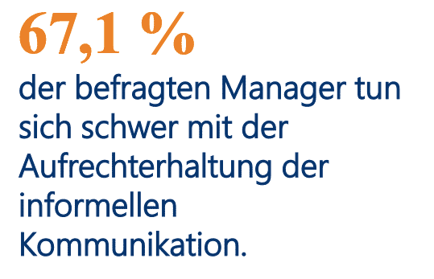

Most companies take measures to enable working from home and organize online seminars or other events for their employees in addition to home office options. However: you start to miss even the most annoying colleague and the chat at the coffee machine is also missing. With a team that works almost exclusively remotely, it's sometimes difficult to stay up-to-date, and [productivity often suffers](https://seatable.io/en/homeoffice-tipps/) as a result. Luckily, there's a method that could help you reclaim your productivity remotely. With daily stand-ups, you'll improve your team's productivity in no time.

[Image source](https://www.odgersberndtson.com/media/9459/sonderausgabe-managerbarometer-corona.pdf)

## What is stand-up anyway?

No, we're not talking about a comedy show here. Although some meetings come pretty close, if we're honest. But no. A daily stand-up meeting is a short meeting to update the whole team, and yes, that's right, it should be held standing up. Because if you stand, it's more likely to actually keep the meeting short, rather than dragging it out unnecessarily.

The ideal length for a short remote team update is 15 minutes. Of course, it is more difficult to get a remote team to stand, but if you explain why, everyone is sure to find a solution for standing for 15 minutes in a video conference without only their midsection being visible. And don't forget: Working while standing is healthy for the back. This not only strengthens productivity, but also builds an ergonomic way of working into the day.

## Advantages of the remote stand-up at a glance

The advantages of a standing meeting are obvious. It should...

- fast (max. 15 minutes)
- efficient (no small talk)
- productive (only working through items on the agenda)
- cooperative (team exchange, no reporting to the boss)
- Prepared (think about what you want to say in advance)

... be.

Lengthy meetings that are daunting and overwhelming are a thing of the past. Stand-ups, on the other hand, can help your team stay up-to-date and become a useful part of everyday work.

## 6 tips to increase remote team productivity with daily stand-ups

### Set goals together

The most common reason for meetings dragging on unnecessarily is that not everyone knows exactly what they are about. So everyone appears unprepared, which makes productivity suffer significantly. It is important to determine together what the purpose of the meeting is and what exactly it should be about. For this purpose, we have brought you 3 guiding questions for a remote stand-up meeting that every team member can and should prepare for:

1. What have you achieved since the last meeting?
2. What are you working on at the moment?
3. What are the challenges and what help may be needed?

The first question should be answered fairly quickly in 1-3 sentences. Of course, there are exceptions. If a major project has been completed, you can of course talk about it in more detail or refer to doing so in a designated meeting.

The second question should also be answered very briefly. In general, it is important here to motivate your staff to set smaller milestones that you can then report on weekly. For example, if an employee is responsible for building your social media presence, a small milestone could be setting up a company account on each platform (Twitter, Instagram, LinkedIn, Facebook, etc.). Celebrating such small successes with colleagues also motivates them to celebrate and appreciate their own small progress towards a bigger goal.

Care should be taken with the third question. This is where there is the greatest potential to have longer conversations. While you want your team to offer help to each other, it should remain a mere show of hands. This way, the person concerned knows who to turn to afterwards. These guiding questions for a stand-up meeting can significantly contribute to increasing productivity.

### Stick to the schedule

This is where online meetings finally have an advantage. When it comes to being on time, you have fewer reasons to be late at home because you don't have to physically move to a meeting room. In general, you should still establish a corporate culture in which it becomes standard to arrive on time (if not rather a little early) for the meeting.

Starting meetings late is actually a very common complaint from staff in general. There are equally complaints about the wrong timing of a meeting. Either it takes far too long or it is scheduled too short. Start on time and finish on time - even if someone shows up late.

The productivity of stand-up meetings lies in their brevity. Stick strictly to the 15-minute rule, at the beginning a timer set for 15 minutes with a 3-minute snooze time might help. This way you can find a rounded conclusion once the timer has expired.

### Respect the time of all

The biggest time eater in meetings is that many people want to speak at once. You often forget to let others finish, just when you want to say something on a certain point. Productivity is something else. On-site, you could solve the problem quite simply by selecting an object that is always in the hand of the person speaking. But how can this be implemented online? Make use of technology!

A simple solution, for example, would be to only ever switch on the microphone when you are actually speaking. If someone else then wants to say something, they first have to overcome the hurdle of unmuting themselves, which will remind them that it is not yet their turn. In addition, some providers allow you to raise a virtual hand. If a meeting moderator is appointed, he or she can then simply take the person's turn.

### Keep to the point

There are a few reasons why people digress in meetings and productivity is lost. Let's recall the questions that serve as the basic framework for the structure of your meeting:

1. What have you achieved since the last meeting?
2. What are you working on at the moment?
3. What are the challenges and what help may be needed?

As mentioned above, question 3 has the greatest potential to drift into unnecessary one-on-one conversations between two people. Make it clear that assistance does not consist of immediately explaining how exactly one can help, but that a simple hand signal is enough. Afterwards, the persons concerned can then arrange a one-on-one conversation on their own.

Especially if you are an expert in the field and the solution therefore seems simple and clear to you, you feel the need to give detailed help immediately. Make it clear once again that the stand-up meeting is really only there to bring everyone up to speed. Assistance usually does not concern every person in the meeting and limits productivity.

Another reason for less productivity is **small talk**. Understandable. Locked up in your own four walls, it's tempting to chat out of the closet and simply socialise with colleagues again. Talking about the weekend, family or good films you've seen strengthens cohesion and that's exactly what's important and good. However, the stand-up meeting is simply not the right place for this. The next tip offers a solution.

### Online events away from commitments

Perhaps the reason for an increase in small talk is that your employees don't have a space to meet away from their duties. Yet small talk inspires and increases productivity later in the day. These online events are great for team building:

1. Joint remote lunch breaks
2. Joint Movie Night with subsequent exchange
3. Quiznight (about a pub quiz)
4. Game Night (with games like [skribbl.io](https://skribbl.io/))
5. Good old Bingo
6. Gin or wine tastings
7. Joint Yoga Hour

These are just a few ideas. You can either organise such online events yourself or order them ready-planned for a manageable budget, for example [here](https://b-ceed.de/remote-teamevents/).

### Keep the format flexible

What works for one team does not necessarily work for every team at the same time. Try to arrive at the solution together that will increase the productivity of your whole team. Try different times and agendas and always stay flexible. Get feedback after a few weeks and, if necessary, change the time and setting of the meeting again.

Our 6 tips focus on the idea that daily stand-ups of 15 minutes work for the whole team. But you don't have to! Maybe it's beneficial for your business to split the meeting into several separate meetings because your team is particularly large. Maybe 2 stand-ups per week are enough for you to bring everyone up to speed.

You may also find that stand-ups are especially good in the development phase, but tend to be distracting and make for less productivity in the implementation phase. Stay flexible and see the daily stand-up as a great way to increase your team's productivity and cohesion.

### Document stand-ups

Especially in daily meetings, it can happen that one or the other colleague is absent due to another appointment. Let them know how to communicate their absence and keep important information in one place. This way, the missing participant can look up afterwards if something relevant to him happened. For the planning and notes of your remote meetings, we have already provided a template [here](https://seatable.io/en/vorlage/gumqbevcroszpprj6j4xyg/) and also explained in detail in [this post](https://seatable.io/en/team-meetings-remote-organisieren/) how you can create one yourself and adapt it to your needs.

Organising an entire team remotely while maintaining high productivity is a challenge. Despite all the technological possibilities at our disposal, it can still be difficult to create a collaborative environment. Daily stand-ups are a great way to update each other and feel part of a bigger picture. Problems are identified early and the sense of belonging is increased.

Try it out!
