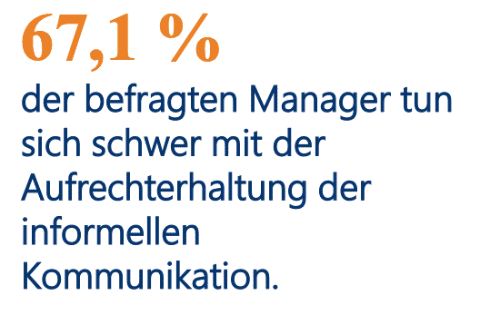

La mayoría de las empresas toman medidas para permitir el trabajo desde casa y organizan seminarios en línea u otros eventos para sus empleados, además de las opciones de oficina en casa. Pero: se empieza a echar de menos hasta al colega más pesado y también falta la charla en la máquina de café. Con un equipo que trabaja casi exclusivamente a distancia, a veces es difícil mantenerse al día y no es raro que [la productividad se resienta]() por ello. Por suerte, existe un método que puede ayudarle a recuperar su productividad a distancia. Con reuniones diarias, puede mejorar la productividad de su equipo en muy poco tiempo.

[Fuente de la imagen](https://www.odgersberndtson.com/media/9459/sonderausgabe-managerbarometer-corona.pdf)

## ¿Qué es el stand-up?

No, no estamos hablando de un programa de comedia. Aunque algunas reuniones se acercan bastante, si somos sinceros. Pero no. Una reunión diaria de pie es una reunión breve para poner al día a todo el equipo, y sí, así es, debe celebrarse de pie. Porque, si está de pie, es más probable que la reunión sea realmente corta, en lugar de alargarla innecesariamente.

La duración ideal de una breve actualización del equipo a distancia es de 15 minutos. Por supuesto, es más difícil conseguir que un equipo remoto se ponga de pie, pero si se explica el motivo, seguro que todos encuentran una solución para estar de pie durante 15 minutos en una videoconferencia sin que sólo se le vea la parte central del cuerpo. Y no lo olvide: trabajar de pie es saludable para la espalda. Esto no sólo refuerza la productividad, sino que también incorpora un modo de trabajo ergonómico a la jornada.

## Las ventajas del stand-up remoto de un vistazo

Las ventajas de una reunión celebrada de pie son evidentes. Debería ser…

- rápida (máx. 15 minutos)
- eficiente (sin charla informal)
- productiva (sólo se tratan los puntos del orden del día)
- cooperativa (intercambio en equipo, sin rendir cuentas al jefe)
- preparada (piense de antemano en lo que quiere decir)

Las largas reuniones, que resultan desalentadoras y abrumadoras, son cosa del pasado. Por otro lado, los stand-ups pueden ayudar a su equipo a mantenerse al día y convertirse en una parte útil del trabajo diario.

## 6 consejos para aumentar la productividad de los equipos remotos con las reuniones diarias

### Fijar juntos los objetivos

La razón más común de que las reuniones se alarguen innecesariamente es que no todo el mundo sabe exactamente de qué tratan. Así que todo el mundo parece no estar preparado, lo que hace que la productividad se resienta considerablemente. Es importante determinar juntos cuál es el objetivo de la reunión y de qué debe tratarse exactamente. Para ello, le traemos 3 preguntas orientativas para una reunión stand-up a distancia que todo miembro del equipo puede y debe preparar:

1. ¿Qué ha conseguido desde la última reunión?
2. ¿En qué está trabajando actualmente?
3. ¿Cuáles son los retos y qué ayuda puede ser necesaria?

La primera pregunta debe responderse rápidamente en 1 a 3 frases. Por supuesto, hay excepciones. Si se ha completado un proyecto importante, puede, por supuesto, hablar de él con más detalle o referirse a hacerlo en una reunión designada.

La segunda pregunta también debe responderse muy brevemente. En general, es importante motivar a su personal para que establezca pequeños hitos de los que pueda informar semanalmente. Por ejemplo, si un empleado es responsable de construir su presencia en las redes sociales, un pequeño hito podría ser la creación de una cuenta de la empresa en cada plataforma (Twitter, Instagram, LinkedIn, Facebook, etc.). Celebrar estos pequeños éxitos con los compañeros también les motiva a celebrar y apreciar sus propios pequeños progresos hacia un objetivo mayor.

Hay que tener cuidado con la tercera pregunta. Aquí es donde existe el mayor potencial para mantener conversaciones más largas. Si bien quiere que su equipo se ofrezca ayuda mutua, ésta no debe ser más que una muestra de manos. De este modo, la persona afectada sabe a quién dirigirse después. Estas preguntas orientadoras para una reunión de pie pueden contribuir significativamente a aumentar la productividad.

### Cumplir el horario

Aquí es donde las reuniones en línea tienen por fin una ventaja. Cuando se trata de la puntualidad, en casa tiene menos motivos para llegar tarde, ya que no necesita desplazarse físicamente hasta una sala de reuniones. En general, debe establecer una cultura corporativa en la que se convierta en norma llegar a tiempo (si no un poco antes) a la reunión.

Empezar las reuniones con retraso es en realidad una queja muy común del personal en general. También hay quejas por el mal momento de una reunión. O se tarda demasiado o se programa demasiado poco. Empiece a tiempo y termine a tiempo, aunque alguien llegue tarde.

La productividad de las reuniones de pie radica en su brevedad. Cumpla estrictamente la regla de los 15 minutos, al principio un temporizador programado para 15 minutos con un tiempo de repetición de 3 minutos podría ayudar. De este modo, podrá encontrar una conclusión redonda una vez que el temporizador haya expirado.

### Respetar el tiempo de todos

El mayor [devorador de tiempo]() en las reuniones es que muchas personas quieren hablar a la vez. A menudo uno se olvida de dejar que los demás terminen, justo cuando quiere decir algo sobre un punto determinado. La productividad es otra cosa. De forma presencial, el problema se resolvería fácilmente eligiendo un objeto que sólo sostenga la persona que habla en cada momento. Pero ¿cómo se puede aplicar esto en línea? ¡Aproveche la tecnología!

Una solución sencilla, por ejemplo, sería encender el micrófono sólo cuando se está hablando realmente. Si otra persona quiere decir algo, primero tiene que superar el obstáculo de desactivar el silencio, lo que le recordará que aún no es su turno. Además, algunos proveedores permiten levantar una mano virtual. Si se nombra a un moderador de la reunión, este puede ir dando la palabra a cada persona.

### Ir al grano

Hay algunas razones por las que la gente divaga en las reuniones y se pierde productividad. Recordemos las preguntas que sirven de marco básico para la estructura de su reunión:

1. ¿Qué ha conseguido desde la última reunión?
2. ¿En qué está trabajando actualmente?
3. ¿Cuáles son los retos y qué ayuda puede ser necesaria?

Como se ha mencionado anteriormente, la pregunta 3 es la que más puede derivar en conversaciones individuales innecesarias entre dos personas. Deje claro que la asistencia no consiste en explicar inmediatamente cómo se puede ayudar, sino que basta con una simple señal con la mano. A continuación, los interesados pueden concertar una conversación individual por su cuenta.

Especialmente si es un experto en la materia y, por tanto, la solución le parece sencilla y clara, siente la necesidad de ofrecer ayuda detallada de inmediato. Deje claro una vez más que la reunión de pie sólo sirve para poner a todo el mundo al día. La asistencia no suele interesar a todas las personas de la reunión y limita la productividad.

Otro motivo de menor productividad es la **charla**. Es comprensible. Encerrado entre sus propias cuatro paredes, es tentador contar intimidades y volver a socializar un poco con los compañeros. Hablar del fin de semana, de la familia o de las buenas películas que uno ha visto refuerza la cohesión y eso es precisamente lo importante y lo bueno. Sin embargo, la reunión de pie no es el lugar adecuado para ello. El siguiente consejo ofrece una solución.

### Eventos en línea lejos de los compromisos

Tal vez la razón del aumento de las charlas sea que sus empleados no tienen un espacio para reunirse lejos de sus obligaciones. Sin embargo, la charla informal inspira y aumenta la productividad a lo largo del resto del día. Estos eventos en línea son excelentes para la creación de equipos:

1. Pausas conjuntas para comer a distancia
2. Noche de cine conjunta con intercambio posterior
3. Noche de quiz (por ejemplo, un pub quiz)
4. Noche de juegos (con juegos como [skribbl.io](https://skribbl.io/))
5. El bueno y viejo bingo
6. Catas de ginebra o de vino
7. Hora de yoga conjunta

Estas son sólo algunas ideas. Puede organizar usted mismo estos eventos en línea o encargarlos ya planificados por un presupuesto manejable, por ejemplo [aquí](https://b-ceed.de/remote-teamevents/).

### Mantenga un formato flexible

Lo que funciona para un equipo no necesariamente funciona para todos los equipos al mismo tiempo. Intente llegar junto a su equipo a la solución que aumente la productividad de todos. Pruebe diferentes horarios y agendas y sea siempre flexible. Pida feedback al cabo de unas semanas y, si es necesario, vuelva a cambiar la hora y el formato de la reunión.

Nuestros 6 consejos se centran en la idea de que las reuniones diarias de 15 minutos funcionan para todo el equipo. Pero no es necesario. Tal vez sea beneficioso para su empresa dividir la reunión en varias reuniones separadas porque su equipo es especialmente grande. Tal vez 2 stand-ups por semana sean suficientes para que todos se pongan al día.

También puede descubrir que los stand-ups son especialmente buenos en la fase de desarrollo, pero tienden a ser una distracción y hacen que la productividad sea menor en la fase de implementación. Manténgase flexible y considere la reunión diaria como una gran forma de aumentar la productividad y la cohesión de su equipo.

### Documentar los stand-ups

Especialmente en las reuniones diarias, puede ocurrir que uno u otro colega esté ausente debido a otra cita. Hágale saber cómo debe comunicar su ausencia y recoja la información importante en un único lugar. De este modo, el participante ausente puede consultar después si ha ocurrido algo relevante para él. Para la planificación y las notas de sus reuniones a distancia, aquí ya hemos preparado una [plantilla]() y hemos explicado en detalle cómo puede crear una usted mismo y adaptarla a sus necesidades.



Organizar todo un equipo a distancia manteniendo una alta productividad es un reto. A pesar de todas las posibilidades tecnológicas que tenemos a nuestra disposición, todavía puede ser difícil crear un entorno de colaboración. Las reuniones diarias son una forma estupenda de ponerse al día y sentirse parte de un panorama más amplio. Los problemas se identifican a tiempo y el sentido de pertenencia aumenta.

¡Pruébelo!
