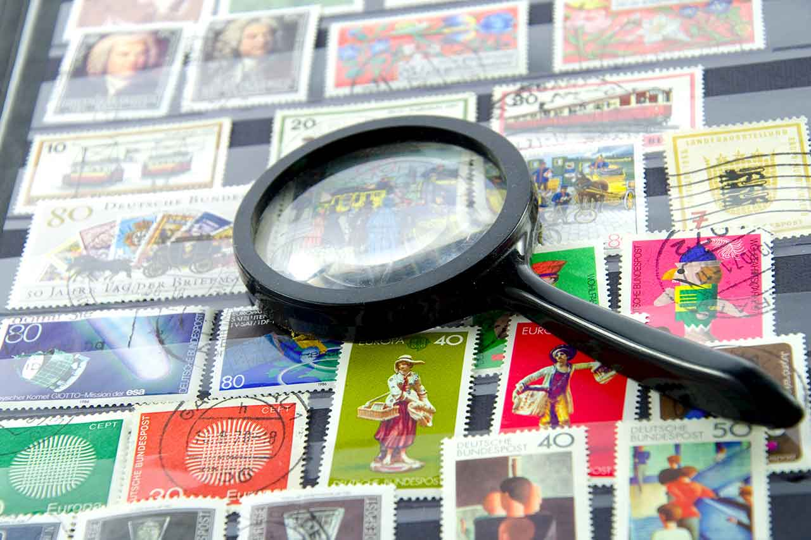

Your **collections** can be ideally **managed** via digital programs and apps. It doesn't matter whether the collection consists of physical items or digital media. The most popular collectibles include coins, stamps, shoes, artwork, toys, trading cards, non-fungible tokens (NFTs), [books](https://seatable.io/en/buecher-katalogisieren/), movies, music (on CD, records) and more. When a collector's passion takes hold, the biggest challenge is often keeping track of everything. This is where the programs that allow you to manage your collection come into play - on your PC or with an app.

What do you collect? © VRD / Adobe Stock

## Why should you manage your collections?

Private individuals and companies manage collections for different reasons. Depending on the reason, there are functions that the management software should enable.

### Use management programs for rankings

One possibility, for example, is to rank items, as is the case in a DVD collection. Here you can rate films with a score from one to five. Later, you can set sorting and filters to rank the films from best to worst or only display films with four stars or more.

### Comparisons, research and more

You can also manage collections to analyze your collection. Programs and apps can be used to make comparisons, either within your own collection or with that of a third party. For example, you can find out which stamps or coins another person has that you do not own. The information in an [art collection](https://seatable.io/en/ausstellungs-und-kunstmanagement-museum-galerie/) can also be used for research. You know exactly which other art objects could fit into the collection and can research accordingly.

### Manage collections in the event of damage

Collection software is also worthwhile in the event of a claim. A scenario: You manage a collection and want to insure it. In the management program, you record which items you own. It serves as a kind of [inventory list](https://seatable.io/en/inventarliste-vorlagen/). Based on this, you then know the value for which you should insure the collection.

### Keeping an eye on storage locations with the collection software

If a collection is located in different places, you can keep an eye on it using an app. This enables users to record data at the various locations. You don't forget which items you have and can keep track of them. If you need something, simply check the app to see where it is. For example, you want to lend out one of your classic cars for a wedding - the app will tell you which garage it is currently in.

### Manage loans from the collection

Collection software is ideal for managing loans. If you lend something from your collection, use the digital tool to record who it is going to. You can also specify the date on which it should be returned. An automatic notification will remind you if this does not happen. On the other hand, you have the option to expand your own collection by lending items. You can then see in the app which items belong to whom.

## What solutions are there for managing collections?

You have various options for managing your collection. There are both paid and free apps and management programs. Below you will find an overview of five tools.

### Evernote - the note app for quickly capturing and managing your collections

One option for managing collections is [Evernote](https://evernote.com/intl/de). Here you can write down notes and attach pictures or documents such as purchase receipts of the items. It is also possible to set tags to distinguish different collections from each other. A search function helps to find collection items within the notes. You start with a free version. The Personal version costs €6.99 per month per user and the Professional version costs €8.99.

Manage collection © monticellllo / Adobe Stock

### Data Crow - Freeware for media management

The [Data Crow](https://www.datacrow.net/) software is particularly suitable for managing collections consisting of media such as [books](https://seatable.io/en/buecher-katalogisieren/), music and images. Here you can create various collections and upload data in AVI, DIVX, XVID, MP3, MP4, OGG, JPG, SVG and PNG format. Data Crow can find further information about the items in your collection online, for example for films via the IMDb rating website. You have the option to share the collection with friends and family and record loans. Data Crow is open source software and is therefore available free of charge for Windows and OS.

### GCstar - free collection software

Another free collection software is [GCstar](http://www.gcstar.org/). This management program has the same functions for recording and managing collections as Data Crow. You also have the option of enriching your collection with information from the Internet. Save the location where you acquired the item and record if you lend the collection item to someone. In addition to media, you can of course also take an inventory of other objects. If you are interested in an open source solution, you can install Data Crow and GCstar on a trial basis and compare the interfaces.

### Niche software for collectors

Apart from general open source collection programs, there are a large number of niche products. For example, you can manage your euro coin collection with **So Many Euros**. **All My Books** only deals with books. **Nyagua** is all about managing aquariums and fish. The **Stamp Manager** app offers a comprehensive digital stamp catalog for Germany, Austria, Switzerland and Liechtenstein, which you can use to estimate the value of your own stamp collection. This app is another example of what is archived and collected.

## SeaTable: Manage collections with the power of a database

[SeaTable](https://de.wikipedia.org/wiki/SeaTable), on the other hand, is a digital tool that does not originate from the collector sector, but is ideal for managing collections. Here you can create clear tables, assign labels, upload images and documents, manage contacts and record loans. The special feature of this solution is its web-based use: you do not need to install any software or app, but can simply log in to the website. In addition, your data is stored in certified German data centers. You can find the free template [here](https://seatable.io/en/vorlage/ebrr3endt7q2zfahahzihq/).

For example, if you collect shoes, your database in SeaTable could look like this:

[Register]() with your e-mail address and start with the free version, which is completely sufficient for private collections. If you need more functions or storage space, switch to the Plus version for €7 per person per month or the Enterprise version for €14 per user per month.

## Conclusion

For collectors, every single collector's item is valuable. You can keep track of them with a suitable collection management app or general management software that is suitable for collections.

The range of collection software is as large and varied as the collections that exist. If you collect fish or classic cars, for example, you will find the right management program online. If, on the other hand, you want to use the same program to manage different collections, it is worthwhile using clearly structured and versatile programs such as SeaTable. With the [free version](), you can manage your collection efficiently in intelligent tables.
