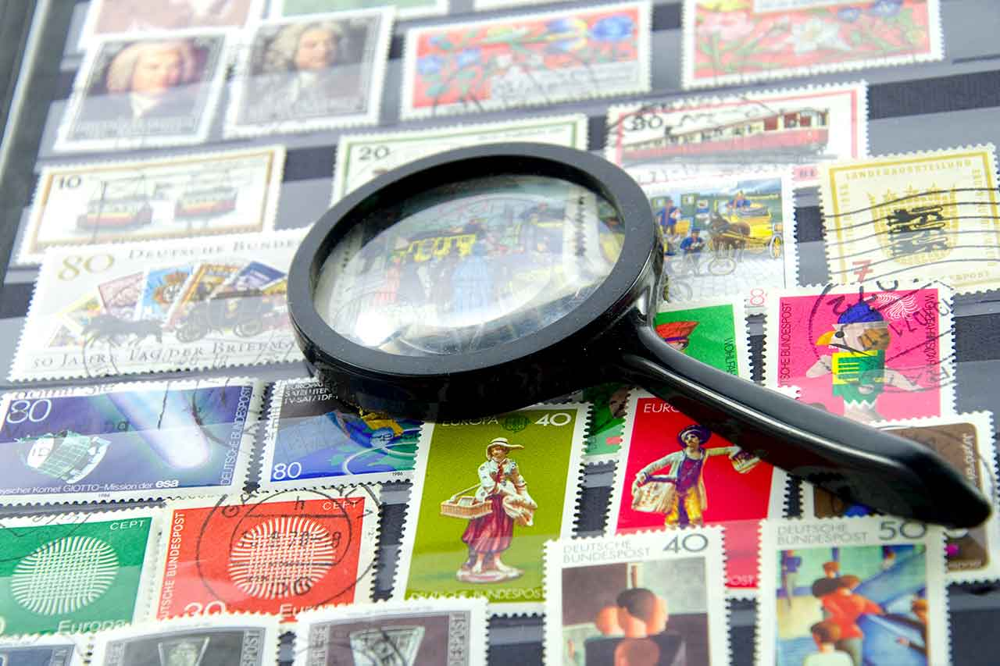
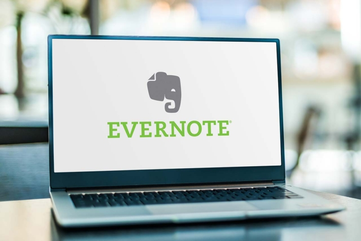

Vos **collections** peuvent être **gérées** de manière idéale via des programmes et des applications numériques. Peu importe que la collection soit constituée d'objets physiques ou de supports numériques. Les objets de collection les plus populaires sont les pièces de monnaie, les timbres, les chaussures, les œuvres d'art, les jouets, les cartes à collectionner, les jetons non fongibles (NFT), les [livres](), les films, la musique (sur CD, disques) et bien plus encore. Lorsqu'un collectionneur est pris de passion, le plus grand défi est souvent de garder une vue d'ensemble. C'est là qu'interviennent les programmes qui vous permettent de gérer votre collection - sur votre PC ou avec une application.

Qu'est-ce que vous collectionnez ? © VRD / Adobe Stock

## Pourquoi gérer vos collections ?

Les particuliers et les entreprises gèrent des collections pour différentes raisons. Selon la raison, il en résulte des fonctions que le logiciel de gestion devrait permettre.

### Utiliser des programmes de gestion pour les classements

Une possibilité est par exemple de classer des objets, comme c'est le cas dans une collection de DVD. Ici, vous pouvez évaluer les films en leur attribuant un score de un à cinq. Plus tard, il est possible de définir des tris et des filtres pour classer les films du meilleur au pire ou pour n'afficher que les films ayant quatre étoiles ou plus.

### Comparaisons, recherches et plus

En outre, vous pouvez gérer des collections afin d'analyser votre collection. Des programmes et des applications permettent de faire des comparaisons, que ce soit dans votre propre collection ou en la comparant à celle d'un tiers. Par exemple, vous pourriez découvrir quels timbres ou pièces de monnaie une autre personne possède et que vous ne possédez pas. Les informations d'une [collection d'art]() permettent en outre de faire des recherches. On sait exactement quels autres objets d'art pourraient faire partie de la collection et on peut faire des recherches en conséquence.

### Gérer les collections en cas de sinistre

Un logiciel de gestion de collection est également utile en cas de sinistre. Un scénario : vous gérez une collection et souhaitez l'assurer. Dans le programme de gestion, vous enregistrez les objets que vous possédez. Il sert en quelque sorte de [liste d'inventaire](). À partir de là, vous savez quelle valeur vous devez assurer pour la collection.

### Garder un œil sur les lieux de stockage grâce au logiciel de collection

Si une collection se trouve à différents endroits, il est possible de garder un œil sur elle à l'aide d'une application. Les utilisateurs sont ainsi en mesure de saisir des données dans les différents lieux. Vous n'oubliez pas quels objets vous possédez et gardez une vue d'ensemble. Si vous avez besoin de quelque chose, il vous suffit de consulter l'application pour savoir où il se trouve. Vous souhaitez par exemple prêter une de vos voitures de collection pour un mariage - l'appli vous indique dans quel garage elle se trouve actuellement.

### Gérer les prêts d'objets de la collection

Les logiciels de collection sont parfaits pour gérer les prêts. Lorsque vous prêtez un objet de votre collection, indiquez dans l'outil numérique à qui il est destiné. Vous fixez éventuellement aussi la date à laquelle il doit être restitué. Une notification automatique vous rappelle si ce n'est pas le cas. D'autre part, vous avez l'option d'élargir votre propre collection par des prêts. Dans l'application, vous voyez ensuite quelles pièces appartiennent à qui.

## Quelles sont les solutions disponibles pour gérer les collections ?

Pour gérer votre collection, vous avez plusieurs possibilités. Il existe des applications et des programmes de gestion payants et gratuits. Vous trouverez ci-dessous un aperçu de cinq outils.

### Evernote - l'application de prise de notes pour une saisie et une gestion rapides de vos collections

Une option pour la gestion des collections est [Evernote](https://evernote.com/intl/de). Vous pouvez y écrire des notes et y joindre des images ou des documents tels que des preuves d'achat des objets. Il est également possible de définir des tags afin de distinguer les différentes collections les unes des autres. Une fonction de recherche permet de retrouver les objets de la collection dans les notes. Vous commencez avec une version gratuite. La version Personal coûte 6,99 € par mois et par utilisateur et la version Professional 8,99 €.

Gérer la collection © monticellllo / Adobe Stock

### Data Crow - Logiciel gratuit de gestion des médias

Le logiciel [Data Crow](https://www.datacrow.net/) est surtout adapté à la gestion de collections composées de médias tels que [des livres](), de la musique et des images. Il vous permet de créer différentes collections et de télécharger des données aux formats AVI, DIVX, XVID, MP3, MP4, OGG, JPG, SVG et PNG. Pour les objets de votre collection, Data Crow trouve des informations complémentaires en ligne, par exemple pour les films, via le site de classement IMDb. Vous avez la possibilité de partager la collection avec vos amis et votre famille et d'enregistrer les prêts. Data Crow est un logiciel open source et est donc disponible gratuitement pour Windows et OS.

### GCstar - logiciel de collection gratuit

Un autre logiciel gratuit pour les collections est [le GCstar](http://www.gcstar.org/). Ce programme de gestion présente les mêmes fonctions de saisie et de gestion des collections que Data Crow. Vous avez également la possibilité d'enrichir votre collection avec des informations provenant d'Internet. Enregistrez l'endroit où vous avez acheté l'objet et si vous le prêtez à quelqu'un. Outre les médias, vous pouvez bien entendu inventorier d'autres objets. Si vous êtes intéressé par une solution open source, vous pouvez installer Data Crow et GCstar à titre d'essai et comparer les interfaces.

### Logiciels de niche pour les collectionneurs

En dehors des programmes de collection open source généraux, il existe une multitude de produits de niche. Vous pouvez par exemple gérer votre collection de pièces d'euros avec **So Many Euros**. **All My Books** ne s'occupe que de livres. **Nyagua** s'occupe de la gestion d'aquariums et de poissons. **Stamp Manager** App propose un vaste catalogue numérique de timbres de l'Allemagne, de l'Autriche, de la Suisse et du Liechtenstein, qui permet d'estimer la valeur de sa collection de timbres. Cette appli est un autre exemple de tout ce qui est archivé et collectionné.

## SeaTable : gérer des collections avec la puissance d'une base de données

[SeaTable](https://de.wikipedia.org/wiki/SeaTable), quant à lui, est un outil numérique qui n'est pas issu du domaine des collectionneurs, mais qui convient parfaitement à la gestion des collections. Vous y créez des tableaux clairs, attribuez des étiquettes, téléchargez des images et des documents, gérez les contacts et notez les prêts. La particularité de cette solution est son utilisation basée sur le web : vous n'avez pas besoin d'installer de logiciel ou d'application, il vous suffit de vous connecter sur le site web. De plus, vos données sont stockées dans des centres de données allemands certifiés. Vous trouverez le modèle gratuit [ici]().

Par exemple, si vous collectionnez des chaussures, votre base de données pourrait ressembler à ceci dans SeaTable :

[Inscrivez-vous]() avec votre adresse e-mail et commencez avec la version gratuite, qui suffit amplement pour les collections privées. Si vous avez besoin de plus de fonctions ou d'espace de stockage, passez à la version Plus pour 7 € par personne et par mois ou à la version Enterprise pour 14 € par utilisateur et par mois.

## Conclusion

Pour les collectionneurs, chaque objet de collection est précieux. Pour garder une vue d'ensemble, il faut utiliser une application de gestion de collection adaptée ou un logiciel de gestion général adapté aux collections.

L'offre de logiciels de collection est aussi vaste et variée que les collections qui existent. Si vous collectionnez par exemple des poissons ou des voitures anciennes, vous trouverez en ligne le programme de gestion adapté à chaque cas. En revanche, si vous souhaitez utiliser un seul et même programme pour gérer différentes collections, il vaut la peine d'opter pour des programmes clairs et polyvalents comme SeaTable. La [version gratuite]() vous permet de gérer efficacement votre collection dans des tableaux intelligents.
