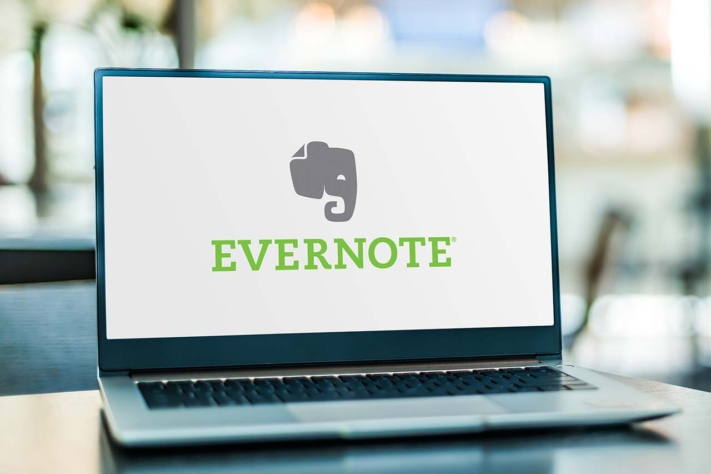

Suas **coleções** podem ser gerenciadas de forma ideal usando programas digitais e aplicativos. Não importa se a coleção é composta por itens físicos ou mídias digitais. Entre os itens de coleção mais populares estão moedas, selos, tênis, obras de arte, brinquedos, cartas colecionáveis, NFTs, [livros](), filmes, música (em CD, vinil) e muito mais. Quando a paixão de um colecionador desperta, o maior desafio costuma ser manter a visão geral. É aí que entram os programas que permitem gerenciar sua coleção – no PC ou em um aplicativo.

O que você coleciona? © VRD / Adobe Stock

## Por que gerenciar suas coleções?

Pessoas físicas e empresas gerenciam coleções por diferentes motivos. Dependendo do motivo, surgem funções que o software de gerenciamento deve oferecer.

### Usar programas de gestão para rankings

Uma possibilidade é, por exemplo, classificar itens, como em uma coleção de DVDs. Aqui, você pode avaliar filmes com uma pontuação de um a cinco. Posteriormente, é possível aplicar ordenações e filtros para classificar os filmes do melhor ao pior ou mostrar apenas aqueles com quatro estrelas ou mais.

### Comparações, pesquisas e mais

Além disso, você pode gerenciar coleções para analisar sua coleção. Com programas e aplicativos, é possível fazer comparações, seja dentro da sua própria coleção ou em comparação com a de terceiros. Por exemplo, você pode descobrir quais selos ou moedas outra pessoa possui que você ainda não tem. Com as informações de uma [coleção de arte](), também é possível realizar pesquisas. Você sabe exatamente quais outros itens de arte poderiam complementar sua coleção e pode pesquisar de acordo.

### Gerenciar coleções para casos de sinistro

O software de coleção também é útil em caso de danos. Um cenário: você gerencia uma coleção e deseja segurá-la. No programa de gerenciamento, você registra quais itens possui. Ele serve como uma espécie de [lista de inventário](). A partir dela, você sabe por qual valor deve segurar a coleção.

### Acompanhar locais de armazenamento com o software de coleção

Se uma coleção está em diferentes locais, você pode monitorá-la com um aplicativo. Assim, os usuários podem registrar dados em vários locais. Você não esquece quais itens possui e mantém a visão geral. Se precisar de algo, basta consultar o aplicativo para saber onde está. Por exemplo, se quiser emprestar um de seus carros antigos para um casamento, o app mostra em qual garagem ele está.

### Gerenciar empréstimos da coleção

O software de coleção é excelente para gerenciar empréstimos. Se você emprestar algo da sua coleção, registre no aplicativo digital para quem foi. Você também pode definir a data de devolução. Uma notificação automática lembra caso não seja devolvido no prazo. Por outro lado, é possível expandir sua própria coleção com itens emprestados. No aplicativo, você vê a quem pertencem os itens.

## Quais soluções existem para gerenciar coleções?

Para gerenciar sua coleção, você tem várias opções. Existem aplicativos e programas de gerenciamento pagos e gratuitos. A seguir, uma visão geral de cinco ferramentas.

### Evernote – o app de notas para registrar e gerenciar rapidamente suas coleções

Uma opção para gerenciar coleções é o [Evernote](https://evernote.com/intl/de). Nele, você pode anotar observações e anexar imagens ou documentos, como comprovantes de compra dos itens. Também é possível usar tags para diferenciar várias coleções. Uma função de busca ajuda a encontrar itens nas notas. Você começa com uma versão gratuita. A versão Personal custa €6,99 por mês por usuário e a Professional €8,99.

Gerenciar coleção © monticellllo / Adobe Stock

### Data Crow – freeware para gerenciamento de mídias

O software [Data Crow](https://www.datacrow.net/) é especialmente indicado para gerenciar coleções de mídias como [livros](), músicas e imagens. Você pode criar diferentes coleções e fazer upload de dados nos formatos AVI, DIVX, XVID, MP3, MP4, OGG, JPG, SVG e PNG. O Data Crow busca informações adicionais online para os itens da sua coleção, como avaliações de filmes no IMDb. É possível compartilhar a coleção com amigos e familiares e registrar empréstimos. O Data Crow é open source e gratuito para Windows e OS.

### GCstar – software gratuito para coleções

Outro software gratuito é o [GCstar](http://www.gcstar.org/). O programa oferece as mesmas funções que o Data Crow para registrar e gerenciar coleções. Também permite enriquecer sua coleção com informações da internet. Você pode salvar onde adquiriu o item e registrar se emprestou o objeto a alguém. Além de mídias, é possível inventariar outros objetos. Se você se interessa por soluções open source, pode testar Data Crow e GCstar e comparar suas interfaces.

### Software de nicho para colecionadores

Além dos programas open source, existem muitos produtos de nicho. Por exemplo, com o **So Many Euros** você gerencia sua coleção de moedas de euro. O **All My Books** é focado apenas em livros. O **Nyagua** é para gerenciar aquários e peixes. O aplicativo **Stamp Manager** oferece um catálogo digital abrangente de selos da Alemanha, Áustria, Suíça e Liechtenstein, permitindo estimar o valor da sua coleção de selos. Este app é mais um exemplo do que pode ser arquivado e colecionado.

## SeaTable: gerencie coleções com o poder de um banco de dados

[SeaTable](https://de.wikipedia.org/wiki/SeaTable) é uma ferramenta digital que não foi criada especificamente para colecionadores, mas é ideal para gerenciar coleções. Nele, você cria tabelas organizadas, atribui etiquetas, faz upload de imagens e documentos, gerencia contatos e registra empréstimos. O diferencial desta solução é o uso web: não é preciso instalar software ou app, basta acessar o site. Além disso, seus dados ficam em data centers certificados na Alemanha. O modelo gratuito está disponível [aqui]().

Se você coleciona tênis, por exemplo, seu banco de dados no SeaTable pode ser assim:

[Cadastre-se]() com seu e-mail e comece com a versão gratuita, suficiente para coleções pessoais. Se precisar de mais funções ou espaço, mude para a versão Plus por €7 por pessoa/mês ou para a versão Enterprise por €14 por usuário/mês.

## Conclusão

Para colecionadores, cada item é valioso. Você mantém a visão geral com um app de gerenciamento de coleções ou um software de gerenciamento geral adequado para coleções.

A oferta de softwares para coleções é tão grande e variada quanto as próprias coleções. Se você coleciona, por exemplo, peixes ou carros antigos, encontrará online o programa certo para cada caso. Se prefere usar um único programa para diferentes coleções, valem a pena soluções versáteis e organizadas como o SeaTable. Com a [versão gratuita](), você gerencia sua coleção com eficiência em tabelas inteligentes.
