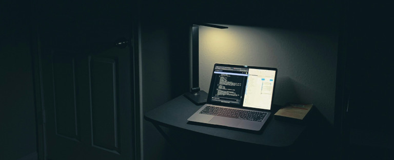
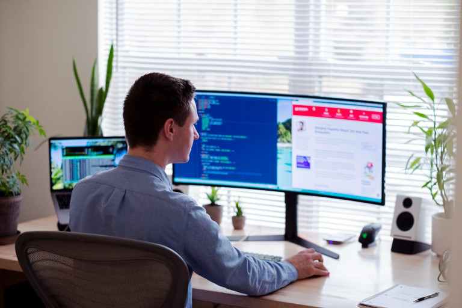

### Principais conclusões

*   Shadow IT refere-se a sistemas de TI e aplicações de software que os funcionários da empresa utilizam sem o conhecimento do departamento de TI.
*   Surge quando a TI oficial não satisfaz os requisitos dos funcionários e estes procuram soluções por si próprios.
*   Como as TI sombra não estão integradas na governação das TI e na gestão dos serviços de TI, comportam riscos elevados para a segurança das TI.
*   Shadow IT pode ser evitada se tiver um departamento de TI bem equipado, uma comunicação aberta, diretrizes claras e soluções modernas sem código, entre outras coisas.
    

## O que é Shadow IT?

Shadow IT refere-se a sistemas de TI e aplicações de software que os funcionários dos departamentos de uma empresa utilizam **sem o conhecimento do departamento de TI** para complementar ou contornar a infraestrutura oficial de TI.

Por definição, Shadow IT não está, portanto, nem técnica nem estrategicamente integrada na [gestão de serviços de TI](), o que acarreta riscos de segurança e outros problemas. Derivado do inglês **Shadow IT**, o termo pretende exprimir o facto de os empregados deixarem as instâncias superiores da empresa às escuras quanto à utilização de ferramentas e processos digitais executados em segredo.

## Exemplos de Shadow IT no quotidiano profissional

Os exemplos de Shadow IT são imensos. Eis alguns exemplos de Shadow IT que todos conhecem e que podem ocorrer em qualquer empresa:

### Ferramentas de IA

Escreve rapidamente um e-mail com o ChatGPT, traduz o relatório anual com o Google Tradutor ou cria uma nova apresentação com o Canva? Muitos funcionários utilizam de forma descuidada ferramentas de IA supostamente inofensivas sem questionar ou informar o departamento de TI da empresa. O que a maioria deles não percebe é que **As ferramentas podem utilizar os textos introduzidos para melhorar os seus serviços ou treinar o seu modelo de IA**, o que representa um grande perigo potencial quando se trata de dados sensíveis. A utilização de chatbots, tradutores em linha e geradores de imagens está atualmente a aumentar e conduz cada vez mais a Shadow IT crítica com riscos para a empresa.

### Aplicações na nuvem

As aplicações Web mencionadas também envolvem **transferência de dados**, normalmente para os EUA, onde estão localizados os servidores dos conhecidos fornecedores de serviços em nuvem. Aí, os fluxos de dados podem ser monitorizados **pelas autoridades dos EUA sem motivo**. O mesmo problema ocorre quando os funcionários utilizam **armazenamento em nuvem**, como Dropbox, WeTransfer ou Google Drive, para partilhar ficheiros rapidamente. Isto raramente acontece de uma forma compatível com a proteção de dados (de acordo com o RGPD da UE), uma vez que todas as pessoas (por exemplo, funcionários ou clientes) devem ter consentido o processamento e a transferência dos seus dados.

### Ferramentas de comunicação

Os funcionários também não devem utilizar **messengers** (por exemplo, WhatsApp), **salas de chat** (por exemplo, Slack) ou **ferramentas de videoconferência** (por exemplo, Zoom) para comunicação profissional sem a verificação e aprovação das TI. Shadow IT é particularmente crítica neste caso, uma vez que as ferramentas de comunicação não autorizadas podem dar aos atacantes acesso a **conteúdos confidenciais de conversas**. O pessoal de TI especializado, por outro lado, presta atenção à encriptação de ponta a ponta e às actualizações regulares para colmatar as lacunas de segurança.

### Gestão de dados

Existem também exemplos de Shadow IT em que a utilização do próprio software é desejável. Imagine uma empresa que depende inteiramente da Microsoft: o departamento de contabilidade utiliza bases de dados Access, o departamento de RH mantém os dados dos empregados em folhas de cálculo [Excel]() e o departamento de vendas regista os dados dos clientes num Microsoft Dynamics [CRM](). Isto revela outro problema: se as TI não coordenarem o desenvolvimento, cada departamento cozinha a sua própria sopa. Isto resulta num **chaos de diferentes processos, aplicações desenvolvidas por si e silos de dados** que não estão integrados entre si e são desconhecidos para o resto da empresa.

### Hardware

Se os funcionários utilizarem **smartphones ou PCs privados** para trabalhar ou se os departamentos adquirirem eles próprios dispositivos como **impressoras ou auscultadores**, isto também é TI sombra. Tal como os exemplos de Shadow IT mencionados acima, o hardware que não faz parte do inventário oficial da empresa também escapa a qualquer controlo, mesmo que isso seja necessário. Isto deve-se ao facto de os dispositivos externos que estão ligados às redes da empresa oferecerem **potenciais portas de entrada para malware**.

De seguida, irá descobrir porque é que Shadow IT ocorre repetidamente nas empresas e o que pode fazer para o evitar.

## Causas de shadow IT

A necessidade é a mãe da invenção: Se houver uma certa **insatisfação com as soluções de TI fornecidas**, isso pode levar a que os funcionários inteligentes procurem eles próprios soluções para os seus problemas e complementem a TI oficial com TI sombra. Isto significa que não têm de perder tempo a formular os seus requisitos e a esperar que o departamento de TI os implemente.  
  
Esta impaciência é compreensível do ponto de vista do utilizador, uma vez que a maioria dos departamentos está sob pressão. No entanto, sem processos digitais eficientes, não podem prestar o serviço pretendido. **Esperar demasiado tempo pela ajuda do departamento de TI** é um incómodo que reduz a produtividade dos funcionários e atrasa o crescimento da empresa.

Shadow IT pode surgir como resultado de

*   Comunicação e coordenação pouco frequentes entre a TI e os departamentos
*   Formalização extensiva (por exemplo, processos complexos e morosos)
*   Falta de orçamento para novo software que satisfaça as necessidades dos utilizadores
*   Excesso de trabalho ou falta de pessoal de TI que mal consegue acompanhar os pedidos
*   Estrutura descentralizada da empresa com um elevado grau de autonomia para os diferentes departamentos
*   Funcionários que não estão conscientes dos riscos de Shadow IT



A TI paralela também é favorecida pelo boom da [IA]() e das [soluções em nuvem](), que oferecem um ponto de entrada de baixo limiar. Muitas das ferramentas utilizadas são **eficientes, fáceis de utilizar, gratuitas e diretamente disponíveis**.



## Quais os riscos que Shadow IT acarreta para as empresas?

Felizmente, pode pensar que os funcionários com experiência em TI nos seus departamentos tomam a solução dos problemas nas suas próprias mãos. Desde que esta iniciativa seja oficialmente desejada e que canalize o empenho para canais ordenados, isto pode ser verdade. No entanto, se os seus funcionários utilizarem ferramentas e programas adicionais sem consultar o departamento de TI, o tiro pode sair pela culatra.

Shadow IT, que é geralmente menos bem concebida e testada do que os sistemas desenvolvidos profissionalmente, comporta **riscos elevados em termos de segurança informática, proteção e integridade dos dados**. Se os departamentos desenvolverem uma vida própria e introduzirem o seu próprio software sem o conhecimento do departamento de TI, rapidamente violam **as regras de conformidade internas e externas**.  

### Os riscos de Shadow IT num relance


As TI sombra escapam à governação das TI. Se a gestão de serviços de TI não tiver uma visão geral das ferramentas utilizadas, não pode incluí-las no suporte e em estratégias futuras, migrações ou actualizações.



As TI sombra raramente são devidamente documentadas, testadas e mantidas. Os erros do sistema ou as aplicações instáveis podem ser o resultado se as soluções de TI forem criadas rapidamente e sem conhecimentos especializados.



Os departamentos podem criar soluções complicadas e isoladas que não estão integradas noutros sistemas. Os silos de dados não sincronizados tornam os processos ineficientes e redundantes.



Muitas vezes, os sistemas de Shadow IT não cumprem as normas de segurança de toda a empresa (por exemplo, encriptação, autenticação), o que os torna vulneráveis a ciberataques e fugas de dados. As instalações não controladas também podem abrir a porta ao malware.



As TI sombra são muitas vezes incompatíveis com a proteção de dados em conformidade com o RGPD, as certificações ISO e outros requisitos. No caso dos serviços em nuvem, a localização dos servidores fora da UE pode ser problemática.



Sem transparência, as empresas perdem rapidamente o controlo dos custos, por exemplo, devido à duplicação de subscrições/licenças para ferramentas semelhantes. Se houver consequências legais devido a violações de conformidade, existe o risco de coimas elevadas.


### Gestão de riscos de TI

Muitos destes pontos também são importantes na gestão de riscos de TI. Isto envolve a avaliação dos riscos para a empresa e a sua ponderação em relação a possíveis alternativas: Dependendo de quanto tempo Shadow IT foi estabelecida sem ser notada, pode ser mais caro paralisar os processos em andamento do que aceitar os riscos até que um substituto adequado esteja disponível, por exemplo.

## Que vantagens pode ter Shadow IT?

Em princípio, os **funcionários motivados e interessados em TI** desempenham um papel importante na condução da transformação digital na sua empresa e na manutenção da sua competitividade. Porquê? Porque conhecem melhor os processos dos seus departamentos e os requisitos do software a desenvolver. **As soluções provisórias de Shadow IT** são, portanto, melhores do que nada e fornecem uma solução rápida enquanto as TI trabalham numa solução permanente.  
  
No entanto, ao contrário dos programadores profissionais, os seus empregados têm poucas ou nenhumas competências em TI e programação. Os exemplos de TI-sombra acima mencionados tornaram claro que muitas pessoas nem sequer se apercebem de que estão a utilizar TI-sombra. Para garantir padrões uniformes de aplicações, deve **formar** os seus empregados sobre os requisitos de conformidade e segurança de TI. Assim, pode até ajudar a aliviar a carga do departamento de TI.



Se quiser ir mais longe, pode capacitar especificamente os funcionários interessados nos departamentos para desenvolverem as suas próprias soluções de software. Pode saber mais sobre este assunto no artigo do blogue sobre [Citizen Development]().



## Como reconhecer Shadow IT

Embora a natureza do Shadow IT seja o facto de ocorrer nos bastidores, os departamentos de TI têm frequentemente uma noção da probabilidade de os exemplos de Shadow IT acima mencionados ocorrerem na organização. Existem basicamente duas abordagens para tornar o Shadow IT visível: **técnica ou organizacional**.

Com o controlo técnico, utiliza **mecanismos de segurança e monitorização** para detetar e impedir as TI sombra. Entre outras coisas, tem as seguintes opções técnicas para a detetar:

-   Utilizando **proxies e firewalls**, pode analisar o **tráfego de Internet** dos seus empregados, por exemplo, o tráfego de dados não autorizado entre os serviços de nuvem e a sua rede.
-   **Cloud Access Security Broker (CASB)** reconhece automaticamente a utilização de serviços em nuvem e pode garantir o cumprimento das diretrizes de conformidade.
-   Faça o inventário de todos os dispositivos da empresa e mantenha o controlo do software instalado nos dispositivos – palavra-chave: **Gestão de terminais / dispositivos móveis**.
    

De uma perspetiva organizacional, Shadow IT pode ser identificada assim que deixa vestígios financeiros: Por exemplo, o departamento de contabilidade pode suspeitar se forem recebidas **facturas recorrentes** de fornecedores de software pouco habituais ou se forem feitos débitos de subscrição nos cartões de crédito da empresa. Em qualquer caso, a abordagem mais eficaz é **falar com os departamentos** e perguntar quais as ferramentas que realmente utilizam.



Certifique-se de que não joga fora a **confiança dos seus empregados** efectuando controlos excessivos e ameaçando com penalizações para Shadow IT. Em vez disso, uma governação clara das TI é a melhor forma de comunicar de forma transparente aos empregados os riscos associados às TI sombra e as políticas que são importantes para a [segurança das TI]().



## Tratamento profissional de Shadow IT

Shadow IT não é normalmente o resultado de malícia, mas sim de pressão de tempo, insatisfação ou descuido por parte dos seus empregados. Se descobrir sistemas de TI não desejados na sua empresa, **um tom calmo mas firme** ajuda a lidar com Shadow IT. Explique aos colegas envolvidos nos departamentos que precisa de saber sobre a introdução e utilização de sistemas de TI, para que possa verificá-los quanto a possíveis riscos de TI e violações de conformidade.
  
Em seguida, encontre **soluções conjuntas** sobre a forma de integrar os sistemas não autorizados no cenário de TI existente, satisfazer as necessidades do departamento e, possivelmente, otimizar ainda mais os processos. Desta forma, pode criar um clima positivo em que **a TI é vista como um amigo e um ajudante** e em que os funcionários têm todo o gosto em contactá-lo, em vez de lhe esconderem as suas soluções de TI paralelas.

## Dicas práticas sobre como evitar Shadow IT

Em resumo, temos as seguintes recomendações de ação para controlar Shadow IT e eliminar as suas causas:

-   **Reforce o departamento de TI**: Para poder atuar e estar presente, o departamento de TI precisa, antes de mais, de recursos suficientes, ou seja, tempo, dinheiro e pessoal.
-   **Abra a comunicação**: Converse regularmente com os departamentos sobre as suas necessidades informáticas e sobre os processos informáticos que podem funcionar ainda melhor.
-   **Governação clara das TI**: Deixe claro o que é permitido e o que não é. Informe os funcionários sobre os riscos de TI e explique por que razão as regras de conformidade fazem sentido.
-   **Soluções pragmáticas**: As modernas plataformas sem código permitem que os seus funcionários desenvolvam eles próprios fluxos de trabalho e aplicações, em estreita colaboração com as TI.

## SeaTable apoia os colaboradores aficionados por informática

Como **plataforma IA sem código**, SeaTable pode contribuir significativamente para canalizar o impulso dos funcionários com experiência em TI e permitir-lhes desenvolver as suas próprias aplicações dentro de uma estrutura predefinida. Basta fornecer aos seus departamentos uma caixa de ferramentas contendo **módulos de software apropriados** com os quais eles podem mapear, otimizar e automatizar os seus processos de forma flexível.
  
Em vez de esperar semanas que o departamento de TI as implemente, os colaboradores podem simplesmente concretizar as suas ideias. Isto permite-lhe **aliviar o departamento de TI e acelerar o desenvolvimento de soluções personalizadas**. SeaTable cumpre as rigorosas diretrizes de conformidade, aumenta a satisfação dos colaboradores e elimina assim o terreno fértil para Shadow IT.

O seu departamento de TI pode implementar SeaTable através da nuvem ou no local - dependendo se prefere a conveniência e a escalabilidade do [SeaTable Cloud]() ou se prefere utilizar [SeaTable Server]() na sua própria infraestrutura de TI para garantir a total soberania dos dados e os mais elevados padrões de segurança.



Receba a nossa **newsletter** e mantenha-se atualizado sobre segurança de TI e proteção de dados!



## Perguntas frequentes sobre Shadow IT


A definição comum de Shadow IT inclui todos os sistemas de TI, programas de software, aplicações, ferramentas de IA e dispositivos que os funcionários de uma empresa utilizam sem o conhecimento do departamento de TI para complementar ou contornar a infraestrutura de TI oficial. De acordo com esta definição, Shadow IT não está técnica nem estrategicamente integrada na gestão dos serviços de TI, o que implica uma série de riscos informáticos. O termo deriva do inglês "Shadow IT".



As TI sombra não detectadas implicam inúmeros riscos, por exemplo, a perda de controlo por parte do departamento de TI, soluções isoladas mal integradas e silos de dados, custos ocultos devido a estruturas duplicadas e sistemas não testados que põem em causa a segurança e a conformidade das TI.



A Shadow IT pode ser evitada principalmente através de um departamento de TI bem equipado, de uma comunicação aberta, de diretrizes claras e de soluções modernas sem código.

