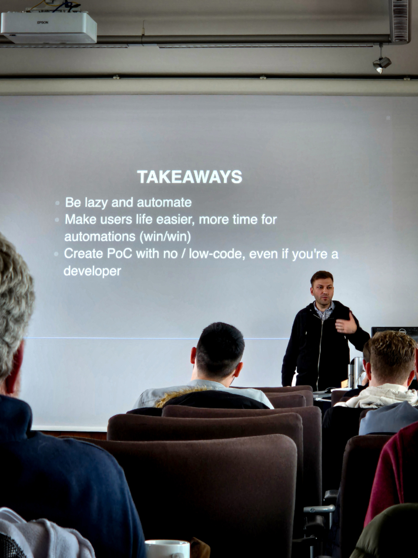

Die **SeaDays 2024** sind vorbei, und wir blicken auf zwei intensive und inspirierende Tage im Senatssaal der Universität Mainz zurück. Zum zweiten Mal trafen sich etwa 50 Teilnehmer – darunter Administratoren und Projektverantwortliche – um die neuesten Entwicklungen rund um Seafile und SeaTable zu diskutieren und ihr Feedback einzubringen.

Tag eins drehte sich alles um **Seafile**, die **leistungsstarke Sync-and-Share-Lösung**. Die Teilnehmer hatten die einzigartige Gelegenheit, direkt mit den Entwicklern zu sprechen, geplante Features kennenzulernen und ihre eigenen Wünsche und Ideen zu platzieren. Am zweiten Tag lag der Fokus auf **SeaTable**, der **No-Code-Datenbank- und App-Building-Lösung**, bei der die Community die Möglichkeit hatte, sich intensiv über Best Practices, Herausforderungen und Zukunftspläne auszutauschen.

Ob große All-in-One-Lösungen oder kleinere Projekte – die SeaDays boten die perfekte Plattform für den persönlichen Austausch und die Vernetzung innerhalb der Seafile- und SeaTable-Community. Ein herzlicher Dank geht an unsere Speaker **Eloy Crespo**, **Stephan Lehniger**, **Ko Smidt**, **Matthias van Laar**, **Lisa Kleinman**, **Christian Livadaru** und **Stephan Heinrich**, die dieses Event möglich gemacht haben!

Alle Teilnehmer der SeaDays 2024.

## Erkenntnisse, die begeistern und inspirieren

Neben neuen Einblicken in **spannende Entwicklungen** förderte die Veranstaltung auch **rege Diskussionen** und **inspirierende Gespräche**. Die Begeisterung war spürbar – vor allem bei den Neuheiten, die bei einigen leuchtende Augen hervorriefen.

Ein besonders interessantes Thema, das häufig aufgegriffen wurde, war die Möglichkeit, Daten **on-premises** zu hosten. Die zunehmende Sensibilität für Datensicherheit und der Wunsch nach maßgeschneiderten Lösungen haben uns gezeigt: Die Nachfrage nach On-Premises-Optionen ist hoch. Für uns war dies eine wertvolle Erkenntnis, die zeigt, dass wir mit unserem Angebot den richtigen Weg einschlagen.

Einer der Höhepunkte war die Q&A-Runde mit unseren Entwicklern Jonathan und Daniel. Beide nahmen sich ausgiebig Zeit, um auf die zahlreichen Fragen der Teilnehmer einzugehen. Dieser direkte Austausch war eine großartige Gelegenheit, tiefer in technische Details einzutauchen und ihre Ideen und Bedenken offen anzusprechen.

Am Abend ging es zum gemütlichen Ausklang in eine Mainzer Gasthausbrauerei. Bei leckerem Essen und entspannten Gesprächen konnten die Teilnehmer neue Kontakte knüpfen und sich in lockerer Runde über die Eindrücke des Tages austauschen.

### Positives Feedback und neue Impulse

Das Feedback zur Veranstaltung war überwältigend positiv. Mit einer durchschnittlichen Bewertung von 5,5 von 6 Punkten spiegelte sich die hohe Zufriedenheit der Teilnehmer deutlich wider. Besonders erfreulich: Alle Befragten gaben an, auch im nächsten Jahr wieder dabei sein zu wollen. Natürlich gibt es immer Raum für Verbesserungen, und wir nehmen das Feedback unserer Teilnehmer sehr ernst, um die SeaDays noch weiter zu optimieren und auch im nächsten Jahr wieder ein erfolgreiches Event zu gestalten.

Die Teilnehmer lauschen gespannt den Neuigkeiten.

## Neuigkeiten und Highlights zu SeaTable & Seafile

Die SeaDays boten eine gelungene Mischung aus technischen Tiefgängen, praxisnahen Präsentationen und einer gesunden Prise Humor. Besonders spannend für Administratoren und Entwickler waren die Präsentationen zu den fortgeschrittenen Container-Deployment-Optionen für Seafile, bei denen Technologien wie **Docker** und **Kubernetes** im Fokus standen. Die Vorstellung der **Workflow-Automatisierung** mit Seafile und n8n zeigte, wie Unternehmen durch Automatisierung repetitive Aufgaben effizienter gestalten können.

Ein weiteres Highlight war die Demonstration, wie man mit Hilfe von KI **automatisch [Python-Skripte]() generieren** kann, um Automationen in SeaTable zu erstellen. Abgerundet wurde das Ganze durch unterhaltsame Beiträge wie „**How to mess up every IT project**“, der mit einem Augenzwinkern zeigte, was man besser vermeiden sollte.

### Ein Ausblick auf kommende Releases bei SeaTable

SeaTable-Nutzer konnten sich über spannende Neuigkeiten freuen: Die **überarbeitete Chart-Funktion** besticht durch ein einheitlicheres Design und erweiterte Anpassungsmöglichkeiten, die es Nutzern erleichtern, ihre Daten visuell ansprechend und übersichtlich darzustellen. Ein weiterer Meilenstein ist die **Einführung eines API-Gateways**, das die Konsistenz und Leistung der APIs erheblich verbessert und so die Integration externer Anwendungen optimiert. Auch der Editor für Langtexte wurde verfeinert und bietet nun eine **intuitivere Inline-Bearbeitung**, die das Arbeiten an längeren Inhalten noch komfortabler gestaltet.

Die Vision für die kommende Version 6 von SeaTable legt den Fokus auf die Verfeinerung bestehender Funktionen und eine noch bessere Benutzerfreundlichkeit. Zu den geplanten Neuerungen zählen erweiterte Möglichkeiten zur Datenverknüpfung zwischen verschiedenen Datenbanken. Außerdem ist der Einsatz innovativer **KI-Assistenten** geplant, die die Datenverarbeitung intelligenter und effizienter machen sollen.

Christoph Dyllick-Brenzinger, einer der beiden Gründerbrüder von SeaTable.

### Ein Ausblick auf kommende Releases bei Seafile

Die Entwickler Jonathan und Daniel haben mit **SeafilePlus** eine innovative Weiterentwicklung im Bereich des Dateimanagements vorgestellt. SeafilePlus setzt auf ein intelligentes System zur Organisation von Dateien, das mit einer Vielzahl an flexiblen Eigenschaften arbeitet. Zu den wichtigsten Funktionen gehören **tabellarische Ansichten**, **Smart Folders** und die **Verwendung von Tags**, die es Nutzern ermöglichen, ihre Dateien noch effizienter zu verwalten.

Ein Highlight ist dabei die Integration von KI-gestützten Features. Die künstliche Intelligenz übernimmt dabei zeitraubende Aufgaben und erstellt beispielsweise automatisch Dateieigenschaften, erkennt ähnliche Fotos, extrahiert Texte aus Bildern und generiert Zusammenfassungen von Dokumenten. SeafilePlus bietet damit eine fortschrittliche und benutzerfreundliche Lösung für die Verwaltung großer Datenmengen, die sowohl Produktivität als auch Übersichtlichkeit fördert.

Die Präsentation gab auch einen Ausblick auf die Zukunft: SeafilePlus soll 2025 als SaaS-Lösung auf den Markt kommen. Einige der fortschrittlichen Funktionen werden zudem in die bestehenden Seafile-Versionen integriert.

Daniel Pan, Chief Executive Officer (CEO) der Seafile Ltd.

### Datensicherheit & Pen-Test

Cybersecurity bleibt eine permanente Herausforderung. SeaTable setzt auf eine proaktive Strategie, um den Schutz im digitalen Raum kontinuierlich zu stärken. Die bisherigen Sicherheitsmaßnahmen umfassen **HTTPS-Verschlüsselung**, sichere **Cookie-Verwaltung**, **Eingabevalidierung** sowie das **Prinzip der minimalen Berechtigungen**, das sicherstellt, dass jeder Nutzer nur die notwendigen Zugriffsrechte erhält.

Weitere Sicherheitsmaßnahmen für SeaTable Version 5.1 wurden mit dem **Penetrationstest** eingeleitet, durchgeführt von der renommierten Sicherheitsfirma SRC Security Consulting. Die Ergebnisse zeigen, dass keine kritischen Sicherheitslücken identifiziert wurden.

Als nächster großer Schritt steht die **BSI-Zertifizierung** für die kommende Version 6.0 auf der Agenda – ein Meilenstein, der SeaTable weiter als sichere und zuverlässige Plattform positionieren wird.

### Neues SeaTable Plugin: Tree

Ein spannendes Feature, das vorgestellt wurde, ist das neue SeaTable-Plugin “**Tree**“. Dieses Plugin ermöglicht es Nutzern, Daten in einer Baumstruktur zu organisieren, was die Navigation durch verschachtelte Tabellen erheblich vereinfacht. Mit Funktionen wie zusammenklappbaren Ebenen, individueller Spaltenbreite und der Möglichkeit, neue Zeilen zu erstellen oder bestehende zu aktualisieren, ist das Baum-Plugin ein leistungsstarkes Werkzeug für das Management komplexer Datensätze. Besonders nützlich ist die sortierbare Darstellung in bis zu drei Ebenen, die mehr Flexibilität bei der Organisation von Daten bietet.

Selbst das regnerische Wetter konnte die Stimmung auf den SeaDays nicht trüben.

## Seafile im Einsatz: Einblicke in Use Cases und Integrationen

Am ersten Tag der SeaDays erhielten die Teilnehmer spannende Einblicke in die vielseitige Anwendung von Seafile im Unternehmensumfeld. Besonders im Fokus stand die Integration einer Office-Lösung in Seafile sowie die Präsentation einer ganzheitlichen Lösung für Unternehmen, die mit sensiblen Daten arbeiten.

### Produktives Arbeiten in Echtzeit mit Collabora

Eloy Crespo von Collabora stellte die Integration der **browserbasierten Open-Source-Office-Lösung** Collabora Online mit Seafile vor. Diese Kombination ermöglicht es Teams, Office-Dokumente in Echtzeit gemeinsam zu bearbeiten und Änderungen sofort live zu sehen – ideal für ein agiles und kollaboratives Arbeitsumfeld.

Bei der Bearbeitung startet Collabora Online automatisch in einem separaten Browser-Tab, wenn ein Dokument in Seafile geöffnet wird. Die Anpassungen werden nahtlos in Seafile gespeichert, was eine **reibungslose Zusammenarbeit** ermöglicht. Diese Lösung bietet Teams, die von überall auf der Welt zusammenarbeiten, Flexibilität und Effizienz, egal ob sie ihre Daten on-premises oder in der Cloud hosten.

### Innovative Einsatzszenarien bei SecUnity

Ein besonderes Highlight am ersten Tage der SeaDays war die Präsentation von Stephan Lehniger, Gründer und Geschäftsführer von SecUnity. Als erfahrener Sicherheitsexperte zeigte Lehniger, wie sein Unternehmen Seafile als Rückgrat für nahezu alle Geschäftsprozesse nutzt.

Von der Wissensdatenbank bis zum Kundenbeziehungsmanagement – Seafile hat sich bei SecUnity als unverzichtbares Tool etabliert. Besonders spannend ist der Plan, Seafile als Grundlage für eine Threat Intelligence Sharing Platform (TISP) zu verwenden. Diese innovative Anwendung unterstreicht das enorme Potenzial von Seafile im Bereich Cybersicherheit. Für Unternehmen auf der Suche nach robusten Lösungen für Dateimanagement und Zusammenarbeit bot diese Präsentation viele konkrete Beispiele und Inspiration.

Ko Smidt erklärt den Ablauf des Prüfungsprozesses an Niederländischen Schulen.

## SeaTable im Einsatz: Einblicke in Use Cases und Integrationen

Am zweiten Tag der SeaDays drehte sich alles um SeaTable und seine vielseitigen Einsatzmöglichkeiten. Von Workflow-Automatisierung über Prozessoptimierung in Schulen bis hin zu KI-gestützter Content-Erstellung – die Teilnehmer erhielten spannende Einblicke, wie SeaTable Unternehmen und [öffentliche Einrichtungen]() unterstützen kann.

### Clevere Automationen am Johannes Fontanus College

Am Johannes Fontanus College in den Niederlanden hat Lehrer Ko Smidt den **Korrekturprozess von Abschlussprüfungen** mit der Hilfe von SeaTable revolutioniert. Dank cleverer Automationen können sie nun jederzeit nachvollziehen, wo sich die Prüfungen befinden und in welchem Status sie sind – ob am Exam Desk, im Empfang, auf dem Postweg zur Zweitkorrektur in einer anderen Schule oder bereits zurück im Haus. Diese Transparenz sorgt für eine deutlich bessere Übersicht im gesamten Prüfungsprozess.

Darüber hinaus wurde auch die Vergabe von IT-Geräten und das Melden von Geräteschäden über SeaTable organisiert. So behält IT-Experte Matthis van Laar stets den Überblick über alle Vorgänge und kann sicherstellen, dass technische Probleme schnell und strukturiert bearbeitet werden.

Ko Smidt, Lehrer für “Music” und “Research & Design” am Johannes Fontanus College (Niederlande).

### Intuitive Prozessautomatisierung mit Make

Lisa Kleinman von Make präsentierte eindrucksvoll, wie einfach und wirkungsvoll **Prozessautomatisierung im Arbeitsalltag** sein kann. Mit Make lassen sich Automationen intuitiv erstellen, ohne dass tiefgehende technische Kenntnisse erforderlich sind. Besonders spannend ist die Verbindung zwischen Make und SeaTable: Kleinman zeigte, wie SeaTable-Nutzer mit Make mühelos **Workflows automatisieren** können, um repetitive Aufgaben effizient zu erledigen.

Durch diese Kombination können Unternehmen ihre Daten in SeaTable nutzen, um automatisierte Prozesse in Make zu triggern – zum Beispiel, um Benachrichtigungen zu versenden, Aufgaben zu erstellen oder Daten mit anderen Tools zu synchronisieren. Das Ergebnis: eine enorme Zeitersparnis und ein optimierter Arbeitsfluss, der den Alltag deutlich erleichtert.

Lisa Kleinman von Make mit Christoph Dyllick-Brenzinger, einer der Gründer von SeaTable.

### Individuelle Kundenbestellungen mit n8n bei LcX.at

Christian Livadaru, Geschäftsführer des IT-Unternehmens LcX.at, hat sein komplettes **Auftragsmanagement** erfolgreich digitalisiert – und zwar mithilfe von SeaTable und n8n. SeaTable fungiert dabei als flexible und leistungsstarke Datenbanklösung, während n8n die Automatisierung der Arbeitsprozesse übernimmt. Diese Kombination ermöglicht es ihm, Arbeitsabläufe effizient zu strukturieren und Aufträge in Echtzeit nahtlos nachzuverfolgen.

Livadaru setzt außerdem ein beeindruckendes Beispiel für den Nutzen des No-Code-App-Builders. Denn damit lassen sich Proof-of-Concepts (PoCs) schnell und unkompliziert umsetzen, was die Entwicklung beschleunigt und erste Ergebnisse in kürzerer Zeit möglich macht. Seine Erfahrung zeigt, dass SeaTable auch für Entwickler eine vielseitige und leistungsfähige Plattform bietet, um effizient und zielgerichtet voranzukommen.

Cristian Livadaru, Geschäftsführer der LcX.at aus Wien.

### Automatisierte Content-Erstellung durch Content Butler

Stephan Heinrich von Content Butler zeigte eindrucksvoll, wie sich mit Hilfe von SeaTable und der OpenAI API automatisiert Content auf Knopfdruck erstellen lässt. In seiner Demonstration präsentierte er eine clever aufgebaute SeaTable-Base, die mit Unternehmensinformationen gefüttert wird und als Grundlage für die **automatisierte Content-Erstellung** dient.

Besonders faszinierend: In der Base können wichtige Parameter wie Contentstil, Thema, Zielgruppe und weitere Feinabstimmungen hinterlegt werden. Diese Daten werden dann genutzt, um automatisch ein Prompt zu generieren, mit dem in wenigen Sekunden Social Media Posts, Blogartikel oder andere Texte, sogar inklusive Bildmaterial, erstellt werden. Auf diese Weise wird die Content-Produktion massiv beschleunigt – ideal für Unternehmen, die regelmäßig frischen Content benötigen.

Stephan Heinrich, Geschäftsführer der Content Butler GmbH.

## Was die SeaDays 2024 so besonders gemacht hat

Die SeaDays 2024 sind offiziell vorbei, und wir möchten die Gelegenheit nutzen, um uns bei allen herzlich zu bedanken, die dieses Event so besonders gemacht haben.

Zunächst ein riesiges Dankeschön an unsere **Teilnehmer**! Viele von Ihnen haben weite Anreisen in Kauf genommen, um an unseren SeaDays teilzunehmen, und wir sind überwältigt von Ihrem Engagement und Interesse.

Ein besonderer Dank gilt auch unseren **Speakern**, die uns durch ihre fesselnden Präsentationen zu SeaTable und Seafile inspiriert haben. Durch Ihre Einblicke in die vielfältigen Möglichkeiten haben Sie nicht nur unsere Perspektive erweitert, sondern auch die Kreativität und Ideen der Teilnehmer angeregt.

Ein riesiges Lob an unsere **Entwickler**, Jonathan und Daniel. Ihre Expertise und Ihr Engagement waren beeindruckend. Sie haben sich Zeit genommen, um jede einzelne Frage in den Q&A-Sessions detailliert zu beantworten und die Weiterentwicklungen von SeaTable und Seafile zu präsentieren. Ihr Beitrag war ein zentraler Bestandteil des Events, und wir wissen Ihre harte Arbeit sehr zu schätzen.

Die Seadays 2024 haben einmal mehr gezeigt, wie wichtig der Austausch von **Erfahrungen** und **Best Practices** in der Community ist. Ihre Rückmeldungen und Ideen treiben uns an und helfen uns dabei, SeaTable und Seafile stetig weiterzuentwickeln. Vielen Dank, dass Sie uns auf diesem spannenden Weg begleiten. Bis zum nächsten Jahr!
