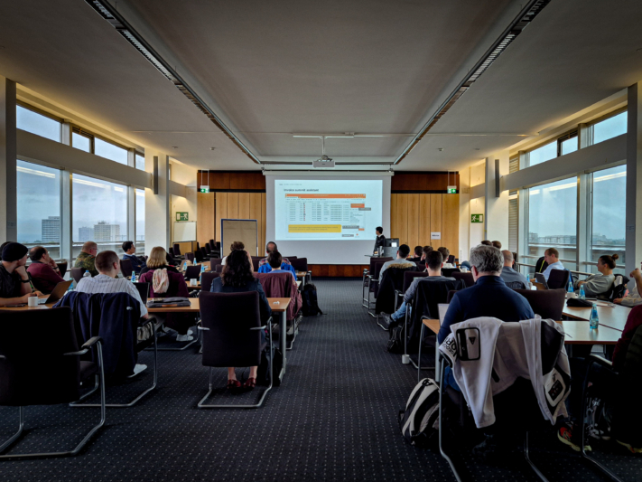
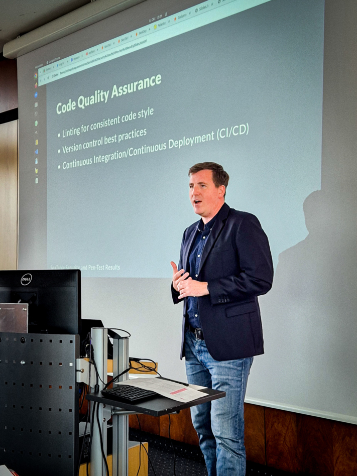
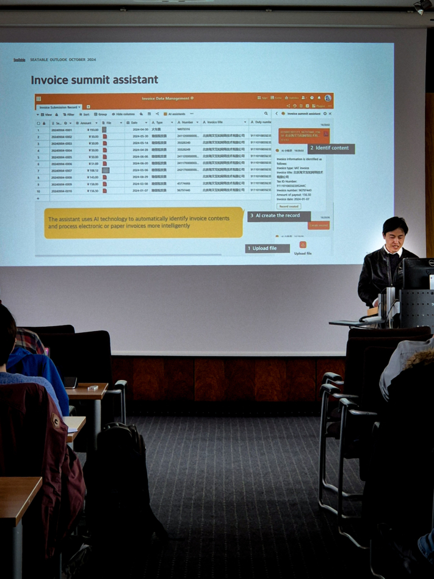
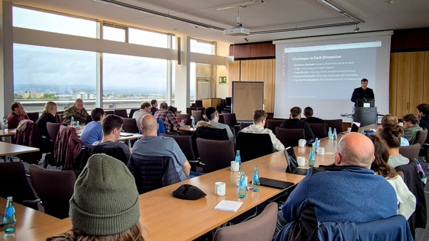
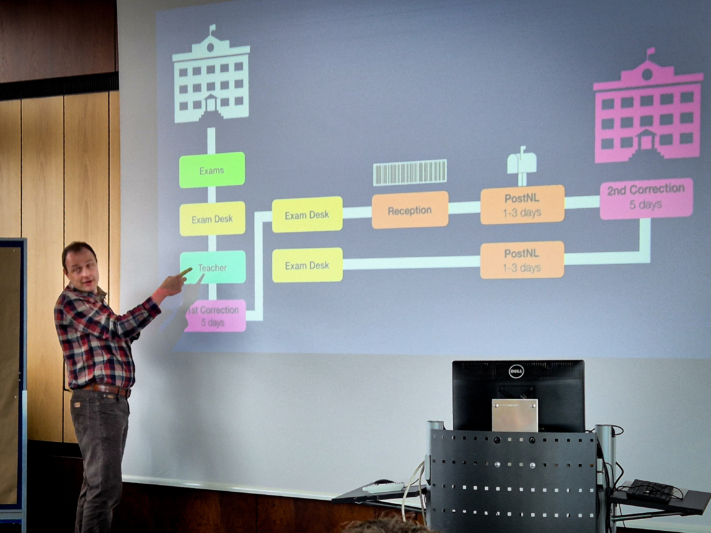
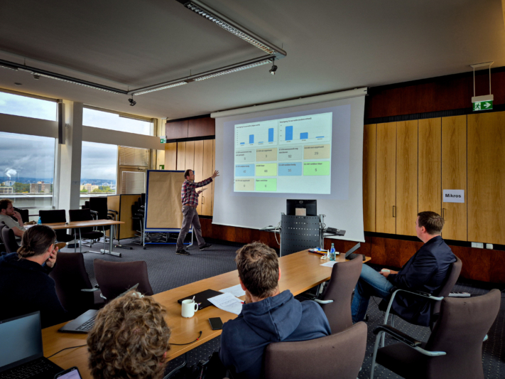
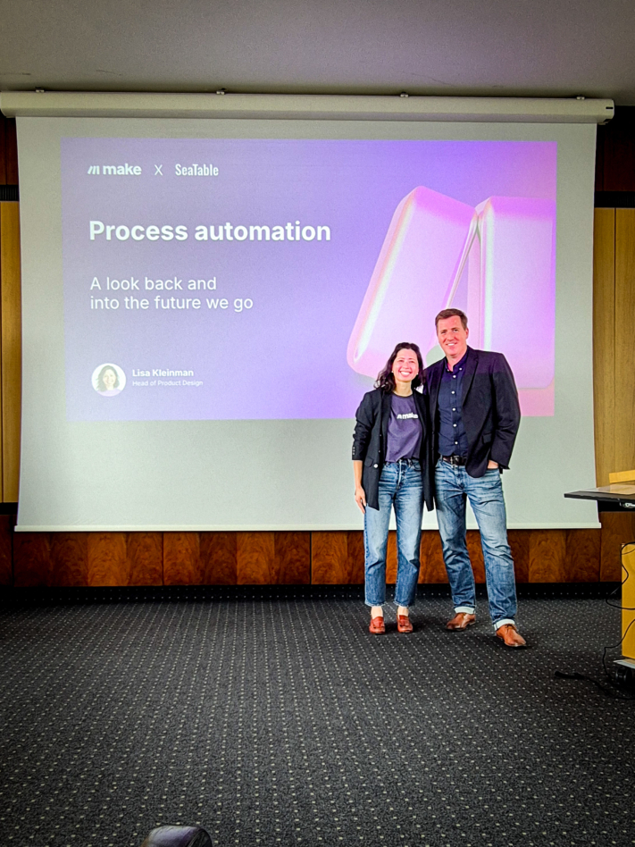
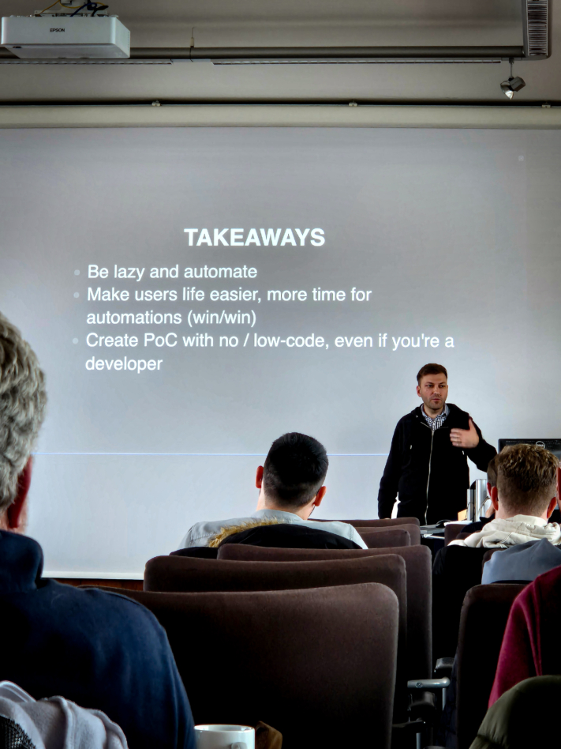
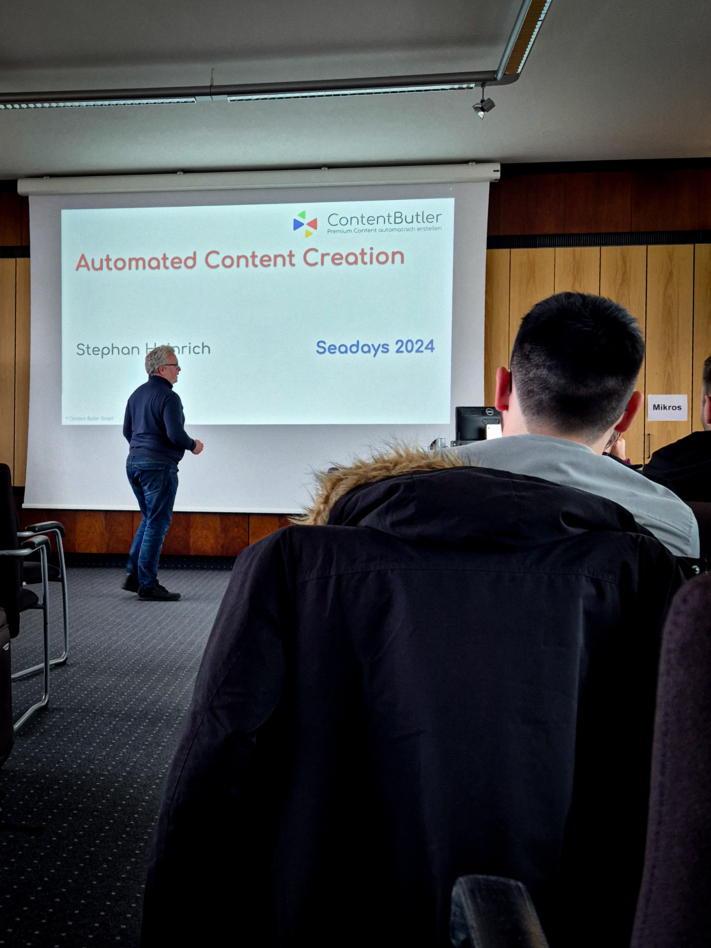

**SeaDays 2024** is over, and we can look back on two intensive and inspiring days in the Senate Hall of Mainz University. For the second time, around 50 participants - including administrators and project managers - met to discuss the latest developments around Seafile and SeaTable and to provide their feedback.

Day one was all about **Seafile**, the **powerful sync-and-share solution**. Participants had the unique opportunity to talk directly to the developers, learn about planned features and put forward their own wishes and ideas. On the second day, the focus was on **SeaTable**, the **no-code database and app-building solution**, where the community had the opportunity to discuss best practices, challenges and future plans in depth.

Whether large all-in-one solutions or smaller projects - the SeaDays provided the perfect platform for personal exchange and networking within the Seafile and SeaTable community. Many thanks to our speakers **Eloy Crespo**, **Stephan Lehniger**, **Ko Smidt**, **Matthias van Laar**, **Lisa Kleinman**, **Christian Livadaru** and **Stephan Heinrich** for making this event possible!

All participants of SeaDays 2024.

## Insights that excite and inspire

In addition to new insights into **exciting developments**, the event also fostered **lively discussions** and **inspiring conversations**. The enthusiasm was palpable - especially when it came to the new products, which made some people's eyes light up.

One particularly interesting topic that was frequently addressed was the possibility of hosting data **on-premises**. The increasing awareness of data security and the desire for customized solutions have shown us that on-premises solutions are in high demand: The demand for on-premises options is high. This was a valuable insight for us and shows that we are on the right track with our offering.

One of the highlights was the Q&A session with our developers Jonathan and Daniel. Both took plenty of time to answer the numerous questions from the participants. This direct exchange was a great opportunity to dive deeper into technical details and openly address their ideas and concerns.

In the evening, the event ended in a pub brewery in Mainz. Over delicious food and relaxed conversation, the participants were able to make new contacts and share their impressions of the day in a relaxed atmosphere.

### Positive feedback and new impetus

The feedback on the event was overwhelmingly positive. With an average rating of 5.5 out of 6 points, the participants' high level of satisfaction was clearly reflected. What was particularly pleasing was that all respondents stated that they would like to attend again next year. Of course, there is always room for improvement, and we take the feedback from our participants very seriously in order to further optimize SeaDays and make it a successful event again next year.

The participants listen intently to the news.

## News and highlights about SeaTable & Seafile

SeaDays offered a successful mix of technical deep dives, practical presentations and a healthy dose of humor. Particularly exciting for administrators and developers were the presentations on advanced container deployment options for Seafile, which focused on technologies such as **Docker** and **Kubernetes** were the focus. The presentation on **workflow automation** with Seafile and n8n showed how companies can use automation to make repetitive tasks more efficient.

Another highlight was the demonstration of how AI can be used to **automatically generate [Python scripts](https://seatable.io/en/docs/javascript-python/unterstuetzte-python-bibliotheken/)** to create automations in SeaTable. The whole event was rounded off with entertaining contributions such as "**How to mess up every IT project**", which showed with a wink what should be avoided.

### An outlook on upcoming releases at SeaTable

SeaTable users can look forward to exciting news: the **revised chart function** boasts a more uniform design and extended customization options that make it easier for users to present their data in a visually appealing and clear way. Another milestone is the **introduction of an API gateway**, which significantly improves the consistency and performance of the APIs and thus optimizes the integration of external applications. The editor for long texts has also been refined and now offers **more intuitive inline editing**, which makes working on longer content even more convenient.

The vision for the upcoming version 6 of SeaTable focuses on the refinement of existing functions and an even better user experience. The planned innovations include extended options for linking data between different databases. The use of innovative **AI assistants** is also planned to make data processing more intelligent and efficient.

Christoph Dyllick-Brenzinger, one of the two founding brothers of SeaTable.

### An outlook on upcoming releases at Seafile

The developers Jonathan and Daniel have introduced **SeafilePlus**, an innovative further development in the field of file management. SeafilePlus is based on an intelligent system for organizing files that works with a variety of flexible features. The most important functions include **tabular views**, **smart folders** and the **use of tags**, which enable users to manage their files even more efficiently.

One highlight is the integration of AI-supported features. The artificial intelligence takes over time-consuming tasks and automatically creates file properties, recognizes similar photos, extracts text from images and generates summaries of documents, for example. SeafilePlus thus offers an advanced and user-friendly solution for managing large volumes of data that promotes both productivity and clarity.

The presentation also gave an outlook on the future: SeafilePlus is to be launched as a SaaS solution in 2025. Some of the advanced functions will also be integrated into the existing Seafile versions.

Daniel Pan, Chief Executive Officer (CEO) of Seafile Ltd.

### Data security & pen test

Cybersecurity remains a permanent challenge. SeaTable relies on a proactive strategy to continuously strengthen protection in the digital space. The security measures taken to date include **HTTPS encryption**, secure **cookie management**, **input validation** and the **principle of minimal authorizations**, which ensures that each user only receives the necessary access rights.

Further security measures for SeaTable version 5.1 were initiated with the **penetration test** carried out by the renowned security company SRC Security Consulting. The results show that no critical security vulnerabilities were identified.

The next big step on the agenda is **BSI certification** for the upcoming version 6.0 - a milestone that will further position SeaTable as a secure and reliable platform.

### New SeaTable plugin: Tree

An exciting feature that has been introduced is the new SeaTable plugin "**Tree**". This plugin allows users to organize data in a tree structure, making it much easier to navigate through nested tables. With features such as collapsible levels, custom column widths and the ability to create new or update existing rows , the Tree plugin is a powerful tool for managing complex data sets. Particularly useful is the sortable display in up to three levels, which offers more flexibility when organizing data.

Even the rainy weather couldn't dampen the mood at SeaDays.

## Seafile in use: Insights into use cases and integrations

On the first day of SeaDays, participants were given exciting insights into the versatile application of Seafile in the corporate environment. The focus was particularly on the integration of an office solution in Seafile and the presentation of a holistic solution for companies that work with sensitive data.

### Work productively in real time with Collabora

Eloy Crespo from Collabora presented the integration of the **browser-based open source office solution** Collabora Online with Seafile. This combination enables teams to work on Office documents together in real time and see changes live immediately - ideal for an agile and collaborative working environment.

When editing, Collabora Online automatically starts in a separate browser tab when a document is opened in Seafile. Customizations are saved seamlessly in Seafile, enabling **smooth collaboration**. This solution offers flexibility and efficiency to teams collaborating from anywhere in the world, whether they host their data on-premises or in the cloud.

### Innovative application scenarios with SecUnity

A special highlight on the first day of SeaDays was the presentation by Stephan Lehniger, founder and CEO of SecUnity. As an experienced security expert, Lehniger showed how his company uses Seafile as the backbone for almost all business processes.

From the knowledge database to customer relationship management - Seafile has established itself as an indispensable tool at SecUnity. Particularly exciting is the plan to use Seafile as the basis for a Threat Intelligence Sharing Platform (TISP). This innovative application underlines the enormous potential of Seafile in the area of cyber security. For companies looking for robust solutions for file management and collaboration, this presentation offered many concrete examples and inspiration.

Ko Smidt explains the examination process at Dutch schools.

## SeaTable in use: Insights into use cases and integrations

The second day of SeaDays was all about SeaTable and its versatile applications. From workflow automation and process optimization in schools to AI-supported content creation - the participants gained exciting insights into how SeaTable can support companies and [public institutions](https://seatable.io/en/docs/abo-abrechnung/rabatte-fuer-oeffentliche-non-profit-oder-bildungseinrichtungen/).

### Clever automation at Johannes Fontanus College

At Johannes Fontanus College in the Netherlands, teacher Ko Smidt has revolutionized the **process of correcting final exams** with the help of SeaTable. Thanks to clever automation, they can now see where the exams are at any time and what their status is - whether at the exam desk, in reception, on their way to a second correction at another school or already back at home. This transparency provides a much better overview of the entire examination process.

In addition, the allocation of IT devices and the reporting of device damage was also organized via SeaTable. This means that IT expert Matthis van Laar always has an overview of all processes and can ensure that technical problems are dealt with quickly and in a structured manner.

Ko Smidt, teacher for "Music" and "Research & Design" at Johannes Fontanus College (Netherlands).

### Intuitive process automation with Make

Lisa Kleinman from Make gave an impressive presentation on how simple and effective **process automation** can be **in everyday working life** . With Make, automations can be created intuitively without the need for in-depth technical knowledge. The connection between Make and SeaTable is particularly exciting: Kleinman showed how SeaTable users can effortlessly **automate workflows** with Make to complete repetitive tasks efficiently.

This combination allows companies to use their data in SeaTable to trigger automated processes in Make - for example, to send notifications, create tasks or synchronize data with other tools. The result: enormous time savings and an optimized workflow that makes everyday life much easier.

Lisa Kleinman from Make with Christoph Dyllick-Brenzinger, one of the founders of SeaTable.

### Individual customer orders with n8n at LcX.at

Christian Livadaru, Managing Director of the IT company LcX.at, has successfully digitalized his entire **order management** - with the help of SeaTable and n8n. SeaTable acts as a flexible and powerful database solution, while n8n automates the work processes. This combination enables them to structure workflows efficiently and track orders seamlessly in real time.

Livadaru also sets an impressive example of the benefits of the no-code app builder. Proof-of-concepts (PoCs) can be implemented quickly and easily, which speeds up development and makes initial results possible in a shorter time. His experience shows that SeaTable also offers a versatile and powerful platform for developers to make efficient and targeted progress.

Cristian Livadaru, Managing Director of LcX.at from Vienna.

### Automated content creation with Content Butler

Stephan Heinrich from Content Butler gave an impressive demonstration of how SeaTable and the OpenAI API can be used to automatically create content at the touch of a button. In his demonstration, he presented a cleverly constructed SeaTable base that is fed with company information and serves as the basis for **automated content creation** .

What is particularly fascinating is that important parameters such as content style, topic, target group and other fine-tuning can be stored in the base. This data is then used to automatically generate a prompt that can be used to create social media posts, blog articles or other texts, even including images, in just a few seconds. In this way, content production is massively accelerated - ideal for companies that regularly need fresh content.

Stephan Heinrich, Managing Director of Content Butler GmbH.

## What made SeaDays 2024 so special

SeaDays 2024 is officially over and we would like to take this opportunity to thank everyone who made this event so special.

First of all, a huge thank you to our **participants**! Many of you have traveled long distances to take part in our SeaDays and we are overwhelmed by your commitment and interest.

Special thanks also go to our **speakers**, who inspired us with their captivating presentations on SeaTable and Seafile. Their insights into the many possibilities not only broadened our perspective, but also stimulated the creativity and ideas of the participants.

Huge praise to our **developers**, Jonathan and Daniel. Their expertise and commitment were impressive. They took the time to answer every single question in detail during the Q&A sessions and presented the further developments of SeaTable and Seafile. Your contribution was a central part of the event and we greatly appreciate your hard work.

The Seadays 2024 have once again shown how important it is to share **experiences** and **best practices** in the community. Your feedback and ideas drive us forward and help us to continuously develop SeaTable and Seafile. Thank you for accompanying us on this exciting journey. See you next year!
