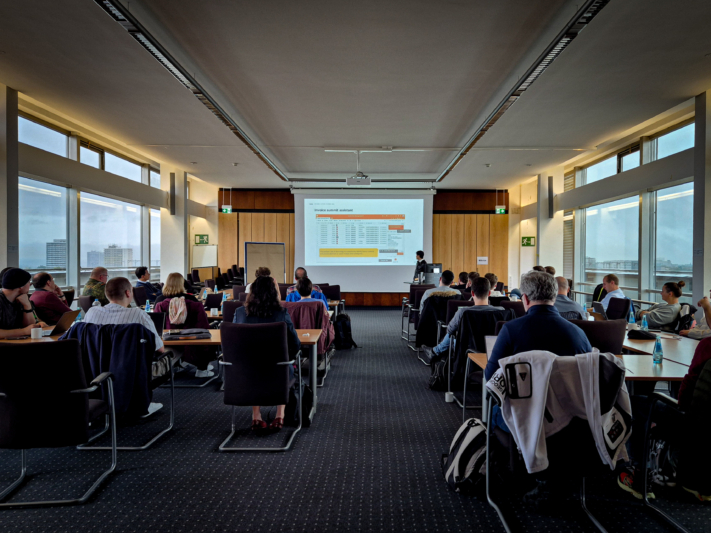
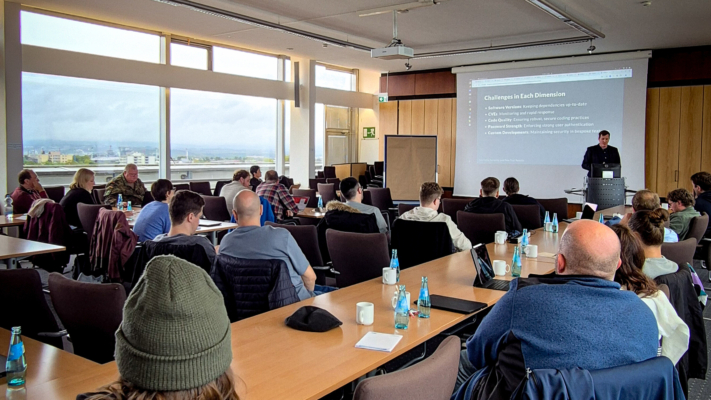

**SeaDays 2024** ha concluido y podemos echar la vista atrás a dos días intensos e inspiradores en la Sala del Senado de la Universidad de Maguncia. Por segunda vez, alrededor de 50 participantes -entre administradores y gestores de proyectos- se reunieron para debatir los últimos avances en torno a Seafile y SeaTable y aportar sus comentarios.

El primer día giró en torno a **Seafile**, la **potente solución para sincronizar y compartir**. Los participantes tuvieron la oportunidad única de hablar directamente con los desarrolladores, conocer las funciones previstas y exponer sus propios deseos e ideas. La segunda jornada se centró en **SeaTable**, la **solución de base de datos y creación de aplicaciones sin código**, donde la comunidad tuvo la oportunidad de debatir en profundidad las mejores prácticas, los retos y los planes de futuro.

Tanto si se trata de grandes soluciones integrales como de proyectos más pequeños, los SeaDays proporcionaron la plataforma perfecta para el diálogo personal y la creación de redes dentro de la comunidad de Seafile y SeaTable. Muchas gracias a nuestros ponentes **Eloy Crespo**, **Stephan Lehniger**, **Ko Smidt**, **Matthias van Laar**, **Lisa Kleinman**, **Christian Livadaru** y **Stephan Heinrich** por hacer posible este evento.

Todos los participantes de SeaDays 2024.

## Ideas que emocionan e inspiran

Además de nuevas perspectivas sobre **interesantes novedades**, el acto también propició **animados debates** y **conversaciones inspiradoras**. El entusiasmo era palpable, sobre todo cuando se hablaba de los nuevos productos, que hicieron que a algunos se les iluminaran los ojos.

Un tema especialmente interesante que se abordó con frecuencia fue la posibilidad de alojar los datos **in situ**. La creciente concienciación sobre la seguridad de los datos y el deseo de soluciones personalizadas nos han demostrado que las soluciones in situ tienen una gran demanda: La demanda de opciones locales es alta. Para nosotros ha sido una constatación muy valiosa, que demuestra que nuestra oferta va por buen camino.

Uno de los momentos más destacados fue la sesión de preguntas y respuestas con nuestros desarrolladores Jonathan y Daniel. Ambos dedicaron mucho tiempo a responder a las numerosas preguntas de los participantes. Este intercambio directo fue una gran oportunidad para profundizar en detalles técnicos y abordar abiertamente sus ideas y preocupaciones.

Por la noche, el acto concluyó con una acogedora tertulia en una cervecería de Maguncia. En torno a una deliciosa comida y una conversación distendida, los participantes pudieron hacer nuevos contactos y compartir sus impresiones de la jornada en un ambiente relajado.

### Reacción positiva y nuevo impulso

Los comentarios sobre el acto fueron abrumadoramente positivos. Con una valoración media de 5,5 puntos sobre 6, el alto grado de satisfacción de los participantes quedó claramente reflejado. Lo que fue especialmente satisfactorio fue que todos los encuestados afirmaron que les gustaría volver a asistir el año que viene. Por supuesto, siempre hay margen de mejora, y nos tomamos muy en serio las opiniones de nuestros participantes para seguir optimizando los SeaDays y convertirlos en un éxito el año que viene.

Los participantes escuchan con atención las noticias.

## Noticias y hechos destacados sobre SeaTable y Seafile

Los SeaDays ofrecieron una acertada mezcla de profundizaciones técnicas, presentaciones prácticas y una saludable pizca de humor. Las presentaciones sobre opciones avanzadas de despliegue de contenedores para Seafile resultaron especialmente interesantes para administradores y desarrolladores, y tecnologías como **Docker** y **Kubernetes** ocuparon un lugar central. La presentación sobre **la automatización del flujo de trabajo** con Seafile y n8n mostró cómo las empresas pueden utilizar la automatización para hacer más eficientes las tareas repetitivas.

Otro momento destacado fue la demostración de cómo la IA puede utilizarse para **generar automáticamente [scripts de Python](https://seatable.io/es/docs/javascript-python/unterstuetzte-python-bibliotheken/)** para crear automatizaciones en SeaTable. Todo el evento se completó con divertidas aportaciones como**"Cómo estropear todos los proyectos informáticos**", que mostraba con un guiño lo que es mejor evitar.

### Panorama de los próximos lanzamientos en SeaTable

Los usuarios de SeaTable pueden esperar novedades interesantes: la **función revisada de gráficos** presenta un diseño más uniforme y opciones de personalización ampliadas que facilitan a los usuarios la presentación de sus datos de forma visualmente atractiva y clara. Otro hito es la **introducción de una pasarela API**, que mejora notablemente la coherencia y el rendimiento de las API y optimiza así la integración de aplicaciones externas. También se ha perfeccionado el editor de textos largos, que ahora ofrece **una edición en línea más intuitiva**, lo que hace aún más cómodo trabajar con contenidos largos.

La visión de la próxima versión 6 de SeaTable se centra en perfeccionar las funciones existentes y mejorar la facilidad de uso. Las innovaciones previstas incluyen opciones ampliadas para vincular datos entre diferentes bases de datos. También está previsto el uso de innovadores **asistentes de IA** para que el procesamiento de datos sea más inteligente y eficiente.

Christoph Dyllick-Brenzinger, uno de los dos hermanos fundadores de SeaTable.

### Perspectivas de los próximos lanzamientos en Seafile

Los desarrolladores Jonathan y Daniel han presentado **SeafilePlus**, un innovador avance en el campo de la gestión de archivos. SeafilePlus se basa en un sistema inteligente de organización de archivos que funciona con diversas funciones flexibles. Las funciones más importantes incluyen **vistas tabulares**, **carpetas inteligentes** y el **uso de etiquetas**, que permiten a los usuarios gestionar sus archivos de forma aún más eficiente.

Uno de los aspectos más destacados es la integración de funciones asistidas por IA. La inteligencia artificial se encarga de tareas que llevan mucho tiempo y crea automáticamente propiedades de archivos, reconoce fotos similares, extrae texto de imágenes y genera resúmenes de documentos, por ejemplo. SeafilePlus ofrece así una solución avanzada y fácil de usar para gestionar grandes volúmenes de datos que fomenta tanto la productividad como la claridad.

La presentación también ofreció una perspectiva de futuro: SeafilePlus se lanzará como solución SaaS en 2025. Algunas de las funciones avanzadas también se integrarán en las versiones existentes de Seafile.

Daniel Pan, Consejero Delegado (CEO) de Seafile Ltd.

### Seguridad de los datos y pen test

La ciberseguridad sigue siendo un reto permanente. SeaTable se basa en una estrategia proactiva para reforzar continuamente la protección en el espacio digital. Las medidas de seguridad adoptadas hasta la fecha incluyen **el cifrado HTTPS**, la **gestión** segura **de cookies**, la **validación de entradas** y el **principio de autorizaciones mínimas**, que garantiza que a cada usuario solo se le conceden los derechos de acceso necesarios.

Se iniciaron nuevas medidas de seguridad para la versión 5.1 de SeaTable con la **prueba de penetración** realizada por la renombrada empresa de seguridad SRC Security Consulting. Los resultados muestran que no se detectaron vulnerabilidades de seguridad críticas.

El siguiente gran paso en la agenda es la **certificación BSI** para la próxima versión 6.0, un hito que posicionará aún más a SeaTable como plataforma segura y fiable.

### Nuevo plugin SeaTable: Árbol

Una función interesante que se ha introducido es el nuevo plugin**"Tree**" de SeaTable. Este complemento permite a los usuarios organizar los datos en una estructura de árbol, lo que facilita enormemente la navegación por las tablas anidadas. Con funciones como niveles plegables, anchuras de columna personalizables y la posibilidad de crear nuevas filas o actualizar las existentes, el plugin Árbol es una potente herramienta para gestionar conjuntos de datos complejos. Especialmente útil es la visualización ordenable en hasta tres niveles, que ofrece más flexibilidad a la hora de organizar los datos.

Ni siquiera el tiempo lluvioso pudo empañar el ambiente de los SeaDays.

## Seafile en uso: casos prácticos e integraciones

En la primera jornada de los SeaDays, los participantes pudieron conocer a fondo la versátil aplicación de Seafile en el entorno empresarial. La atención se centró en la integración de una solución ofimática en Seafile y en la presentación de una solución holística para empresas que trabajan con datos sensibles.

### Trabaje de forma productiva en tiempo real con Collabora

Eloy Crespo, de Collabora, presentó la integración de la **solución ofimática de código abierto basada en navegador** Collabora Online con Seafile. Esta combinación permite a los equipos trabajar juntos en documentos de Office en tiempo real y ver los cambios en directo inmediatamente, lo que resulta ideal para un entorno de trabajo ágil y colaborativo.

Al editar, Collabora Online se inicia automáticamente en una pestaña separada del navegador cuando se abre un documento en Seafile. Las personalizaciones se guardan sin problemas en Seafile, lo que permite **una colaboración fluida**. Esta solución ofrece flexibilidad y eficacia a los equipos que trabajan juntos desde cualquier lugar del mundo, tanto si alojan sus datos en las instalaciones como en la nube.

### Escenarios de aplicación innovadores con SecUnity

Uno de los platos fuertes del primer día de los SeaDays fue la presentación de Stephan Lehniger, fundador y CEO de SecUnity. Como experto en seguridad, Lehniger mostró cómo su empresa utiliza Seafile como columna vertebral de casi todos los procesos empresariales.

Desde la base de datos de conocimientos hasta la gestión de las relaciones con los clientes, Seafile se ha consolidado como una herramienta indispensable en SecUnity. Especialmente interesante es el plan de utilizar Seafile como base para una Plataforma de Intercambio de Inteligencia sobre Amenazas (TISP). Esta innovadora aplicación pone de relieve el enorme potencial de Seafile en el ámbito de la ciberseguridad. Para las organizaciones que buscan soluciones sólidas de gestión de archivos y colaboración, esta presentación ofreció muchos ejemplos concretos e inspiración.

Ko Smidt explica el proceso de exámenes en las escuelas neerlandesas.

## SeaTable en funcionamiento: casos de uso e integraciones

El segundo día de los SeaDays giró en torno a SeaTable y su amplia gama de aplicaciones. Desde la automatización del flujo de trabajo y la optimización de procesos en las escuelas hasta la creación de contenidos asistida por IA, los participantes obtuvieron interesantes conocimientos sobre cómo SeaTable puede ayudar a empresas e [instituciones públicas]().

### Automatización inteligente en el Colegio Johannes Fontanus

En el colegio Johannes Fontanus de los Países Bajos, el profesor Ko Smidt ha revolucionado el **proceso de corrección de los exámenes finales** con la ayuda de SeaTable. Gracias a una automatización inteligente, ahora puede ver en todo momento dónde están los exámenes y cuál es su estado, ya sea en el mostrador de exámenes, en recepción, de camino a una segunda corrección en otro colegio o ya de vuelta en casa. Esta transparencia proporciona una visión mucho mejor de todo el proceso de examen.

Además, la asignación de dispositivos informáticos y la notificación de daños en los dispositivos también se organizaron a través de SeaTable. De este modo, el experto en TI Matthis van Laar siempre tiene una visión general de todos los procesos y puede garantizar que los problemas técnicos se resuelvan de forma rápida y estructurada.

Ko Smidt, profesor de "Música" e "Investigación y Diseño" en el Johannes Fontanus College (Países Bajos).

### Automatización intuitiva de procesos con Make

Lisa Kleinman, de Make, hizo una impresionante presentación sobre lo sencilla y eficaz que puede ser **la automatización de procesos en la vida laboral cotidiana** . Con Make, las automatizaciones pueden crearse intuitivamente sin necesidad de profundos conocimientos técnicos. La conexión entre Make y SeaTable es especialmente interesante: Kleinman mostró cómo los usuarios de SeaTable pueden **automatizar flujos de trabajo** sin esfuerzo con Make para completar tareas repetitivas de forma eficaz.

Esta combinación permite a las empresas utilizar sus datos en SeaTable para activar procesos automatizados en Make, por ejemplo, para enviar notificaciones, crear tareas o sincronizar datos con otras herramientas. El resultado: un enorme ahorro de tiempo y un flujo de trabajo optimizado que facilita enormemente el día a día.

Lisa Kleinman, de Make, con Christoph Dyllick-Brenzinger, uno de los fundadores de SeaTable.

### Pedidos personalizados de clientes con n8n en LcX.at

Christian Livadaru, Director General de la empresa de TI LcX.at, ha digitalizado con éxito toda su **gestión de pedidos** con la ayuda de SeaTable y n8n. SeaTable actúa como una solución de base de datos flexible y potente, mientras que n8n automatiza los procesos de trabajo. Esta combinación les permite estructurar eficazmente los flujos de trabajo y realizar un seguimiento perfecto de los pedidos en tiempo real.

Livadaru también es un ejemplo impresionante de las ventajas del creador de aplicaciones sin código. Las pruebas de concepto (PoC) pueden realizarse de forma rápida y sencilla, lo que acelera el desarrollo y permite obtener los primeros resultados en menos tiempo. Su experiencia demuestra que SeaTable también ofrece una plataforma versátil y potente para que los desarrolladores avancen de forma eficaz y específica.

Cristian Livadaru, Director General de LcX.at, de Viena.

### Creación automatizada de contenidos con Content Butler

Stephan Heinrich, de Content Butler, hizo una impresionante demostración de cómo SeaTable y la API OpenAI pueden utilizarse para crear contenidos automáticamente con solo pulsar un botón. En su demostración, presentó una base SeaTable ingeniosamente construida que se alimenta con información de la empresa y sirve de base para la **creación automatizada de contenidos** .

Lo que resulta especialmente fascinante es que en la base se pueden almacenar parámetros importantes como el estilo del contenido, el tema, el grupo destinatario y otros ajustes. A partir de estos datos, se genera automáticamente un mensaje con el que se pueden crear en pocos segundos entradas para redes sociales, artículos de blog u otros textos, incluso con imágenes. De este modo, se acelera enormemente la producción de contenidos, lo que resulta ideal para las empresas que necesitan contenidos nuevos con regularidad.

Stephan Heinrich, Director General de Content Butler GmbH.

## Por qué SeaDays 2024 es tan especial

SeaDays 2024 ha terminado oficialmente y nos gustaría aprovechar esta oportunidad para dar las gracias a todos los que han hecho de este evento algo tan especial.

En primer lugar, ¡muchas gracias a nuestros **participantes**! Muchos de vosotros habéis viajado largas distancias para participar en nuestros SeaDays y estamos abrumados por vuestro compromiso e interés.

Un agradecimiento especial también a nuestros **ponentes**, que nos inspiraron con sus cautivadoras presentaciones sobre SeaTable y Seafile. Su visión de las múltiples posibilidades no sólo amplió nuestra perspectiva, sino que también estimuló la creatividad y las ideas de los participantes.

Enormes elogios a nuestros **desarrolladores**, Jonathan y Daniel. Su experiencia y compromiso fueron impresionantes. Se tomaron el tiempo necesario para responder detalladamente a todas y cada una de las preguntas durante las sesiones de preguntas y respuestas y presentaron las novedades de SeaTable y Seafile. Su contribución fue una parte fundamental del evento y agradecemos enormemente su duro trabajo.

Seadays 2024 han demostrado una vez más lo importante que es compartir **experiencias** y **buenas prácticas** en la comunidad. Sus comentarios e ideas nos hacen avanzar y nos ayudan a desarrollar continuamente SeaTable y Seafile. Gracias por acompañarnos en este apasionante viaje. ¡Hasta el año que viene!
