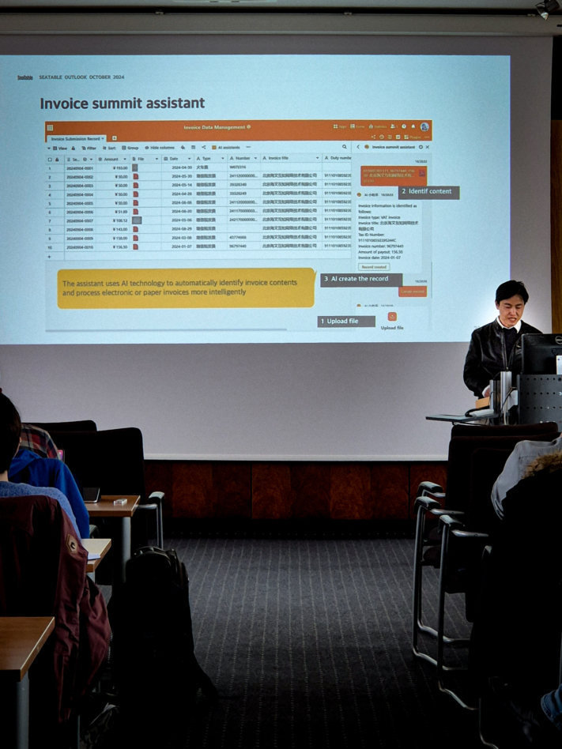
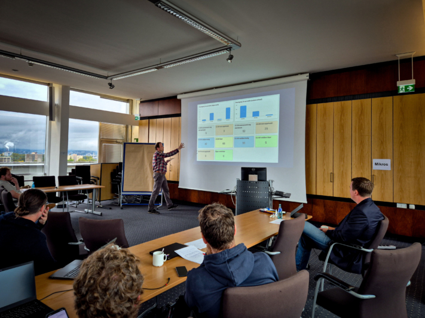

Les **SeaDays 2024** sont terminés et nous revenons sur deux jours intenses et inspirants dans la salle du Sénat de l'Université de Mayence. Pour la deuxième fois, une cinquantaine de participants - dont des administrateurs et des responsables de projets - se sont réunis pour discuter des derniers développements autour de Seafile et SeaTable et apporter leurs commentaires.

Le premier jour était consacré à **Seafile**, la **puissante solution de synchronisation et de partage**. Les participants ont eu l'occasion unique de parler directement avec les développeurs, de découvrir les fonctionnalités prévues et de placer leurs propres souhaits et idées. Le deuxième jour, l'accent a été mis sur **SeaTable**, la **solution de base de données sans code et de construction d'applications**, où la communauté a eu l'occasion d'échanger intensivement sur les meilleures pratiques, les défis et les projets d'avenir.

Qu'il s'agisse de grandes solutions tout-en-un ou de projets plus modestes, les SeaDays ont offert une plateforme parfaite pour les échanges personnels et le réseautage au sein de la communauté Seafile et SeaTable. Un grand merci à nos speakers **Eloy Crespo**, **Stephan Lehniger**, **Ko Smidt**, **Matthias van Laar**, **Lisa Kleinman**, **Christian Livadaru** et **Stephan Heinrich**, qui ont rendu cet événement possible !

Tous les participants aux SeaDays 2024.

## Des connaissances qui enthousiasment et inspirent

Outre de nouveaux aperçus sur **des développements passionnants**, l'événement a également favorisé des **discussions animées** et **des conversations inspirantes**. L'enthousiasme était palpable - surtout lors de la présentation des nouveautés, qui ont fait briller les yeux de certains.

Un thème particulièrement intéressant qui a souvent été abordé était la possibilité d'héberger des données **sur site**. La sensibilité croissante à la sécurité des données et le souhait d'avoir des solutions sur mesure nous l'ont montré : La demande d'options on-premises est élevée. Pour nous, ce fut un constat précieux, qui montre que nous sommes sur la bonne voie avec notre offre.

L'un des moments forts a été la séance de questions-réponses avec nos développeurs Jonathan et Daniel. Tous deux ont consacré beaucoup de temps à répondre aux nombreuses questions des participants. Cet échange direct a été une excellente occasion de plonger plus profondément dans les détails techniques et d'aborder ouvertement leurs idées et préoccupations.

Le soir, les participants se sont rendus dans une brasserie de Mayence pour terminer la journée en beauté. Un délicieux repas et des discussions détendues ont permis aux participants de nouer de nouveaux contacts et d'échanger leurs impressions sur la journée dans une ambiance décontractée.

### Feedback positif et nouvelles impulsions

Le feed-back sur l'événement a été extrêmement positif. Avec une note moyenne de 5,5 sur 6, la grande satisfaction des participants s'est clairement reflétée. Fait particulièrement réjouissant : toutes les personnes interrogées ont indiqué vouloir participer à nouveau l'année prochaine. Bien sûr, il y a toujours une marge d'amélioration et nous prenons très au sérieux les commentaires de nos participants afin d'optimiser encore davantage les SeaDays et de faire de l'année prochaine un événement à nouveau réussi.

Les participants écoutent avec attention les nouvelles.

## Nouveautés et points forts de SeaTable & Seafile

Les SeaDays ont offert un savant mélange de profondeur technique, de présentations pratiques et d'une bonne dose d'humour. Les présentations sur les options avancées de déploiement de conteneurs pour Seafile ont été particulièrement intéressantes pour les administrateurs et les développeurs. **Docker** et **Kubernetes** étaient au centre de l'attention. La présentation de l'**automatisation des flux de travail** avec Seafile et n8n a montré comment les entreprises peuvent rendre les tâches répétitives plus efficaces grâce à l'automatisation.

Un autre moment fort a été la démonstration de la manière de **générer automatiquement [des scripts Python]()** à l'aide de l'IA pour créer des automatisations dans SeaTable. Le tout a été complété par des contributions divertissantes comme "**How to mess up every IT project**", qui a montré avec un clin d'œil ce qu'il vaut mieux éviter.

### Un aperçu des prochaines versions de SeaTable

Les utilisateurs de SeaTable ont pu se réjouir de nouveautés passionnantes : la **fonction graphique remaniée** se distingue par un design plus homogène et des possibilités de personnalisation étendues, qui permettent aux utilisateurs de présenter plus facilement leurs données de manière visuellement attrayante et claire. Une autre étape importante est l'**introduction d'une passerelle API** qui améliore considérablement la cohérence et la performance des API et optimise ainsi l'intégration d'applications externes. L'éditeur de textes longs a également été affiné et offre désormais une **édition en ligne plus intuitive**, ce qui rend le travail sur des contenus plus longs encore plus confortable.

La vision de la prochaine version 6 de SeaTable met l'accent sur le raffinement des fonctions existantes et sur une convivialité encore plus grande. Parmi les nouveautés prévues figurent des possibilités étendues de liaison de données entre différentes bases de données. Il est également prévu d'utiliser des **assistants IA** innovants qui rendront le traitement des données plus intelligent et plus efficace.

Christoph Dyllick-Brenzinger, l'un des deux frères fondateurs de SeaTable.

### Un aperçu des prochaines versions de Seafile

Les développeurs Jonathan et Daniel ont présenté **SeafilePlus**, un développement innovant dans le domaine de la gestion de fichiers. SeafilePlus mise sur un système intelligent d'organisation des fichiers qui fonctionne avec une multitude de propriétés flexibles. Parmi les fonctions les plus importantes, on trouve les **vues tabulaires**, les **Smart Folders** et l'**utilisation de tags** qui permettent aux utilisateurs de gérer leurs fichiers de manière encore plus efficace.

L'un des points forts est l'intégration de fonctions basées sur l'IA. L'intelligence artificielle prend en charge des tâches fastidieuses et crée par exemple automatiquement des propriétés de fichiers, reconnaît des photos similaires, extrait du texte d'images et génère des résumés de documents. SeafilePlus offre ainsi une solution avancée et conviviale pour la gestion de grandes quantités de données, qui favorise à la fois la productivité et la clarté.

La présentation a également donné un aperçu de l'avenir : SeafilePlus devrait être lancé sur le marché en 2025 en tant que solution SaaS. Certaines des fonctions avancées seront en outre intégrées dans les versions existantes de Seafile.

Daniel Pan, Chief Executive Officer (CEO) de Seafile Ltd.

### Sécurité des données & Pen-Test

La cybersécurité reste un défi permanent. SeaTable mise sur une stratégie proactive pour renforcer en permanence sa protection dans l'espace numérique. Les mesures de sécurité mises en place jusqu'à présent comprennent **le cryptage HTTPS**, la **gestion** sécurisée **des cookies**, la **validation des entrées** et le **principe des autorisations minimales**, qui garantit que chaque utilisateur ne dispose que des droits d'accès nécessaires.

D'autres mesures de sécurité pour SeaTable version 5.1 ont été lancées avec le **test d'intrusion**, réalisé par la célèbre société de sécurité SRC Security Consulting. Les résultats montrent qu'aucune faille de sécurité critique n'a été identifiée.

La prochaine étape importante est la **certification BSI** pour la prochaine version 6.0, une étape qui positionnera davantage SeaTable comme une plateforme sûre et fiable.

### Nouveau plugin SeaTable : Arbre

Une fonctionnalité passionnante qui a été présentée est le nouveau plug-in SeaTable "**Arbre**". Ce plugin permet aux utilisateurs d'organiser les données dans une structure arborescente, ce qui simplifie considérablement la navigation dans des tableaux imbriqués. Avec des fonctions telles que les niveaux repliables, la largeur individuelle des colonnes et la possibilité de créer de nouvelles lignes ou de mettre à jour les lignes existantes, le plug-in Arbre est un outil puissant pour la gestion d'ensembles de données complexes. La présentation triable en trois niveaux maximum est particulièrement utile et offre une plus grande flexibilité dans l'organisation des données.

Même le temps pluvieux n'a pas réussi à gâcher l'ambiance des SeaDays.

## Seafile en action : aperçu des cas d'utilisation et des intégrations

Le premier jour des SeaDays, les participants ont eu un aperçu passionnant de l'utilisation polyvalente de Seafile dans un environnement d'entreprise. L'accent a été mis en particulier sur l'intégration d'une solution bureautique dans Seafile ainsi que sur la présentation d'une solution globale pour les entreprises qui travaillent avec des données sensibles.

### Travail productif en temps réel avec Collabora

Eloy Crespo de Collabora a présenté l'intégration de Collabora Online, la **solution bureautique open source basée sur un navigateur,** avec Seafile. Cette combinaison permet aux équipes de travailler ensemble sur des documents Office en temps réel et de voir immédiatement les modifications en direct - idéal pour un environnement de travail agile et collaboratif.

Lors de l'édition, Collabora Online démarre automatiquement dans un onglet séparé du navigateur lorsqu'un document est ouvert dans Seafile. Les personnalisations sont enregistrées de manière transparente dans Seafile, ce qui permet une **collaboration fluide**. Cette solution offre flexibilité et efficacité aux équipes qui collaborent depuis n'importe où dans le monde, qu'elles hébergent leurs données sur site ou dans le cloud.

### Scénarios d'utilisation innovants chez SecUnity

La présentation de Stephan Lehniger, fondateur et directeur de SecUnity, a été un moment fort de la première journée des SeaDays. En tant qu'expert en sécurité expérimenté, Lehniger a montré comment son entreprise utilise Seafile comme colonne vertébrale pour presque tous les processus commerciaux.

De la base de connaissances à la gestion de la relation client, Seafile s'est imposé comme un outil indispensable chez SecUnity. Le projet d'utiliser Seafile comme base d'une plate-forme de partage du renseignement sur les menaces (TISP) est particulièrement excitant. Cette application innovante souligne l'énorme potentiel de Seafile dans le domaine de la cybersécurité. Pour les entreprises à la recherche de solutions robustes de gestion de fichiers et de collaboration, cette présentation a fourni de nombreux exemples concrets et de l'inspiration.

Ko Smidt explique le déroulement du processus d'examen dans les écoles néerlandaises.

## SeaTable en action : aperçu des cas d'utilisation et des intégrations

Le deuxième jour des SeaDays était consacré à SeaTable et à ses nombreuses possibilités d'utilisation. De l'automatisation des flux de travail à l'optimisation des processus dans les écoles en passant par la création de contenu assistée par l'IA, les participants ont eu un aperçu passionnant de la manière dont SeaTable peut aider les entreprises et [les institutions publiques]().

### Automations intelligentes au Johannes Fontanus College

Au Johannes Fontanus College aux Pays-Bas, l'enseignant Ko Smidt a révolutionné le **processus de correction des examens finaux** avec l'aide de SeaTable. Grâce à des automatisations intelligentes, ils peuvent désormais savoir à tout moment où se trouvent les examens et quel est leur statut - que ce soit à l'Exam Desk, à la réception, en route pour une deuxième correction dans une autre école ou déjà de retour dans l'établissement. Cette transparence assure une bien meilleure vue d'ensemble de tout le processus d'examen.

En outre, l'attribution des équipements informatiques et la notification des dommages aux équipements ont également été organisées via SeaTable. Ainsi, l'expert informatique Matthis van Laar garde toujours une vue d'ensemble de tous les processus et peut s'assurer que les problèmes techniques sont traités rapidement et de manière structurée.

Ko Smidt, professeur de "Music" et de "Research & Design" au Johannes Fontanus College (Pays-Bas).

### Automatisation intuitive des processus avec Make

Lisa Kleinman de Make a présenté de manière impressionnante à quel point **l'automatisation des processus** peut être simple et efficace **dans le travail quotidien** . Make permet de créer des automatisations de manière intuitive, sans qu'il soit nécessaire d'avoir des connaissances techniques approfondies. Le lien entre Make et SeaTable est particulièrement intéressant : Kleinman a montré comment les utilisateurs de SeaTable peuvent utiliser Make pour **automatiser** facilement **des flux de travail** afin d'effectuer des tâches répétitives de manière efficace.

Grâce à cette combinaison, les entreprises peuvent utiliser leurs données dans SeaTable pour déclencher des processus automatisés dans Make - par exemple, pour envoyer des notifications, créer des tâches ou synchroniser des données avec d'autres outils. Résultat : un gain de temps considérable et un flux de travail optimisé qui facilite considérablement le quotidien.

Lisa Kleinman de Make avec Christoph Dyllick-Brenzinger, l'un des fondateurs de SeaTable.

### Commandes individuelles de clients avec n8n chez LcX.at

Christian Livadaru, directeur de l'entreprise informatique LcX.at, a numérisé avec succès l'ensemble de sa **gestion des commandes** à l'aide de SeaTable et de n8n. SeaTable fait office de solution de base de données flexible et puissante, tandis que n8n se charge de l'automatisation des processus de travail. Cette combinaison lui permet de structurer efficacement les flux de travail et de suivre les commandes en temps réel et de manière transparente.

Livadaru est également un exemple impressionnant de l'utilité du No-Code-App-Builder. En effet, il permet de réaliser rapidement et facilement des preuves de concept (PoC), ce qui accélère le développement et permet d'obtenir les premiers résultats en moins de temps. Son expérience montre que SeaTable offre également aux développeurs une plateforme polyvalente et performante pour progresser de manière efficace et ciblée.

Cristian Livadaru, directeur de LcX.at à Vienne.

### Création de contenu automatisée par Content Butler

Stephan Heinrich de Content Butler a montré de manière impressionnante comment il est possible de créer automatiquement du contenu en appuyant sur un bouton à l'aide de SeaTable et de l'API OpenAI. Dans sa démonstration, il a présenté une base SeaTable intelligemment construite, alimentée par des informations sur l'entreprise et servant de base à la **création automatisée de contenu** .

Particulièrement fascinant : dans la base, il est possible d'enregistrer des paramètres importants tels que le style de contenu, le thème, le groupe cible et d'autres réglages fins. Ces données sont ensuite utilisées pour générer automatiquement un prompt qui permet de créer en quelques secondes des posts pour les médias sociaux, des articles de blog ou d'autres textes, y compris des images. De cette manière, la production de contenu est considérablement accélérée - idéal pour les entreprises qui ont régulièrement besoin de contenu frais.

Stephan Heinrich, directeur général de Content Butler GmbH.

## Ce qui a rendu les SeaDays 2024 si particuliers

Les SeaDays 2024 sont officiellement terminés et nous souhaitons profiter de l'occasion pour remercier chaleureusement tous ceux qui ont rendu cet événement si spécial.

Tout d'abord, un immense merci à nos **participants**! Beaucoup d'entre vous ont fait de longs trajets pour participer à nos SeaDays, et nous sommes submergés par votre engagement et votre intérêt.

Nous tenons également à remercier tout particulièrement nos **intervenants** qui nous ont inspirés par leurs présentations captivantes sur SeaTable et Seafile. En nous donnant un aperçu des nombreuses possibilités, ils ont non seulement élargi notre perspective, mais aussi stimulé la créativité et les idées des participants.

Un grand bravo à nos **développeurs**, Jonathan et Daniel. Votre expertise et votre engagement ont été impressionnants. Ils ont pris le temps de répondre en détail à chaque question lors des sessions de questions-réponses et de présenter les évolutions de SeaTable et Seafile. Votre contribution a été un élément central de l'événement et nous avons beaucoup apprécié votre travail acharné.

Les Seadays 2024 ont une fois de plus montré l'importance de l'échange d'**expériences** et **de bonnes pratiques** au sein de la communauté. Vos réactions et vos idées nous poussent à aller de l'avant et nous aident à développer SeaTable et Seafile en permanence. Merci de nous accompagner sur cette voie passionnante. À l'année prochaine !
