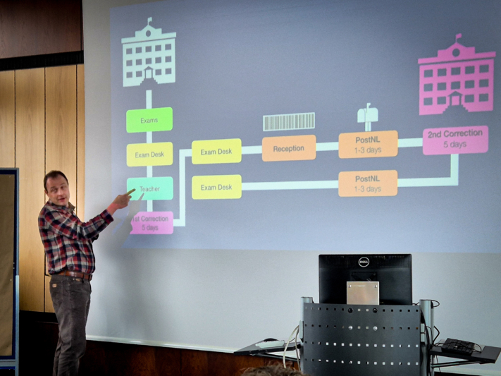

**O SeaDays 2024** chegou ao fim e podemos olhar para trás, para dois dias intensos e inspiradores na Sala do Senado da Universidade de Mainz. Pela segunda vez, cerca de 50 participantes - incluindo administradores e gestores de projectos - reuniram-se para discutir os últimos desenvolvimentos em torno do Seafile e do SeaTable e dar o seu feedback.

O primeiro dia foi dedicado ao **Seafile**, a **poderosa solução de sincronização e partilha**. Os participantes tiveram a oportunidade única de falar diretamente com os programadores, conhecer as funcionalidades planeadas e apresentar os seus próprios desejos e ideias. No segundo dia, o foco foi o **SeaTable**, a **base de dados sem código e a solução de criação de aplicações**, onde a comunidade teve a oportunidade de discutir em profundidade as melhores práticas, os desafios e os planos futuros.

Quer se trate de grandes soluções tudo-em-um ou de projectos mais pequenos - os SeaDays proporcionaram a plataforma perfeita para o diálogo pessoal e a criação de redes no seio da comunidade Seafile e SeaTable. Muito obrigado aos nossos oradores **Eloy Crespo**, **Stephan Lehniger**, **Ko Smidt**, **Matthias van Laar**, **Lisa Kleinman**, **Christian Livadaru** e **Stephan Heinrich** por tornarem este evento possível!

Todos os participantes no SeaDays 2024.

## Ideias que entusiasmam e inspiram

Para além de novos conhecimentos sobre **desenvolvimentos empolgantes**, o evento também incentivou **discussões animadas** e **conversas inspiradoras**. O entusiasmo era palpável - especialmente quando se tratava dos novos produtos, que faziam brilhar os olhos de algumas pessoas.

Um tema particularmente interessante que foi frequentemente abordado foi a possibilidade de alojar os dados **no local**. A crescente consciencialização para a segurança dos dados e o desejo de soluções personalizadas mostraram-nos que as soluções locais são muito procuradas: A procura de opções no local é elevada. Esta foi uma constatação valiosa para nós e mostra que estamos no caminho certo com a nossa oferta.

Um dos destaques foi a sessão de perguntas e respostas com os nossos programadores Jonathan e Daniel. Ambos dispuseram de muito tempo para responder às inúmeras perguntas dos participantes. Esta troca direta foi uma excelente oportunidade para aprofundar os detalhes técnicos e abordar abertamente as suas ideias e preocupações.

À noite, o evento terminou com um encontro acolhedor numa cervejaria em Mainz. Com comida deliciosa e conversas descontraídas, os participantes puderam fazer novos contactos e partilhar as suas impressões do dia num ambiente descontraído.

### Reacções positivas e novos impulsos

A reação ao evento foi extremamente positiva. Com uma classificação média de 5,5 em 6 pontos, o elevado nível de satisfação dos participantes reflectiu-se claramente. O que foi particularmente agradável foi o facto de todos os inquiridos terem afirmado que gostariam de participar novamente no próximo ano. É claro que há sempre espaço para melhorias e levamos muito a sério o feedback dos nossos participantes, a fim de otimizar ainda mais os SeaDays e torná-los um evento de sucesso no próximo ano.

Os participantes ouvem as notícias com entusiasmo.

## Notícias e destaques sobre o SeaTable & Seafile

Os SeaDays ofereceram uma mistura bem-sucedida de profundidade técnica, apresentações práticas e uma pitada saudável de humor. As apresentações sobre opções avançadas de implantação de contentores para o Seafile foram particularmente interessantes para administradores e programadores, com destaque para tecnologias como **Docker** e **Kubernetes** estiveram no centro das atenções. A apresentação sobre a **automatização do fluxo de trabalho** com o Seafile e o n8n mostrou como as empresas podem utilizar a automatização para tornar as tarefas repetitivas mais eficientes.

Outro destaque foi a demonstração de como a IA pode ser utilizada para **gerar automaticamente [scripts Python]()** para criar automações no SeaTable. Todo o evento foi completado com contribuições divertidas, como**"Como estragar todos os projectos de TI**", que mostrou com um piscar de olhos o que deve ser evitado.

### Uma perspetiva dos próximos lançamentos no SeaTable

Os utilizadores do SeaTable podem contar com novidades interessantes: a **função de gráfico revista** apresenta um design mais uniforme e opções de personalização alargadas que facilitam aos utilizadores a apresentação dos seus dados de uma forma visualmente apelativa e clara. Outro marco importante é a **introdução de um gateway de API**, que melhora significativamente a consistência e o desempenho das API, optimizando assim a integração de aplicações externas. O editor de textos longos também foi aperfeiçoado e oferece agora **uma edição em linha mais intuitiva**, o que torna o trabalho com conteúdos mais longos ainda mais cómodo.

A visão para a próxima versão 6 do SeaTable centra-se no aperfeiçoamento das funções existentes e na melhoria da facilidade de utilização. As inovações planeadas incluem opções alargadas para ligar dados entre diferentes bases de dados. Está também planeada a utilização de **assistentes de IA** inovadores para tornar o processamento de dados mais inteligente e eficiente.

Christoph Dyllick-Brenzinger, um dos dois irmãos fundadores do SeaTable.

### Perspectivas sobre os próximos lançamentos da Seafile

Os criadores Jonathan e Daniel apresentaram o **SeafilePlus**, um novo desenvolvimento inovador no domínio da gestão de ficheiros. O SeafilePlus baseia-se num sistema inteligente de organização de ficheiros que funciona com uma variedade de caraterísticas flexíveis. As funções mais importantes incluem **vistas tabulares**, **pastas inteligentes** e a **utilização de etiquetas**, que permitem aos utilizadores gerir os seus ficheiros de forma ainda mais eficiente.

Um destaque é a integração de funcionalidades suportadas por IA. A inteligência artificial assume tarefas morosas e cria automaticamente propriedades de ficheiros, reconhece fotografias semelhantes, extrai texto de imagens e gera resumos de documentos, por exemplo. O SeafilePlus oferece assim uma solução avançada e fácil de utilizar para gerir grandes volumes de dados que promove a produtividade e a clareza.

A apresentação também deu uma perspetiva para o futuro: o SeafilePlus deverá ser lançado como uma solução SaaS em 2025. Algumas das funções avançadas serão também integradas nas versões actuais do Seafile.

Daniel Pan, Diretor Executivo (CEO) da Seafile Ltd.

### Segurança de dados e teste de penetração

A cibersegurança continua a ser um desafio permanente. A SeaTable baseia-se numa estratégia proactiva para reforçar continuamente a proteção no espaço digital. As medidas de segurança implementadas até à data incluem **a encriptação HTTPS**, **a gestão** segura **dos cookies**, **a validação dos dados introduzidos** e o **princípio das autorizações mínimas**, que garante que a cada utilizador apenas são concedidos os direitos de acesso necessários.

As medidas de segurança adicionais para a versão 5.1 do SeaTable foram iniciadas com o **teste de penetração** efectuado pela empresa de segurança de renome SRC Security Consulting. Os resultados mostram que não foram identificadas vulnerabilidades de segurança críticas.

O próximo grande passo na agenda é a **certificação BSI** para a próxima versão 6.0 - um marco que irá posicionar ainda mais o SeaTable como uma plataforma segura e fiável.

### Novo plugin SeaTable: Árvore

Uma funcionalidade interessante que foi introduzida é o novo plugin SeaTable**"Árvore**". Este plugin permite aos utilizadores organizarem os dados numa estrutura em árvore, facilitando a navegação através de tabelas aninhadas. Com caraterísticas como níveis recolhíveis, larguras de coluna personalizáveis e a capacidade de criar novas linhas ou atualizar as existentes, o plug-in Árvore é uma ferramenta poderosa para gerir conjuntos de dados complexos. Particularmente útil é a exibição ordenável em até três níveis, que oferece mais flexibilidade na organização de dados.

Nem mesmo o tempo chuvoso conseguiu diminuir a disposição no SeaDays.

## Seafile em utilização: informações sobre casos de utilização e integrações

No primeiro dia do SeaDays, os participantes tiveram uma visão interessante da aplicação versátil do Seafile no ambiente empresarial. O foco foi a integração de uma solução de escritório no Seafile, bem como a apresentação de uma solução holística para empresas que trabalham com dados sensíveis.

### Trabalhe de forma produtiva em tempo real com o Collabora

Eloy Crespo, da Collabora, apresentou a integração da **solução de escritório de código aberto baseada no navegador** Collabora Online com o Seafile. Esta combinação permite que as equipas trabalhem em conjunto nos documentos do Office em tempo real e vejam as alterações imediatamente - ideal para um ambiente de trabalho ágil e colaborativo.

Ao editar, o Collabora Online inicia automaticamente num separador separado do navegador quando um documento é aberto no Seafile. As personalizações são guardadas sem problemas no Seafile, permitindo **uma colaboração sem problemas**. Esta solução oferece flexibilidade e eficiência às equipas que trabalham em conjunto a partir de qualquer parte do mundo, quer alojem os seus dados no local ou na nuvem.

### Cenários de aplicação inovadores com o SecUnity

Um destaque especial no primeiro dia dos SeaDays foi a apresentação de Stephan Lehniger, fundador e diretor executivo da SecUnity. Como experiente especialista em segurança, Lehniger mostrou como a sua empresa utiliza o Seafile como espinha dorsal de quase todos os processos empresariais.

Desde a base de dados de conhecimentos até à gestão das relações com os clientes, o Seafile estabeleceu-se como uma ferramenta indispensável na SecUnity. Particularmente interessante é o plano de utilizar o Seafile como base para uma Plataforma de Partilha de Informações sobre Ameaças (TISP). Esta aplicação inovadora realça o enorme potencial do Seafile na área da cibersegurança. Para as organizações que procuram soluções robustas de gestão de ficheiros e de colaboração, esta apresentação ofereceu muitos exemplos concretos e inspiração.

Ko Smidt explica o processo de exame nas escolas neerlandesas.

## SeaTable em utilização: informações sobre casos de utilização e integrações

O segundo dia dos SeaDays foi dedicado ao SeaTable e à sua vasta gama de aplicações. Desde a automatização do fluxo de trabalho e a otimização de processos nas escolas até à criação de conteúdos apoiada por IA - os participantes obtiveram conhecimentos interessantes sobre a forma como o SeaTable pode apoiar empresas e [instituições públicas]().

### Automação inteligente no Colégio Johannes Fontanus

No Colégio Johannes Fontanus, nos Países Baixos, o professor Ko Smidt revolucionou o **processo de correção dos exames finais** com a ajuda do SeaTable. Graças a uma automatização inteligente, podem agora ver onde estão os exames em qualquer altura e qual o seu estado - quer estejam na mesa de exames, na receção, a caminho de uma segunda correção noutra escola ou já de volta a casa. Esta transparência proporciona uma visão muito melhor de todo o processo de exame.

Além disso, a atribuição de dispositivos de TI e a comunicação de danos nos dispositivos também foram organizadas através do SeaTable. Isto significa que o especialista em TI Matthis van Laar tem sempre uma visão geral de todos os processos e pode garantir que os problemas técnicos são tratados rapidamente e de forma estruturada.

Ko Smidt, professor de "Música" e "Investigação e Design" no Colégio Johannes Fontanus (Países Baixos).

### Automatização intuitiva de processos com o Make

Lisa Kleinman, da Make, fez uma apresentação impressionante sobre como **a automatização de processos** pode ser simples e eficaz **na vida quotidiana** . Com a Make, as automatizações podem ser criadas intuitivamente sem a necessidade de conhecimentos técnicos aprofundados. A ligação entre o Make e o SeaTable é particularmente interessante: Kleinman mostrou como os utilizadores do SeaTable podem **automatizar** sem esforço **os fluxos de trabalho** com o Make para concluir tarefas repetitivas de forma eficiente.

Esta combinação permite às empresas utilizar os seus dados no SeaTable para acionar processos automatizados no Make - por exemplo, para enviar notificações, criar tarefas ou sincronizar dados com outras ferramentas. O resultado: uma enorme poupança de tempo e um fluxo de trabalho optimizado que torna o dia a dia muito mais fácil.

Lisa Kleinman, da Make, com Christoph Dyllick-Brenzinger, um dos fundadores da SeaTable.

### Encomendas personalizadas de clientes com n8n em LcX.at

Christian Livadaru, Diretor-Geral da empresa de TI LcX.at, digitalizou com sucesso toda a sua **gestão de encomendas** - com a ajuda do SeaTable e do n8n. O SeaTable actua como uma solução de base de dados flexível e poderosa, enquanto o n8n automatiza os processos de trabalho. Esta combinação permite-lhes estruturar eficazmente os fluxos de trabalho e acompanhar as encomendas em tempo real.

O Livadaru também dá um exemplo impressionante das vantagens do criador de aplicações sem código. As provas de conceito (PoC) podem ser realizadas de forma rápida e fácil, o que acelera o desenvolvimento e torna os resultados iniciais possíveis num período de tempo mais curto. A sua experiência mostra que o SeaTable também oferece uma plataforma versátil e poderosa para os programadores fazerem progressos eficientes e direcionados.

Cristian Livadaru, Diretor-Geral da LcX.at, de Viena.

### Criação automatizada de conteúdos com o Content Butler

Stephan Heinrich, da Content Butler, fez uma demonstração impressionante de como o SeaTable e a API OpenAI podem ser utilizados para criar conteúdos automaticamente com o toque de um botão. Na sua demonstração, apresentou uma base SeaTable inteligentemente construída que é alimentada com informações da empresa e serve de base para a **criação automática de conteúdos** .

O que é particularmente fascinante é o facto de parâmetros importantes como o estilo do conteúdo, o tópico, o grupo-alvo e outras afinações poderem ser armazenados na base. Estes dados são depois utilizados para gerar automaticamente um prompt que pode ser utilizado para criar publicações nas redes sociais, artigos de blogue ou outros textos, mesmo incluindo imagens, em apenas alguns segundos. Desta forma, a produção de conteúdos é massivamente acelerada - ideal para empresas que necessitam regularmente de novos conteúdos.

Stephan Heinrich, Diretor-Geral da Content Butler GmbH.

## O que tornou o SeaDays 2024 tão especial

O SeaDays 2024 terminou oficialmente e gostaríamos de aproveitar esta oportunidade para agradecer a todos os que tornaram este evento tão especial.

Em primeiro lugar, um enorme obrigado aos nossos **participantes**! Muitos de vós percorreram longas distâncias para participar nos nossos SeaDays e estamos maravilhados com o vosso empenho e interesse.

Um agradecimento especial vai também para os nossos **oradores**, que nos inspiraram com as suas apresentações cativantes sobre o SeaTable e o Seafile. Os seus conhecimentos sobre as muitas possibilidades não só alargaram a nossa perspetiva, como também estimularam a criatividade e as ideias dos participantes.

Um grande elogio aos nossos **programadores**, Jonathan e Daniel. A sua experiência e empenho foram impressionantes. Dedicaram tempo a responder a todas as perguntas em pormenor durante as sessões de perguntas e respostas e apresentaram os novos desenvolvimentos do SeaTable e do Seafile. A vossa contribuição foi uma parte central do evento e nós apreciamos muito o vosso trabalho árduo.

A Seadays 2024 demonstrou mais uma vez a importância da partilha de **experiências** e de **boas práticas** na comunidade. Os seus comentários e ideias fazem-nos avançar e ajudam-nos a desenvolver continuamente o SeaTable e o Seafile. Obrigado por nos acompanharem nesta emocionante viagem. Até ao próximo ano!
