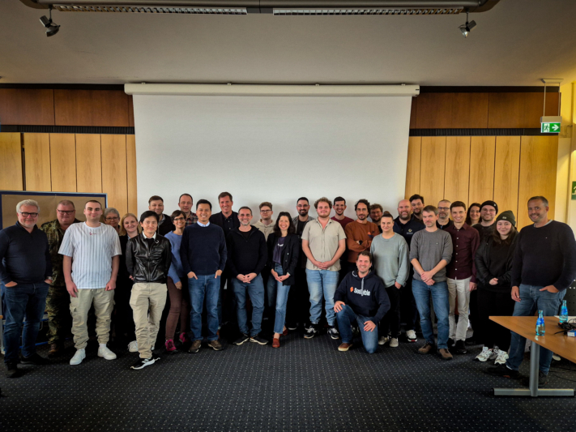
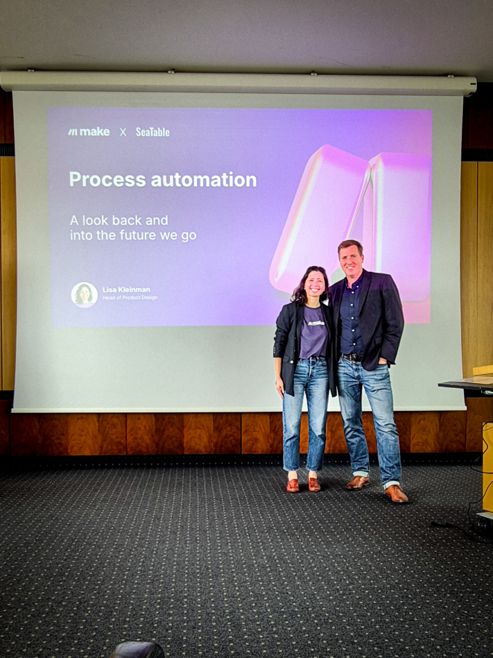

**SeaDays 2024** завершился, и мы можем оглянуться на два интенсивных и вдохновляющих дня, проведенных в Сенатском зале Майнцского университета. Во второй раз около 50 участников, включая администраторов и руководителей проектов, собрались вместе, чтобы обсудить последние разработки Seafile и SeaTable и высказать свои замечания.

Первый день был посвящен **Seafile**, **мощному решению для синхронизации и обмена данными**. У участников была уникальная возможность напрямую пообщаться с разработчиками, узнать о планируемых функциях и высказать свои пожелания и идеи. Второй день был посвящен **SeaTable**, **некодируемой базе данных и решению для создания приложений**, где сообщество смогло подробно обсудить лучшие практики, проблемы и планы на будущее.

Будь то крупные комплексные решения или небольшие проекты - SeaDays предоставил идеальную платформу для личного общения и налаживания контактов в сообществе Seafile и SeaTable. Большое спасибо нашим докладчикам **Элою Креспо**, **Стефану Лехнигеру**, **Ко Смидту**, **Матиасу ван Лаару**, **Лизе Кляйнман**, **Кристиану Ливадару** и **Стефану Хайнриху** за то, что сделали это мероприятие возможным!

Все участники SeaDays 2024.

## Познавательные материалы, которые волнуют и вдохновляют

Помимо новых сведений о **захватывающих разработках**, мероприятие способствовало **оживленным дискуссиям** и **вдохновляющим беседам**. Энтузиазм был ощутимым - особенно когда речь шла о новых продуктах, от которых у некоторых загорались глаза.

Особенно интересной темой, которая часто затрагивалась, была возможность размещения данных **на локальных площадках**. Растущая осведомленность о безопасности данных и стремление к индивидуальным решениям показали нам, что локальные решения пользуются большим спросом: Спрос на локальные решения высок. Это стало для нас ценным осознанием и показывает, что мы находимся на правильном пути с нашим предложением".

Одним из самых ярких моментов стала сессия вопросов и ответов с нашими разработчиками Джонатаном и Дэниелом. Оба уделили достаточно времени, чтобы ответить на многочисленные вопросы участников. Этот прямой обмен мнениями стал отличной возможностью углубиться в технические детали и открыто высказать свои идеи и опасения.

Вечером мероприятие завершилось уютной встречей в пивоварне в Майнце. За вкусной едой и непринужденной беседой участники смогли завязать новые знакомства и поделиться своими впечатлениями о прошедшем дне в непринужденной обстановке.

### Положительные отзывы и новый импульс

Отзывы о мероприятии были в подавляющем большинстве положительными. Средняя оценка 5,5 из 6 баллов свидетельствует о высокой степени удовлетворенности участников. Особенно приятно, что все респонденты заявили, что хотели бы принять участие в мероприятии в следующем году. Конечно, всегда есть возможности для совершенствования, и мы очень серьезно относимся к отзывам наших участников, чтобы еще больше оптимизировать SeaDays и сделать его успешным мероприятием в следующем году.

Участники с нетерпением слушают новости.

## Новости и основные моменты о SeaTable & Seafile

SeaDays предложил удачное сочетание технических глубин, практических презентаций и здоровой щепотки юмора. Особенно интересными для администраторов и разработчиков были презентации о расширенных возможностях развертывания контейнеров в Seafile, где основное внимание уделялось таким технологиям, как **Docker** и **Kubernetes** заняли центральное место. Презентация об **автоматизации рабочих процессов** с помощью Seafile и n8n показала, как компании могут использовать автоматизацию для повышения эффективности повторяющихся задач.

Еще одним ярким моментом стала демонстрация того, как искусственный интеллект может быть использован для **автоматической генерации [сценариев Python]()** для создания автоматизаций в SeaTable. В завершение мероприятия были представлены такие занимательные материалы, как**"Как испортить каждый ИТ-проект**", в котором с подмигиванием было показано, чего лучше избегать.

### Прогноз на предстоящие релизы в SeaTable

Пользователей SeaTable ожидают интересные новости: **обновленная функция диаграмм** отличается более единообразным дизайном и расширенными возможностями настройки, что облегчает пользователям представление данных в визуально привлекательном и понятном виде. Еще одной важной вехой стало **внедрение API-шлюза**, который значительно повышает согласованность и производительность API и тем самым оптимизирует интеграцию внешних приложений. Редактор длинных текстов также был доработан и теперь предлагает **более интуитивное поточное редактирование**, что делает работу с длинным контентом еще более удобной.

Концепция грядущей шестой версии SeaTable сосредоточена на доработке существующих функций и повышении удобства использования. Среди планируемых нововведений - расширенные возможности по связыванию данных между различными базами. Также планируется использовать инновационные **помощники искусственного интеллекта**, чтобы сделать обработку данных более интеллектуальной и эффективной.

Кристоф Диллик-Бренцингер, один из двух братьев-основателей компании SeaTable.

### Перспективы предстоящих релизов на Seafile

Разработчики Джонатан и Дэниел представили **SeafilePlus** - инновационную разработку в области управления файлами. В основе SeafilePlus лежит интеллектуальная система организации файлов, которая работает с множеством гибких функций. Среди наиболее важных функций - **табличные представления**, **"умные" папки** и **использование тегов**, которые позволяют пользователям управлять файлами еще более эффективно.

Одна из изюминок - интеграция функций, поддерживаемых искусственным интеллектом. Искусственный интеллект берет на себя трудоемкие задачи и автоматически создает свойства файлов, распознает похожие фотографии, извлекает текст из изображений и генерирует резюме документов, например. Таким образом, SeafilePlus предлагает передовое и удобное решение для управления большими объемами данных, которое способствует повышению производительности и четкости работы.

Презентация также дала представление о будущем: SeafilePlus будет запущен как SaaS-решение в 2025 году. Некоторые из расширенных функций будут также интегрированы в существующие версии Seafile.

Дэниел Пан, генеральный директор компании Seafile Ltd.

### Безопасность данных и перьевые тесты

Кибербезопасность остается постоянной проблемой. SeaTable опирается на проактивную стратегию, направленную на постоянное усиление защиты в цифровом пространстве. Среди мер безопасности, реализованных на сегодняшний день, - **шифрование HTTPS**, безопасное **управление файлами cookie**, **проверка правильности ввода данных** и **принцип минимальной авторизации**, который гарантирует, что каждому пользователю предоставляются только необходимые права доступа.

Дополнительные меры безопасности для SeaTable версии 5.1 были начаты с **теста на проникновение**, проведенного известной компанией SRC Security Consulting. Результаты показали, что критических уязвимостей в системе безопасности выявлено не было.

Следующий важный шаг на повестке дня - **сертификация BSI** для предстоящей версии 6.0 - веха, которая еще больше утвердит SeaTable в качестве безопасной и надежной платформы.

### Новый плагин SeaTable: Дерево

Новая функция SeaTable - плагин **Дерево**. Этот плагин позволяет пользователям организовывать данные в виде древовидной структуры, что значительно упрощает навигацию по вложенным таблицам. Благодаря таким функциям, как сворачиваемые уровни, настраиваемая ширина столбцов и возможность создавать новые строки или обновлять существующие, плагин Дерево является мощным инструментом для управления сложными наборами данных. Особенно полезным является возможность сортировки до трех уровней, что обеспечивает большую гибкость при упорядочивании данных.

Даже дождливая погода не смогла омрачить настроение на SeaDays.

## Seafile в использовании: обзор вариантов использования и интеграций

В первый день SeaDays участники получили захватывающее представление о разностороннем применении Seafile в корпоративной среде. Основное внимание было уделено интеграции офисного решения в Seafile и представлению целостного решения для компаний, работающих с конфиденциальными данными.

### Продуктивная работа в режиме реального времени с помощью Collabora

Элой Креспо из компании Collabora представил интеграцию **браузерного офисного решения с открытым исходным кодом** Collabora Online с Seafile. Эта комбинация позволяет командам совместно работать над документами Office в режиме реального времени и сразу же видеть изменения - идеальное решение для гибкой и совместной рабочей среды.

При редактировании Collabora Online автоматически запускается на отдельной вкладке браузера, когда документ открыт в Seafile. Настройки легко сохраняются в Seafile, обеспечивая **бесперебойную совместную работу**. Это решение обеспечивает гибкость и эффективность для команд, работающих вместе из любой точки мира, независимо от того, где они размещают свои данные - в локальной сети или в облаке.

### Инновационные сценарии применения SecUnity

Особым событием первого дня SeaDays стала презентация Стефана Лехнигера, основателя и генерального директора SecUnity. Будучи опытным экспертом в области безопасности, Лехнигер показал, как его компания использует Seafile в качестве основы для почти всех бизнес-процессов.

От базы данных знаний до управления взаимоотношениями с клиентами - Seafile зарекомендовал себя как незаменимый инструмент в SecUnity. Особенно интересен план использования Seafile в качестве основы для платформы обмена информацией об угрозах (TISP). Это инновационное приложение подчеркивает огромный потенциал Seafile в области кибербезопасности. Организациям, которые ищут надежные решения для управления файлами и совместной работы, эта презентация предложила множество конкретных примеров и вдохновила их.

Ко Смидт рассказывает об экзаменационном процессе в голландских школах.

## SeaTable в использовании: обзор примеров использования и интеграций

Второй день SeaDays был посвящен SeaTable и широкому спектру его применения. От автоматизации рабочих процессов и оптимизации процессов в школах до создания контента с помощью искусственного интеллекта - участники получили захватывающее представление о том, как SeaTable может помочь компаниям и [государственным учреждениям]().

### Умная автоматизация в колледже Иоганна Фонтануса

В колледже Йоханнеса Фонтануса в Нидерландах преподаватель Ко Смидт произвел революцию в **процессе исправления выпускных экзаменов** с помощью SeaTable. Благодаря продуманной автоматизации он может в любой момент увидеть, где находятся экзамены и каков их статус - на экзаменационном столе, в приемной, на пути к повторной коррекции в другой школе или уже дома. Такая прозрачность позволяет лучше контролировать весь процесс сдачи экзаменов.

Кроме того, через SeaTable было организовано распределение ИТ-устройств и информирование о повреждениях устройств. Это означает, что IT-эксперт Маттис ван Лаар всегда имеет представление обо всех процессах и может гарантировать, что технические проблемы будут решаться быстро и структурированно.

Ко Смидт, преподаватель по специальностям "Музыка" и "Исследования и дизайн" в колледже Йоханнеса Фонтануса (Нидерланды).

### Интуитивная автоматизация процессов с помощью Make

Лиза Клейнман из Make выступила с впечатляющей презентацией о том, насколько простой и эффективной может быть **автоматизация процессов в повседневной работе** . С помощью Make автоматизация может быть создана интуитивно, без необходимости глубоких технических знаний. Особенно интересна связь между Make и SeaTable: Клейнман показала, как пользователи SeaTable могут без труда **автоматизировать рабочие процессы** с помощью Make для эффективного выполнения повторяющихся задач.

Такое сочетание позволяет компаниям использовать данные в SeaTable для запуска автоматизированных процессов в Make - например, для отправки уведомлений, создания задач или синхронизации данных с другими инструментами. Результат: огромная экономия времени и оптимизированный рабочий процесс, который значительно упрощает повседневную жизнь.

Лиза Клейнман из Make и Кристоф Диллик-Бренцингер, один из основателей SeaTable.

### Индивидуальные заказы клиентов с n8n в LcX.at

Кристиан Ливадару, управляющий директор IT-компании LcX.at, успешно перевел в цифровой формат всю **систему управления заказами** - с помощью SeaTable и n8n. SeaTable выступает в качестве гибкого и мощного решения для работы с базами данных, а n8n автоматизирует рабочие процессы. Такая комбинация позволяет эффективно выстраивать рабочие процессы и отслеживать заказы в режиме реального времени.

Livadaru также показывает впечатляющий пример преимуществ конструктора приложений без кода. Proof-of-concepts (PoC) могут быть реализованы быстро и легко, что ускоряет разработку и делает первые результаты возможными в более короткие сроки. Его опыт показывает, что SeaTable также предлагает разработчикам универсальную и мощную платформу для эффективного и целенаправленного продвижения вперед.

Кристиан Ливадару, управляющий директор LcX.at из Вены.

### Автоматизированное создание контента с помощью Content Butler

Стефан Хайнрих из Content Butler продемонстрировал, как SeaTable и API OpenAI можно использовать для автоматического создания контента одним нажатием кнопки. В своей демонстрации он представил грамотно построенную базу SeaTable, в которую вносится информация о компании и которая служит основой для **автоматического создания контента** .

Особенно интересно то, что в базу можно занести такие важные параметры, как стиль контента, тема, целевая группа и другие тонкие настройки. Эти данные затем используются для автоматической генерации подсказок, которые можно использовать для создания постов в социальных сетях, статей в блогах и других текстов, даже с изображениями, всего за несколько секунд. Таким образом, производство контента значительно ускоряется - идеальный вариант для компаний, которым регулярно требуется свежий контент.

Стефан Хайнрих, управляющий директор компании Content Butler GmbH.

## Что делает SeaDays 2024 таким особенным

SeaDays 2024 официально завершен, и мы хотели бы воспользоваться этой возможностью, чтобы поблагодарить всех, кто сделал это событие таким особенным.

Во-первых, огромное спасибо нашим **участникам**! Многие из вас преодолели большие расстояния, чтобы принять участие в наших Днях моря, и мы потрясены вашим стремлением и интересом.

Особую благодарность мы также выражаем нашим **докладчикам**, которые вдохновили нас своими увлекательными презентациями по SeaTable и Seafile. Их понимание многочисленных возможностей не только расширило наш кругозор, но и стимулировало творческий потенциал и идеи участников.

Огромная похвала нашим **разработчикам**, Джонатану и Дэниелу. Их опыт и преданность делу впечатляют. Они нашли время, чтобы подробно ответить на каждый вопрос во время сессий вопросов и ответов и представить дальнейшие разработки SeaTable и Seafile. Ваш вклад был центральной частью мероприятия, и мы очень ценим вашу тяжелую работу.

Seadays 2024 в очередной раз продемонстрировали, насколько важен обмен **опытом** и **лучшими практиками** в сообществе. Ваши отзывы и идеи двигают нас вперед и помогают постоянно развивать SeaTable и Seafile. Спасибо, что сопровождаете нас в этом увлекательном путешествии. До встречи в следующем году!
