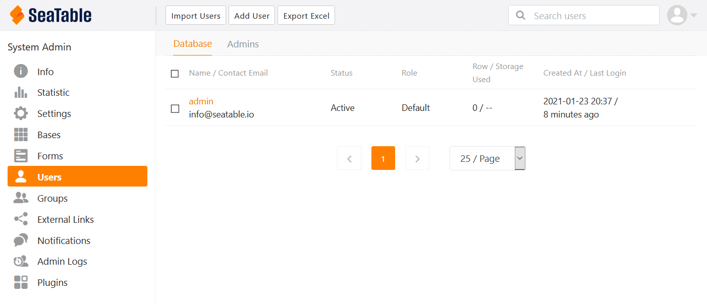

Thanks to Docker , the installation of SeaTable Enterprise Edition is very simple and can be done in just a few moments. Ubuntu Server as a widely used and well-documented Linux operating system is an excellent basis for SeaTable. If you already have an Ubuntu server, you can find out here how to install SeaTable on it in 10 minutes.



## Requirements

In order for SeaTable to be set up as smoothly as described here, a few prerequisites must be met. These are:

- VServer / Dedicated Server with 4 cores, 8GB RAM and around 10GB memory for the Ubuntu operating system, SeaTable and other requirements.
- Root access to the server (via SSH or console)
- Subdomain that refers to the IP address of the server via A-record (IPv4) or AAAA-record (IPv6).
- Server accessible on port 80 and 443 via the subdomain
- No other service listens on port 80 and 443

Of course, you should plan for more than the above-mentioned hard disk space in order to be able to store your own data on the data carrier in addition to the operating system and SeaTable. In particular, if you intend to organise files in SeaTable, you should plan very generously for additional storage space.

It is not a prerequisite, but helpful, if the server can be reached via a static IPv4 address. This maximises the accessibility of the server while on the move. In Europe, there are still [mobile networks that do not yet support IPv6](https://www.datamate.org/status-der-ipv6-implementierung-in-mobilfunknetzen-in-dach/). Your SeaTable server cannot be reached via such a network if it does not have an IPv4 address.

In case port 80 and/or 443 are already occupied on your server, you will find everything you need to know for the installation in your situation in the article [Installing SeaTable Enterprise on your own server behind a web server]().

You are ready? Let's go! We assume that you have a root shell open on your server.

## Preparation

First we update the system to have all packages up to date:

`apt update   apt upgrade -y`

Of course, these and all following commands must be executed with root rights unless otherwise specified.

SeaTable uses docker-compose and you need to install this package. Since it is available via the Ubuntu package sources, the command is sufficient:

`apt install docker-compose -y`

The packages docker.io and containerd as well as numerous Python3 libraries are part of the dependencies of docker-compose. These are therefore installed at the same time. The system is ready for SeaTable!

## Download SeaTable Enterprise

The Docker image of SeaTable Enterprise Edition is located in a repository on Docker Hub. Use the following command to start the download of the SeaTable image:

`docker pull seatable/seatable-ee:latest`

Let's move on to the only somewhat more difficult topic in setting up SeaTable. With the extended explanations, however, this step also becomes easily doable.

## Customization of the docker-compose.yml

To introduce this section, a little basic knowledge about the installation of SeaTable: SeaTable provides its services via several [Docker](https://www.docker.com/resources/what-container) containers. Besides the SeaTable container itself, in which the SeaTable server runs, there are three other containers involved. Specifically, these are the database MariaDB, the caching service Memcached and the dictionary server redis.

The file docker-compose.yml, which will be discussed in a moment, is the recipe used by Docker for the installation and configuration of SeaTable and the other containers. It contains central security settings (e.g. the database password) and allows you to adapt the installation to your own wishes and needs (e.g. SSL/TLS configuration).

First create the directory seatable in /opt. Since the installation of containerd, the directory /opt already contains the directory with the same name. Then download the docker-compose.yml into this directory and open the file with a text editor. The code example below describes the procedure in detail. We use the text editor nano to edit the docker-compose.yml. Logically, however, vim or any other text editor will also work.

`mkdir /opt/seatable   cd /opt/seatable   wget -O "docker-compose.yml" "https://manual.seatable.io/docker/Enterprise-Edition/docker-compose.yml"   nano docker-compose.yml`

This is what the YAML file looks like after the download:  

At first glance, you can see the four containers that Docker sets up when the recipe is executed: db, memcached, redis and seatable. For each container, the image to use ("image") and the container name ("container_name") are declared. The container name is the name by which the container can later be managed via Docker Console.

In addition, each container has a few individual settings, some of which need your attention now.

In the **container db** you have to change the database password. Replace "YOUR_PASSWORD" with a multi-character, alphanumeric password. In addition, you can adjust the path where the /opt/seatable/mysql-data/ directory is made available in the seatable-mysql container. By default, this is the path /var/lib/mysql. This is not necessary.

The **memcached container** and the **redis container** do not require any adjustments. If you are already running memcached or redis, you can remove these two containers from the Compose file. However, in order for SeaTable to run, you will have to make manual adjustments in the configuration files later.

The most extensive adjustments have to be made in the **seatable container**: First of all, the MYSQL_ROOT_PASSWORD must be entered there. Otherwise SeaTable cannot communicate with the database. So enter at "DB_ROOT_PASSWD" the password specified above for the container db.

Then it's a matter of deciding whether you want Let's Encrypt to request an SSL certificate for you and include it in the configuration of the web server. If you want to do this - which is probably the recommendation for most users - then change the value of the SEATABLE_SERVER_LETSENCRYPT key to "True" and enter the subdomain you use for SEATABLE_SERVER_HOSTNAME. The Certbot from Let's Encrypt will then request an SSL certificate as part of the setup process and take it into account in the configuration of the web server.

You can leave the time zone set to Etc/UTC for Central Europe. If you are outside Central Europe, use the usual time zone codes.

## Initialisation of the database

After the YAML file has been adapted to your needs, the next step is to initialise the database. To do this, enter the following commands:

`cd /opt/seatable   docker-compose up`

The docker-compose command executes the recipe contained in the YAML file: Several Docker images are downloaded from Docker Hub and extracted. First MariaDB, then Memcached, then redis and finally SeaTable itself - i.e. in the order prescribed in the docker-compose.yml. After the download the database container seatable-mysql starts. You can follow the activity on the screen (see below). When finally the seatable container takes over and the message "This is an idle script (infinite loop) to keep container running." appears on the screen, you can abort the process with the key combination CTRL + C.

Has this worked so far? Then you are very close to your own self-hosted SeaTable instance! If not, please see the troubleshooting tips at the end of this article.

## Launch of SeaTable

Execute the docker-compose.yml again. Unlike the previous step, docker-compose is now executed in the background or "detached". After that you can start the SeaTable server in the Docker container seatable. Finally, you only need to create an admin user. Your SeaTable server is then ready for its tasks!

`docker-compose up -d   docker exec -d seatable /shared/seatable/scripts/seatable.sh start   docker exec -it seatable /shared/seatable/scripts/seatable.sh superuser`

After the last command, you will be asked to enter an email address and a password. Bravo, you have created the first user in your SeaTable on-premises system.

## Commissioning

Now call up the URL that you specified in the docker-compose.yml under SEATABLE_SERVER_HOSTNAME. You will land on the login page of your SeaTable server. Installation successful!

If you have voted to use Let's Encrypt in the docker-compose.yml, then your request should be redirected directly to https and thus communication with your server should be encrypted. If not, then you should now insert your own SSL certificate. Copy the certificate into the folder /opt/seatable/ssl/ and adjust the configuration of the web server nginx. You also have to change the addresses from http to https in the configuration files ccnet.conf, dtable_web_seetings.py and the dtable_server_config.json. After that, nginx, SeaTable and Memcached have to be restarted. You do this with these three commands:

`docker exec -it seatable /shared/seatable/scripts/seatable.sh restart   docker restart seatable-memcached   docker exec -it seatable /usr/sbin/nginx -s reload`

You can find out more about integrating your own SSL certificate in the [SeaTable manual](https://manual.seatable.io/docker/Enterprise-Edition/Deploy%20SeaTable-EE%20with%20Docker/#ssltls).

## Activation of the SeaTable licence

You can use SeaTable Enterprise Edition with all functions without a paid licence with up to three users - privately as well as commercially and also permanently. For this reason, you do not need a licence to get started.

However, if you want to create more than three users in SeaTable, SeaTable will refuse to do so. You can obtain a licence from [our sales department](). You can find more information about the prices of SeaTable Enterprise on our [pricing page]().

To activate the licence, save the licence file, a TXT file, in the folder /opt/seatable/seatable-data/seatable and restart SeaTable:

`docker exec -d seatable /shared/seatable/scripts/seatable.sh restart`

The additional users are then immediately available and displayed in the control panel.

## Troubleshooting

If something went wrong during the installation, simply delete the /opt/seatable directory and start again. But be careful: The data stored in SeaTable will be lost.

If you have forgotten your administrator's password, execute the command

`docker exec -it seatable /shared/seatable/scripts/seatable.sh superuser`

again. The command creates another user with admin rights. If the command produces an error, then your SeaTable licence does not allow the creation of further users. (This also applies to the test mode with a maximum of three users.) In this case, you must set a user to inactive in the MySQL database and then execute the command again.
